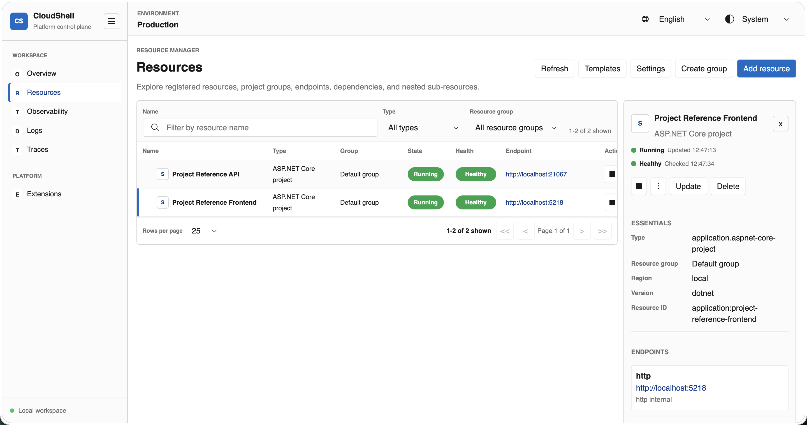
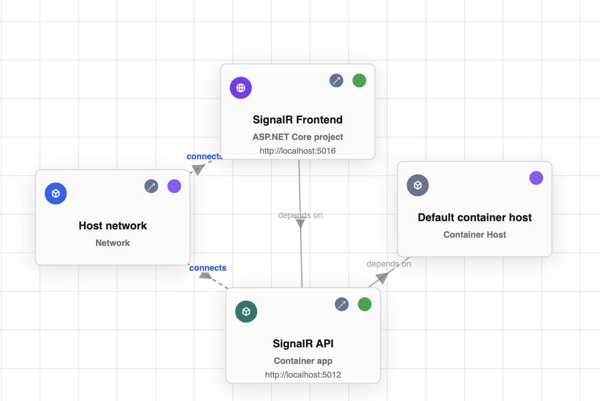
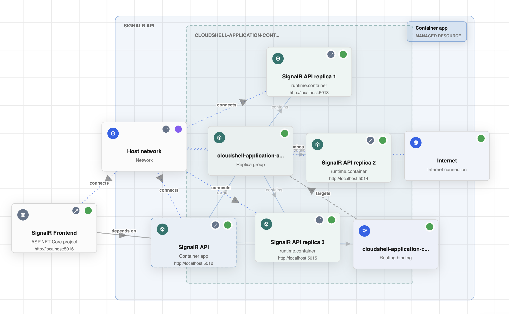

# CloudShell

> **Disclaimer:** Project is in an early phase. This is not a committed product.

CloudShell is a language-neutral, resource-oriented control plane for modeling,
running, inspecting, and operating distributed applications in local and
self-hosted environments.

It is for developers building local distributed apps, platform teams building
self-hosted internal cloud tooling, and extension authors adding resource
types, providers, UI, diagnostics, or service integrations. CloudShell gives
those users one shared resource graph across code, Resource Manager, the CLI,
and the Control Plane API instead of binding the platform to one programming
language or one public cloud.

The Resource Manager UI is built with Blazor, Fluent UI, and .NET 11 preview,
with an operational experience inspired by the .NET Aspire Dashboard.

**Resources view:**

<a href="images/resources.png"></a>

**Graphs (from UI):**

<p align="center">
  <a href="images/resource-graph.png"></a>
  &nbsp;
  <a href="images/runtime-graph.png"></a>
</p>

## Integration Paths

| Path | Status |
| --- | --- |
| C# launchers and resource builders | Most complete authoring path today. |
| JavaScript/TypeScript launchers | Active work; experimental until default run behavior, packaging, and samples are stable. |
| Java launchers | Active work; experimental until default run behavior, packaging, and samples are stable. |
| Go launchers | Experimental initial ResourceTemplate builder and local host launcher sample. |
| Control Plane API and remote client | Available for automation, split hosting, and integrations. |
| Runtime service clients | Configuration, secrets, and SQL client paths exist for workloads that consume CloudShell-managed services. |

## Ways To Use CloudShell

| Mode | Use when | Status |
| --- | --- | --- |
| Resource Manager UI | You want to inspect resources, follow relationships, run actions, and diagnose local environments visually. | Implemented; first major shell experience. |
| Launcher | You are developing an app and want the CloudShell graph to live with that project. | C# most complete; JavaScript/TypeScript and Java experimental. |
| CLI | You need automation, resource operations, template apply, local host-name mappings, or scripts/CI workflows. | Implemented; see [CloudShell CLI](docs/cli.md). |
| Daemon hosting | You want a persistent local CloudShell instance installed on the machine for tools, scripts, users, or launchers to attach to. | Implemented for local Control Plane process reuse. |
| Custom or split host | You are building an internal platform, provider package, UI extension, or self-hosted environment. | Supported architecture; still stabilizing. |

## Application Providers

CloudShell includes built-in application providers for the local-development
resource graph. These are not meant to be a complete deployment platform yet;
they are the current supported resource types for modeling and running
application workloads through Resource Manager, launchers, and the Control
Plane API.

| Application type | Resource type | Status |
| --- | --- | --- |
| ASP.NET Core project | `application.aspnet-core-project` | Implemented; most complete project-backed app path. |
| JavaScript/TypeScript app | `application.javascript-app` | Implemented for Node.js/package-manager local apps; framework-specific helpers are future work. |
| Java/JVM app | `application.java-app` | Implemented for local JVM processes and samples; Java service-client and launcher support remain experimental. |
| Go app | `application.go-app` | Implemented for local Go services through the C# provider model; Go launcher support is experimental. |
| Executable application | `application.executable` | Implemented for generic host-local commands, workers, tools, and emulators. |
| Container app | `application.container-app` | Implemented for local container workloads; Docker is the first runtime target and orchestration diagnostics are still hardening. |
| SQL Server | `application.sql-server` and `application.sql-database` | Implemented for local SQL Server in a container with volumes and database children; reusable non-local SQL support is future work. |
| RabbitMQ | `application.rabbitmq` | Implemented for local RabbitMQ in a container with AMQP and management endpoints; specialized broker management UI is future work. |

## Current Capabilities

- Resource Manager web UI with resource inventory, relationships, actions,
  endpoints, diagnostics, logs, traces, metrics, monitoring, and activity.
- ResourceDefinition-backed graph declarations through code, templates, CLI,
  API, and launcher workflows.
- Built-in providers for local applications, containers, SQL Server, RabbitMQ,
  configuration, secrets, storage, networking, DNS/name mappings, load
  balancing, identity, logs, traces, and usage.
- Resource-scoped authorization, configurable authentication, and EF Core
  persistence with SQLite or SQL Server.
- Extension points for resource providers, Resource Manager UI, shell views,
  diagnostics, runtime adapters, and client helpers.

## Core Concepts

### CloudShell Environments

A CloudShell environment is the managed cloud-like environment for a local,
team-owned, or on-premise deployment. It is made up of a Control Plane,
installed capability packages, resource state, and one or more UI hosts.

### Host Applications

A CloudShell host application is the ASP.NET Core app that composes one
deployment. It can host the CloudShell UI, the Control Plane, or both. In local
development, a combined host can run programmatically declared resources
through the same local Control Plane that manages them.

### Capability Packages

CloudShell capability packages add environment capabilities. They can
contribute Control Plane resource providers, resource type definitions,
programmatic declaration helpers, Resource Manager UI support, shell views, and
client helpers. The intended distribution model is NuGet packages that expose
CloudShell extension registrations for host applications to install.

### Resources

Resources represent things CloudShell can manage, such as applications,
containers, databases, networks, storage, identities, configuration services,
and infrastructure components.

See [CloudShell Terminology](docs/terminology.md) for canonical vocabulary and
[Resource model](docs/resource-model.md) for the projected object model,
endpoint mappings, and ownership rules.

### Resource Providers

Providers connect CloudShell resources to underlying implementations such as
local processes, Docker, networking systems, or external platforms.

CloudShell provider authoring is currently C#-only. Workloads written in other
languages integrate through resource declarations, templates, launchers, or
Resource Manager/Control Plane clients that target the same resource model.

### Resource Groups

Resource groups organize related resources into project boundaries for
management, filtering, and authorization.

CloudShell uses the same resource model through code, the Resource Manager UI,
and the Control Plane API.

## Example

CloudShell resources can be declared from code and then run through the same
Control Plane model:

```csharp
resources
    .AddAspNetCoreProject(...)
    .AddContainerApplication(...)
    .AddVirtualNetwork(...);
```

Applications, infrastructure, networking, and operational capabilities are
represented through the same resource graph. For full launcher examples, see
`samples/CSharpAppHost`, `samples/TypeScriptAppHost`, and
`samples/JavaAppHost`.

## Projects

- `CloudShell.Hosting`: Razor class library for the Blazor shell, layout, static assets, built-in Resource Manager, Extensions, and Observability views.
- `CloudShell.AppHost`: combined-host composition helpers that wire the CloudShell UI and Control Plane into one ASP.NET Core process.
- `Launchers/`: language-specific app-host launcher packages that emit ResourceTemplates and ask the CLI or Control Plane API to apply them.
- `CloudShell.Host`: development sample host that wires CloudShell UI, Control Plane, and local provider extensions together.
- `CloudShell.LocalDevelopmentHost`: stable local Control Plane and UI host profile with the built-in provider presets for launcher-based samples.
- `CloudShell.ControlPlane`: control-plane services, authorization adapters, resource/log stores, and the versioned OpenAPI endpoint module.
- `CloudShell.Abstractions`: extension SDK, shell contributions, and resource contracts.
- `CloudShell.Client`: shared SDK client credential primitives.
- `CloudShell.ControlPlane.Client`: remote domain client for the Control Plane API.
- `CloudShell.Configuration.Client`: SDK client and `IConfiguration` integration for Configuration Store service APIs.
- `CloudShell.Configuration`: service-discovery configuration helpers.
- `CloudShell.ConfigurationService`: standalone ASP.NET Core configuration service application.
- `CloudShell.Secrets.Client`: SDK client and `IConfiguration` integration for Secrets Vault service APIs.
- `CloudShell.Persistence`: EF Core SQLite or SQL Server persistence for resources and local Identity.
- `CloudShell.ResourceModel`: Resource model and ResourceDefinition graph contracts.
- `CloudShell.ControlPlane.ResourceModel`: Control Plane Resource Manager integration for graph-backed Resource model state.
- `CloudShell.ControlPlane.Providers`: built-in Resource model providers and their Control Plane/runtime adapter integrations.
- `CloudShell.ControlPlane.Providers.UI`: Resource Manager UI integration for built-in Resource model providers.
- `CloudShell.Abstractions.Tests`: extension registration and validation tests.

## Contributing

See the project workflow and tracking docs:

- [Development workflow](CONTRIBUTIONS.md): how to make changes in focused,
  verified slices.
- [Changelog](CHANGELOG.md): dated implementation, stabilization, sample, and
  documentation history.
- [Architecture decision log](ADR.md): durable product and architecture
  decisions.

## Prerequisites

- .NET 11 preview SDK.
- Docker Desktop or a local Docker daemon if you want to use the Docker sample.

The repository includes `global.json` to pin the preview SDK expected by the project.

## Run

From the repository root:

```bash
dotnet restore
dotnet run --project CloudShell.Host --urls http://localhost:5088
```

Then open:

```text
http://localhost:5088
```

Useful routes:

- `/resources`: resource inventory and resource groups.
- `/resources/add`: add a resource by choosing a registered resource type.
- `/resources/templates`: export and import resource group templates.
- `/resources/docker-engine`: Docker Engine detail view.
- `/extensions`: installed extensions and contributed resource types.
- `/api/control-plane/v1`: versioned Control Plane API.
- `<configuration-service-endpoint>/api/configuration/entries?resourceId=...`: token-authenticated configuration service API.
- `/openapi/control-plane-v1.json`: OpenAPI document for generated clients.

Local-development host and launcher samples are also available:

- `CloudShell.LocalDevelopmentHost`: reusable Control Plane/UI host profile used by launcher-based samples.
- `samples/CSharpAppHost`: declares a JavaScript app and Configuration Store resource from a C# launcher app, then applies the template through the CLI.
- `samples/TypeScriptAppHost`: declares the same style of graph from TypeScript using the experimental `@cloudshell/local-development` package.
- `samples/JavaScriptApp`: declares a Node.js app resource from a C# launcher and runs it as a local process managed by CloudShell.
- `samples/JavaApp`: declares a Java app resource from a C# launcher and runs it as a local JVM process managed by CloudShell.
- `samples/JavaAppHost`: declares a Java app, Configuration Store, and Secrets Vault from a Java launcher source file, then applies the template through the CLI.
- `samples/JavaScriptContainerApp`: wraps a JavaScript app as a Dockerfile-backed container app with replica scaling.
- `samples/CloudShell.UiExtensionHost`: hosts only the CloudShell UI and a custom UI extension.
- `samples/CloudShell.ResourceHost`: hosts CloudShell UI and Control Plane together with a sample resource provider.
- `samples/ProjectReference`: declares two ASP.NET Core project resources from a C# launcher where one references the other in an Aspire-style dev loop.

## Test

```bash
dotnet build
dotnet test CloudShell.Abstractions.Tests/CloudShell.Abstractions.Tests.csproj --no-restore
```

## Documentation

- [CloudShell goal](docs/goal.md)
- [Why CloudShell](docs/why-cloudshell.md)
- [CloudShell and Aspire](docs/cloudshell-and-aspire.md)
- [Domain model](docs/domain-model.md)
- [Launchers and app hosts](docs/launchers-and-app-hosts.md)
- [CloudShell Terminology](docs/terminology.md)
- [System design guidelines](docs/system-design-guidelines.md)
- [Roadmap](docs/roadmap.md)
- [Architecture decision log](ADR.md)
- [Changelog](CHANGELOG.md)
- [Control plane API and generated clients](docs/control-plane-api.md)
- [Authentication and authorization](docs/authentication-and-authorization.md)
- [Hosting model](docs/hosting-model.md)
- [Localization](docs/localization.md)
- [Persistence](docs/persistence.md)
- [Programmatic resources](docs/programmatic-resources.md)
- [Resource templates](docs/resource-templates.md)
- [Configuration services](docs/configuration-services.md)
- [Executable applications](docs/resources/executable-applications.md)
