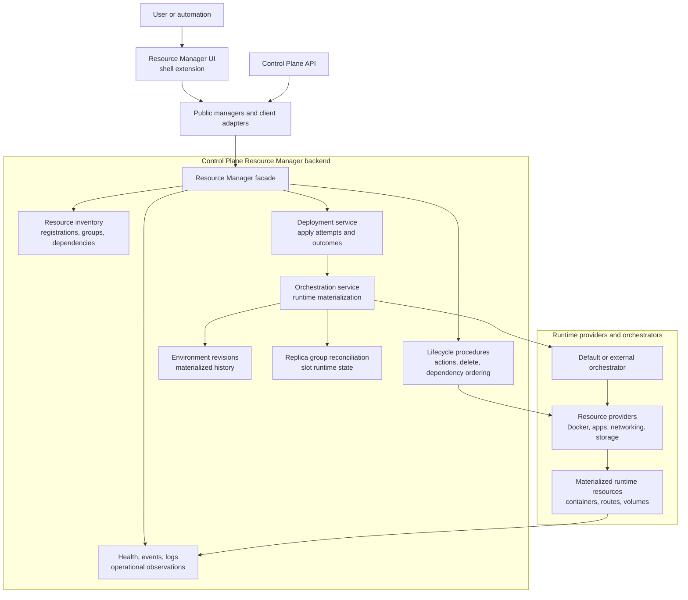
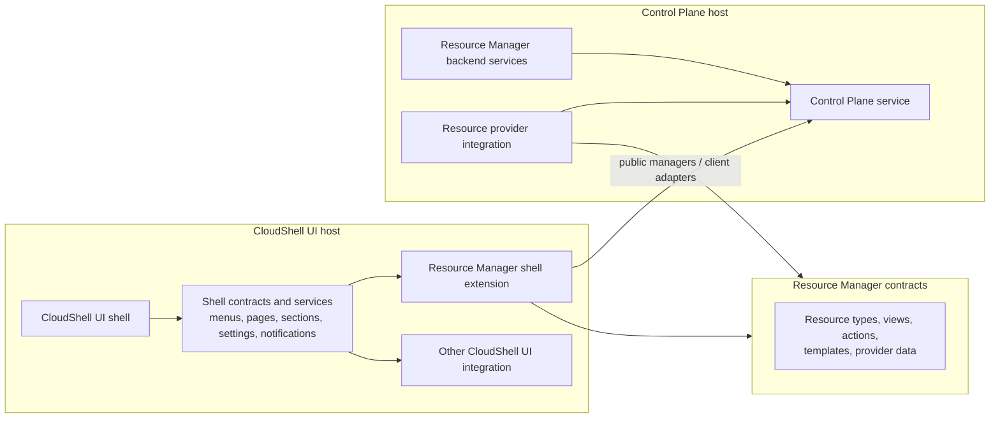

# CloudShell architecture

CloudShell is split into application surfaces, extension surfaces, and shared
product concepts. The important boundary is not only "frontend" and
"backend"; it is which layer owns UI composition, which layer owns Control
Plane behavior, and which shared concepts an integration uses across both.

Architecture describes the overarching model and conceptual boundaries. It is
not the same as design or implementation. Design documents explain how the
architecture is expressed in APIs, UI flows, validation, and behavior.
Implementation and project-structure documents describe the concrete assemblies,
folders, components, services, and migration steps used to realize that design.
For canonical product and domain vocabulary, see
[CloudShell Terminology](terminology.md).

## Application surfaces

### CoreShell and CloudShell UI

The common shell infrastructure should be treated as **CoreShell** until a
better name is chosen. CoreShell is the product-neutral toolkit for building
extensible shells from CMS-like fundamentals: addressable content,
relationships between content, navigation, settings surfaces, notifications,
extension points, shell services, and presenter contracts. It sits above the
low-level Composition UI structure and below domain shells such as CloudShell.
The long-term target is a toolkit that can build any shell for CloudShell
product areas or custom platform workspaces, not only Resource Manager.
Resource Manager proves the extension model, but CoreShell should remain
useful for teams that need their own dashboards, operations consoles, settings
experiences, developer portals, or internal platform tools. CloudShell UI is
the domain shell that assembles CoreShell with the default presenters and
predefined CloudShell integrations.

CloudShell UI may run inside a host application by itself, or it may run in the
same host process as the Control Plane for local development.

The hosting methods mirror that boundary. `AddCloudShellUi()`,
`UseCloudShellUiAsync()`, and `MapCloudShellUi<TRootComponent>()` are UI-only
composition points. `AddCloudShellControlPlane()`,
`AddCloudShellControlPlaneApplication(...)`,
`UseCloudShellControlPlaneAsync()`, and `MapCloudShellControlPlane()` are
Control Plane composition points. A local development host that wants both
surfaces registers the Control Plane application first, then calls
`AddCloudShellUi(...)` with a UI-registration callback for shell extensions,
Resource Manager UI extensions, and provider-owned UI contributions. The
request pipeline follows the same rule: map `UseCloudShellControlPlaneAsync()`
and `MapCloudShellControlPlane()` for the backend, and
`UseCloudShellUiAsync()` plus `MapCloudShellUi<TRootComponent>()` for the UI.

CoreShell provides the generic shell contribution model and shell services that
a shell uses to accept integrations. It owns reusable shell concepts:

- pages, menus, menu groups, menu items, sections, and section outlets
- route, navigation, section-address, and page-materialization services
- shared shell service contracts such as settings and notification surfaces
- shell composition adapters
- presenter contracts
- shell-level extension areas

CoreShell should not be defined by Resource Manager or CloudShell. CloudShell
is a domain shell built on CoreShell: it installs the default shell chrome,
Fluent UI presenters, user/session affordances, CloudShell settings, extension
catalog surfaces, Resource Manager, Observability, Usage, and adapters for
Control Plane-backed services. CloudShell may add CloudShell-specific extension
points, such as Resource Manager resource type UI, resource tabs, provider
detail views, and shell settings sections, but those product extensions should
project into CoreShell pages, navigation, sections, and services rather than
becoming a second shell model.

Resource Manager is the first major built-in integration in CloudShell, but
the CoreShell toolkit must stay useful for other shells, product areas, and
extension-owned experiences.
Architecturally, Resource Manager is still an integration into CloudShell. It
is larger and more central than most extensions, but it is on the same side of
the shell boundary as another CloudShell extension. Resource Manager has a
shell extension that contributes UI and uses shell services. The backend for
that extension is the Control Plane service, which may run in the same host
process during development or remotely in a split deployment. Resource Manager
does not define the shell itself.

When the boundary matters, use precise terms: "Resource Manager shell
extension" for the CloudShell UI integration and "Resource Manager backend" or
"Control Plane side" for the backend services. "Resource Manager" by itself
can refer to the whole product area or capability package that includes both
halves.

CoreShell should also stay isolated from shell implementations at the
implementation level. Extensions integrate through declared CoreShell
extension points, shared abstractions, and shell-provided services. They
should not depend on a concrete CloudShell UI host implementation or reach
into shell internals to participate in navigation, settings, notifications,
Resource Manager views, or other shell-owned surfaces.

The structure should not prevent another CloudShell UI implementation from
using a different UI component stack. Extension-facing contracts should be
defined through public abstractions and services first. A concrete CloudShell
UI package then adapts those contracts into its chosen rendering stack,
whether Fluent UI, plain Blazor components, or another presenter set.
An extension can still implement its own presenters and component stack for
surfaces it owns. The boundary is that shell-owned areas such as menus, pages,
sections, notifications, and settings are integrated through shell contracts
and services. From the extension's perspective those services should feel like
normal product services, such as a notification manager or layout manager,
even though the active shell decides how the result is rendered.

Fluent UI is the default CloudShell look and feel, not the shell contract.
CoreShell extension points should stay in framework-neutral CoreShell
contracts. Fluent-specific presenters should live behind a separate presenter
layer over those contracts. Today those presenters live mainly in
`CloudShell.Hosting`; as the boundary hardens, they are candidates for a
dedicated CoreShell Fluent UI package that CloudShell can consume as its
default presenter implementation. That presenter layer should expose concrete
host-usable components and integrations such as navigation menu presenters,
settings presenters, section/tab layouts, notification surfaces, and other
Fluent UI renderers over CoreShell contracts.

CoreShell should also avoid presenting CloudShell as a .NET-only platform.
The shell implementation can remain .NET and Blazor, but language-specific
packages, generated clients, process launchers, and API-driven tools should be
able to start or configure a CloudShell host and operate through stable
contracts over time.

### Control Plane

The Control Plane is the backend application. It may be hosted with
CloudShell UI in a combined local-development host, or independently in split
and on-premise deployments.

Control Plane provider and runtime registration belongs to the Control Plane
host. UI hosts may reference UI integration packages and remote client
adapters, but they should not install provider runtime integrations unless the
host is deliberately the combined CloudShell host.

The Control Plane owns backend state and operations:

- resource inventory and registration
- resource groups, dependencies, relationships, and source metadata
- lifecycle procedures and provider orchestration
- activity, logs, traces, metrics, and operational data
- persistence integration
- API projection and remote-client behavior
- authorization and permission evaluation

The core CloudShell UI shell does not directly know about the Control Plane
domain. It hosts shell integrations such as Resource Manager, settings,
notifications, and other extension-owned surfaces. Resource Manager UI and
similar integrations consume their own public managers and client adapters,
which may be backed by an in-process Control Plane in a combined host or by a
remote Control Plane service. UI integrations should not depend on Control
Plane stores or provider runtime internals.

Resource Manager is the logical facade over the services that manage
resources. The Control Plane side owns inventory, validation, lifecycle,
deployment coordination, orchestration, health, events, and API projection.
Orchestrators are execution adapters inside Resource Manager: they materialize
runtime state for resources and services, but they do not own the resource
graph or replace Resource Manager as the authority.

As CloudShell moves toward shared and on-premise hosting, host-local execution
and observation should be pushed behind typed provider execution boundaries
instead of requiring the Control Plane process to directly invoke every host
tool or runtime. This is a boundary-first strategy, not an immediate agent
split: existing resource type providers, operation providers, and runtime
handlers remain the right shape, but their execution contracts should become
typed, observable, idempotent, and transport-neutral. For now, the execution
implementation can stay inside the same Control Plane host and run through the
same dependency-injection path. The important design constraint is that the
Control Plane should call an execution boundary that could later be backed by
a remote agent without changing resource definitions, operation providers, or
Resource Manager semantics. The Control Plane remains authoritative for
desired state, identity, policy, operation history, and diagnostics; a future
agent can run the same provider-side operation shape on the machine where the
capability exists and report observed state back for reconciliation.

Local and single-host environments should not require users or resource
definitions to name an agent. The default execution target is implicit in the
host profile: local development uses the local in-process execution path, and a
simple shared environment can use its default execution target the same way.
The intermediate milestone is agent-targetable execution, not full distributed
topology: Resource Manager should be able to produce a typed execution request
that could be routed to an agent later, while the current implementation still
handles that request in the same Control Plane process. Explicit agent or host
selection should appear only when an environment actually has multiple
execution targets and the user, operator, or scheduler needs to constrain where
work can run. Regions and data-center-like topology belong after that as
deferred placement metadata for larger environments, not concepts the local
development model should force users to provide.

The preparation path is:

```text
Current MVP
    one Control Plane host, implicit default execution target

Execution-boundary MVP
    one Control Plane host, typed execution requests and observed results

Agent transition
    same execution requests can be routed to an agent instead of local DI

Distributed hosting later
    multiple agents, placement policy, regions, and failure domains
```

Users normally work with resources. Agents are operational execution targets,
and regions are later placement metadata; neither should become required
resource-definition input for the MVP path.

The dispatcher is the boundary between orchestration and execution. Resource
Manager decides which operation should happen and creates a typed execution
request. The dispatcher resolves where that request should go; for the MVP it
selects an in-process handler, and later it can send the same request to an
agent. The handler realizes the request through local capabilities such as
containers, processes, filesystem materialization, mounts, host networking, or
runtime observation, then returns observed state and diagnostics.

The architecture should allow more than one Control Plane deployment shape. A
small environment can run one in-process Control Plane. A shared environment
can run a standalone Control Plane. Future clustered environments can split
API replicas, controller duties, background workers, and provider execution
across several processes. Future federated or multi-Control Plane scenarios
should let a shell target several Control Plane authorities while preserving a
clear resource identity, authorization, and operational boundary for each.

### Runtime and orchestration boundary

The host application runs CloudShell. The host environment is what CloudShell
manages. The Control Plane owns Resource Manager backend behavior for that
environment: resource graph state, provider registrations, authorization,
commands, lifecycle, health, telemetry, events, persistence, and API
projection.

Resource Manager is the management facade. It accepts resource intent through
resource definitions, persists or projects the accepted graph state, and
coordinates operations against resources. Orchestration is a Resource Manager
execution subsystem, not a separate product surface. It is used when accepted
resource state must be materialized into runtime artifacts such as services,
replica groups, replicas, routing bindings, load-balancer mappings, or
provider-managed runtime resources.

Most resources can remain standalone orchestrated resources: the resource is
the unit Resource Manager starts, stops, inspects, and diagnoses. Container
apps are different because one stable resource represents a managed workload
facade over several runtime artifacts. In that case the container app resource
stays the user-facing API object, while Resource Manager derives internal
orchestrator deployments and service boundaries from accepted app resource
state. Users apply resource intent; orchestrators reconcile runtime artifacts.

The runtime model is therefore layered:

```text
Host application
    hosts CloudShell UI and/or Control Plane

Host environment
    contains resources and runtime artifacts

Control Plane / Resource Manager
    owns resource graph state, commands, API, events, health, telemetry

Resource providers
    validate resource definitions and implement provider-owned behavior

Orchestration
    plans and reconciles runtime materialization when resource state requires it

Runtime providers and hosts
    execute processes, containers, routing, storage, network, or provider APIs
```

The [Resource model](terminology.md#resource-model) is the resource-focused
subset users usually need first. The [Runtime model](terminology.md#runtime-model)
is the fuller management model that includes the Resource model plus
orchestration services, replica groups, replicas, routing bindings, retained
revisions, and environment revisions. Resource Manager may visualize the
Runtime model in the [Environment Map](terminology.md#environment-map), but
that map is a read model over Control Plane and orchestrator state, not another
source of truth.

Network topology is a shared overlay over those models, not a third model.
Resource Manager may project networks, endpoint mappings, load-balancer
routes, name mappings, and internet reachability in both the Resource graph and
the Environment Map. The Resource graph uses that overlay to explain resource
connectivity; the Environment Map can combine it with runtime service
boundaries, replica groups, replicas, routing bindings, and load-balancer
materialization.



## Host topology

CloudShell separates the environment from the host applications and capability
packages that compose it.

### CloudShell environment

A CloudShell environment is the managed local, team-owned, or on-premise
cloud-like environment that users inspect and operate. It is anchored by
Control Plane resource state, installed capability packages, and one or more
UI hosts.

The environment model is deliberately shared between local development and
on-premise hosting. A developer can run the platform locally as a combined
CloudShell UI and Control Plane host while resources are still code-first, then
the same resource model can be persisted into durable Control Plane state and
operated by a standing CloudShell environment. CloudShell is therefore a
hosting platform that doubles as a development tool, not a development
dashboard that must later be replaced by a different operational model.

An on-premise CloudShell environment is a standalone CloudShell cloud
environment, potentially for shared hosting. It owns Control Plane state,
installed capabilities, provider integrations, and runtime placement policy
instead of acting only as a developer workstation process.

### Language-neutral bootstrapping and graph authoring

The current host APIs are .NET registration APIs, and the CloudShell core can
remain C#/.NET-based. That is an implementation choice, not the product
boundary. The platform direction is that the code which bootstraps the host,
defines the resource graph, and drives the Control Plane does not have to be
C#. JavaScript, TypeScript, Java, C#, and other ecosystems should be able to
provide launcher authoring experiences over the same CloudShell model, similar
in spirit to cross-language resource authoring in modern developer platforms.

In that model, a language-specific host authoring layer may produce
declarations, configuration, launch instructions, or API calls, while a
CloudShell-provided C# host process runs the shell, Control Plane, providers,
and runtime adapters. CloudShell should still feel like one platform for
heterogeneous application stacks, not a .NET portal with incidental external
clients. The user experience should stay consistent across languages: the same
resource model, names, diagnostics, lifecycle operations, Control Plane APIs,
and Resource Manager views should apply whether the graph was defined from
C#, TypeScript, JavaScript, Java, or another supported language.

Language support should preserve the same ownership boundaries:

- language-specific launchers or SDKs can author declarations, call APIs,
  configure capabilities, or start a CloudShell host process
- the CloudShell core remains the implementation authority for the shell,
  Control Plane, providers, and resource-management behavior
- CloudShell remains applicable to non-.NET applications, services, providers,
  and operational workflows
- the Control Plane remains the authority for accepted resource state and
  operations
- provider-owned runtime behavior remains behind provider contracts
- the shell consumes product managers and client adapters rather than
  language-specific implementation details

### Multiple Control Planes and clusters

CloudShell should support a progression from a single local Control Plane to
standing, clustered, and federated topologies.

A clustered Control Plane deployment still represents one environment
authority. It can split request-serving API replicas, primary-controller or
lease-owned reconciliation duties, background workers, and provider adapters
without changing the resource model exposed to users.

The first scale-out step should remain a normal shared environment, not a
multi-region cluster: one environment authority and one implicit default
execution target that can later be replaced by or mapped to an agent. The
architecture work before agents should focus on making execution targetable
and observable while the Control Plane still owns orchestration. Explicit
regions, data-center boundaries, and multi-host placement policies can layer
on after the agent transition when the environment needs capacity partitioning,
failure-domain awareness, or operator-directed placement.

A multi-Control Plane or federated deployment represents several environment
authorities. CoreShell and Resource Manager should be able to present those
authorities coherently, but each Control Plane keeps its own authorization,
state ownership, provider registrations, and operational history unless a
future federation layer explicitly models shared ownership.

### CloudShell host application

A CloudShell host application is the ASP.NET Core application owned by a
product integrator or sample. It chooses deployment shape, configuration,
authentication, persistence, and installed capabilities. A host application can
run CloudShell UI, the Control Plane, or both.

In split deployments, the UI host discovers resources through a remote Control
Plane client instead of declaring resources or hosting providers locally. In
combined local-development deployments, programmatically declared resources
may run from the same host process that hosts CloudShell UI and the Control
Plane, but they are still managed by the same local Control Plane that
coordinates provider behavior, lifecycle actions, and resource projection.

### Capability packages

A CloudShell capability package is an installable environment capability. It
may be vertical, such as Docker support, application resources, configuration
services, or secrets, or cross-cutting, such as networking, identity,
observability, deployment, or policy.

A capability package may contribute:

- Control Plane resource providers and provider-owned services.
- Resource type definitions and programmatic declaration helpers.
- Resource actions, logs, templates, diagnostics, and capabilities.
- Resource Manager UI support such as add/update components, detail views,
  tabs, routes, and UI actions.
- Shell-level UI such as navigation, workspaces, settings pages,
  notifications, named content areas, and operational dashboards.
- SDK clients or helper packages for authored services.

Capability packages are product packaging and environment-capability
boundaries, not resource model entities. A capability package can define
several resource types, and a resource can depend on capabilities from several
packages.

### CloudShell extensions

A CloudShell extension is the in-process registration mechanism a capability
package uses to plug into a host application. Extension registrations are
code-level contracts. Capability packages are the packaging and environment
capability boundary.

Use "capability package" for installable environment capabilities. Use
"extension" for the code-level registration mechanism. Use more specific
terms such as "Control Plane provider integration" or "Resource Manager UI
integration" when the layer matters.

### Workloads

Use "workload" only for runtime application execution concerns, such as
container-image, container-build, ASP.NET Core project, or local executable
configuration. That runtime meaning is distinct from CloudShell capability
packages.

## Extension surfaces

An extension can integrate with CloudShell UI, the Control Plane, or both.
Those are separate layers even when a single capability package installs both
halves into a combined host.

Extensions are guests of the host application. The host loads their
contributions, validates them, adapts them into shell composition or Control
Plane services, and decides which surfaces are active. Even when extensions
run in-process for the current implementation, the architectural dependency
should point toward abstractions and host-provided services, not toward
CloudShell UI implementation details.

This keeps the extension model portable across shell implementations. A
different CloudShell UI can honor the same contribution descriptors and service
contracts while rendering them with its own layout, navigation, settings,
notification, or Resource Manager presenters.

Resource Manager is the canonical large integration. It integrates with:

- CloudShell UI, by contributing pages, navigation, settings sections,
  resource-detail views, UI components, and shell composition adapters.
- The Control Plane, by installing resource-management services, provider
  contracts, lifecycle orchestration, activity recording, API endpoints,
  persistence behavior, and authorization behavior.

The CloudShell UI host sees the Resource Manager side as a shell extension.
The Control Plane service is the backend for that shell extension. A combined
host may load both halves in one ASP.NET Core process, but the architecture is
still "CloudShell UI hosts the Resource Manager shell extension" and "Resource
Manager talks to its backend through public managers/client adapters," not
"CloudShell UI owns Control Plane behavior."

Resource Manager also owns product-specific extension points of its own.
Resource providers extend Resource Manager through resource types, detail
views, actions, templates, provider-backed operational data, and resource
creation/update surfaces. Those provider integrations can span both CloudShell
UI and the Control Plane, but they should still pass through Resource
Manager's public contracts instead of shell internals. The same pattern can
apply to other large integrations that later define their own sub-extension
points.



## Shared concepts

Some product areas need shared concepts that bridge UI and Control Plane
integrations without merging their implementations.

Resource Manager is the clearest example. Resource Manager concepts such as
resource view IDs, route targets, capability descriptors, contribution
descriptors, settings section IDs, and installation options may be needed by
both UI and backend integrations. Those concepts should live in shared
abstractions that do not depend on Blazor, Fluent UI, Control Plane stores, or
provider runtime implementations.
These abstractions are Resource Manager's integration contracts, not the
CloudShell shell model itself. A resource provider extension can be a Resource
Manager extension while Resource Manager itself remains a CloudShell
extension.

This gives each product area three possible layers:

- shared abstractions for product concepts
- UI integration for CloudShell UI
- Control Plane integration for backend behavior

Capability packages can still provide convenience registration that installs
all relevant layers, but that convenience should not erase the architectural
boundary.

CloudShell UI and extensions may share common abstractions without sharing a
concrete UI implementation. A shell feature such as notifications should expose
an abstraction for producers and consumers, while CloudShell UI can provide an
optional integration package that renders those notifications in the shell.
Extensions should be able to hook into the notification service or another
shell-owned service without referencing the UI components that happen to render
it. The same pattern applies to composition: extension authors should be able
to target menu, page, section, and settings contracts without depending on the
CloudShell UI presenters that render those artifacts.

## Hosting shapes

CloudShell supports several host shapes:

- UI-only host: runs CloudShell UI plus UI integrations such as Resource
  Manager UI; backend-aware integrations call a remote Control Plane through
  their configured adapters.
- Control Plane-only host: runs backend services and APIs without the Blazor
  shell.
- Combined host: runs CloudShell UI and Control Plane together, primarily for
  local development and small self-hosted deployments.
- Clustered Control Plane host: runs API replicas, controller roles, workers,
  or provider adapters as one environment authority.
- Federated UI host: runs one CoreShell surface over multiple remote Control
  Plane authorities through explicit client configuration.

Host registration APIs should make these choices explicit. A combined host can
install both UI and Control Plane integrations, while split hosts install only
the layers they need.

## Design rule

When adding or moving a feature, identify which layer owns it:

- Shell/UI concern: belongs in CloudShell UI or a UI integration package.
- Backend resource-management concern: belongs in the Control Plane or a
  Control Plane integration package.
- Shared product vocabulary: belongs in an abstractions package with no UI or
  backend implementation dependency.
- Convenience host setup: belongs in hosting registration helpers that compose
  the appropriate layers explicitly.
