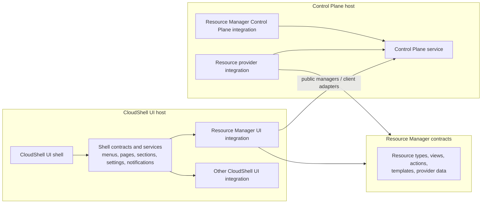

# CloudShell architecture

CloudShell is split into application surfaces, extension surfaces, and shared
product concepts. The important boundary is not only "frontend" and
"backend"; it is which layer owns UI composition, which layer owns Control
Plane behavior, and which shared concepts an integration uses across both.

Architecture describes the overarching model and conceptual boundaries. It is
not the same as design or implementation. Design documents explain how the
architecture is expressed in APIs, UI flows, validation, and behavior.
Implementation and project-structure documents describe the concrete assemblies,
folders, components, services, and migration steps used to realize that design.

## Application surfaces

### CloudShell UI

CloudShell UI is the extensible Blazor application. It may run inside a host
application by itself, or it may run in the same host process as the Control
Plane for local development.

CloudShell UI acts as a shell for integrations. It owns common visual
structure and shell services:

- main layout and navigation
- top bar and user/session affordances
- common Settings
- notification surfaces
- shell composition adapters and presenters
- shell-level extension areas

CloudShell UI should not be defined by Resource Manager. Resource Manager is
the first major built-in integration, but the UI shell must stay useful for
other product areas and extension-owned experiences.
Architecturally, Resource Manager is still an integration into CloudShell. It
is larger and more central than most extensions, but it is on the same side of
the shell boundary as another CloudShell extension: it contributes shell UI,
uses shell services, and installs Control Plane behavior through extension
registration rather than defining the shell itself.

CloudShell UI should also stay isolated from extensions at the implementation
level. Extensions integrate through declared extension points, shared
abstractions, and shell-provided services. They should not depend on the
concrete CloudShell UI host implementation or reach into shell internals to
participate in navigation, settings, notifications, Resource Manager views, or
other shell-owned surfaces.

The structure should not prevent another CloudShell UI implementation from
using a different UI component stack. Extension-facing contracts should be
defined through public abstractions and services first. A concrete CloudShell
UI package then adapts those contracts into its chosen rendering stack,
whether Fluent UI, plain Blazor components, or another presenter set.
An extension can still implement its own presenters and component stack for
surfaces it owns. The boundary is that shell-owned areas such as menus, pages,
sections, notifications, and settings are integrated through shell contracts
and services. From the extension's perspective those services should feel like
normal product services, such as a notification manager or layout manager,
even though the active shell decides how the result is rendered.

### Control Plane

The Control Plane is the backend application. It may be hosted with
CloudShell UI in a combined local-development host, or independently in split
and on-premise deployments.

The Control Plane owns backend state and operations:

- resource inventory and registration
- resource groups, dependencies, relationships, and source metadata
- lifecycle procedures and provider orchestration
- activity, logs, traces, metrics, and operational data
- persistence integration
- API projection and remote-client behavior
- authorization and permission evaluation

The core CloudShell UI shell does not directly know about the Control Plane
domain. It hosts shell integrations such as Resource Manager, settings,
notifications, and other extension-owned surfaces. Resource Manager UI and
similar integrations consume their own public managers and client adapters,
which may be backed by an in-process Control Plane in a combined host or by a
remote Control Plane service. UI integrations should not depend on Control
Plane stores or provider runtime internals.

## Host topology

CloudShell separates the environment from the host applications and capability
packages that compose it.

### CloudShell environment

A CloudShell environment is the managed local, team-owned, or on-premise
cloud-like environment that users inspect and operate. It is anchored by
Control Plane resource state, installed capability packages, and one or more
UI hosts.

The environment model is deliberately shared between local development and
on-premise hosting. A developer can run the platform locally as a combined
CloudShell UI and Control Plane host while resources are still code-first, then
the same resource model can be persisted into durable Control Plane state and
operated by a standing CloudShell environment. CloudShell is therefore a
hosting platform that doubles as a development tool, not a development
dashboard that must later be replaced by a different operational model.

An on-premise CloudShell environment is a standalone CloudShell cloud
environment, potentially for shared hosting. It owns Control Plane state,
installed capabilities, provider integrations, and runtime placement policy
instead of acting only as a developer workstation process.

### CloudShell host application

A CloudShell host application is the ASP.NET Core application owned by a
product integrator or sample. It chooses deployment shape, configuration,
authentication, persistence, and installed capabilities. A host application can
run CloudShell UI, the Control Plane, or both.

In split deployments, the UI host discovers resources through a remote Control
Plane client instead of declaring resources or hosting providers locally. In
combined local-development deployments, programmatically declared resources
may run from the same host process that hosts CloudShell UI and the Control
Plane, but they are still managed by the same local Control Plane that
coordinates provider behavior, lifecycle actions, and resource projection.

### Capability packages

A CloudShell capability package is an installable environment capability. It
may be vertical, such as Docker support, application resources, configuration
services, or secrets, or cross-cutting, such as networking, identity,
observability, deployment, or policy.

A capability package may contribute:

- Control Plane resource providers and provider-owned services.
- Resource type definitions and programmatic declaration helpers.
- Resource actions, logs, templates, diagnostics, and capabilities.
- Resource Manager UI support such as add/update components, detail views,
  tabs, routes, and UI actions.
- Shell-level UI such as navigation, workspaces, settings pages,
  notifications, named content areas, and operational dashboards.
- SDK clients or helper packages for authored services.

Capability packages are product packaging and environment-capability
boundaries, not resource model entities. A capability package can define
several resource types, and a resource can depend on capabilities from several
packages.

### CloudShell extensions

A CloudShell extension is the in-process registration mechanism a capability
package uses to plug into a host application. Extension registrations are
code-level contracts. Capability packages are the packaging and environment
capability boundary.

Use "capability package" for installable environment capabilities. Use
"extension" for the code-level registration mechanism. Use more specific
terms such as "Control Plane provider integration" or "Resource Manager UI
integration" when the layer matters.

### Workloads

Use "workload" only for runtime application execution concerns, such as
container-image, container-build, ASP.NET Core project, or local executable
configuration. That runtime meaning is distinct from CloudShell capability
packages.

## Extension surfaces

An extension can integrate with CloudShell UI, the Control Plane, or both.
Those are separate layers even when a single capability package installs both
halves into a combined host.

Extensions are guests of the host application. The host loads their
contributions, validates them, adapts them into shell composition or Control
Plane services, and decides which surfaces are active. Even when extensions
run in-process for the current implementation, the architectural dependency
should point toward abstractions and host-provided services, not toward
CloudShell UI implementation details.

This keeps the extension model portable across shell implementations. A
different CloudShell UI can honor the same contribution descriptors and service
contracts while rendering them with its own layout, navigation, settings,
notification, or Resource Manager presenters.

Resource Manager is the canonical large integration. It integrates with:

- CloudShell UI, by contributing pages, navigation, settings sections,
  resource-detail views, UI components, and shell composition adapters.
- The Control Plane, by installing resource-management services, provider
  contracts, lifecycle orchestration, activity recording, API endpoints,
  persistence behavior, and authorization behavior.

The CloudShell UI host sees the Resource Manager side as a shell extension.
The Control Plane side remains a backend service boundary. A combined host may
load both halves in one ASP.NET Core process, but the architecture is still
"CloudShell UI hosts Resource Manager UI" and "Resource Manager UI talks to
Resource Manager/Control Plane abstractions," not "CloudShell UI owns Control
Plane behavior."

Resource Manager also owns product-specific extension points of its own.
Resource providers extend Resource Manager through resource types, detail
views, actions, templates, provider-backed operational data, and resource
creation/update surfaces. Those provider integrations can span both CloudShell
UI and the Control Plane, but they should still pass through Resource
Manager's public contracts instead of shell internals. The same pattern can
apply to other large integrations that later define their own sub-extension
points.

## Shared concepts

Some product areas need shared concepts that bridge UI and Control Plane
integrations without merging their implementations.

Resource Manager is the clearest example. Resource Manager concepts such as
resource view IDs, route targets, capability descriptors, contribution
descriptors, settings section IDs, and installation options may be needed by
both UI and backend integrations. Those concepts should live in shared
abstractions that do not depend on Blazor, Fluent UI, Control Plane stores, or
provider runtime implementations.
These abstractions are Resource Manager's integration contracts, not the
CloudShell shell model itself. A resource provider extension can be a Resource
Manager extension while Resource Manager itself remains a CloudShell
extension.

This gives each product area three possible layers:

- shared abstractions for product concepts
- UI integration for CloudShell UI
- Control Plane integration for backend behavior

Capability packages can still provide convenience registration that installs
all relevant layers, but that convenience should not erase the architectural
boundary.

CloudShell UI and extensions may share common abstractions without sharing a
concrete UI implementation. A shell feature such as notifications should expose
an abstraction for producers and consumers, while CloudShell UI can provide an
optional integration package that renders those notifications in the shell.
Extensions should be able to hook into the notification service or another
shell-owned service without referencing the UI components that happen to render
it. The same pattern applies to composition: extension authors should be able
to target menu, page, section, and settings contracts without depending on the
CloudShell UI presenters that render those artifacts.

## Hosting shapes

CloudShell supports several host shapes:

- UI-only host: runs CloudShell UI plus UI integrations such as Resource
  Manager UI; backend-aware integrations call a remote Control Plane through
  their configured adapters.
- Control Plane-only host: runs backend services and APIs without the Blazor
  shell.
- Combined host: runs CloudShell UI and Control Plane together, primarily for
  local development and small self-hosted deployments.

Host registration APIs should make these choices explicit. A combined host can
install both UI and Control Plane integrations, while split hosts install only
the layers they need.

## Design rule

When adding or moving a feature, identify which layer owns it:

- Shell/UI concern: belongs in CloudShell UI or a UI integration package.
- Backend resource-management concern: belongs in the Control Plane or a
  Control Plane integration package.
- Shared product vocabulary: belongs in an abstractions package with no UI or
  backend implementation dependency.
- Convenience host setup: belongs in hosting registration helpers that compose
  the appropriate layers explicitly.
