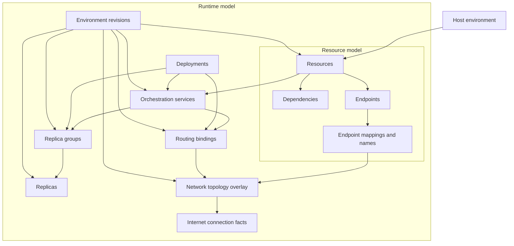
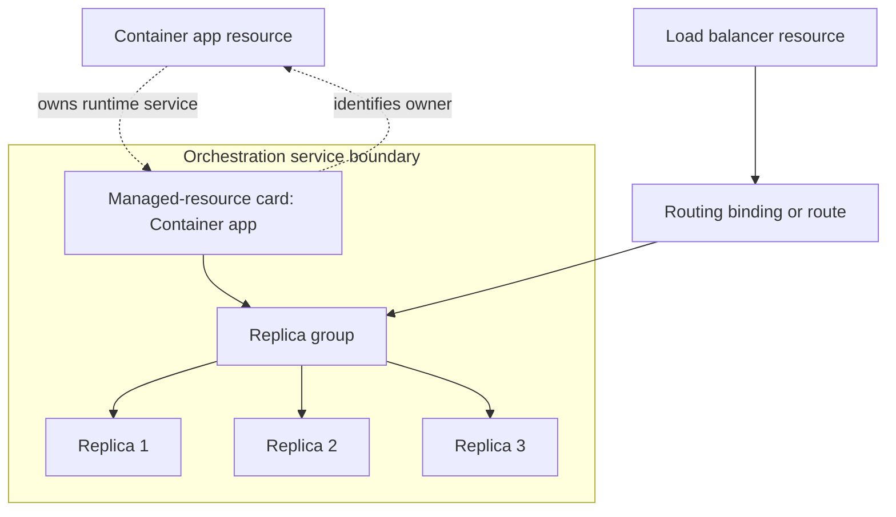

# Domain model

This document explains the core CloudShell concepts, where each concept is
modeled in code, and how the concepts are projected through the Control Plane
API.

For the focused definition of what a CloudShell resource is, how resources
relate to services, and how the resource object model maps endpoint and
relationship concepts, see [Resource model](resource-model.md).
For canonical product and domain vocabulary, see
[CloudShell Terminology](terminology.md).

CloudShell deliberately uses different levels of abstraction, but those levels
should use the same established concepts. Internal Control Plane services are
more granular because they coordinate providers, stores, and authorization.
Shell and integration consumers use higher-level managers. The HTTP API
projects the same domain entities through versioned contracts with hypermedia
affordances.

For implementation and verification checklists for each resource-model
artifact, see [Artifact implementation guidelines](artifact-implementation-guidelines.md).
For CloudShell application surfaces, host topology, extension surfaces,
capability packages, and workload terminology, see
[CloudShell architecture](architecture.md).

## Abstraction levels

| Level | Audience | Purpose | Examples |
| --- | --- | --- | --- |
| Host topology | Product integrators and operators | Describe how CloudShell environment capabilities are packaged and deployed | CloudShell environment, host application, CloudShell UI, Control Plane, capability packages |
| Product concepts | Users and extension authors | Describe what CloudShell manages and shows | resources, resource groups, lifecycle actions, logs |
| Public domain abstraction | Shell integrations and remote adapters | Cloud-plane client API for the Control Plane domain without caring about transport | `IResourceManager`, `IResourceTemplateManager`, `ILogManager`, `Resource` |
| Internal Control Plane services | Control Plane implementation | Coordinate state, providers, persistence, authorization, and procedures | `InProcessControlPlane`, `IResourceManagerStore`, `IResourceRegistrationStore`, `ResourceOrchestrationService` |
| Provider contracts | Provider and extension packages | Project external systems into CloudShell and execute provider-owned operations | `IResourceProvider`, `IResourceCreationProvider`, `IResourceProcedureProvider`, resource-type graph providers |
| HTTP API projection | Remote Control Plane clients and generated clients | Versioned contract for the same domain entities and relationships | `/api/control-plane/v1/resources`, `ResourceResponse`, `resourceActions` |
| UI projection | Shell UI and extension views | Render resources and operations for users | Resource Manager pages, detail routes, provider-owned views |

The higher-level public abstraction is the cloud-plane client API. It should be
less granular than the internal Control Plane implementation while still using
the same domain concepts. A consumer asks the domain manager to list resources
or execute a resource action. It should not need to compose registration
stores, provider stores, route templates, and generated HTTP clients itself.

## Host topology

CloudShell's host topology is part of the product architecture, not the
resource domain model. The durable definitions of CloudShell UI, Control
Plane, CloudShell environment, host application, capability package, extension
surface, and workload live in [CloudShell architecture](architecture.md).

This document uses those terms when explaining how resources, services,
providers, public domain abstractions, and API projections relate to each
other.

## Core concepts

### Resource and service terminology

CloudShell is a resource-oriented model over infrastructure that often provides
network-addressable services. The canonical definitions of **resource**,
**service**, and **service resource** live in
[CloudShell Terminology](terminology.md#resource-terms). Use those terms
deliberately. When in doubt, use **resource** for the thing CloudShell manages
and **service** for the capability, process, API, or runtime behavior behind
that resource. For example, a container app resource may provide an application
service, and a SQL Server resource may provide a database service, but both are
still resources in the CloudShell model.

### Resource

A resource is the central CloudShell artifact. It represents something the
platform can inspect or operate, such as a Docker Engine, container, executable
application, configuration service, database, queue, or internal service.

Resources may be declared or they may be projected/listed by a provider. A
declaration may come from code, persistence, import, or a future API. The
resource provider for the resource type validates declared resources, maps
their attributes to provider-owned behavior, and projects the current resource
state back to Resource Manager. Provider-projected child, runtime, or
diagnostic artifacts can also appear as `Resource` projections. They are still
resources in the graph and can be referenced inside the system, but they are
not automatically user-declared resources or persisted Resource Manager
inventory. Projected resources are read-only by default unless their provider
exposes operations or change handling for them. This distinction matters
because `GetResources()` currently returns a unified projection over both
stable declared resources and provider/runtime artifacts.

Declarations are expressed as resource definitions: resource identity, resource
type, and resource-specific intent. That intent can include provider-owned
attributes such as executable path, arguments, and working directory, or more
complex typed values when the resource schema supports them. The definition
structure is separate from JSON, YAML, builders, persistence records, or other
serialized projections of that structure.

The resource model is the portability boundary. CloudShell should not require
users to learn a provider-specific vocabulary, such as pods, container groups,
app-service products, or vendor-specific deployment units, before they can
understand a resource. Providers and orchestrators may materialize a resource
through those native objects, and CloudShell may expose them as runtime
children, provider resources, or diagnostics when they matter, but the primary
model remains resources, endpoints, endpoint mappings, dependencies,
identity, storage, health, telemetry, lifecycle, and deployment state.

In code, a resource is projected as `Resource`.

Important properties:

- `Id`: immutable platform identity or derived resource path.
- `Name`: scoped unique resource name.
- `DisplayName`: optional presentation label.
- `TypeId` / `EffectiveTypeId`: stable resource type.
- `ResourceClass`: broad resource classification such as executable, project,
  container, service, network, storage, configuration, or infrastructure.
- `Attributes`: stable, non-secret details that describe the resource's class,
  type, or provider-owned shape.
- `State`: optional lifecycle or health-oriented state produced by resources
  that expose lifecycle status.
- `Endpoints`: resource-owned named ports/protocols exposed by the resource.
- `ResourceEndpointNetworkMappings`: topology-specific addresses that map
  resource endpoints into a network.
- `DependsOn`: resource dependencies.
- `ParentResourceId`: parent/child hierarchy.
- `DetailRoute`: optional extension-owned UI detail route.
- `ResourceActions`: resource-domain operations exposed by the provider.
- `ResourceHealthChecks`: health signals contributed by providers.
- `ResourceRecoveryPolicies`: resource-owned recovery policy declarations that
  the Control Plane can materialize into operational recovery state.
- `ResourceCapabilities`: standardized or provider-owned capabilities the
  resource can provide to the environment, such as endpoint sources or
  networking providers, liveness signals, or recovery support.

`Resource` is a uniform projection. It is not subclassed for container apps,
runtime containers, executables, projects, services, or infrastructure. A
resource carries common
attributes such as class, type, endpoints, actions, health checks,
observability, and structural metadata; providers own the configuration and
runtime behavior behind those attributes. `Resource` does not imply CloudShell
owns all underlying provider configuration or runtime state.

This means an application resource can represent a single local process, one
container, several containers, a provider-managed service, or a future
orchestrated workload without making Docker, Kubernetes, Azure, or another
provider's native object model the CloudShell object model. Provider-native
terms are still appropriate inside provider-specific resource pages and
diagnostic views when they explain placement, materialization, health, or
failure.

`Id` is the canonical resource identity and should be visible wherever users
inspect resource details. Activity logs should use the resource ID as the
canonical resource address so lifecycle actions, provider-scoped events, and
procedure milestones remain traceable even when display names are enabled.
`Name` is the scoped unique name that users and programmatic declarations
normally provide. Providers derive internal resource IDs from names when the
backing platform needs a typed path, such as `application:api`.
`DisplayName` is an optional presentation label for readability in Resource
Manager and other presentation surfaces. Display-name editing is a future
Resource Manager capability; it should update only the presentation label and
must not change the resource ID, resource name, type, provider identity,
dependencies, permissions, or other stable references.

Not every resource exposes lifecycle status. Runtime resources such as
applications, container hosts, containers, configuration services, secrets
vaults, load balancers with runtime providers, and other managed services can
produce `State`. Logical model resources such as DNS zones and DNS name
mappings can omit `State` entirely because they describe configuration,
relationships, or materialization intent rather than a running process or
service. `null` state means "no lifecycle status is produced"; it is not the
same as `Unknown`, which means the resource participates in lifecycle status
but the provider cannot currently determine the value.

Liveness is a resource-owned signal that can affect lifecycle status. Because
liveness checks are best-effort observations, a single failed observation is
kept as health history. Liveness is active when the resource is running or
already degraded; resources intentionally stopped through lifecycle actions
should not be probed for liveness or recovered from that stopped state. If
recovery has already observed the resource healthy and the provider later
projects it as `Stopped`, CloudShell treats that as an unexpected runtime loss
and recovery may start it again when policy allows. When consecutive unhealthy
liveness observations meet the configured failure threshold for a running or
degraded resource, a responding-but-unhealthy signal can project the resource
as `Degraded`, while a no-response signal can project it as `Stopped`. Generic
health and readiness checks do not imply lifecycle degradation by default.
Providers can still project a more specific lifecycle state when they own a
better runtime signal.

A storage volume resource represents allocated physical storage that can be
referenced and mounted by another resource. A simple local volume can be
declared without a separate storage-provider resource for local development,
while provider-backed storage can later own materialization, diagnostics, and
usage metrics for specific volume types.

A container app resource is the top-level deployable workload. It may be bound
to a specific container host resource, such as Local Docker, or it may omit that
binding and let CloudShell resolve the configured default container host. That
host selection is deployment plumbing; consumers should not need to know which
runtime type or runtime container is used to deploy the app. A container app is more
than a single container: it may be backed by one or more runtime container
instances/replicas, and those runtime instances may change across deployments.
The container app may materialize app-owned replica resources below itself
when replica mode is enabled. Docker and other host providers may also project
runtime container resources, often as children under a container host resource.
Those Docker-host container resources are provider observations of runtime
containers, not the same thing as the container app's replica resources.
Projected provider resources can still have stable, addressable resource IDs
when the provider has a stable underlying identity. For Docker containers, the
resource ID is derived from the host resource ID plus the actual container
identity. Those runtime container resources are useful for inspection and
low-level operations, but they are not the stable deployment target for app
image updates.

Provider-owned resources may create and manage runtime containers without
becoming container app resources. For example, a load balancer provider can run
Traefik in a container, track that container as provider-owned runtime state or
as a child resource, and tie its lifetime to the load balancer resource. The
stable resource remains the load balancer; the container is implementation
detail unless the user explicitly models it as a workload they want to manage.

When provider-owned infrastructure needs placement, CloudShell should select a
host resource rather than a container engine. In this context, a host is an
instance of a runtime or control boundary that CloudShell can target, not
necessarily a physical machine. A host may represent Docker, Podman,
containerd, Kubernetes, systemd, a VM boundary, a scheduler, or a vendor
appliance API through capabilities and provider-owned attributes. The stable
resource records the selected host; the provider decides how to use that host's
runtime capabilities.

Use "container host" for the selectable CloudShell resource or configured
runtime instance. Use "container runtime" for the implementation capability or
product family behind that host, such as Docker, Podman, containerd, or CRI-O.
Avoid "engine" as a CloudShell abstraction except when naming a specific product
concept such as Docker Engine or preserving compatibility with older APIs.

Container app deployments create app-owned revisions. The current revision is
projected on the container app resource and changes when the deployable image
is updated. Runtime container instances/replicas are implementations of a
revision; they are not themselves the revision identity.

Resources can now also project ownership metadata that distinguishes who
created them, who manages them, how visible they should be in normal Resource
Manager inventory, which stable resource owns them, and how they should be
cleaned up with that owner. This metadata does not split CloudShell into
separate resource graphs. The resource graph remains unified; visibility and
permissions only decide which parts of that graph are shown in which contexts.

Some resources are hidden from the global inventory by default but still
belong to the visible resource graph when the user has permission. A
storage-owned volume or a container-app replica can be shown by Resource
Manager on the parent resource page, in relationship views, or in selectors
without appearing as a top-level inventory item. That placement is a UI
presentation concern; the domain model only records ownership, visibility,
management mode, and permissions. These resources can also be hidden by
permission when an environment does not allow a user to inspect that part of
the graph.

Internal managed resources are stricter. They are provider, orchestrator, or
runtime implementation details for another resource and should never be part
of the default user-facing graph. They may be exposed only through explicit
diagnostic or advanced inspection modes, when the user has the required
permission. For example, a provider-owned helper container can stay internal
even though CloudShell may still track it for cleanup, diagnostics, and
relationship integrity. The stable user-facing resource remains the
application, storage resource, load balancer, or other modeled resource that
owns the behavior.

The **[host environment](terminology.md#host-environment)** is where the
complete realized model exists. The **[Resource model](terminology.md#resource-model)**
represents the resources in that environment, their relationships,
dependencies, endpoints, and endpoint mappings or names when present. It
answers what resources are in the environment, how they connect, and which
resources the user can inspect or operate. Its graph representation is the
**[Resource graph](terminology.md#resource-graph)**.

The **[Runtime model](terminology.md#runtime-model)** is the fuller management,
orchestration, and deployment model of the same host environment. It contains
the Resource model as a subset and adds **[environment artifacts](terminology.md#environment-artifact)**
such as orchestration service boundaries, replica groups, materialized
replicas, routing bindings, retained previous revisions, deployments, and
other runtime state. These artifacts are not only deployment internals. A
deployment may define, change, or retire services, replica groups, replicas,
and routing artifacts, while environment revisions record the versioned outcome
of those changes. The Runtime model is often less important to application
developers than the Resource model, but it becomes important for operations,
diagnostics, deployment progress, scaling behavior, versioning the environment,
and understanding why a running system changed.

A **[network topology overlay](terminology.md#network-topology-overlay)** can
be projected over both the Resource model and the Runtime model. In the
Resource graph, the overlay should emphasize network resources, endpoint
mappings, published names, routes, and whether resources are connected through
networks. In the Environment Map, the same overlay can include runtime service
boundaries, routing bindings, replica groups, load-balancer materialization,
and **[internet connection](terminology.md#internet-connection)** facts. This
keeps network and internet reachability visible where useful without making
the Resource graph or Environment Map a separate source of truth.



The default orchestration mode is managing standalone resources. A resource
provider can expose lifecycle procedures for a single executable, container,
database helper, volume, network, host, or other runtime resource where the
resource itself is the orchestrated unit. The resource is still orchestrated,
and declared dependency relationships are still managed by the orchestrator
when actions require dependency ordering or dependency startup. It just does
not need to be modeled as a service, deployment, revision, or replica group.
Those concepts are added for the complexity that appears when running systems
scale, need versioned runtime configuration, or need several materialized
resources to behave as one runtime service.
Most resources therefore represent things that exist in the environment or
configuration that other workloads use. Workload resources such as container
apps can actively affect the environment: they ask Resource Manager
orchestration to deploy and reconcile runtime resources, such as service
bindings, replica groups, routing targets, and runtime containers. Deployment
and environment-revision tracking belongs to that runtime-changing path, not
to every resource merely because it participates in the resource graph.

Orchestrators materialize a scaled container app by producing an
orchestration-level runtime service descriptor. In CloudShell's orchestration
contracts this is represented by `ResourceOrchestratorService`: a
provider-facing descriptor derived from the stable resource id, workload
configuration, requested replica count, ports, networks, and dependencies. A
container app produces one of these descriptors today. It is the grouping used
to keep track of the runtime implementation for the service contained by the
resource: replicas, endpoint bindings, dependency ordering, network membership,
and related provider-owned runtime services such as app ingress. It is not a
projected Resource Manager resource by default. Docker Compose maps it to a
Compose service where replicas can be declared, Kubernetes-oriented providers
can map it to Service/Deployment-style objects, and the default local runner
uses the container app identity as the implicit service identity for convention
named replica containers.

Within that service boundary, the orchestrator owns the runtime shape that
materializes the service: routing or load-balancer configuration plus a runtime
replica group. The replica group is the orchestrator's default replication unit
for the service. It lets the orchestrator track the resource instances that
materialize a specific service revision, including requested count,
materialized count, readiness, routing membership, and cleanup state. Resource
providers may still act on the group and its members directly when the backing
runtime requires manual commands, but they should treat the group as
orchestrator-owned runtime state instead of owning replica enumeration
themselves. It is an internal orchestrator/runtime concept, not a Kubernetes
ReplicaSet copied into the CloudShell domain model. The structure is
intentionally similar only where the problem is similar: CloudShell tracks
resource instances as the materialized units instead of introducing a pod
concept.

Resource Manager may still visualize this internal orchestration state when it
helps explain a running environment. A container app should appear in the
environment map as a managed orchestration service boundary rather than as a
separate peer node beside that service. The service group is the primary visual
unit; the container app resource identity can be shown as an attached
managed-resource card on that group so users understand which user-facing
resource owns the runtime service. Replica groups should appear as nested
groups inside the service boundary, with materialized replica resources inside
their replica group. Load balancers, routes, and other routing participants
should be shown only when they are represented by actual CloudShell resources
or explicit routing artifacts; otherwise the visualization should defer them
until the runtime model projects those facts.



The orchestrator deployment and revision abstractions are the shared lower
layer for applying runtime intent inside Resource Manager. Resource Manager is
the umbrella concept for the services that manage resources: lifecycle, graph
validation, authorization, grouping, persistence, and runtime materialization.
The Resource Manager surface is the logical facade over those services, and
orchestrators are Resource Manager execution components that manage CloudShell
runtime resources and their runtime configuration. An
orchestrator deployment represents the desired runtime state for a resource, as
specified by the actor deploying the workload. An orchestrator revision
represents the environment-history outcome: the change record produced after
the selected orchestrator applies that desired runtime state. At this layer,
the deployment is the object Resource Manager asks the orchestrator to apply;
the revision is the historical record of the environment change that followed.
For container
apps, the app submits a deployment that says "this is the runtime state I
want"; when the orchestrator completes, the resulting environment revision and
materialization data let the app correlate or project runtime replica
resources without sharing identity with the app-owned configuration revision.
Deployment apply is
incremental: specified runtime resources are created or updated by id, while
removing runtime resources is a separate tear-down operation such as scaling
down a replica group, retiring a superseded runtime group, or cleaning up the
resources that belong to an orchestration service. A failed deployment attempt
is an apply failure, not an environment-history outcome, so it does not produce
an orchestrator revision. The orchestrator should log the failure and attempt
best-effort rollback of the deployment unit it was setting up. Runtime health
problems after setup are resource health unless they were declared as part of a
deployment readiness gate. A resource can still be managed directly by Resource
Manager while an orchestrator derives a default deployment for a
deployment-relevant state or configuration change. These abstractions are
available for internal container-app, provider, and orchestrator implementation
work before they are announced as a public management surface. The Control
Plane exposes an internal deployment-apply boundary that dispatches a
deployment to the selected orchestrator instead of having the resource domain
manipulate runtime replicas directly. A container app revision answers app
configuration-version questions; an orchestrator deployment and environment
revision answer what CloudShell runtime state was requested, what hosting
environment changed, and which service/runtime resources were affected.

This model is not a Kubernetes copy. It has similar mechanics where the
problem is similar: desired state, orchestration, materialization, dependency
ordering, rollout, runtime grouping, and history. CloudShell is more flexible
because the common Control Plane unit is the resource, while Kubernetes centers
its workload model around pods. CloudShell resources are not limited to
container workloads or provider-native runtime primitives. A resource can
represent an application, database helper, volume, network, host, appliance,
logical mapping, identity integration, or any other manageable thing a
provider contributes to the Control Plane. CloudShell orchestrators are an
abstraction for executing desired runtime state over those resources. A custom
orchestrator can implement the contract directly, while integration
orchestrators can translate it into provider-native objects such as Docker
Compose services or Kubernetes workload resources without making those objects
the CloudShell domain model.

The container app layer should not directly manipulate orchestrator-owned
replicas, backend registrations, routing tables, or cleanup behavior. It
records app deployment intent and revision history, then asks the selected
orchestrator to apply that intent. The orchestrator owns runtime materialization,
readiness, ingress or load-balancer cutover, and cleanup of superseded runtime
replicas.

The container app resource is also the normal user-facing deployment and
exposure artifact for application workloads. It can own the stable application
endpoint, requested replica count, discovery name, public exposure intent,
ingress or load-balancer mapping, DNS/name mapping, and health/routing
diagnostics. Provider-native service objects, such as Kubernetes Services,
Docker Compose services, or local runtime service descriptors, are
materialization details unless a provider explicitly imports or projects them.

This is distinct from the optional `cloudshell.service` resource type at the
CloudShell model and API layer. A `cloudshell.service` resource can still model
a logical service unit or facade over non-application targets, multiple
application targets, imported provider-native services, or advanced routing
scenarios that need a stable discovery name independent of one container app
lifecycle. One potential use is a manually composed replica set: several web
application instance resources can be grouped behind a shared service-resource
frontend, then a load balancer can target that service resource's endpoint
instead of each instance. It is not required to expose a normal container app
in the MVP, and it is not the internal orchestrator service descriptor by
default. Later orchestrators may deliberately materialize a
`cloudshell.service` resource as their own service-resource primitive, or
derive an orchestrator service descriptor from it, when that resource
represents the service unit that should be scheduled, discovered, or exposed
together.

`Attributes` are not a second provider configuration schema. They are projected
facts useful for inspection, filtering, diagnostics, and orchestration hints,
such as container image, workload kind, endpoint count, service port count, or
configuration entry count. Providers must not expose secrets through resource
attributes.

Attribute values are strings for the MVP. This keeps the API projection,
generated details UI, programmatic declarations, and provider implementations
simple and stable. Use invariant formatting for numbers, lower-case strings for
booleans, and stable non-localized tokens for enum-like values. If a value needs
structure, lifecycle semantics, validation, or secrecy, it belongs in
provider-owned configuration or runtime state instead of `Resource.Attributes`.

Attribute names use dotted lower-camel segments such as `workload.kind`,
`container.image`, `container.registry`, and `configuration.entries`. Names in
`ResourceAttributeNames` are reserved for CloudShell-defined meanings. Provider
or extension-specific attributes should use a stable provider or domain prefix,
for example `acme.cluster` or `postgres.database`. Do not use display labels as
attribute names; generated details can format the name for presentation.

Because `Resource` is uniform, the shell can generate a default detail view from
the projected resource shape: identity, class, endpoints, attributes,
dependencies, health checks, actions, and observability. Provider-owned detail
routes, resource tabs, or update components override that default when a
resource needs a specialized operational experience.

Consumers can filter resource lists by `ResourceClass` when they need broad
class-level views, such as all container-backed resources or all logical
services, without relying on provider-specific `TypeId` values.

`IResourceManager` publishes `ResourcesChanged` notifications after
resource-manager mutations such as create, registration changes, dependency
updates, deletion, resource actions, and image updates. The notification is a
coarse inventory signal, not a replacement for re-reading resources. Consumers
that need current state should reload the relevant resource or resource list
when notified. Provider-discovered external changes, such as a Docker
container appearing outside CloudShell, still require provider polling or a
future provider push channel unless the provider itself raises a resource
manager mutation.

`ResourceClass` describes the projected domain shape, not the provider's
internal runtime mechanics. For example, an ASP.NET Core project resource can be
process-backed and still project as `ResourceClass.Project` with project-shaped
attributes rather than executable command attributes.

For known resource types, `ResourceClass` is part of the resource model
invariant. The class declared by the resource type, creation metadata,
programmatic declaration metadata, and provider projection should agree.
Resource Manager validates this at creation and projection boundaries. Invalid
creation metadata is rejected before provider dispatch; invalid provider or
declaration projections are reported through resource model diagnostics and the
projected `Resource` is normalized back to the known type class so consumers do
not receive an invalid model.

As a client API entity, `Resource` should be convenient to inspect without
becoming an active service object. It may expose domain helpers such as
case-insensitive resource-action lookup and standard lifecycle action
properties. It should not execute operations itself. Commands still go through
`IResourceManager`, which can represent either the in-process Control Plane or a
remote API-backed adapter.

Capabilities describe what role a resource can play; they do not make the
resource an active service object. A workload that exposes endpoints can
advertise `endpoint.source`. A resource that supports configured environment
variables can advertise `environment.variables`. A managed network, reverse
proxy, load balancer, or containerized network controller can advertise
networking capabilities such as `networking.provider`,
`networking.endpointProvider`, `networking.endpointMapper`,
`networking.gateway`, `networking.loadBalancer`, or
`networking.serviceDiscovery`. The Control Plane still mediates operations,
authorization, audit, and remote access. See [Resource capabilities](capabilities.md)
for the common capability vocabulary.

### Resource type

A resource type identifies a kind of resource and, when appropriate, the UI for
adding or updating that resource.

Resource types are extension contributions. They are user-facing and stable
across providers and hosts.

Examples:

- `docker.host`
- `application.executable`
- `configuration.store`
- `secrets.vault`
- `cloudshell.network`
- `cloudshell.service`

Resource type registration is separate from resource discovery. A provider can
discover available resources, while a resource type contribution describes how a
user can add or configure a resource of that type.

Resource type contributions can also declare the expected `ResourceClass` for
that type. This class is a model constraint, not a UI hint.

Resource metadata should follow an inheritance model:

```text
Base resource model -> ResourceClass -> resource type/kind -> resource instance
```

Base resource metadata applies to every resource. `ResourceClass` metadata
describes portable class-level concerns, such as storage-capable resources or
network-capable resources. Resource type or kind metadata refines that class
for a specific user-facing type, such as `application.aspnet-core-project` or
`application.sql-server`. Resource instance configuration is the final layer
and can override or materialize the inherited defaults when the provider and
environment allow it.

Endpoint descriptors are one example of this model. A descriptor announces the
service a resource type can expose by default, such as endpoint name, protocol,
and target port. The provider that contributes the resource type also declares
whether it supports remapping that endpoint to a different concrete port in
topologies where that is useful. The descriptor does not itself bind a host
address. The provider, network, or runtime uses the descriptor plus instance
configuration to create concrete endpoint assignments and mappings. Attributes
and capabilities should follow the same inheritance model as their contracts
become explicit: base, class, type/kind, then instance.

### Resource provider

A resource provider is an internal implementation service. It maps an external
system or provider-owned configuration into `Resource` projections.

Providers implement contracts such as:

- `IResourceProvider`: lists projected resources.
- `IResourceCreationProvider`: creates/registers resources from domain
  creation commands.
- `IResourceProcedureProvider`: executes provider-owned procedures such as
  lifecycle actions.
- ResourceDefinition provider contracts: validate, normalize, project, and
  apply graph-backed resource intent for resource types that have moved to the
  Resource model path.

Providers are not a product concept shown directly in the UI. They are part of
the Control Plane implementation.

Control Plane resource provider registration is separate from CloudShell UI
integration registration. The same extension or NuGet package may provide both,
and most user-facing resource providers should, but the contracts target
different apps. The Control Plane provider projects and operates resources.
The UI integration contributes resource type registration components, update
components, tabs, detail routes, and UI actions for Resource Manager. This
separation matters in split hosting, where the shell and Control Plane may run
as different processes even when the common development host runs them together
inside one ASP.NET Core application.

### Resource registration

A registration is platform-owned state saying that a resource should be visible
and managed through CloudShell.

In code, registration state is represented by `ResourceRegistration` and stored
through `IResourceRegistrationStore`.

Registration tracks:

- resource ID
- provider ID
- optional resource group ID
- registration time
- platform-declared dependencies

Provider discovery alone does not make a root resource visible in Resource
Manager. A root resource becomes visible when it is registered. Dynamic children
can appear under a registered parent.

### Resource group

A resource group is a user-managed project boundary and authorization scope.

Resource groups are platform-owned state. Providers do not own group semantics.

Sub-resources inherit grouping through their parent or registration path. Group
membership affects filtering, dependency candidate selection, and resource-scope
authorization.

### Dependency

A dependency is a relationship where one resource relies on another.

Dependencies can come from:

- provider projection, such as a service depending on a network
- platform registration metadata
- programmatic resource declarations

The projected resource dependency list should be normalized and stable.
Dependency behavior is owned by the Control Plane, especially when actions need
to start dependencies or warn about active dependents.

Programmatic declaration startup and dependency startup are separate policies.
`WithAutoStart(...)` expresses whether a declared resource should start when the
Control Plane starts. `WithDependencyAutoStart(...)` expresses whether that
resource may be started automatically when another resource starts with
dependency startup enabled. Explicit declaration overrides win over provider
defaults, and provider defaults win over graph-level defaults.

Resources created through the UI are not startup-autostart resources. Create
flows use an explicit "start after create" option, with the initial value coming
from provider policy, and the create operation must request that behavior
explicitly.

### Endpoint and networking

Endpoint descriptors describe the services a resource can expose before a
concrete address exists. A `ResourceEndpointDescriptor` belongs to the resource
type, kind, or instance contract and includes a stable endpoint name, protocol,
target port, default exposure, assignment default, and whether the provider can
remap that endpoint to a different concrete port in a given topology.

Resource endpoints are projected resource facts. They describe the named
endpoint contract on a resource instance: endpoint name, protocol, target port,
and explicit `ResourceExposureScope`. They do not carry concrete addresses;
topology-specific reachability is projected through
`ResourceEndpointNetworkMapping`.

Endpoint requests are networking intent. They describe what should be assigned
or reserved, including protocol, host or IP address, port, exposure scope, and
assignment mode. Manual assignments require the caller to provide the concrete
address details. Auto or provider-default assignments let a networking provider
resource choose an address from its configured policy. Endpoint requests are
resolved against endpoint descriptors by a network, runtime, or provider.

Endpoint network mappings connect a resource endpoint to a topology and provide
the current resolved address for that topology. Resources project these
topology-specific addresses through `Resource.ResourceEndpointNetworkMappings`.
For local development, an Aspire-compatible helper such as
`WithHttpEndpoint(port: 6000)` declares an HTTP endpoint descriptor and creates
assignment intent for the implied local network; the resulting network mapping
is the address the provider passes to the service when it starts.

Configured endpoint mappings connect a source endpoint to a target endpoint. A
mapping may be realized by the same network resource that owns the source
endpoint, or by a specialized networking provider resource such as a gateway,
load balancer, service discovery system, or custom controller running as a
managed resource.

Network resources project configured endpoint mappings through
`Resource.ResourceEndpointMappings`. A configured mapping is a resource
relationship in the resource model, not a provider-specific attribute.
API-backed clients receive the same source endpoint, target endpoint, network
reference, and provider resource reference as in-process consumers. The
Resource Manager uses that projection to show mappings on network resources and
read-only network exposure on target resources.

The configured mapping records both the logical network boundary and the
provider resource that should materialize or validate the mapping. The provider
resource must advertise `networking.endpointMapper`; resources that assign or
reserve endpoints advertise `networking.endpointProvider`.

CloudShell uses three basic network resource kinds:

- Host network: the implicit default when no network resource has been created.
  The default Control Plane projects it as the local host environment.
- Logical network: a named CloudShell boundary for endpoint requests and
  configured endpoint mappings.
- Virtual network: a richer environment boundary intended for on-premise or
  provider-backed infrastructure, including ingresses, gateways, backend pools,
  clusters, and load balancers.

The built-in `cloudshell.network` resource represents host or logical network
boundaries. The built-in `cloudshell.virtualNetwork` resource represents a
virtual network boundary using the same endpoint request and configured
endpoint mapping model. For local development, the default host-local
implementation can reserve manual localhost endpoints or auto-assign stable
localhost ports from the configured range on Windows, macOS, and Linux. Richer
network topology, routing, policy, TLS, DNS, clustering, and load-balancing
behavior should be expressed as capabilities on authored resources and
implemented by provider-owned configuration behind those resources.

Network topology should be visualized as an overlay rather than a separate
resource model. The Resource graph can use the overlay to show network
resources, endpoint mappings, name mappings, load-balancer routes, and
internet reachability. The Environment Map can use the same topology facts
while adding runtime context such as orchestration service boundaries, replica
groups, replicas, routing bindings, and load-balancer materialization. A
resource or network should be shown as internet-connected only when that is
declared by a network/public endpoint resource, projected by a capable
provider, or observed by the runtime; inferred reachability should be presented
as inferred.

When a virtual network is projected by the default host-local implementation
without external mapping providers, it carries
`network.hostReadiness=logicalOnly`. When mappings name external providers, it
uses `network.hostReadiness=providerRequired` and
`network.mappingProviders` to name the provider resources. The shell can use
those projected facts to warn that real virtual-network configuration requires
an activated host networking service such as a gateway, load balancer, DNS
publisher, service mesh, firewall manager, or cluster network controller.

The first built-in host networking provider is the portable local host
networking provider. It projects `networking:host-local` on macOS, Linux, and
Windows and can materialize HTTP, HTTPS, and TCP configured endpoint mappings
as local TCP proxies. OS-native providers can later materialize the same
configured endpoint mapping model through Linux, Windows, macOS, or
runtime-specific networking facilities.

`network:host` and `networking:host-local` are intentionally separate. The
former is the default topology boundary; the latter is the provider resource
that can materialize local proxies, host publishing, and other host-local
mapping behavior.

When configured endpoint mappings are declared, the network resource exposes a
reconcile action. The Control Plane action validates that the source endpoint
exists, the target endpoint exists, and the selected provider resource
advertises endpoint mapping capability. Provider-owned controllers can then use
their own resource configuration and actions to apply routing, DNS,
load-balancing, policy, TLS, or other runtime-specific behavior.

### Resource action

A resource action is a domain operation on a resource.

Standard lifecycle actions use `ResourceActionKind`:

- `Start`
- `Stop`
- `Pause`
- `Restart`

Providers can also expose custom actions with stable IDs.

Resource actions are not UI actions. A UI button or menu item may render a
resource action, but the UI element is only a presentation of the resource
operation. A UI action is custom shell behavior attached to a resource in the
UI. It may invoke a resource action, navigate to an extension-owned view, open
a configuration workflow, or perform another UI-only operation. UI actions are
registered by the UI resource provider or extension; resource actions are
projected by the Control Plane provider through the resource model.

The provider declares the action surface on `Resource.ResourceActions`.
The Control Plane validates state, authorization, provider support, and other
constraints before dispatching execution.

The public abstraction defines canonical action IDs for standard lifecycle
actions. Consumers should use those IDs and `Resource` action lookup
helpers instead of hard-coding string literals or route templates. The list of
actions on a resource means "this operation exists for this resource"; it does
not mean the current caller can execute the operation right now.

### Resource action capability

A resource action capability describes whether a resource action can currently
be executed and why.

In code, this is modeled through:

- `ResourceOperationCapabilities`
- `ResourceActionCapability`

Capabilities are separate from actions:

- Resource action: the operation that exists on the projected resource.
- Resource action capability: current ability to execute that operation.

Capability decisions can combine authorization, resource state, provider
support, dependency warnings, and other operational constraints.

As a client API convenience, `ResourceOperationCapabilities` can expose
case-insensitive action-capability lookup and standard lifecycle booleans. This
keeps the consumer workflow explicit:

1. Inspect `Resource.ResourceActions` to discover the resource operation.
2. Inspect `ResourceOperationCapabilities` to decide whether it can execute now.
3. Call `IResourceManager.ExecuteResourceActionAsync` to request execution.

The public abstraction may provide manager extension methods for common
lifecycle operations, such as start, stop, pause, and restart. These helpers
should construct domain commands for `IResourceManager`; they should not move
execution behavior onto `Resource`.

Client convenience APIs can also provide singular capability lookup helpers for
a resource. Those helpers are still manager operations because the Control Plane
owns authorization and state decisions. The resource projection remains passive.

### Log

A log is an operational stream or historical source exposed by a provider or
extension.

Logs are not embedded fields on a resource. A log source can point at a
resource ID, artifact ID, or provider-owned source. Providers expose source
metadata through `LogSource` records, and log reads are addressed to a source
ID.

Container app providers should surface console logs from the underlying
containers or local processes. Console logs represent stdout/stderr emitted by
the workload and are resource-type-specific operational detail.

Every visible resource should also expose a platform-owned `Resource events`
stream. Resource events are actor-attributed audit-style records for operations
performed on a resource, such as executing an action, changing configuration, or
updating a deployable image. Provider or resource-type-specific logs can add
more detail, such as container console output or container-app-specific restart
events, but generic resource events are the consistent per-resource history.
They are queryable activity records, not just text log lines. Resource Manager
presents this stream as Activity, while provider resource logs remain separate
operational streams.

Operational severity is a resource-domain concept. CloudShell uses
`ResourceSignalSeverity` values (`Success`, `Info`, `Warning`, and `Error`)
for resource diagnostics, current failure summaries, and UI callouts. Resource
events use typed severity in the domain model, and API/persistence projections
serialize that severity as stable strings. Hard lifecycle/action failures
should be `Error`; warning-level dependency or startup conditions remain
`Warning` when the requested action can continue or when the warning is
advisory.

Standard resource actions and standard resource events are related but
separate concepts. `ResourceActionIds` names standard operations such as
`start`, `stop`, `pause`, and `restart`. `ResourceEventTypes` names standard
activity facts such as `action.lifecycle.stop`, `event.lifecycle.stopping`, and
`event.lifecycle.stopped`. Authors may still define custom resource actions and
custom resource event types. Custom action event types use
`action.<custom-action-id>`, and authors may namespace their own action IDs,
for example `action.database.backup`. Authors may also namespace their own
event types under `event.*`, such as `event.database.backup.completed`; only
the standard lifecycle action kinds receive Resource Manager lifecycle events
automatically.

### Action and Event Naming

Action IDs name requested operations. Standard lifecycle actions use simple
stable IDs: `start`, `stop`, `pause`, and `restart`. Custom actions may use
namespaced IDs such as `database.backup` or
`loadBalancer.applyConfiguration` when the namespace improves clarity.

Action event types record that an action was requested. Standard lifecycle
action event types use `action.lifecycle.*`, for example
`action.lifecycle.start` and `action.lifecycle.stop`. Custom action event
types use `action.<custom-action-id>`, preserving author namespaces.

Event types describe facts that happened. Standard lifecycle events use
`event.lifecycle.*`, for example `event.lifecycle.starting`,
`event.lifecycle.started`, `event.lifecycle.stopping`, and
`event.lifecycle.stopped`. Standard deployment events use
`event.deployment.*`, for example `event.deployment.image.updated` and
`event.deployment.replicas.updated`. Deployment apply events can also record
orchestrator milestones such as service reconciliation and replica
materialization using `event.deployment.service.*` and
`event.deployment.replica.*`. Authors may define their own event
namespaces under `event.*`, such as `event.database.backup.completed`.
Provider-scoped activity events use `event.provider.<provider-id>.*` and are
attached to the resource whose procedure the provider is fulfilling. They let
provider implementations record concise procedure milestones, such as DNS
settings being published or a container replica being started, without turning
those details into standardized lifecycle events.

Display names are presentation metadata. The Activity UI can show friendly
labels such as "Start action" or "Started" while preserving the stable event
type as metadata.

In code:

- `ILogManager` is the public domain abstraction.
- `ILogStore` is the internal Control Plane implementation store. It exposes
  source-addressed read and stream operations. It can also materialize a
  disposable log-source session for Control Plane services that need to own
  the read, poll, stream, or future transport lifecycle explicitly.
- `ILogSourceCatalog` is the Control Plane listing/projection boundary. It
  merges resource `ResourceLogSource` declarations, contributed `LogSource`
  records, and provider-owned source projections into the log-source inventory
  consumed by `ILogManager`.
- `ILogSourceContributor` is the integration point for listing-only source
  metadata that is not naturally declared on a resource and does not itself
  manage read or stream sessions.
- `ILogProvider` is the provider contract for managing specific log source
  types or sources. Its primary responsibility is deciding whether it can open
  a resolved `LogSource` and materializing the `ILogSourceSession` for that
  source. Providers may also contribute projected `LogSource` metadata
  directly.
- `ILogSourceSession` is the provider-owned runtime access context materialized
  when a source is read or streamed. It keeps source discovery separate from
  access status, file handles, process or container streams, remote cursors,
  collector query contexts, and provider-owned fan-out or shared-reader
  optimizations. Sessions are disposed through `IAsyncDisposable`.
- `ResourceLogSource` is the resource-model discovery declaration for a log
  source, similar to `ResourceHealthCheck` for health checks. Its primary
  purpose is to let the Control Plane discover logs that a resource produces
  or can expose, then layer platform services such as controlled access,
  persistence, query, and streaming over those sources. It records whether the
  source is provider default or custom, and can point at runtime sources such
  as stdout/stderr, provider streams, or files on an attached storage volume.
  It also announces source availability, because some sources can only be read
  while the resource or producer process is running.
- `LogSource` is the Control Plane projection used for listing, authorization,
  reading, querying, streaming, parsing, and rendering. The Control Plane can
  list projected log sources independently and decide which access,
  persistence, and query services apply. Resource Manager, Observability,
  provider-specific overview pages, and the Logs view use projected sources for
  availability, counts, navigation, and source-addressed access.
- `ResourceCapabilityIds.LogSources` advertises that a resource exposes or can
  configure log sources. Future UI configuration should be driven by that
  capability and `ResourceLogSource` configuration metadata.
- `IResourceEventManager` is the public domain abstraction for resource
  activity queries.
- `IResourceEventStore` is the internal append/query store for resource
  events.

### Template

A resource template is a portable desired-state envelope owned by CloudShell.
It contains `ResourceDefinition` entries. Resource definitions are the
serialization boundary for user-authored resource intent; providers validate
and normalize the resource state through the Resource model rather than
receiving provider-specific template payloads.

In code:

- `IResourceTemplateManager` is the public domain abstraction.
- `ResourceTemplate` is the graph-backed desired-state envelope.
- `ResourceDefinitionTemplateService` exports accepted graph state and applies
  resource definitions through the graph apply path.

This preserves the ownership split: CloudShell owns the portable resource-state
format and Resource Manager apply path; providers own validation,
normalization, and runtime planning for their resource types.

Template apply follows the same validation posture as resource creation:
expected invalid states are represented as ResourceDefinition diagnostics on
the apply result. Deployment, orchestration service, replica group, replica,
and routing artifacts are derived later by Resource Manager and the
orchestrator when accepted resource state requires runtime materialization.

## Projection into the API

The Control Plane API projects the domain for remote clients. It is a
transport/versioning contract, not the internal implementation model.

The contract should resemble the domain model. API DTOs are contract entities
for the established domain entities and relationships. They should use the same
conceptual nouns as the public domain abstraction, then add transport
affordances where useful.

For example, an API resource is still a resource, a resource action is still a
resource action, a resource group is still a resource group, and a capability is
still a capability. The HTTP projection may add `href`, `method`, and versioned
route details, but it should not rename domain concepts into generic Web API
operations or expose internal provider/store granularity.

### Resource response

`GET /api/control-plane/v1/resources` returns projected resources.

The API resource response includes:

- identity and descriptive fields
- state
- endpoints
- dependencies
- parent/resource group information
- registration signal
- `resourceActions`

`resourceActions` is a dictionary keyed by resource action ID. Each value is a
hypermedia affordance:

```json
{
  "id": "service:api",
  "name": "API",
  "typeId": "application.executable",
  "state": "Running",
  "resourceActions": {
    "stop": {
      "id": "stop",
      "displayName": "Stop",
      "kind": "Stop",
      "method": "POST",
      "href": "/api/control-plane/v1/resources/service%3Aapi/actions/stop",
      "requiresConfirmation": true
    }
  }
}
```

The action affordance tells clients how to invoke the operation without knowing
route templates out of band.

### Capabilities response

`POST /api/control-plane/v1/resources/capabilities` returns current
capabilities for selected resources.

The capability response includes:

- `canManage`
- `canDelete`
- `executableActionIds`
- `resourceActionCapabilities`

`resourceActionCapabilities` is the richer signal. `executableActionIds` is a
compact projection for common UI and adapter checks.

### Commands

Commands in the public domain abstraction are intent-shaped:

- `CreateResourceCommand`
- `RegisterResourceCommand`
- `AssignResourceGroupCommand`
- `SetResourceDependenciesCommand`
- `ExecuteResourceActionCommand`
- `UpdateResourceImageCommand`
- `UpdateResourceReplicasCommand`

The HTTP API maps these commands to routes and request DTOs. Consumers should
prefer the manager abstraction unless they are implementing or generating an
HTTP adapter.

`UpdateResourceImageCommand` targets the top-level resource that owns the
deployable image, such as a container app. It should not require consumers to
target provider-specific runtime children such as Docker containers. In the HTTP
projection this is exposed through the Container Apps API, for example creating
a revision for a container app, rather than as a resource-type-specific route
under the core Resource Manager `/resources` endpoints.

`UpdateResourceReplicasCommand` targets the same stable container app resource
and updates the explicit requested replica count. The container app materializes
replica resources to represent the app-owned runtime units. The backing
runtime containers remain provider-owned implementation instances and are not
API targets for deployment automation.

The intended build-server deployment procedure is to push an immutable image tag
to a registry, then call the authenticated Container Apps revision endpoint with
that tag. The Control Plane authorizes the caller, updates the app-owned image
configuration, creates a new revision, and records a resource event with the
actor or external trigger supplied by the build action.

`CreateResourceCommand` may carry `ResourceClass` and stable, non-secret
attributes from the selected resource type or caller context. Creation providers
receive that metadata through `ResourceCreationRequest`, but provider-owned
configuration and runtime state remain in the request configuration payload and
provider stores.

## Granularity rules

Use this rule of thumb when adding or changing concepts:

- If it is visible to shell integrations, model it in the public domain
  abstraction.
- If it coordinates providers, stores, persistence, or authorization, keep it in
  internal Control Plane services.
- If it is provider-owned configuration or runtime state, keep it behind the
  provider contract and project only the useful resource/log/template signals.
- If it is a remote transport concern, keep it in the API DTO/client adapter.
- If it is only presentation, keep it in the UI layer or extension UI.

Do not leak internal store/provider granularity into client-facing abstractions.
Do not model UI actions as resource actions. Do not force API consumers to know
route templates when the operation belongs to a projected artifact.

When adding API fields, prefer names that match the public domain concept unless
there is a clear transport reason not to. When a generated client maps back to
the domain abstraction, the mapping should be shallow and obvious rather than a
semantic translation layer.

If a proposed API contract needs a concept that does not exist in the domain
model yet, first decide whether the domain model is missing an entity,
relationship, or capability. Add the domain concept deliberately, then project
it through the API contract.
