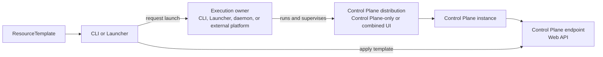

# Control Plane Execution Model

## Status

- Status: Future direction.
- Strategy fit: High; CloudShell should use one Control Plane and Resource
  Manager API across application-scoped development and standing
  hosting-platform environments.
- Current behavior is documented in [Hosting model](../hosting-model.md),
  [CloudShell CLI](../cli.md), and
  [Launchers](../launchers-and-app-hosts.md).
- This document describes the target architecture. It does not claim that the
  current CLI daemon commands, Launcher packages, or distribution packaging
  already implement this model.

## Direction

CloudShell should separate its stable client boundary from packaging and
process supervision:

- a **Control Plane distribution** packages the Control Plane, its selected
  capabilities, and optionally the CloudShell UI
- a **Control Plane instance** is a running realization of a distribution
- a **Control Plane endpoint** is the URL and Web API through which clients use
  the instance
- an **execution owner** starts, monitors, and stops the process or service

The CLI and programmatic Launchers should not need to know how a distribution
is hosted after they obtain its endpoint and credentials. The stable
interoperability boundary is the Control Plane and Resource Manager API, not
the executable, service manager, container runtime, or combined UI packaging.

## Bootstrap Flows

The CLI receives a resource template:

1. receive or read a `ResourceTemplate`
2. launch a compatible Control Plane distribution or select an existing
   Control Plane endpoint
3. wait for endpoint readiness
4. apply the template through the Control Plane API
5. retain a lifetime handle only when the CLI owns the launched instance

A programmatic Launcher follows the same flow, except that it produces the
template through language-native authoring APIs before launching or selecting
the Control Plane.

After endpoint discovery, both are ordinary Control Plane API clients. They do
not need to distinguish a child process from a service, container, remote
deployment, or daemon-supervised instance. A client that launches an
application-scoped instance additionally needs an opaque lifetime handle or
equivalent process integration so the instance can be stopped or monitored.
That launch handle is not part of the Resource Manager API.

## Distribution Shapes

A Control Plane distribution always contains the Control Plane API and the
capabilities selected by the product integrator. It can use either supported
surface shape:

- **Control Plane-only distribution**: exposes the API without serving the
  CloudShell UI
- **combined distribution**: exposes the same Control Plane API and also serves
  the CloudShell UI

`CloudShell.LocalDevelopmentHost` is the standard development-oriented
combined distribution. Custom host applications can produce Control Plane-only
or combined distributions for application-specific, team-owned, on-premise,
or specialized environments.

Whether the UI is present does not change template apply or resource
operations. A separately deployed UI is another client of the same Control
Plane endpoint.

## Execution Models

### Application-scoped execution

The CLI or a programmatic Launcher can launch a distribution whose lifetime is
bound to the invoking command or application. The caller owns shutdown and may
monitor the process or service through a launch-specific handle.

This is the normal direction for local development, tests, samples, CI, and
application-specific environments. The instance can run in a child process or
through another local launch mechanism; that detail is not exposed through the
Control Plane API.

### Daemon-supervised execution

CloudShell should provide a daemon that runs as an operating-system service and
supervises resident Control Plane instances independently of interactive CLI or
Launcher processes. This is the preferred built-in direction when CloudShell
is used as a hosting platform.

The CLI acts as a management client for the daemon during distribution and
instance lifecycle operations, then uses the instance's Control Plane endpoint
for resource operations. The target daemon contract should eventually support:

- installing or registering the system service
- selecting and updating a Control Plane distribution
- creating and configuring an instance
- starting, stopping, restarting, and inspecting the instance
- durable configuration without persisted secrets
- endpoint discovery, readiness, health, logs, and startup diagnostics
- restart and recovery policy
- authenticated local or remote management

The architecture should not prevent one daemon from supervising multiple named
instances, but the first implementation may deliberately support one resident
instance. That choice belongs in a focused implementation proposal.

### External execution and attachment

A distribution can also be run by systemd, a container runtime, Kubernetes,
another service manager, or a product-specific supervisor. CLI and Launcher
clients can attach to any compatible Control Plane endpoint without knowing or
owning its process lifetime.

The CloudShell daemon is the built-in resident execution path, not a
requirement for every production topology.

## Contract Boundaries

A `ResourceTemplate` describes desired resources accepted by the Control
Plane. It does not select provider packages, choose whether the UI is included,
configure persistence, or define how the distribution is supervised.

The conceptual bootstrap inputs and outputs are:

```text
Control Plane distribution + distribution configuration + lifetime policy
    -> Control Plane endpoint + optional lifetime handle

Resource template + Control Plane endpoint
    -> Control Plane template apply
```

This decomposition is not yet a commitment to public launch request, endpoint,
or lifetime-handle types.



## Ownership Boundaries

The design must keep three kinds of ownership separate:

| Ownership | Question |
| --- | --- |
| Execution ownership | Which caller, daemon, or external supervisor keeps the Control Plane instance running? |
| Graph authority | Which Launcher, template source, user, or automation owns desired resource intent? |
| Resource lifetime | Are accepted resources transient, persisted Control Plane state, or detached provider runtime state? |

Application-scoped execution often makes these lifetimes end together, but a
resident instance makes the distinction observable. Applying templates from
several Launchers to one standing environment will require explicit source
identity, reconciliation, collision, cleanup, and persistence semantics.
`EnvironmentId` alone should not be assumed to solve declaration ownership.

A later proposal should define whether the Control Plane needs a declaration
source ID, project identity, session or lease ID, or another durable ownership
contract. That contract belongs to resource application and reconciliation,
not to distribution supervision.

## Architectural Constraints

- The Control Plane and Resource Manager API is the stable client boundary.
- A distribution may contain only the Control Plane or combine it with the UI.
- CLI and Launcher bootstrap behavior converges after template production.
- Clients need only endpoint connection information after discovery, except
  for an opaque lifetime handle when they own an application-scoped launch.
- A resource template does not define distribution composition or supervision.
- The daemon supervises distributions and instances; it does not replace the
  Control Plane.
- Launchers author and submit resource intent; they do not own provider runtime
  behavior or Control Plane state.
- Templates and management protocols must not contain persisted secret values.
- Current PID/state-file behavior must not be treated as the final daemon
  service contract.

## Current State And Future Work

Current CloudShell behavior proves parts of this direction: the CLI can run a
same-version development distribution in the foreground, current daemon-style
commands can start and track a local process, Launchers can produce templates,
and clients can apply templates to an existing Control Plane endpoint.

The target system-service daemon, shared distribution-launch contract, durable
instance-management model, endpoint-discovery contract, and declaration
ownership semantics are future work. They should be extracted into focused
proposals only after the local-development MVP is stable and the first
on-premise hosting slice becomes active roadmap work.
