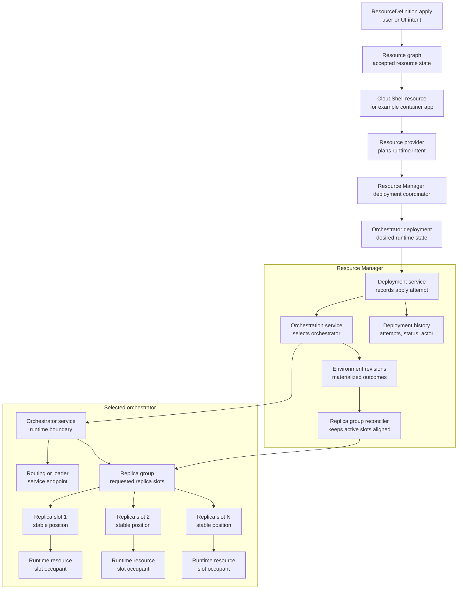
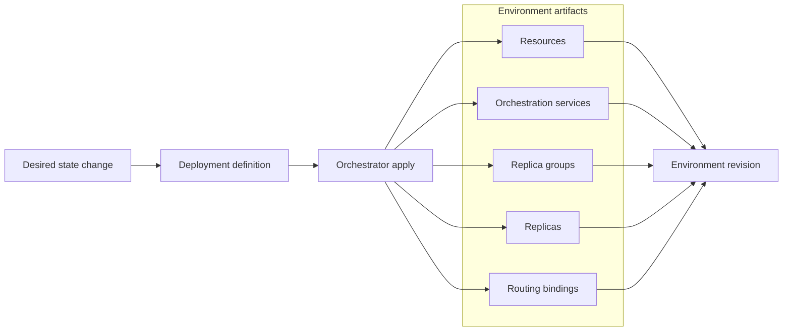

# Orchestration and Deployments

CloudShell separates user-authored resource state from runtime materialization.
Users and tools author `ResourceDefinition` entries, usually grouped in a
`ResourceTemplate`. Resource Manager validates and accepts those definitions
into the resource graph. Providers and orchestrators then turn accepted state
into running processes, containers, networks, routes, volumes, and other
runtime artifacts.

An orchestrator deployment is an internal runtime materialization record. It is
not the user-facing template format and should not replace `ResourceTemplate`
or `ResourceDefinition` authoring.

## Boundary

The current boundary is:



Resource definitions describe desired resource state. Orchestrator deployments
describe runtime work derived from accepted resource state.

Runtime resources materialized from deployment work remain ordinary resource
projections when identity is useful for diagnostics, relationships, scoped
health, logs, traces, metrics, or cleanup. The source/management/visibility
contract for those projections is defined in
[Provider-created and runtime-managed resources](runtime-managed-resources.md).

For example, a container app image or replica-count update starts as a
`ResourceDefinition` change. After that state is accepted, the container app
provider can describe the required runtime deployment. Resource Manager applies
that deployment through the selected orchestrator and records the result.

## Current Contracts

The internal orchestration contracts live in the Resource Manager abstractions:

- `ResourceOrchestratorDeployment`
- `ResourceOrchestratorDeploymentSpec`
- `ResourceOrchestratorRevision`
- `ResourceOrchestratorDeploymentApplyResult`
- `IResourceOrchestratorDeploymentProvider`
- `IResourceOrchestratorDeploymentApplier`
- `IResourceOrchestratorDeploymentCoordinator`
- deployment applied, failure, and tear-down provider hooks

A provider can opt into `IResourceOrchestratorDeploymentProvider` when accepted
resource state implies runtime work. The provider describes the deployment; it
does not own deployment locking, revision numbering, history recording, or
post-apply cleanup. Those concerns belong to the Resource Manager deployment
path.

## Deployment Records

The Control Plane records deployment attempts through
`IResourceOrchestratorDeploymentStore`. The current in-memory store records:

- deployment id
- orchestrator id
- source resource id
- service id
- runtime revision id
- deployment status
- start/completion timestamps
- trigger and cause
- message or error
- environment revision data
- replica-group data
- deployment definition snapshot

The public read model is `ResourceDeploymentRecord`, exposed through
`IResourceDeploymentManager`.

The Control Plane API exposes deployment history through:

```http
GET /api/control-plane/v1/deployments
```

Supported query fields are source resource id, deployment id, orchestrator id,
and maximum record count. The remote Control Plane client maps this endpoint
back to `IResourceDeploymentManager.ListResourceDeploymentsAsync(...)`.

The relationship between desired state, deployment apply, and the environment
revision is:



## Environment Revisions

An environment revision records the materialized runtime state produced by a
successful or failed deployment attempt. Revisions are scoped by source
resource and orchestrator service. The current revision model tracks:

- revision id
- deployment id
- source resource id
- service id
- revision number
- creation time
- revision status
- optional replica group
- optional base revision
- provider/orchestrator provisioning owner
- deployment definition snapshot

Environment revisions are internal runtime history. They support traceability
and rollback/reconciliation design, but they are not currently a user-authored
configuration revision surface.

## Replica Groups

Replica groups describe runtime instances for workloads that scale. They are
used by container app deployment and health/recovery flows to reason about
requested slots, occupied slots, runtime revision ids, and tear-down of retired
groups.

Replica groups are runtime artifacts. The stable user-facing resource remains
the container app or other workload resource that requested them.

## Resource Manager Responsibilities

Resource Manager owns the deployment coordination concerns:

- selecting the orchestrator
- applying the provider-described deployment
- recording applying, active, and failed deployment records
- creating environment revisions
- looking up previous replica groups
- invoking provider hooks after apply or failure
- coordinating post-apply tear-down and cleanup
- exposing deployment history through the Control Plane API/client

Providers own the resource-specific planning and projection concerns:

- determining whether accepted resource state implies deployment work
- describing service, workload version, routing, inputs, and replica groups
- projecting deployment status back onto stable resources when useful
- handling provider-specific applied/failure callbacks
- describing runtime resources that should be torn down after apply

## Non-Goals

Current orchestrator deployments are not:

- a public deployment template format
- a replacement for `ResourceTemplate`
- a Kubernetes, Docker Compose, or provider-native deployment object exposed as
  the CloudShell domain model
- a requirement that every resource become a scaled service
- a public rollout-history or traffic-splitting API

Those higher-level rollout and portability features remain proposal or future
direction work until the internal deployment/reconciliation boundary is stable.
