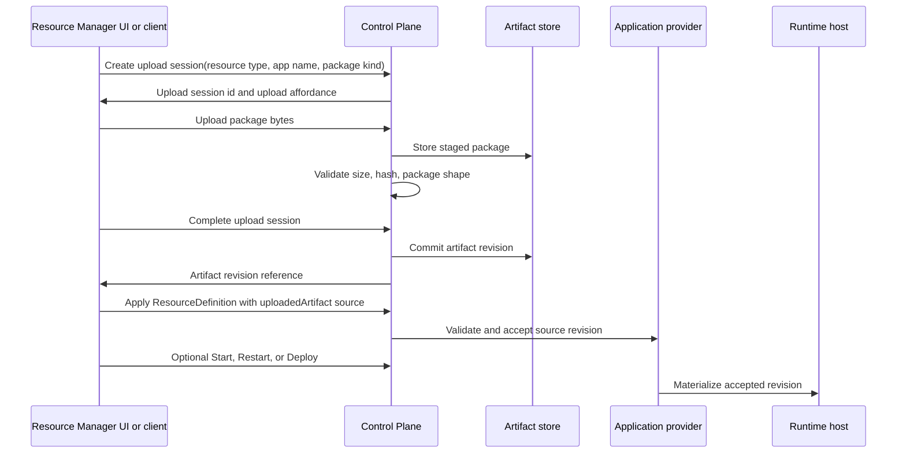

# Application Source Artifacts

## Status

- Status: Proposed
- Strategy fit: High; resource creation and editing need a host-safe way to
  load application code into local and hosted environments.
- Canonical feature docs: None yet. The nearest current contracts are
  [Application resources](../../resources/application-resources.md),
  [ResourceDefinition structure](../../resource-definition-structure.md),
  [Resource model providers](../../resource-model-providers.md), and
  [Orchestration and Deployments](../../orchestration-and-deployments.md).
- Remaining action: Define the first Control Plane artifact-store contract,
  upload API, source-reference shape, and Resource Manager create/edit UI flow.
- Out of scope: general object storage, source control hosting, CI systems,
  public rollout history, and provider-native deployment package formats.

## Summary

Application resources need a source-loading model that works when the
CloudShell UI, Control Plane, and runtime host are not the same computer. A
local project path is enough for local development when the runtime host can
read the same filesystem path. It is not enough for hosted or team-owned
environments where application files must be uploaded, stored, validated,
versioned, and materialized by the Control Plane or a provider-owned runtime.

CloudShell should model application source as resource intent while keeping
the physical artifact store behind Control Plane host configuration. The
resource definition should reference a source revision, not the host's private
storage path. The Control Plane should expose an upload API that stores
application artifacts in the configured store, returns a stable artifact
revision reference, and lets the application provider materialize that
revision during start, restart, or deployment.

## Problem

Current application resources are mostly local-development resources. Their
project path, command, script, artifact path, Dockerfile path, or working
directory assumes that the process applying the resource and the process
running the workload can access the same files.

That assumption breaks in these scenarios:

- Resource Manager UI runs in a browser and cannot give the remote Control
  Plane access to arbitrary local files.
- A split UI host targets a remote Control Plane whose runtime host is a
  different machine.
- A team-owned Control Plane needs to accept an application package from a
  user or automation client without exposing its internal filesystem layout.
- A provider needs to validate package size, checksum, file type, or build
  requirements before replacing the currently running source.
- Restarting an app after upload must not disturb the previous running
  revision if upload or validation fails.

The source-loading workflow must therefore be a Control Plane capability, not
a UI-only convenience and not a path string in resource attributes.

## Goals

- Let Resource Manager create and edit application resources that use either a
  host-readable local path or a Control Plane-managed uploaded artifact.
- Keep the physical artifact store configured by the Control Plane host, not
  authored into resource definitions.
- Give resources stable source references such as an artifact revision id,
  content hash, package kind, and optional entry path, without exposing the
  store root path.
- Make upload, validation, apply, and restart/deploy distinct domain steps so
  failed uploads do not affect the currently accepted application revision.
- Support split hosting and remote Control Plane clients through the same API
  shape the Resource Manager UI uses.
- Keep artifact storage provider-extensible so local filesystem storage can be
  replaced by file shares, object storage, or provider-backed stores later.
- Preserve secret boundaries. Uploaded packages may contain application files,
  but resource definitions, logs, diagnostics, and generated UI must not leak
  provider credentials or secret values.

## Non-goals

- Do not make mounted volumes the source artifact model. Volumes are runtime
  storage; application artifacts are deployment inputs with revision,
  validation, and rollback concerns.
- Do not expose the artifact store root path as resource state.
- Do not make Resource Manager a source-code editor or CI/build service.
  Providers may run a build step when their resource type supports it, but the
  artifact contract only gets package bytes into a trusted store.
- Do not require every application resource type to support uploaded artifacts
  in the first slice.
- Do not couple the model to one provider-native package format.

## Source Kinds

Application resources should use a provider-owned source descriptor in their
`ResourceDefinition` payload. The descriptor is resource intent and may vary by
application type, but the common source kinds should be:

| Kind | Meaning | Resource state |
| --- | --- | --- |
| `localPath` | The runtime host can read a path directly. Best for combined-host local development and trusted host-local automation. It is allowed only when the host runs in local-development mode or the actor has explicit permission to reference host paths on the target host. | Relative or absolute path plus working directory rules owned by the provider. |
| `uploadedArtifact` | The caller uploaded a package through the Control Plane artifact API. | Artifact revision reference, package kind, hash, and optional entry path. |
| `git` | The runtime/provider can fetch source from a repository. | Repository URL, ref, path, and credential reference when supported. |
| `containerImage` | The app runs from an already built image. | Image reference and registry credential reference when supported. |

`localPath` remains valid, but it is a privileged host-readable path source,
not a normal browser upload substitute. Resource Manager should allow local
path entry only when the target environment advertises local-development host
mode or when the current actor has permission to reference files on that host.
In a shared or hosted environment, ordinary application editors should use
`uploadedArtifact`, `git`, or `containerImage` instead of host paths.

`uploadedArtifact` is the first hosted-environment source kind this proposal
targets.

## Artifact Store Configuration

The artifact store is configured by the Control Plane host. It is not part of
the application resource definition.

An initial filesystem-backed configuration could look like:

```json
{
  "ApplicationArtifacts": {
    "Store": {
      "Kind": "FileSystem",
      "RootPath": "Data/application-artifacts",
      "MaxUploadBytes": 268435456,
      "AllowedPackageKinds": [ "zip", "tar.gz" ]
    }
  }
}
```

The same logical store contract should allow later providers:

- `FileSystem` for local and simple on-premise hosts.
- `FileShare` for a shared mounted path.
- `BlobStorage`, `S3`, or equivalent object storage for hosted environments.
- Provider-owned stores that expose signed upload URLs while preserving the
  same artifact revision model.

The Control Plane should project whether artifact upload is available through
capabilities or a small artifact-store status endpoint. Resource Manager can
then enable or disable upload UI without knowing the concrete store path.

## ResourceDefinition Shape

The resource definition should carry only the source reference, not the store
location. A sketch:

```yaml
resources:
  - type: application.python-app
    name: api
    source:
      kind: uploadedArtifact
      artifactRevision: app-artifact:api/revisions/20260711T120000Z
      packageKind: zip
      contentSha256: 4f6b...
      entryPath: .
    python:
      module: app
    endpoints:
      - name: http
        targetPort: 8000
```

The exact field placement may remain provider-owned while the common source
descriptor is being proven. The important contract is that the resource points
to an artifact revision identity accepted by the Control Plane, not to
`Data/application-artifacts/...`.

For project resources such as ASP.NET Core, JavaScript, Java, Go, and Python,
the source descriptor can replace or supplement the current project path:

- `localPath` uses `project.path` or the existing type-specific path fields.
- `uploadedArtifact` gives the provider a package root and optional entry path
  from which type-specific build or run settings are resolved.

## Upload API Flow

The Control Plane should own artifact upload sessions. A client should not
write directly into the configured store path.



The first HTTP API can be simple and Control Plane-hosted:

```http
POST /api/control-plane/v1/application-artifacts/uploads
PUT  /api/control-plane/v1/application-artifacts/uploads/{uploadId}/content
POST /api/control-plane/v1/application-artifacts/uploads/{uploadId}/complete
GET  /api/control-plane/v1/application-artifacts/{artifactId}/revisions/{revisionId}
```

Provider-backed stores may later return direct upload affordances, such as a
single-use signed URL, but the Resource Manager and remote client model should
still treat the Control Plane as the authority that creates, completes, and
accepts artifact revisions.

## Apply and Lifecycle Boundary

Uploading bytes is not the same as updating the application resource.

The intended flow is:

1. Upload package bytes.
2. Complete and validate the upload.
3. Apply a `ResourceDefinition` update that references the new artifact
   revision.
4. Optionally start, restart, or deploy the resource.

Resource Manager can expose this as one guided workflow, but the domain steps
should stay separate. This avoids replacing a known-good source revision with a
failed upload and lets automation choose when to roll forward.

`Restart` should restart the currently accepted revision. Applying a new
source revision and then restarting or deploying it is a separate update
workflow. Container apps may route this through deployment planning and
environment revision records. Process-backed project resources may initially
stop and start after accepting the new source revision, but they should still
record which source revision is running when that state is observable.

## Resource Manager Create and Edit UI

The application create/edit UI should present source as an explicit section:

- Source kind: host-readable path, upload package, image, or future Git.
- For host-readable paths, show path fields and a note that the target host
  must be able to read them. Hide or disable this option unless the host is a
  local-development host or the actor has host-path authoring permission.
- For upload package, show package selection, upload progress, validation
  result, artifact revision, and whether the resource definition has been
  updated to use it.
- For image-backed apps, show image reference and registry credential
  reference where supported.
- Keep start-after-create and restart-after-update as explicit options after
  the source has been accepted.

The UI should call domain/API operations. It should not inspect or write the
artifact store path directly, even in a combined host.

## Security and Authorization

Artifact upload requires its own authorization checks. A user who can edit a
resource may not automatically be allowed to upload arbitrary packages unless
the environment grants that capability.

Local-path source also requires explicit gating. A user who can edit an
application resource must not automatically be allowed to point a hosted
runtime at arbitrary host filesystem paths. The Control Plane should accept
`localPath` only when one of these is true:

- the target host profile advertises local-development mode
- the actor has a host-path authoring permission for the target host or
  environment
- a trusted automation identity with equivalent permission applies the
  definition

The Control Plane should enforce:

- maximum upload size
- allowed package kinds
- upload session expiry
- content hash calculation
- package extraction limits and path traversal protection
- secret and credential redaction in logs and diagnostics
- actor/resource audit records for upload, completion, apply, and
  start/restart/deploy

Uploaded package contents are not projected through resource attributes or
logs. If scanning, SBOM, provenance, or signature validation is added later,
the results should be summarized as non-secret metadata and diagnostics.

## Provider Parity

Application resource providers that support uploaded artifacts should document:

- supported source kinds
- package kinds and expected layout
- how package entry paths map to project paths, scripts, Dockerfiles, build
  files, or executable paths
- whether the provider builds from source, runs from source, or expects a
  prebuilt artifact inside the package
- whether source updates can be applied while running or require restart
- how the running source revision is projected
- which diagnostics are returned for missing artifact revisions, incompatible
  package layout, build failure, and runtime materialization failure
- how logs, traces, metrics, health, and deployment records identify the source
  revision when available

## Implementation Slices

1. Define `ApplicationArtifactStoreOptions`, filesystem-backed store
   registration, and a no-store disabled state.
2. Add a Control Plane artifact upload manager with create, upload, complete,
   lookup, validation, and cleanup semantics.
3. Project upload APIs through the Control Plane HTTP surface and remote
   client.
4. Add a common application source descriptor shape with Control Plane
   validation for `localPath` host mode and host-path authoring permission.
5. Support
   `uploadedArtifact` for one narrow provider, preferably Python or executable
   applications because their runtime mapping is simpler than ASP.NET Core
   build semantics.
6. Add Resource Manager create/edit source UI that can use local path or
   uploaded artifact source.
7. Add start/restart-after-update workflow wiring while keeping upload,
   apply, and lifecycle actions distinct.
8. Extend the model to ASP.NET Core, JavaScript, Java, Go, and container app
   sources after the first provider proves the contract.

## Open Questions

- Should artifact revision records be their own hidden resources, provider
  runtime records, or a separate Control Plane artifact read model?
- Should a completed upload be usable by more than one resource, or should the
  first implementation scope each artifact to one resource name and type?
- How long should staged but incomplete uploads be retained?
- Should package extraction happen at upload completion, provider
  materialization time, or both?
- How should artifact revisions integrate with deployment records for
  process-backed resources that do not yet use the container app deployment
  coordinator?
- Which authorization permission names should gate upload, source apply, and
  artifact revision read?
