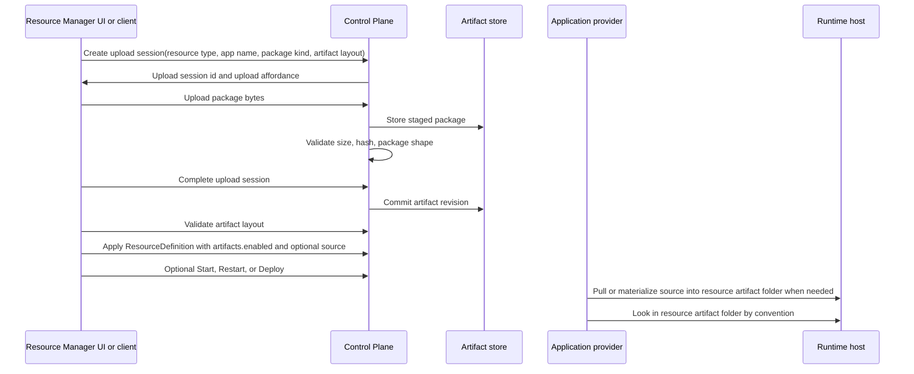

# Deployment Artifacts

## Status

- Status: Proposed
- Strategy fit: High; resource creation and editing need a host-safe way to
  load application code into local and hosted environments.
- Canonical feature docs: None yet. The nearest current contracts are
  [Application resources](../../resources/application-resources.md),
  [ResourceDefinition structure](../../resource-definition-structure.md),
  [Resource model providers](../../resource-model-providers.md), and
  [Orchestration and Deployments](../../orchestration-and-deployments.md).
- Remaining action: Add runtime materialization for accepted application
  artifact revisions, enforce host-path permissions for local source mode, and
  add future artifact-source download/pull transfer modes.
- Out of scope: general object storage, source control hosting, CI systems,
  public rollout history, and provider-native deployment package formats.

## Summary

Application resources need a deployment-artifact model that works when the
CloudShell UI, Control Plane, and runtime host are not the same computer. A
local project path is enough for local development when the runtime host can
read the same filesystem path. It is not enough for Resource Manager UI
creation or editing in hosted or team-owned environments where package bytes
must be uploaded, stored, validated, versioned, and handed to the resource
provider.

CloudShell should store deployment artifacts behind Control Plane host
configuration while resource definitions expose only the selected artifact
mode. The resource definition should choose either local source mode or
deployment-artifact mode. In deployment-artifact mode, the definition carries
an allocation flag for the host-managed artifact/data folder and the provider
looks in that folder for runnable artifacts by convention.
`artifacts.source` is optional source metadata for future pull/download flows,
not a required pointer to the current local artifact. The resource provider,
not the generic artifact store, owns what the folder layout means and how it is
materialized during start, restart, or deployment.

The public route shape is resource-scoped and uses `/resources/{resourceId}/artifacts/...`.
The current contracts still use deployment-artifact names internally. A later
rename may call these resource artifacts once the broader resource-owned
artifact model is settled.

## Problem

Current project-style application resources are mostly local-development
resources. Their project path, command, script, artifact path, Dockerfile path,
or working directory assumes that the process applying the resource and the
process running the workload can access the same files.

That assumption breaks in these scenarios:

- Resource Manager UI runs in a browser and cannot give the remote Control
  Plane access to arbitrary local files.
- A split UI host targets a remote Control Plane whose runtime host is a
  different machine.
- A team-owned Control Plane needs to accept an application package from a
  user or automation client without exposing its internal filesystem layout.
- A provider needs to validate package size, checksum, file type, artifact
  layout, or build requirements before replacing the currently running
  deployment input.
- Restarting an app after upload must not disturb the previous runnable
  artifact folder contents if upload or validation fails.

The deployment-artifact workflow must therefore be a Control Plane capability,
not a UI-only convenience and not a path string in resource attributes.

## Goals

- Let Resource Manager create and edit application resources that use a
  Control Plane-managed deployment artifact.
- Preserve the existing local-development path/project-file story for resource
  declarations that run close to the developer's filesystem.
- Let a resource type support both local-source mode and deployment-artifact
  mode while requiring each resource definition to choose exactly one mode.
- Keep the physical artifact store configured by the Control Plane host, not
  authored into resource definitions.
- Give resources stable artifact-folder mode and optional source metadata
  without exposing the store root path.
- Make upload, validation, apply, and restart/deploy distinct domain steps so
  failed uploads do not replace known-good runnable content in the resource
  artifact folder.
- Support split hosting and remote Control Plane clients through the same API
  shape the Resource Manager UI uses.
- Keep artifact storage provider-extensible so local filesystem storage can be
  replaced by file shares, object storage, or provider-backed stores later.
- Preserve secret boundaries. Uploaded packages may contain application files,
  but resource definitions, logs, diagnostics, and generated UI must not leak
  provider credentials or secret values.

## Non-goals

- Do not make mounted volumes the deployment artifact model. Volumes are
  runtime storage; deployment artifacts are deployment inputs with revision,
  validation, and rollback concerns.
- Do not expose the artifact store root path as resource state.
- Do not make Resource Manager a source-code editor or CI/build service.
  Providers may run a build step when their resource type supports it, but the
  artifact contract only gets package bytes into a trusted store.
- Do not require every resource type to support uploaded deployment artifacts
  in the first slice.
- Do not couple the model to one provider-native package format.

## Local Source Mode and Deployment Artifact Mode

CloudShell should treat local source and deployment artifacts as two authoring
modes for resource types that support both:

| Mode | Meaning | Normal authoring surface |
| --- | --- | --- |
| Local source | The runtime host can read source, project, script, or build files directly from a path. The provider owns the path fields and local runner behavior. | Programmatic declarations, launchers, local-development host profiles, or trusted host-path automation. |
| Application artifact | The resource activates host-managed artifact/data-folder allocation. The provider looks in that folder for runnable content by convention. The caller may provide package bytes through a Control Plane artifact upload flow, and the host places or materializes those bytes into the resource artifact folder. | Resource Manager create/edit UI, remote clients, hosted/team-owned environments, and automation that cannot rely on host-local paths. |
| External artifact source | Optional `artifacts.source` metadata can later tell the provider or Control Plane where to download or pull application artifacts before placing them in the resource artifact folder. | Future source-control, object-store, registry, Artifactory, or CI artifact integrations. |

A resource type may support both modes, but a single resource definition should
select one. For example, a .NET web app resource might run from a local
project file in local source mode or from an uploaded ZIP in deployment
artifact mode. The resource provider decides how to build or run each mode.
This preserves the existing project-file and local-path authoring flows while
making the selected input mode unambiguous for a given resource instance.

The common reference kinds should be:

| Kind | Meaning | Resource state |
| --- | --- | --- |
| `localPath` | The runtime host can read a path directly. Best for combined-host local development and trusted host-local automation. It is allowed only when the host runs in local-development mode or the actor has explicit permission to reference host paths on the target host. | Relative or absolute path plus working directory rules owned by the provider. |
| `uploadedArtifact` | The caller uploaded a package through the Control Plane artifact API. | `artifacts.enabled` plus host-managed folder content; optional source metadata only when the host needs to pull or materialize content later. |
| `git` | The runtime/provider can fetch source from a repository. | Repository URL, ref, path, and credential reference when supported. |
| `containerImage` | The app runs from an already built image. | Image reference and registry credential reference when supported. |

`localPath` remains valid, but it is a privileged host-readable path source,
not a normal browser upload substitute. Resource Manager should allow local
path entry only when the target environment advertises local-development host
mode or when the current actor has permission to reference files on that host.
In a shared or hosted environment, ordinary application editors should use
`uploadedArtifact`, `git`, or `containerImage` instead of host paths.

`uploadedArtifact` is the first application-artifact kind this proposal targets.
The store does not define what a ZIP, tarball, JAR, DLL, static-site bundle,
Docker build context, or other package means. The package kind describes the
container format, such as `zip` or `tar.gz`; the artifact layout kind describes
provider-owned meaning, such as a .NET published output package or a .NET
source project directory. The resource provider validates the artifact layout
for its resource type and decides whether it builds, copies, extracts, runs, or
rejects that artifact.

An artifact-mode resource can exist before the first artifact upload. That
state is useful because the Control Plane can allocate the resource artifact
folder and Resource Manager can later upload a replacement package through the
same resource-scoped API. The resource definition is valid, but lifecycle
operations that need runnable application bytes must fail with provider-owned
diagnostics when the resource artifact folder does not contain a valid layout.
When `artifacts.source` is present, the provider should pull or materialize
that source into the resource artifact folder when the resource is first
started, not while the ResourceDefinition is merely accepted.

The common resource attributes for this mode are:

- `artifacts.enabled`: `true` when the resource uses a host-managed artifact or
  data folder instead of a provider-owned local source path.
- `artifacts.source`: optional source metadata describing where the host can
  pull or download artifacts from before placing them in the resource artifact
  folder. Direct upload to the host does not require this attribute.

## Package Kind and Artifact Layout

CloudShell should keep package transport separate from provider deployment
meaning:

| Concept | Owner | Examples |
| --- | --- | --- |
| Source kind | Common resource descriptor | `localPath`, `uploadedArtifact`, `git`, `containerImage` |
| Package kind | Artifact store | `zip`, `tar.gz` |
| Artifact layout kind | Resource provider | `dotnetPublishedOutput`, `dotnetSourceProject`, `pythonSourceDirectory`, `containerBuildContext` |

This distinction matters for .NET app resources. The normal hosted upload flow
should accept a compiled/published .NET application package. In that layout,
the provider validates runnable output, such as the entry assembly, dependency
metadata, runtime configuration, static web assets where relevant, and the
selected entry path. It should not require a project file because the build has
already happened.

A provider may also support uploading an entire source directory package. That
is a different artifact layout. In that layout, the provider validates source
shape, such as a `.csproj` or `.fsproj` file, solution/project selection rules,
target framework compatibility, and any supported build requirements. The UI
should present these layouts as different upload choices when a provider
advertises both.

Supported artifact layouts are announced by the resource type provider. The
Resource Manager UI should not hard-code layout names or infer support from a
resource type string. A provider descriptor for a layout should include:

- resource type id
- layout kind
- display name and description
- supported package kinds
- default package kind when more than one package kind is supported
- optional default entry path and whether entry path is required
- optional metadata for provider-specific UI hints

Resource Manager should combine this provider descriptor with the Control
Plane artifact-store status. For example, if a .NET web app provider supports
`dotnetPublishedOutput` in `zip` or `tar.gz`, but the configured store only
allows `zip`, the UI should offer that layout with `zip` only. If no provider
layout and store package-kind intersection exists, upload mode should be
disabled for that resource type with a clear validation message.

## Provider Validation

The Control Plane artifact store validates generic storage concerns:

- whether artifact upload is enabled
- allowed package kinds
- maximum upload size
- upload session expiry
- content hash
- safe staging and revision identity

Resource providers validate deployment meaning. A provider that accepts a
deployment artifact should be able to inspect the committed artifact stream and
return resource-definition diagnostics before a resource definition that
references the artifact is accepted. Examples:

- a .NET web app provider checks runnable published output when the selected
  layout is published output, or checks project files and build requirements
  when the selected layout is source project
- a Java provider checks for a JAR, classpath layout, Maven or Gradle project,
  or expected main-class metadata
- a Python provider checks for an entry module, script, requirements file, or
  supported web server convention
- a container app provider checks for a Dockerfile, OCI image reference, or
  build context shape when that mode is supported

Provider validation should return the same diagnostic shape Resource Manager
already shows for resource-definition validation in the create/edit workflow.
The generic artifact store must not decide that one package layout is valid
for every resource type.

## Project Resources and Hosted App Resources

The existing project resource types, such as
`application.aspnet-core-project`, are still valuable for local development.
They represent a project on a host-readable filesystem and can use development
behaviors such as `dotnet run`, `dotnet watch`, launch-settings endpoint
loading, and source directories that change while the developer works.

Hosted artifact loading should not force those project resources to become the
general deployment model. CloudShell should introduce app resource types when
the resource can represent an application loaded from an accepted deployment
artifact rather than a live project directory. For .NET, that
likely means separate types such as:

| Type | Purpose |
| --- | --- |
| `application.dotnet-app` | A .NET application loaded from local source mode or from a provider-validated deployment artifact. |
| `application.dotnet-web-app` | A .NET web application loaded from local source mode or from a provider-validated deployment artifact, with web endpoint defaults and ASP.NET Core runtime conventions. |
| `application.aspnet-core-project` | A local-development project resource that runs from a host-readable project path. |

The exact type IDs should be confirmed when the provider is implemented. The
product boundary should be clear: project resources are for project-on-disk
development, while app resources can support deployment-artifact mode. A
hosted create/edit UI should default to the app resource type. It may still
expose local source mode in local-development hosts or to users with host-path
authoring permission.

The same distinction can apply to other ecosystems. A Python project resource
can remain useful for local source-on-disk development, while a hosted Python
app resource can load from an uploaded deployment artifact or Git source and
materialize that content on the runtime host.

## Artifact Store Configuration

The artifact store is configured by the Control Plane host. It is not part of
the application resource definition and it is not entered in the Resource
Manager UI. In uploaded-artifact mode, the host-provided store location is the
direct upload target behind the Control Plane artifact API.

An initial filesystem-backed configuration could look like:

```json
{
  "DeploymentArtifacts": {
    "Store": {
      "Kind": "FileSystem",
      "RootPath": "Data/deployment-artifacts",
      "MaxUploadBytes": 268435456,
      "AllowedPackageKinds": [ "zip", "tar.gz" ]
    }
  }
}
```

The same logical store contract should allow later providers:

- `FileSystem` for local and simple on-premise hosts.
- `FileShare` for a shared mounted path.
- `BlobStorage`, `S3`, or equivalent object storage for hosted environments.
- Provider-owned stores that expose signed upload URLs while preserving the
  same artifact revision model.

The Control Plane should project whether artifact upload is available through
capabilities or a small artifact-store status endpoint. Resource Manager can
then enable or disable upload UI without knowing the concrete store path.

## ResourceDefinition Shape

The resource definition should carry only the selected mode, the host-managed
artifact allocation flag, and optional source metadata, not the store
location. The normal direct-upload shape is intentionally small:

```yaml
resources:
  - type: application.aspnet-core-project
    name: api
    attributes:
      application.source.kind: uploadedArtifact
      application.source.owner: resource-manager-ui
      artifacts.enabled: true
    endpoints:
      - name: http
        targetPort: 8080
```

Advanced source metadata can be added later without changing the folder
contract:

```yaml
resources:
  - type: application.aspnet-core-project
    name: api
    attributes:
      application.source.kind: uploadedArtifact
      application.source.owner: resource-manager-ui
      artifacts.enabled: true
      artifacts.source:
        kind: githubRelease
        repository: example/api
        tag: v1.2.3
        asset: api-linux-x64.zip
        artifactLayoutKind: dotnetPublishedOutput
```

The exact source fields can evolve while the common folder contract is being
proven. The important contract is that neither `artifacts.enabled` nor
`artifacts.source` exposes `Data/deployment-artifacts/...` or any other
host-local store path.

For app resources such as future .NET web apps or hosted Python apps, the
deployment descriptor chooses the mode:

- local source mode uses provider-owned path fields, such as project path,
  script path, or working directory
- application artifact mode gives the provider a resource artifact folder and
  provider-owned conventions for locating executable content; the physical
  host storage path remains Control Plane-owned
- external artifact source metadata is deferred and will describe where the
  host can download or pull artifacts from before placing them in the resource
  artifact folder

## Upload API Flow

The Control Plane should own artifact upload sessions. A client should not
write directly into the configured store path.



The first HTTP API is resource-scoped and Control Plane-hosted:

```http
GET  /api/control-plane/v1/resources/{resourceId}/artifacts/status
GET  /api/control-plane/v1/resources/{resourceId}/artifacts/layouts?resourceTypeId=application.dotnet-web-app
POST /api/control-plane/v1/resources/{resourceId}/artifacts/upload
PUT  /api/control-plane/v1/resources/{resourceId}/artifacts/uploads/{uploadId}/content
POST /api/control-plane/v1/resources/{resourceId}/artifacts/uploads/{uploadId}/complete
GET  /api/control-plane/v1/resources/{resourceId}/artifacts/{artifactId}/revisions/{revisionId}
POST /api/control-plane/v1/resources/{resourceId}/artifacts/validate
```

For the first slice, the host-configured artifact store is the direct upload
target. The client streams package bytes to the Control Plane, and the Control
Plane writes them to the configured host store. Future providers may support
pulling artifacts from repositories, object stores, or other artifact systems
into a supported host target, or returning direct upload affordances such as a
single-use signed URL. Those are later transfer modes. Resource Manager and
remote clients should still treat the Control Plane as the authority that
creates, completes, and accepts artifact revisions.

Validation runs after upload completion against the committed artifact revision.
The Control Plane loads the revision content from the configured host store and
dispatches to the resource type provider's deployment-artifact validator. The
result uses normal resource-definition diagnostics so Resource Manager can show
the same validation UI used by template apply and resource editing.

## Apply and Lifecycle Boundary

Uploading bytes is not the same as updating the application resource.

The intended flow is:

1. Upload package bytes.
2. Complete and validate the upload.
3. Apply a `ResourceDefinition` update that enables the resource artifact
   folder and, when needed, records optional source metadata.
4. Optionally start, restart, or deploy the resource.

Uploading a package does not by itself create a new resource revision. A
successful apply of a new accepted artifact package does count as a resource
revision, even when the resource stays in artifact-folder mode. That revision
is the audit and rollback boundary for “this resource now points at this
accepted artifact package or source metadata.”

The model therefore has artifact revisions within a versioned resource.
Artifact revisions are stored package/content versions scoped to the resource.
Resource revisions are accepted resource-state versions that record which
artifact revision, source metadata, or local-source configuration the resource
should use.

Artifact revisions also need provenance. Direct uploads should be recorded as
upload-sourced and non-rehydratable unless provider validation can discover a
stable executable or package version. Source downloads should record the
resolved version that was fetched, such as a commit SHA, release id, package
version, or object version, and mark whether the same artifact can be
rehydrated from that source later.

Application artifact packages are resource-owned data. After a resource delete
operation succeeds, the Control Plane deletes stored artifact revisions for
that resource from the configured artifact store. If provider delete fails,
the artifact revisions remain available for retry and diagnostics.

Accepted artifact revisions must be able to coexist while a running resource
is switching versions. Upload and apply prepare the next revision; they do not
delete files used by the current process. Runtime materialization should place
each accepted revision in its own runnable directory and only start the new
directory when lifecycle restart/deploy reaches the provider.

Retention policy should respect provenance and live resource state. Uploaded
artifact bytes may require bounded but conservative retention because
CloudShell may be the only durable copy. Rehydratable source-backed revisions
can be pruned after they are no longer referenced by accepted resource state,
running materialization, or rollback policy, because they can be downloaded
again.

Any accepted application artifact must eventually be materialized onto the
runtime host or into the host's runtime substrate before the app can run. Direct
upload only changes how bytes enter the host artifact store; provider
materialization still owns how stored or pulled content becomes a runnable app.

Resource Manager can expose this as one guided workflow, but the domain steps
should stay separate. This avoids replacing known-good resource artifact folder
contents with a failed upload and lets automation choose when to roll forward.

`Restart` should restart whatever valid artifact content is present in the
resource artifact folder. Uploading or pulling new content and then restarting
or deploying it is a separate update workflow. Container apps may route this
through deployment planning and environment revision records. Process-backed
app resources may initially stop and start after new content is accepted, but
they should still record the running artifact identity when that state is
observable.

## Resource Manager Create and Edit UI

The application create/edit UI should present deployment mode as an explicit
section:

- Mode: local source, uploaded deployment artifact, image, or future Git.
- Upload layout: provider-supported layouts such as compiled/published app
  package or source directory package.
- For host-readable paths, show path fields and a note that the target host
  must be able to read them. Hide or disable this option unless the host is a
  local-development host or the actor has host-path authoring permission.
- For upload package, show package selection, upload progress, validation
  result, and whether the resource definition has `artifacts.enabled`. Resource
  Manager-created artifact-mode resources should require an acceptable upload
  before creation.
- For image-backed apps, show image reference and registry credential
  reference where supported.
- Keep start-after-create and restart-after-update as explicit options after
  the artifact package has been accepted.

The UI should call domain/API operations. It should not inspect or write the
artifact store path directly, even in a combined host.

For resources declared by launchers or host graph builders, source settings are
host-owned. Resource Manager should show the selected source mode, project path,
artifact folder mode, or optional source metadata as read-only and must not
offer upload or path editing unless the resource was created through Resource Manager artifact mode
or another caller explicitly marked the source as Resource Manager-owned.

## Security and Authorization

Artifact upload requires its own authorization checks. A user who can edit a
resource may not automatically be allowed to upload arbitrary packages unless
the environment grants that capability.

Local-path source also requires explicit gating. A user who can edit an
application resource must not automatically be allowed to point a hosted
runtime at arbitrary host filesystem paths. The Control Plane should accept
`localPath` only when one of these is true:

- the target host profile advertises local-development mode
- the actor has a host-path authoring permission for the target host or
  environment
- a trusted automation identity with equivalent permission applies the
  definition

The Control Plane should enforce:

- maximum upload size
- allowed package kinds
- upload session expiry
- content hash calculation
- package extraction limits and path traversal protection
- secret and credential redaction in logs and diagnostics
- actor/resource audit records for upload, completion, apply, and
  start/restart/deploy

Uploaded package contents are not projected through resource attributes or
logs. If scanning, SBOM, provenance, or signature validation is added later,
the results should be summarized as non-secret metadata and diagnostics.

## Provider Parity

Resource providers that support uploaded deployment artifacts should document:

- supported modes and artifact kinds
- package kinds and provider-owned artifact layout kinds, surfaced through the
  provider's artifact-layout descriptor
- how package entry paths map to project paths, scripts, Dockerfiles, build
  files, or executable paths
- whether the provider builds from source, runs from source, or expects a
  prebuilt artifact inside the package
- whether artifact updates can be applied while running or require restart
- how the running artifact identity is projected
- which diagnostics are returned for missing artifact content, incompatible
  package layout, build failure, and runtime materialization failure
- how logs, traces, metrics, health, and deployment records identify the source
  artifact identity when available

## Implementation Slices

1. Define `DeploymentArtifactStoreOptions`, filesystem-backed store
   registration, and a no-store disabled state.
2. Add a Control Plane artifact upload manager with create, upload, complete,
   lookup, validation, and cleanup semantics.
3. Project upload APIs through the resource-scoped Control Plane HTTP surface
   and remote client.
4. Add a provider validation hook that can inspect committed artifact content
   before accepting a ResourceDefinition update.
5. Add a common deployment artifact descriptor shape with package kind,
   provider-owned artifact layout kind, provider-announced layout descriptors,
   and Control Plane validation for `localPath` host mode and host-path
   authoring permission.
6. Support `uploadedArtifact` validation descriptors across the application
   resource providers and preserve local source validation for local mode.
7. Add Resource Manager create/edit upload UI for Resource Manager-owned
   application artifact resources while keeping launcher/graph-builder sources
   read-only.
8. Add runtime materialization and start/restart-after-update workflow wiring
   so providers look in allocated resource artifact folders by convention while
   keeping upload, apply, and lifecycle actions distinct.
9. Add future external artifact source transfer modes for pulling artifacts
   from repositories, object stores, registries, or CI artifact systems into
   a supported host target.

## Open Questions

- Should artifact revision records be their own hidden resources, provider
  runtime records, or a separate Control Plane artifact read model?
- Should a completed upload be usable by more than one resource, or should the
  first implementation scope each artifact to one resource name and type?
- How long should staged but incomplete uploads be retained?
- Should package extraction happen at upload completion, provider
  materialization time, or both?
- Should provider artifact-layout descriptors be exposed through the core
  Control Plane resource-type metadata endpoint, a dedicated deployment
  artifact capability endpoint, or both?
- How should artifact revisions integrate with deployment records for
  process-backed resources that do not yet use the container app deployment
  coordinator?
- Which authorization permission names should gate upload, artifact apply, and
  artifact revision read?
