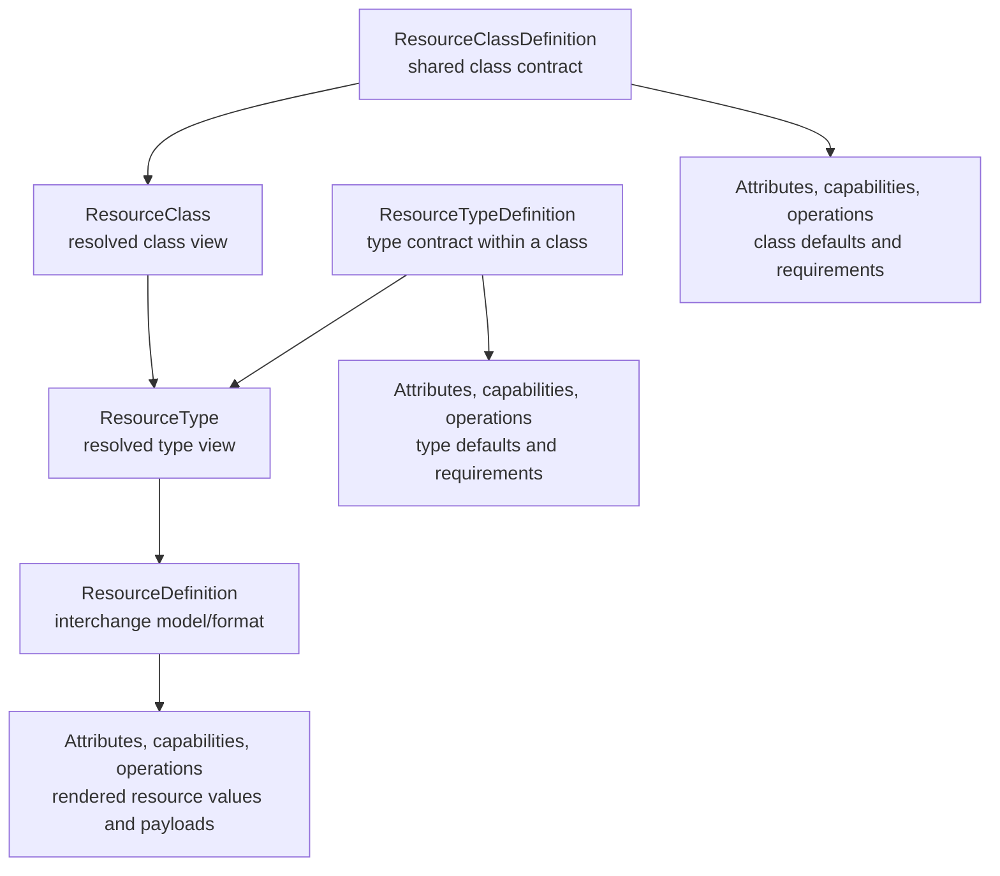
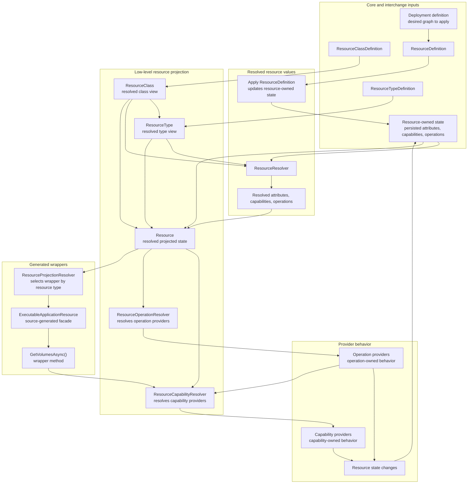
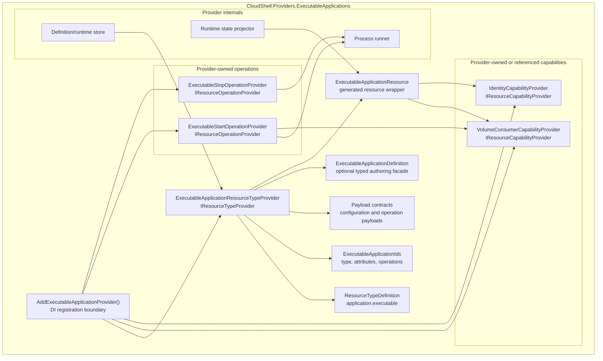
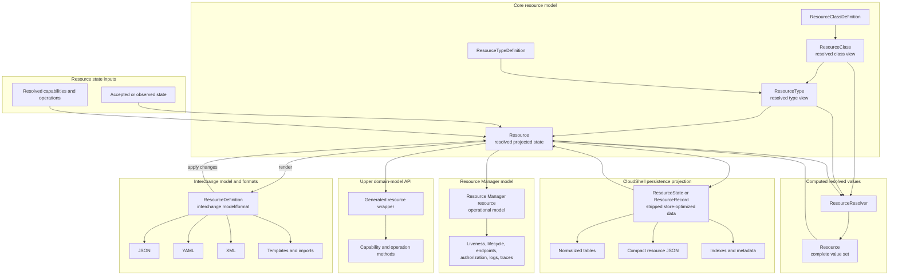

# Resource Graph and Runtime Separation Proposal

## Status

POC in progress.

CloudShell already distinguishes projected resources from declared resources in
the resource model documentation, and several providers already carry typed
definition records such as application, storage, volume, network, service, DNS,
and load-balancer definitions. This proposal narrows that work into one core
architecture: the Resource model is the durable resource graph and
configuration contract, while the Control Plane and Resource Manager own
runtime behavior and operational state.

## Core Clarification

The Resource model owns the durable, declarative description of the system:

- resource identity
- resource types and classes
- attributes
- relationships and references
- declared capabilities
- declared operations
- metadata
- accepted graph state

The graph describes what CloudShell should know about the system. It does not
describe how the system is currently executing. Runtime lifecycle, orchestration,
process state, health snapshots, logs, traces, metrics, runtime handles, locks,
provider caches, and operational history belong to the Control Plane and
Resource Manager.

The boundary can be summarized as:

```mermaid
flowchart TD
    definition["ResourceDefinition<br/>interchange format"]
    graph["Resource graph<br/>durable configuration contract"]
    resolved["Resolved Resource<br/>effective graph view"]
    declarations["Capabilities and operations<br/>resolved declarations"]
    manager["Resource Manager<br/>Control Plane operational model"]
    runtime["Runtime integrations<br/>handlers and provider services"]
    infrastructure["Running infrastructure"]

    definition --> graph
    graph --> resolved
    resolved --> declarations
    declarations --> manager
    manager --> runtime
    runtime --> infrastructure
```

`ResourceDefinition` is the interchange format for graph state. It is used for
authoring, deployments, templates, imports, exports, debug views, and applying
changes. Applying a `ResourceDefinition` produces graph-state changes that are
validated and accepted by the owning resource type before they become part of
the graph.

`ResourceTypeDefinition` and `ResourceClassDefinition` define configuration
shape: attributes, defaults, validation rules, supported capabilities, and
supported operations. They do not implement runtime behavior. Their
responsibility ends when proposed configuration changes have been validated,
normalized, and accepted into the graph.
Those definitions should be treated as versioned provider artifacts in the
future, alongside capability and operation declarations. A resource definition
may eventually pin the type, capability, or operation declaration version it
expects; if it does not, resolution can choose the latest compatible provider
artifact. The model should represent artifact ID and requested version
separately even if an authoring format later supports compact selectors such
as `application.executable:v2`, `application.executable:latest`, or another
convention that proves clearer.

Capabilities and operations are declarations in the graph. Their
implementations are resolved by the runtime layer. The graph owns what exists;
the runtime owns how it behaves. Capability providers and operation providers
are integration points, not background runtime systems.

The Resource Manager composes the resolved graph with its own operational
records, provider state, authorization, orchestration, logs, traces, health,
and lifecycle state into the operational view exposed through the API and UI.
The graph remains the contract; the runtime remains the implementation.

Storage is intentionally an implementation detail. The same graph model should
support in-memory graphs, Resource Manager-owned records with embedded graph
payloads, document stores, cached projections, and future distributed Control
Plane deployments without changing the model primitives.

## POC Scope

The first implementation slice is isolated in `CloudShell.ResourceDefinitions`
with tests in `CloudShell.ResourceDefinitions.Tests`. It proves the
interchange envelope, class/type inheritance, effective
attribute/capability/operation resolution, diagnostics, apply seams, and
provider-dispatch contracts without replacing the current Control Plane
pipeline, API projection, Resource Manager persistence, or existing provider
definition stores.

The POC should stay focused on the lower graph/configuration model and the
bridge into Resource Manager. It should prove that existing providers can be
ported onto a consistent graph contract, while runtime behavior remains behind
Control Plane-owned integrations.

Common `ResourceDefinition` interchange structure is documented separately in
[Resource Definition Structure](../../resource-definition-structure.md). This
keeps the proposal focused on architecture while giving shared constructs such
as references, endpoint requests, endpoint mappings, health checks, liveness,
volumes, log sources, attributes, capabilities, and operations a concrete
place to evolve as provider ports expose usability issues.

## Problem

`Resource` is the current known projection of a managed artifact. It is what
Resource Manager, the Control Plane API, providers, and remote clients can
inspect after provider behavior has accepted, normalized, or observed resource
state.

Resource declarations, templates, persistence flows, imports, and create flows
need an interchange artifact. They describe a resource state snapshot or
change that can be applied to a `Resource`, but they are not the source from
which a `Resource` is projected. Today that structure exists in several
partly overlapping forms:

- programmatic `ResourceDeclaration`
- provider-specific typed records such as `ApplicationResourceDefinition`,
  `VolumeResourceDefinition`, and `NetworkResourceDefinition`
- resource template entries with `JsonElement Configuration`
- create requests with `JsonElement Configuration`
- projected `Resource.Attributes`

This makes it easy for definition, projection, configuration, and diagnostics
to blur together. It also tempts the platform to put complex resource
configuration into projected attributes, even though attributes are currently
documented as stable, non-secret projected facts.

Resource definitions also need inherited expectations. A resource instance can
inherit attributes, capabilities, and operations from its
`ResourceTypeDefinition`, and that type definition can in turn inherit from a
broader `ResourceClassDefinition`. Raw property bags such as `.Attributes`,
`.Capabilities`, and `.Operations` therefore cannot be treated as the
effective model. They are declared or observed inputs that need resolution
against class, type, preset, provider, and environment rules.

Capabilities have a related issue. A resource type may support a capability,
an individual resource may define capability-owned state, and the resolved
resource may advertise a capability that downstream systems can discover.
Those are related, but they are not the same lifecycle phase.

Resource commands and operations have the same boundary concern. A projected
resource can expose commands such as start, stop, restart, reconcile,
update-image, or a provider-specific command. A command is the thing a caller
performs. Operations are declared on class definitions, type definitions, or
resource-owned state and add behavior to a resource. Some operations can be exposed as caller-facing
commands; other operations may exist mainly to drive validation, projection,
automation, reconciliation, or provider behavior. The behavior that validates
operation availability and executes or applies the backing behavior should not
have to live in a single monolithic resource type provider. The current
implementation may continue mapping command affordances onto the existing
action-shaped API fields during migration, but the durable domain language
should distinguish caller-facing commands from declared operations.

Other possible names for this concept are action, command, or procedure.
`Operation` is the most neutral term because it does not imply that the
behavior is always directly invoked by a user. The important point is that an
operation declaration adds behavior to a resource, and a provider supplies the
implementation for that behavior in the current environment.

## Goals

- Distinguish `Resource` projections from the `ResourceDefinition`
  interchange model/format in public domain language, docs, APIs,
  persistence, templates, imports, and provider contracts.
- Keep `Resource` as the resolved core projection of resource state.
- Define a plain serialized resource-definition interchange format that can be
  exchanged, reviewed, imported, and projected through templates without
  becoming provider-native configuration or the required persistence shape.
- Let resource types expose typed facades over definition payloads without
  requiring every consumer to understand every provider-specific type.
- Treat capability providers as attached behavior registered through
  dependency injection, so they can resolve provider or platform services while
  validating and interpreting resolved capabilities on `Resource`.
- Treat resource operation providers as attached behavior registered through
  dependency injection, so each provider can own the provider-side behavior
  behind one resolved resource operation.
- Define `ResourceClassDefinition` and `ResourceTypeDefinition` inheritance so
  attributes, capabilities, operations, defaults, presets, and requirements can
  be resolved before validation or projection.
- Define attribute validators for common rules and provider/type-specific
  rules, including required attributes and broader value validation.
- Provide resolver APIs that compute effective attributes, capabilities, and
  operations instead of asking callers to trust raw property bags.
- Separate resource-type validation from cross-cutting capability validation.
- Preserve provider ownership over runtime behavior, apply/update/delete
  behavior, and provider-specific configuration.
- Use existing providers as behavioral references, not as boundaries or
  terminology that the new model must preserve. When the old model is
  inconsistent, make the new Resource model internally consistent around graph
  attributes, provider-owned capabilities, provider-owned operations, explicit
  apply hooks, and Resource Manager dispatch.
- Do not extract an application-resource implementation toolkit prematurely.
  The goal of a future toolkit still stands, but common services should be
  introduced only after provider ports expose repeated needs. Even then,
  shared API surfaces should split when concepts, purposes, lifecycle, or
  behavior diverge instead of forcing unlike providers through one abstraction.
- Use the first working ASP.NET Core project provider integration as the proof
  point before broadening the port. The proof should include the basic
  Resource Manager services needed by that resource type, including actions,
  endpoint projection, health/liveness declarations, and log-source
  integration. After that, port the remaining providers as an investigation
  path: identify architectural baggage, compatibility adapters, old
  terminology, and boundary pain that do not contribute to the Resource model
  goal, then simplify or redesign those pieces where the POC exposes concrete
  evidence.
- Integrate well with existing Control Plane runtime concerns without making
  the Resource graph model Control Plane-only. Control Plane and Resource
  Manager should be able to compose graph projections, capabilities,
  operations, apply diagnostics, and provider-owned services, while other
  future hosts or orchestrators can use the same graph/configuration model
  through their own integration layers.
- Prevent secrets from being serialized into resource definitions, projected
  attributes, diagnostics, logs, templates, or generated code.

## Why This Model

The main advantage of this model is that it separates resource graph
configuration from Control Plane operations. The Resource model is best
understood as the resource graph and configuration model: it owns declared
resources, relationships, resource-owned attributes, configuration values,
capability declarations, operation declarations, and resolution rules. Resource
Manager owns operational records, liveness, lifecycle procedures,
authorization-filtered views, logs, traces, and provider runtime state. That
lets each side evolve without forcing one model to carry every concern.

The expected benefits are:

- Cleaner provider boundaries: provider packages can define resource types,
  attributes, capabilities, and operations without mixing those declarations
  with Resource Manager UI or operational state.
- A real graph/configuration boundary: declared resources, relationships, and
  configuration values can be resolved, validated, rendered, diffed, and applied
  instead of being inferred from ad hoc provider projections.
- Lazy resolution: Resource Manager can serve ordinary inspection from its own
  model and resolve the Resource model graph only when relationships,
  capabilities, operations, validation, planning, or graph changes require it.
- Behavior as integration points: capabilities and operations declare supported
  behavior on graph resources, while provider-owned implementations attach the
  actual behavior outside the stored graph/configuration record.
- Deliberate interchange: `ResourceDefinition` becomes an import, export,
  deployment, template, and debug format instead of the required internal
  runtime state container.
- Typed upper-domain APIs: future generated wrappers can expose typed
  properties and methods over the low-level `Resource` projection without
  duplicating state or introducing resource subclasses.
- Better persistence choices: CloudShell can persist resource-owned state,
  snapshots, or incremental changes without making the interchange document
  the database schema or choosing a backing store too early.
- Safer replacement path: the model can first integrate through adapters into
  the existing Resource Manager surface, then replace older provider and
  declaration paths only after the integration proves value.

## Non-Goals

- Do not subclass projected `Resource` for executable apps, container apps,
  volumes, databases, networks, services, or other resource types.
- Do not make projected `Resource.Attributes` a structured provider
  configuration schema.
- Do not make the Resource graph the operational database for lifecycle,
  health, logs, traces, runtime handles, orchestration progress, or provider
  caches.
- Do not put background execution, reconciliation loops, or runtime lifecycle
  systems inside resource type definitions, capability providers, operation
  providers, or graph resources.
- Do not require every provider-owned runtime artifact to be authorable as a
  resource definition.
- Do not require lossless round-tripping from every provider projection back
  into a resource definition.
- Do not replace provider-specific typed definitions immediately; the first
  step is an envelope and validation model that existing definitions can map
  into.
- Do not require the first implementation to settle the final resolver API
  shape. The durable requirement is that resolution exists and callers have a
  supported path to ask for effective values and diagnostics.
- Do not make capability providers UI actions. Capabilities may support UI
  workflows, but their model behavior belongs to the resource/domain layer.
- Do not make resource commands UI actions. They are resource-domain commands
  that UI or API surfaces may invoke after authorization and capability checks.
  Resource operation providers own what happens behind those commands.

## Proposed Model

At the highest level, the graph/configuration model centers on three concrete
domain concepts: `Resource`, `ResourceTypeDefinition`, and
`ResourceClassDefinition`. `ResourceDefinition` remains in the model with one
specific purpose: it is the interchange format used to render or apply graph
state.

`Resource` represents the resolved graph projection of a resource: identity,
type, attributes, capability declarations, operation declarations,
dependencies, references, metadata, and accepted graph state. It is not the
Resource Manager's operational resource object and it is not a live runtime
handle. `ResourceTypeDefinition` and `ResourceClassDefinition` define shapes,
presets, and expectations for valid `Resource` instances.

The composition of a `Resource` is based on its `ResourceTypeDefinition`,
which is based on its `ResourceClassDefinition`, plus the resource's declared
attribute values, capabilities, and operations. Those inputs are merged by the
resource resolution rules. That is why `Resource` is a projection: callers see
the resolved `.Type`, `.Attributes`, `.Capabilities`, and `.Operations`, not
only the raw declarations. Some resolved values may still be lazy or queried
through resolvers when they depend on related graph resources,
provider-managed accepted graph state, or integration-specific projection
rules.

CloudShell may also need `ResourceType` and `ResourceClass` views.
`ResourceTypeDefinition` resolves to `ResourceType`, and
`ResourceClassDefinition` resolves to `ResourceClass`. The definitions are
static declarations; they do not change and do not carry modifiable resource
state. `ResourceType` would include inherited class values, effective
attributes, supported capabilities, supported operations, presets, and
provider requirements. `ResourceClass` would be the resolved view of a
`ResourceClassDefinition`. A `Resource` can then expose or query its resolved
`.Type` and `.Class` views instead of forcing callers to inspect raw
definition objects.

The reason for having the `*Definition` classes is that they are declaration
classes for interchange and provider/package metadata. `ResourceDefinition`,
`ResourceTypeDefinition`, and `ResourceClassDefinition` can be rendered to and
loaded from JSON, YAML, XML, templates, imports, or provider package
manifests, while `Resource`, `ResourceType`, and `ResourceClass` remain the
resolved graph views used by normal domain code.

`ResourceDefinition` is still part of the model, but with a specific purpose:
it is the interchange model/format for a `Resource`, not another runtime
state container. The direction is explicit: take a `Resource` projection and
render it as a `ResourceDefinition` for interchange, review, deployment input,
import, or export; take a `ResourceDefinition` and apply it to a `Resource`
through provider-owned validation and planning. Applying a
`ResourceDefinition` changes resource-owned graph state, not
`ResourceTypeDefinition` or `ResourceClassDefinition`. Runtime effects caused
by accepted graph changes are handled above the graph layer by Control
Plane-owned integrations.

Raw `ResourceDefinition` validation is a separate interchange/document
concern. It can check whether an authored document is well formed, references
known IDs, uses allowed fields, or contains capability/operation declarations
that are valid before a `Resource` exists. Capability providers and operation
providers are the runtime/domain behavior layer and should act on the
resolved `Resource`. If CloudShell supports both, the contracts should remain
separate so document validation does not become resource behavior and
resource behavior does not depend on raw interchange shape.

This proposal should distinguish the capability or operation from its
provider. A resolved `Capability` or `Operation` can live in the `Resource`
collections as model data with IDs, source information, availability, and
effective configuration. A `CapabilityProvider` or `OperationProvider` is the
behavior implementation for that resolved model entry in the current
environment.

Typed resource wrappers are a higher-level API over this low-level
projection. They may eventually be source generated from type definitions,
attribute IDs, capability IDs, and operation IDs, but they are not the
projection itself and must not become another state container.

CloudShell should use `ResourceDefinition` as the authored or exchanged
resource interchange model/format.

A resource definition interchange format should include:

- stable resource name or ID
- resource type
- optional provider ID when the type can be handled by more than one provider
- optional display name
- dependencies and references
- optional definition version
- provider-owned configuration payload
- capability-owned intent payloads
- optional operation declarations or operation configuration when a resource
  type allows authored operation policy
- non-secret platform metadata needed for registration, ownership, visibility,
  persistence, or grouping

A serialized projection might look like:

```jsonc
{
  "apiVersion": "cloudshell.resource/v1",
  "name": "api",
  "type": "application.executable",
  "provider": "applications.executable",
  "displayName": "API",
  "dependsOn": [
    {
      "value": "storage.volume:data",
      "relationship": "dependsOn",
      "addressingMode": "resourceId"
    }
  ],
  "configuration": {
    "executable": {
      "path": "dotnet",
      "arguments": "run",
      "workingDirectory": "./src/Api"
    }
  },
  "capabilities": {
    "storage.volumeConsumer": {
      "mounts": [
        {
          "volume": "volume:data",
          "targetPath": "App_Data",
          "readOnly": false,
          "name": "data"
        }
      ]
    }
  }
}
```

The serialized form is one rendering of a `Resource`. Code-first builders,
Resource Manager create flows, resource templates, imports, and future API
clients can all produce a `ResourceDefinition` interchange model that applies
to the same core resource model. `ResourceTypeDefinition` and
`ResourceClassDefinition` should also be renderable as plain JSON when they
need to be inspected, exchanged, or loaded from provider packages.

## Resource and ResourceDefinition

The core concern in this proposal is the Resource model, understood as a
resource graph and configuration model. The model defines resources, their
relationships, resource-owned attribute data, configuration values, capability
declarations, and operation declarations. A resource graph is the result: a
graph defined using this model, resolved from the declared resources and their
relationships.

`Resource` is the concrete resolved projection in this model. It combines
`ResourceClassDefinition` and `ResourceTypeDefinition` presets with
resource-specific declared state, resolved attributes, resolved capabilities,
resolved operations, and accepted resource state. It is the low-level object
that typed wrappers can be built on, not the generated typed wrapper itself.
Most consumers should normally see this `Resource` projection rather than a
`ResourceDefinition`.

`ResourceDefinition` is the interchange model/format for a `Resource`. It is
used for rendering, validation at import boundaries, apply/update/delete
planning, template export, interchange, and deployment input. It should be
plain and serializable, but it should not be treated as the runtime state
container inside the model. The two primary operations are:

- render `Resource` as `ResourceDefinition`
- apply `ResourceDefinition` to `Resource`

Resource Manager is part of the Control Plane. It should manage a resource
graph that is defined using the Resource model. It may share identity with a
low-level `Resource`, may use that projection model, and may reference the
same accepted state, but it is a separate Control Plane artifact. Resource
Manager resources carry operational responsibilities such as liveness signal
realization, lifecycle state, materialization status, authorization-filtered
projection, endpoints, procedures, logs, traces, and provider-observed runtime
facts. Those concerns belong to the Resource Manager model and projection
pipeline, not to the core Resource model or its interchange format.

For the POC, the Resource model should be implemented far enough to produce
and resolve a resource graph: type/class inheritance, resolved attributes,
resolved capabilities, resolved operations, provider lookup, and
rendering/applying `ResourceDefinition`. It should prove declaration,
relationship, stored attribute data, capability declaration, and operation
declaration semantics. It should also prove that capabilities and operations
are integration points over this graph/configuration state, not a reason to
move runtime lifecycle logic into the stored graph model. It should not try to
become the Resource Manager model. Resource Manager concerns such as liveness
realization, lifecycle execution, authorization-specific views, operational
history, endpoint materialization, logs, and traces should remain above this
model.

That is the core POC concern. The immediate implementation should stay focused
on declaring resources, storing their graph/configuration state, expressing
their relationships, defining capabilities and operations, resolving the
resulting graph, and committing accepted declaration-state changes. Runtime
operation execution, liveness materialization, provider reconciliation,
authorization views, and operational history are consumers or later layers over
that graph, not reasons to expand the Resource model now.

The next useful POC question is therefore Resource Manager integration, not
the final data store. Resource Manager should be able to manage a resource
graph defined by the Resource model while continuing to own Control Plane
concerns such as registration, grouping, liveness, lifecycle procedures,
authorization-filtered views, logs, traces, and provider runtime metadata. The
integration slice should show where a resolved Resource model graph enters the
existing Resource Manager composition path, how it maps to the current
Resource Manager-facing `Resource` projection, and which operational state
remains Control Plane-owned. Only after that boundary is proven should the POC
optimize the backing store shape.

Resource Manager should also remain the normal entry point for users and API
consumers. Most reads can start from the Resource Manager model and its
Resource Manager-facing resources without resolving the full Resource model
graph. The graph should be resolved when a workflow needs graph-aware behavior:
relationship traversal, inherited type/class values, capability or operation
resolution, validation, planning, or a change that updates declared resource
state. This keeps ordinary inspection and operational views on the Resource
Manager side, while reserving Resource model resolution for the cases where
the model's relationships and declaration semantics are actually needed.

In effect, CloudShell has two complementary models. The Resource model owns
the graph model: resource structure, declared relationships, resource-owned
attributes, capability declarations, operation declarations, and the
resolution rules that turn those declarations into usable capability and
operation behavior. Resource Manager owns the operational model: records of
existing resources and the state and behavior it needs to operate its Control
Plane domain. When Resource Manager needs graph knowledge or behavior, it
resolves the Resource model graph and composes that result with its own
operational resource record.

The Resource Manager API should therefore expose a projection composed from
both sources: the Resource Manager resource record and the resolved `Resource`
from the Resource model graph. This composition lets Resource Manager keep
operational data and behavior in its own model while still using Resource
model capabilities and operations when it needs to validate, plan, update, or
execute graph-aware behavior.

The current integration POC starts with that projection seam. A small bridge
adapter maps resolved Resource model `Resource` instances to the existing
Resource Manager-facing `CloudShell.Abstractions.ResourceManager.Resource`
shape and exposes them through `IResourceProvider`. This does not replace
Resource Manager storage or orchestration. It tests whether the new Resource
model can be consumed by the existing Resource Manager composition path before
the project decides which existing declaration/provider paths it should
replace. The bridge provider can be registered with the existing
`ResourceManagerStore` like any other provider, letting the current Resource
Manager registration filtering, metadata composition, resource class
projection, capability projection, and action projection run over resources
that originated in the new Resource model. The bridge can also resolve a
`ResourceGraphSnapshot` on demand through `ResourceResolver`, which keeps the
Resource Manager entry point stable while moving graph resolution to the
provider boundary where graph-aware behavior is needed.

A fuller integration should not make Resource Manager persist resolved
Resource model `Resource` projections directly. Resource Manager-facing
resources should be projections composed from resolved Resource model
resources, stripped Resource model state data such as `ResourceState`, and the
Control Plane's own operational records. The stripped Resource model state
data is the durable graph-owned container for identity, declared attributes,
capability and operation payloads, metadata, revisions, and timestamps. The
resolved `Resource` is then recomputed from that state plus
`ResourceTypeDefinition`, `ResourceClassDefinition`, provider declarations,
and the active resolution context. Resource Manager can add liveness,
authorization, grouping, procedures, logs, traces, runtime metadata, and other
operational facts on top without turning those responsibilities into Resource
model persistence concerns.
When the backing store wants a more compact or store-optimized shape, it can
persist `ResourceRecord` rows/documents and rehydrate them into `ResourceState`
at the graph boundary before resolution.

Future Control Plane scaling may require the same logical Resource model to be
served from either centralized or distributed graph storage. A single Control
Plane can keep one authoritative graph projection, while several Control Plane
instances may need graph partitions, replicated graph records, or delegated
provider-owned graph segments. That is a deployment and projection concern,
not a different domain model. The Resource model should continue to describe
the logical graph, references, attributes, capabilities, and operations; the
projection layer decides whether a resource and its dependencies are resolved
from one central graph store, from several distributed stores, or from a
Resource Manager-owned operational record that embeds graph state. The current
POC should not add distributed graph APIs, but it should avoid assuming that
all future projections come from one in-memory graph owned by one process.
This is also why the Resource graph and Resource model primitives should stay
small: they should describe the durable logical graph and the integration
points needed by providers, while leaving topology, synchronization, and
distributed projection strategies room to evolve when a real architecture
requirement appears.

The bridge should also project Resource model diagnostics into Resource
Manager diagnostics. That makes invalid graph definitions visible through the
existing `GetResourceModelDiagnostics()` surface instead of hiding resolver
diagnostics inside the bridge provider. The initial POC maps
`ResourceDefinitionDiagnostic` entries to `ResourceModelDiagnostic` entries
with the Resource model diagnostic code and message preserved, while the
diagnostic source identifies the Resource model bridge.

The bridge should also provide a caller-owned graph access point for workflows
that need Resource model behavior. Resource Manager or an orchestrator can
resolve a graph resource by the shared resource ID, optionally include its
dependency closure, and receive the graph snapshot version plus the resolved
`Resource` projections with capability and operation work units bound. The
caller still owns the operational scope, apply dispatcher, retry behavior, and
commit policy. This keeps capability and operation objects as integration work
units while leaving graph stability decisions at the Control Plane or Resource
Manager boundary.

For the POC, capability and operation work units should be designed to modify
only the `Resource` they are attached to when they produce Resource model
changes. They may still perform integration logic, such as asking Resource
Manager to run a procedure or querying other services, but any direct Resource
model mutation should be limited to the attached resource and returned as a
caller-owned change set. Cross-resource graph mutations, graph-wide
side-effects, graph-wide isolation, and whether a capability or operation
needs stronger write coordination are deferred concerns for the Resource
Manager, orchestrator, or Control Plane layer.

The same bridge can resolve a declared capability by capability ID and return
the capability projection registered by the consuming boundary. This gives
Resource Manager, Control Plane services, or an orchestrator a typed
capability work unit without making the bridge own the capability behavior.
If the capability is declared but no capability projection has been registered,
the bridge returns diagnostics so the caller can expose the capability as
unavailable, route to another implementation, or keep the workflow read-only.

The bridge can also translate a Resource Manager action request into the
matching Resource model operation projection by using the action ID as the
operation ID. That gives Resource Manager or an orchestrator a typed operation
work unit to inspect or execute without making the bridge the operation
executor. If the operation is declared but no operation projection has been
registered by the consuming boundary, the bridge returns diagnostics instead
of throwing, so the caller can expose the operation as unavailable or route it
to another implementation.

When a host wants direct Resource Manager action integration, it can register
an explicit procedure-capable bridge provider. That provider still lists the
same graph-backed Resource Manager resources, but it also implements Resource
Manager action availability and procedure execution by resolving the matching
Resource model operation projection. It only executes operations that opt into
the generic executable operation projection contract. This keeps the read-only
graph provider and the procedure-capable provider as separate host choices.
The helper should wire the same scoped bridge instance into both the
`IResourceProvider` and `IResourceActionAvailabilityProvider` collections so
standard Control Plane composition can discover availability reasons without
host-specific adapter code.
Graph-backed Resource Manager projections should also carry bridge-provider
metadata. The procedure-capable bridge must use that metadata when evaluating
actions, rather than claiming every declared resource with a matching action
ID, so it does not interfere with unrelated Resource Manager providers.
The Resource Manager bridge should use the same graph-reference resolution
rules as dependency-closure resolution when projecting provider-produced
dependencies. Missing staged dependencies may remain visible as declared
`DependsOn` IDs, but a reference that resolves to an existing resource of the
wrong expected type should be diagnosed and not projected as an actionable
Resource Manager dependency.
Reference resolution may still return the target resource for diagnostics and
debugging when an expected-type check fails, but the bridge should bind
capability and operation projections only for successfully resolved references.
That keeps invalid targets inspectable without making their behavior available
through the wrong relationship.
The procedure-capable bridge may also use those typed-reference diagnostics as
operation availability blockers. The current POC should keep that policy
narrow: wrong-type existing dependency targets are unsafe for runtime
execution, while broader dependency validation, missing staged resources, and
cross-resource orchestration policy remain provider/Resource Manager concerns
to refine as real providers are ported.
ASP.NET Core project service discovery follows this boundary in the current
POC. The provider owns `project.references` as a graph attribute for
developer-service-discovery references, validates that `resourceId` targets
exist, and reports an expected-type diagnostic when a typed reference resolves
to the wrong resource type. These references are not startup dependencies and
must not be projected into `DependsOn` just to make service discovery work.
The ASP.NET Core project runtime resolver may also understand selected
provider-owned endpoint attributes from referenced service resources, such as
Configuration Store and Secrets Vault, while those endpoint shapes remain
owned by their providers.
When a graph resource declares lifecycle operations, the Resource Manager
bridge should project an initial lifecycle state such as `Unknown` instead of
leaving lifecycle state empty. Resource Manager has generic action guards
before provider dispatch; a lifecycle-capable graph resource with no lifecycle
state would otherwise be blocked before the operation provider can execute.
`Unknown` proves Start dispatch when no runtime state provider is available;
graph-backed resources that need full state-sensitive lifecycle parity should
project provider-observed runtime state through the bridge instead of putting
runtime loops into the graph model.
The existing Resource Manager status semantics still apply: a missing
resource state is the neutral "no lifecycle or status indication is exposed"
case, while `Unknown` means the resource participates in lifecycle/status
projection but the current provider or bridge cannot determine the value. The
Resource model bridge therefore needs a small runtime-state projection seam,
not a graph-owned runtime loop. Hosts or runtime adapters can provide an
observed state for a graph resource through bridge-registered state providers
or projection options; when they do not, lifecycle-capable graph resources
fall back to `Unknown` and resources without lifecycle operations fall back to
no state.
The ProjectReference sample adapts the ASP.NET Core provider-local process
runtime status into this bridge seam. That proves the intended boundary:
process tracking remains provider-owned, Resource Manager receives the
projected state it needs for lifecycle policy, and the graph record does not
store live process status.
Runtime-facing operation implementations should sit behind provider-owned
services that are injected into the operation provider or projector. The
reference executable start operation demonstrates this with a no-op default
runtime controller that hosts can replace, proving the integration seam without
making the resource type provider run background work or own runtime loops.
For concrete provider ports, the runtime service should be shaped around the
new resource type and its graph attributes, capabilities, and operations. The
ASP.NET Core project POC follows that direction with a provider-local process
runtime controller that reads `project.path`, `project.arguments`, and
`project.hotReload`, and `project.useLaunchSettings` directly from the
resolved Resource projection. It should not adapt the old application-provider
definition/store terminology back into the new provider model.
The ProjectReference sample now includes a graph-backed ASP.NET Core project
resource registered through the Resource Manager bridge provider. That sample
path is intentionally narrow: it proves Resource Manager can list and dispatch
operations to a resolved graph resource while the concrete process behavior is
owned by the ASP.NET Core reference provider.

### Sample-Driven Provider Migration Tracker

Provider ports should now be selected from supported samples instead of from a
generic provider inventory. A sample gives each port a concrete runtime seam,
dependency shape, and smoke-test target. It also prevents the POC from
extracting an application-resource toolkit before multiple ports prove the
same concept belongs in shared code.
ApplicationTopology, ReplicatedContainerHealth, and ThirdPartyIdentity are the
highest-priority samples because they cover the common scenarios the POC needs
to prove first: multi-resource application topology, health/liveness
aggregation, and identity integration.

The target for each selected sample is a runnable workload path through the
new graph-backed providers. Temporary adapters are acceptable when they bridge
the graph provider into existing Control Plane or Resource Manager services,
but the new provider should not depend on the old application-provider
aggregate as its implementation model. If old logic is still the best available
runtime path for a slice, prefer extracting or directly plugging the required
focused service into the new provider boundary, and record the remaining
replacement work explicitly.

| Sample lens | Current graph-model coverage | Next migration question |
| --- | --- | --- |
| ProjectReference | Graph-backed ASP.NET Core API and frontend resources run side-by-side with old application-provider resources and now prove graph-to-graph project calls through service-discovery variables derived from provider-owned graph references, provider-owned service names, endpoint request attributes, start, stop, logs, traces, metrics, health, endpoint projection, state projection, and ResourceDefinition apply diagnostics. ASP.NET Core state, endpoint, observability, and process-output log projection now come from the reference-provider bridge package. Provider-owned service references now validate missing targets and expected resource type mismatches without using `DependsOn`. | Decide whether ASP.NET Core graph service discovery should remain provider-local for the POC or become a reusable graph/runtime projection after more providers need it; updated smoke coverage still keeps old `application:project-reference-api` dependency links as the comparison baseline. |
| SplitHosting | The split Control Plane host now exposes a graph-backed network resource through the Resource Manager bridge. Smoke coverage verifies the separate UI host can render it through the remote Control Plane client and the Control Plane API returns the graph-backed resource alongside the old persisted network. | Use this sample to keep validating that graph-backed Resource Manager projections work across split hosting before changing public API/client contracts. |
| SettingsAndSecrets | Configuration Store, Secrets Vault, identity provisioning, and ASP.NET Core project graph definitions can be applied together; Configuration Store and Secrets Vault now project Resource Manager endpoints plus `/healthz` health/liveness declarations through provider-bridge coverage, and the sample host carries a side-by-side graph-backed app/settings/secrets vertical slice with endpoint, count-summary, inspect-action projection/execution, typed app-to-settings/secrets startup dependencies, provider-owned runtime option registration for backing services and seeded runtime data, backing-service startup, authorized graph-backed entry/secret reads, graph API identity projection/provisioning/grants through Resource Manager declarations, API process startup, graph API to graph Configuration Store and Secrets Vault service discovery through `project.references`, derived CloudShell client environment from those graph references, and API consumption coverage. | Decide how graph-backed configuration/secrets resources persist runtime-owned data, whether identity needs to become a first-class graph concept after more provider ports, and how much of the old configuration provider API should be replaced before turning the old providers off for this sample. |
| ThirdPartyIdentity | The sample host now declares a side-by-side graph-backed identity provisioning resource for Keycloak. Non-Docker smoke coverage verifies Resource Manager projection and setup operation shape, focused adapter coverage verifies that graph setup delegates to the attached Resource Manager identity provider setup service, and the Docker-backed sample path executes graph setup through the Keycloak runtime integration with returned provider diagnostics before the old Resource Manager path provisions the workload identity and protected configuration access. | Use this sample later to decide whether individual resource identity declarations should remain Resource Manager-owned for the POC or gain first-class graph declarations after more provider ports need that shape. |
| ContainerHost | The sample host now declares side-by-side graph-backed storage, volume, and SQL Server resources. Service-level coverage verifies Resource Manager projection, storage/volume attributes, typed storage dependency, and SQL Server volume-consumer capability while the old sample still owns local Docker materialization. | Use this sample to keep validating storage-backed volume semantics before runtime storage materialization moves behind graph-backed provider seams. |
| ApplicationTopology | The sample host now declares side-by-side graph-backed storage, SQL Server/database, configuration, secrets, API, and frontend ASP.NET Core resources across provider boundaries. Smoke coverage verifies their Resource Manager projection, SQL endpoint mapping, settings/secrets endpoints, typed startup dependencies, graph frontend-to-API service discovery through `project.serviceDiscoveryName` and `project.references`, health/liveness declarations, and explicit separation from `DependsOn`. The graph Configuration Store and Secrets Vault now use separate configurable service endpoints, provider-owned runtime option registration, seeded provider-owned runtime data, Resource Manager-declared graph API identity grants, backing-service startup, authenticated entry/secret reads through the new provider runtime controllers, and graph API consumption through the CloudShell Configuration Store and Secrets Vault client integrations derived from `project.references`. The graph ASP.NET Core resources now use runtime-ready absolute project paths, separate configurable graph endpoints, and runtime smoke coverage for graph API settings, frontend-to-API discovery through the intentional failure route, graph API `/database`, and the Docker-backed graph frontend `/upstream` path. The API project can target either the old or graph SQL Server service-discovery name through configuration, and the graph API declares the graph SQL target, built-in identity, SQL read/write grant, and sample-local graph SQL credential endpoint for `/database`. | Use this sample to keep validating multi-provider dependencies, SQL child ownership, volume materialization, graph SQL credential flow, and application-level discovery before replacing the old application-provider path. Reusable graph SQL credential brokering and broader SQL runtime ownership remain provider work. |
| ContainerAppDeployment | The sample host now declares side-by-side graph-backed Docker host, registry container, and container-app resources. Smoke coverage verifies Resource Manager projection, registry attributes, and typed graph dependencies while the old sample runtime still owns deployment, registry, and Docker behavior. | Port runtime deployment only when the graph-to-Resource Manager runtime apply boundary can be tested against registry and container-host seams without reintroducing the old application-provider aggregate. |
| ReplicatedContainerHealth | The sample host now declares side-by-side graph-backed Docker host and replicated container-app resources. Smoke coverage verifies Resource Manager projection, replica-count attributes, typed graph dependencies, container endpoint requests, endpoint/network mapping projection, health/liveness capability declarations, and resource group template export of graph resources as `resource-definition.v1` payloads. Container-app start/restart/image-update graph operations now delegate through a provider-owned runtime handler seam, and the sample wires that seam to a sample-local adapter that starts/restarts the existing `application:api` runtime app from the graph `application.container-app:graph-api` lifecycle actions, projects graph container-app state from the runtime app, and applies graph `container.image` changes into the existing runtime app configuration through the graph `container.image.update` operation. Docker smoke coverage verifies the graph start/restart actions publish the replicated API health endpoint. The old sample runtime still owns replica materialization, aggregate health observations, logs, traces, and metrics. | Use this sample later to decide which health/telemetry declarations belong in graph configuration and which remain operational projections from Resource Manager runtime state. |
| HostVirtualNetwork and LoadBalancer | Network, virtual network, host networking, DNS zone, name mapping, service, and load-balancer graph providers have definition/projection coverage. HostVirtualNetwork carries side-by-side graph-backed local host networking, ASP.NET Core target API, and virtual-network resources in the sample host. LoadBalancer carries side-by-side graph-backed Docker host, container-app targets, and load-balancer resources. Smoke coverage verifies Resource Manager projection, typed graph dependencies, and load-balancer count/operation shape. | Continue validating endpoint mapping operations, route payloads, and provider-owned network/load-balancer reconciliation as the graph model starts carrying richer route and backend configuration. |

### Porting Test Lifecycle

Tests added during provider porting have different jobs and should not all be
treated as permanent product coverage. Each port should make the test purpose
clear in its name, fixture shape, or nearby documentation.

Comparison and parity tests run old-provider resources next to graph-backed
resources or use the old sample as the behavioral oracle. Their purpose is to
prove that the new provider can expose equivalent Resource Manager shape,
dependencies, endpoints, health, logs, grants, or runtime behavior before the
old provider path is switched off. After switch-over, these tests should either
be deleted with the old provider, or rewritten as normal graph-provider smoke
tests when the compared behavior remains product-critical.

Graph-only model tests should survive the migration. These cover definition
resolution, attribute/default merging, typed `ResourceReference` validation,
capability and operation projection, ResourceDefinition apply behavior, and
Resource Manager bridge projection. They are not compatibility tests; they
define the Resource Graph contract.

Runtime seam tests should also survive when the seam remains intentional. These
prove that capabilities, operations, and apply hooks delegate runtime behavior
to provider-owned or Control Plane-owned implementations instead of embedding
runtime systems in type definitions. They should verify both invocation and
the runtime diagnostics returned through the graph/Resource Manager bridge when
the provider reports useful non-secret status. Some seam tests may be rewritten
from recording/no-op fakes to real integration tests as providers mature.

Sample smoke tests that carry both old and graph-backed resources are temporary
migration tests. They are valuable while porting because they prevent accidental
behavior loss and show where the new graph model still depends on old runtime
infrastructure. Once a sample switches fully to the graph-backed provider path,
the smoke test should be simplified to the new path and any assertions that only
exist to compare with old resource ids, old provider names, or old projected
attributes should be removed.

### Revised POC Plan

The POC should now optimize for one clean end-to-end provider replacement
path before more broad provider coverage. The current target is a graph-backed
ASP.NET Core project resource that can be listed by Resource Manager and
started through the new Resource model provider seams.

Once that ASP.NET Core path is working end-to-end, the next provider ports
should be treated as investigation slices as much as implementation slices.
Each provider should test whether the graph/configuration model integrates
cleanly with existing Control Plane runtime concerns such as lifecycle,
materialization, liveness, diagnostics, endpoint mapping, logs, and resource
manager records. When a port exposes old architectural baggage, duplicated
provider terminology, compatibility adapters, or abstractions that only exist
because of the previous application-provider structure, the POC should record
the pain and either remove it in the slice or add a concrete cleanup task. The
Resource model should be compatible with Control Plane needs, but it should not
be limited to Control Plane as its only possible consumer.

Log sources are a good next concept to pull through this path. The existing
Control Plane model is already source-first: resources can declare
`ResourceLogSource` metadata, contributors can add `LogSource` records, and
`ILogProvider` opens source-addressed read or stream sessions. The graph model
should therefore model log-source declarations as provider-owned graph
metadata or capability-shaped complex values, while live file handles, process
streams, container log readers, retention, authorization filtering, and
`ILogProvider` sessions remain Control Plane concerns.

After log sources, health checks and liveness should be the next fundamental
services to pull through the same boundary. They are used by the orchestrator
and recovery flows, so the graph model should be able to declare health and
liveness intent in a portable way. The Control Plane should still own polling,
execution, observed snapshots, degradation policy, recovery decisions, and
orchestrator inputs. In other words, the graph declares what can be observed
and how a resource participates in liveness; Control Plane services decide
when to observe it, how to store observations, and how those observations
affect lifecycle or orchestration.

Working plan and progress:

| Step | Status | Notes |
| --- | --- | --- |
| Keep the graph model and Resource Manager operational model separate | Done | Graph resources carry configuration and declarations; Resource Manager owns operational state and dispatch. |
| Use existing providers as behavior references only | Done | The POC should not adapt `ApplicationResourceDefinition`, application stores, or old application-provider terminology into the new provider seams. |
| Register a graph-backed ASP.NET Core resource in a real host/sample | Done | ProjectReference declares `Graph Project Reference API` through the Resource Manager bridge provider. |
| Apply changed `ResourceDefinition` inputs to existing resources | Done | Deployment-style creation and later `ResourceDefinition` overlays now prove the same apply/commit path can update existing graph resources with resource revision and graph version changes. Provider/Control Plane apply policy can still reject a proposed update or accept the saved graph change while reporting that the resource needs a restart to materialize it. The ASP.NET Core project slice now uses this policy for running project configuration changes, and ProjectReference exposes a sample-local host seam that applies a changed graph definition through the running sample process. |
| Dispatch Resource Manager Start to a resolved graph operation | Done | Registered graph resources with lifecycle operations can fall back to `Unknown` state so Start reaches `ResourceModelGraphProcedureProvider`, while provider-observed state projection enables the normal state-sensitive action path. |
| Keep ASP.NET Core runtime behavior provider-local | Done | The runtime controller starts from resolved graph attributes, and command construction now honors project path, arguments, typed endpoint requests, hot reload, launch-settings, environment, process lifetime, and diagnostics inside the ASP.NET Core provider boundary. |
| Prove the graph-backed project can actually run | Done | An executable-backed integration test starts the ProjectReference API through typed endpoint request attributes on the graph ASP.NET Core provider seam and verifies its `/health` endpoint. |
| Decide minimal runtime state projection | Done | The bridge can accept an optional runtime-state resolver. `null` remains the neutral no-status case, lifecycle-capable graph resources fall back to `Unknown`, and observed runtime state can enable actions such as Restart without putting runtime loops into the graph model. |
| Re-evaluate redundant or premature model concepts | Pending | `ResolvedResourceDefinition`, broad graph contexts/transactions, and compatibility adapters should be removed, renamed, or deferred if provider ports do not prove them necessary. Attribute value-state naming now has initial POC coverage for defined/unset and undefined/custom attributes. |
| Use provider ports to find architectural baggage | Pending | After the ASP.NET Core vertical slice works, port the next providers in focused slices and record any old-provider baggage, compatibility pain, duplicated terminology, or model seams that do not help the graph/configuration model integrate with Control Plane runtime concerns. |
| Pull log-source declarations into the graph model | In progress | The graph model now has a `logs.sources` capability payload for provider-owned source declarations, and executable/ASP.NET Core project type defaults project a console source into Resource Manager `ResourceLogSource`. ProjectReference adapts the ASP.NET Core provider-local process output buffer into a Control Plane `ILogProvider`, proving that read/stream sessions, runtime handles, and source providers remain Control Plane/runtime concerns. |
| Pull health and liveness declarations into the graph model | In progress | The graph model now has a `health.checks` capability payload for HTTP health/liveness declarations, and Resource Manager bridge projections map those declarations to `ResourceHealthCheck` plus the derived `liveness` capability. The ProjectReference graph-backed ASP.NET Core project now declares `/health` and `/alive` through this payload and verifies that Control Plane health refresh can evaluate both probes through the projected endpoint mapping. Configuration Store and Secrets Vault graph providers now declare `/healthz` health and liveness checks on their projected service endpoints, with runtime materialization delegated to provider-local backing-service controllers. Polling, observed snapshots, degradation policy, and recovery decisions remain Control Plane concerns. |
| Project provider-owned endpoint requests into Resource Manager | In progress | The Resource Manager bridge now accepts an endpoint projection resolver and registered endpoint projection providers, allowing a host or provider integration to translate provider-owned endpoint request attributes into `ResourceEndpoint` and `ResourceEndpointNetworkMapping` projections without making endpoints graph-native primitives. ProjectReference uses this for the graph-backed ASP.NET Core project. |
| Project provider-owned observability declarations into Resource Manager | In progress | The Resource Manager bridge now accepts an observability resolver and registered observability providers, allowing a host or provider integration to declare Resource Manager logs/traces/metrics support for graph resources. ProjectReference uses this for the graph-backed ASP.NET Core project so telemetry tabs are declared by the runtime integration instead of inferred by the generic graph model. |
| Re-introduce programmatic graph builders | In progress | The POC now has a `ResourceDefinitionGraphBuilder` that builds `ResourceDefinitionGraph` and `ResourceDeploymentDefinition` values, a common base for manual definition builders, and provider-owned Network, Configuration Store, Secrets Vault, Storage, CloudShell Volume, Local Volume, SQL Server, SQL Database, Container Host, Docker Host, Docker Container, Container Application, Executable Application, ASP.NET Core Project, Identity Provisioning, Service, DNS Zone, Name Mapping, Load Balancer, and Host Configuration Source builders. Builders should stay provider-owned and hand-written until multiple resource types prove the conventions that source generation should automate. They are also being used to improve provider test setup by replacing raw attribute dictionaries, configuration payloads, capability payloads, and typed reference payloads with provider-shaped builder calls. SQL tests now use builders for declared database configuration, typed server dependencies, and SQL Server volume mount payloads. Container tests now use builders for host dependencies, endpoint requests, replicas, image settings, and volume mount payloads. Executable/project tests now use builders for command/project settings, endpoint requests, environment variables, service-discovery references, volume mounts, and health-check payloads. Identity tests now use builders for provider identity and provider-kind attributes. Exposure tests now use builders for service target/network dependencies, DNS zones, name mappings, load balancers, and host configuration sources. Configuration and secrets builders intentionally declare service resources and endpoints, not entry or secret values. |
| Port the next provider | Deferred | Continue only after the ASP.NET Core vertical slice proves the provider seam and exposes any needed model changes. Provider selection should favor the next concrete integration question over broad type-count coverage. |

Attribute value-state naming needs one cleanup pass before the model is
considered stable. `Undefined` should mean "there is no attribute definition
for this attribute id." A separate state should represent "the attribute is
defined, but no resource value has been set and no default value applies."
That separation matters for validation, ResourceDefinition rendering, typed
wrappers, and provider logic because an unknown attribute id is a schema
problem, while an unset value may be valid, defaultable, required, or
provider-managed depending on the resolved `ResourceAttributeDefinition`.
The immediate value of this distinction is status projection. A defined but
unset status-related attribute or projection slot can mean "this resource does
not currently project a status value." That is different from setting a value
to `Unknown`, which means the resource participates in that status surface but
the current provider cannot determine the current status. If an attribute
definition marks the value as required, unset is invalid unless the definition
or provider contract explicitly says the value is provider-managed and may be
filled later by provider projection.
Resource state should still be able to carry custom id/value attributes that
do not have resolved definitions, for annotations and extension metadata. The
model should treat those as undefined/custom attributes, not as defined
attributes with unset values. Validation can stay permissive for neutral
custom namespaces while warning or rejecting unknown attributes in reserved
provider or CloudShell namespaces where an unknown id is more likely to be a
schema error.
The POC now reflects this distinction in `ResourceAttributeResolution`:
`IsDefined` indicates whether the attribute id came from a resolved
class/type definition, and `IsSet` indicates whether the resolved resource has
an actual string value. Class/type attributes without defaults resolve as
defined but unset. Resource-state attributes without class/type definitions
resolve as undefined/custom but set. Projections that need concrete
id/string maps, such as the Resource Manager bridge, should include only set
attributes.

The bridge project should own registration helpers for this integration seam.
Hosts can register a graph-backed Resource model provider as an existing
Resource Manager `IResourceProvider` without making `CloudShell.ControlPlane`
reference the experimental Resource model infrastructure directly. The host
still owns which `ResourceResolver`, graph snapshot source, and graph model
services it registers.

The same integration helper should make `ResourceResolver` host-wirable from
registered Resource model providers. A host can register class definitions,
`IResourceTypeProvider` implementations, and attribute validators, then let the
bridge compose a resolver from those services. That keeps provider packages as
the owners of their type definitions while Resource Manager consumes the
resolved graph through the existing provider composition path.
Provider packages may register their own `ResourceClassDefinition` defaults
when they own the class boundary. Hosts can still register explicit class
definitions for shared or host-owned classes; when the same class id is
registered more than once, later registrations override earlier defaults for
resolver composition. Resource definition validation should use the same
override rule so graph resolution and validation do not disagree about which
class shape applies.

The expected migration path is to keep the bridge temporary and incremental.
Once the graph model, provider registration, resolution, diagnostics, and
Resource Manager projection path work well enough, existing resource providers
can be ported to the new provider model one boundary at a time. After the
ported providers cover the required Resource Manager behavior, the older
resource provider infrastructure can be removed instead of maintained as a
parallel long-term model.

The near-term POC path should now favor provider implementation over adding
new model concepts. The model should stay sufficiently stable and consistent
for porting real provider behavior, especially operation execution, provider
owned services, apply diagnostics, persistence projection, and Resource Manager
composition. New abstractions should be proposed only when a provider port
demonstrates a concrete gap that cannot be handled by the existing Resource,
ResourceTypeDefinition, ResourceClassDefinition, ResourceReference, capability,
operation, apply, and bridge contracts.
The first serious replacement candidates should be simple resource types with
clear current documentation and low runtime coupling. Networking and
relationship resources such as networks, DNS zones, and name mappings are
better early POC targets than container applications because they can prove
typed references, Resource Manager projection, provider boundaries, validation,
and sample-shaped graph composition without starting from the most complex
runtime/orchestration resource. Container applications should still inform the
model, but they should not be treated as the first end-to-end provider
replacement.

Integration tests for the POC should use sample-shaped resource graphs as soon
as several narrow providers exist. The Application Topology sample is a useful
source of scenarios: SQL Server with a mounted volume, a declared SQL database,
configuration and secrets resources, and an application resource depending on
those graph nodes. The POC should cover both generic application projections
and the ASP.NET Core project projection used by the sample. It also gives an
exposure scenario where a service depends on a workload and network, while a
name mapping depends on the service and DNS zone. The tests should prove
provider composition, typed `ResourceReference` resolution,
capability-produced dependencies, Resource Manager bridge projection, and
operation projection without reintroducing the old aggregate application
provider. The same sample-shaped graph should also be projected from persisted
`ResourceRecord` values through Resource Manager, because the likely
integration path is to let Resource Manager keep its own operational resource
records while storing the Resource model graph state alongside them.
The Host Virtual Network sample is the simpler networking-oriented scenario
for early provider replacement work. It should prove that local host
networking, virtual network, and ASP.NET Core project resources can compose
through typed graph references and Resource Manager projection before the POC
tries to model richer endpoint-mapping payloads, load-balancer routes, or
container-app orchestration.
The Settings and Secrets sample gives another small composition target that is
useful before heavier runtime resources are ported. The POC should model the
ASP.NET Core project, configuration store, Secrets Vault, and identity
provisioning resources as separate provider boundaries and prove that typed
graph dependencies, Resource Manager projection, and typed Resource
projections compose without moving grants, secret values, configuration
entries, or runtime credential provisioning into the Resource graph. The same
shape should also be projected from persisted `ResourceRecord` values through
Resource Manager, matching the likely integration path where graph state is
stored beside operational Resource Manager records. The Resource Manager
procedure bridge should be able to route declared operations on those stored
records, proving that identity setup and configuration/secrets inspection
remain provider-owned operation projections over the resolved graph state.
Wrong typed identity references in that stored graph should block operation
availability through the same bridge diagnostics, so Resource Manager does not
execute provider-owned operations over a relationship that no longer resolves
to the expected resource type. Resource Manager listing should surface the
same diagnostic and omit the invalid target from actionable dependencies,
keeping projection and procedure behavior aligned.

Porting a provider means implementing the complete Resource model support that
the resource type needs to work, not only mapping an existing provider to a new
list or projection interface. A ported resource type should own its
`ResourceTypeDefinition`, attribute definitions and validation, supported
capability declarations and capability provider implementations, supported
operation declarations and operation provider implementations, a provider-owned
manual `ResourceDefinitionGraphBuilder` builder, plus any apply, update, or
provider-owned behavior required for Resource Manager and other Control Plane
consumers to use that type through the new model. The builder is part of the
porting contract because it proves that the resource can be authored through
the interchange model without callers repeating raw attribute dictionaries,
capability payloads, configuration payloads, or typed references by hand. If a
resource type is ported without a builder, the provider README should say why
and record what would make the builder valuable later.

Provider registration should follow the same boundary. The reference POC uses
a singular executable application resource-type registration that wires the
type provider, capability providers, operation providers, projection provider,
and apply/change handlers needed by that type. It should not grow into a broad
application-provider aggregate that registers unrelated executable, project,
container, and database resource types behind one provider identity.

The POC should also include at least one second resource type from another
boundary. A local volume resource type is a useful test because it lets the
model prove that storage class/type defaults, apply validation, provider-owned
operation projection, typed wrappers, and Resource Manager projection compose
with executable application capabilities without folding storage behavior into
an application provider aggregate. Its provision operation delegates to a
provider-owned provisioner with a no-op POC default. Later, when an existing
provider is ported,
the verification path should be to register the ported provider through the
new model, turn off the old registration, and prove the Resource Manager and
orchestration paths still work through the graph. The first acceptance test
for that path should apply a deployment containing both resource types,
project the committed graph through the Resource Manager bridge, resolve the
executable resource with its storage dependency from the graph, and execute a
Resource model operation through the bridge.

A narrow container application reference provider extends the same proof
without porting the full legacy container app provider. It owns
`application.container-app`, container image, container registry, and replica
attributes, start/restart operation providers, a typed image-update operation
provider, and a typed projection wrapper. Explicit host binding is expressed
as a typed `ResourceReference` and can target either the generic
`cloudshell.container-host` resource or the provider-specific `docker.host`
resource when the resolved host advertises the required container-image
capability. The image-update operation stages resource-local attribute changes
on the attached `Resource`; the container application type provider then
accepts or rejects those proposed changes through the normal apply hook. The
ContainerAppDeployment sample path is represented by a Docker host, a Docker
container registry resource, and a container app that references both through
typed graph dependencies while storing the registry address as normal
container-app configuration. The shared `storage.volumeConsumer` capability
can attach to both
executable and container application resources through the capability provider
boundary, so volume behavior is not folded into either application provider
implementation. The capability provider should act on the resolved capability
declaration rather than maintaining a hard-coded list of compatible resource
types; type compatibility can be expressed by which resource types declare or
accept the capability and by graph-level validation.

Volume consumers can target direct local volumes (`storage.volume`) or
storage-backed CloudShell volumes (`cloudshell.volume`). Because both are
valid mountable graph resources, the dependency provider should not force a
single expected resource type into the produced `ResourceReference`; graph
validation owns the accepted volume resource-type set. The ContainerHost sample
is the smallest current sample path for this shape: local storage,
storage-backed SQL data volume, an explicit container host, and SQL Server
consuming that volume while declaring the host relationship as a typed
`ResourceReference` when a host is selected.

An ASP.NET Core project reference provider extends the proof without depending
on `CloudShell.Providers.Applications`. It owns
`application.aspnet-core-project`, project path and launch-related attributes,
start/restart operation providers, a typed projection wrapper, and shared
volume-consumer capability support. Provider-specific services, configuration
records, operation implementations, validators, and projectors should live in
the provider boundary that owns them. The generic Resource model
infrastructure should only take abstractions that multiple providers prove are
shared: graph resolution, definition/state projection, capability and
operation contracts, diagnostics, and registration composition. Unique provider
behavior should not move into broad shared infrastructure just because it is
needed by the first provider that exercises a scenario. The reference POC
applies this by keeping provider-owned configuration records and operation
provider services in separate files next to the owning resource type provider,
while the type provider stays focused on definition shape, validation, and
apply planning. Each reference resource provider should live in its own
folder, with shared capability implementations placed in a dedicated shared
capability folder. That keeps type-specific constants, validators,
operations, projections, and service registration close to the provider
boundary that owns them. When runtime-facing implementations stay in the same
provider project for the POC, they should live under a provider-local
`Runtime/` folder. Operation and capability projection/provider code can live
under provider-local `Operations/` and `Capabilities/` folders as the provider
grows. That leaves graph/type provider code close to the definition shape
while making runtime seams, no-op defaults, and future Resource Manager-owned
implementations visible instead of mixing them into type definition files.

The intended provider-local structure is:

```text
  <ProviderName>/
  README.md
  <ProviderName>ResourceTypeProvider.cs
  <ProviderName>ResourceDefinitionBuilder.cs
  <ProviderName>ResourceProjectionProvider.cs
  <ProviderName>ResourceTypeServiceCollectionExtensions.cs
  Attributes.cs or nested ID constants when local to the provider
  Validators/
    <ProviderName>GraphValidator.cs
  Dependencies/
    <ProviderName>GraphDependencyProvider.cs
  Capabilities/
    <CapabilityName>CapabilityProvider.cs
    <CapabilityName>Capability.cs
  Operations/
    <OperationName>OperationProvider.cs
    <OperationName>Operation.cs
  Runtime/
    <RuntimeHandlerOrService>.cs
  Configuration/
    <ProviderOwnedConfigurationRecord>.cs
```

Small providers can keep operation, projection, and validation files directly
under the provider folder while the POC is still small, but runtime-facing
contracts and no-op defaults should move into `Runtime/` as soon as they
represent behavior that Resource Manager or another runtime integration may
replace. Shared capabilities that are intentionally cross-provider, such as
volume consumption, should live in a shared capability folder rather than
inside whichever provider used them first. The same applies to dependency
providers that are owned by a shared capability rather than by one resource
type.

Each ported resource provider should keep a provider-local `README.md`. The
README should identify the resource type and provider id, summarize what the
provider owns, list the POC behavior that has been ported, and list what remains
before the old provider path can be turned off. This keeps the central proposal
useful as the architecture record while keeping provider-specific status and
cleanup notes near the code that owns them.

Provider READMEs should also include at least one representative
`ResourceDefinition` example when the provider has enough shape to be useful.
Those examples are not only documentation. They are part of the API feedback
loop for treating `ResourceDefinition` as an interchange format used by
deployments, templates, imports, exports, and external tooling. If the example
is hard to author, hard to read, overly coupled to implementation details, or
awkward to round-trip, that is evidence to record for later API cleanup once
the providers have been ported. The examples should therefore prefer the
actual serialized shape over pseudo-code, call out which fields are graph
configuration versus runtime-owned behavior, and leave provider-specific
integration details in the runtime section rather than hiding them inside the
interchange document.

A narrow configuration store reference provider extends the proof outside the
old application-provider group. It owns `configuration.store`, configuration
class defaults, endpoint and entry-count summary attributes, an inspect
operation, a typed projection wrapper, and Resource Manager bridge coverage.
The inspect operation delegates to a provider-owned configuration-store
inspector with a no-op POC default. The POC keeps configuration entries out of
graph attributes and capabilities; actual entries are service/runtime state,
while `*.entries.count` attributes such as `configuration.entries.count`
summarize provider-projected counts.
The existing provider backs the service by starting a local C# project. A
future provider implementation should be free to back the same graph resource
with a containerized service without changing the graph model surface.

A narrow host configuration source reference provider covers the companion
`configuration.host` type. It owns host-source defaults, source and
entry-count attributes, an inspect operation, a typed projection wrapper, and
Resource Manager bridge coverage. The inspect operation delegates to a
provider-owned host-configuration inspector with a no-op POC default. The POC
records only the exposed-entry count as Resource model state; actual host
configuration values are read and authorized by the provider/runtime layer.

A narrow Docker host reference provider covers the provider-specific
`docker.host` type. It owns Docker host kind, endpoint, registry, default-host
attributes, passive container image/build/filesystem-mount capability markers,
an inspect operation, a typed projection wrapper, and Resource Manager bridge
coverage. The inspect operation delegates to a provider-owned Docker host
inspector with a no-op POC default. It stays separate from the generic
`cloudshell.container-host` reference provider so Docker-owned runtime services
and attributes can evolve inside the Docker provider boundary.

A narrow load balancer reference provider covers the declarative
`cloudshell.loadBalancer` graph resource. It owns provider, host-resource,
entrypoint-count, route-count, and endpoint-count attributes, passive
networking capability markers, an apply-configuration operation, a typed
projection wrapper, and Resource Manager bridge coverage. The
apply-configuration operation delegates to a provider-owned configuration
applier with a no-op POC default, leaving Traefik or other runtime
materialization behind the Resource Manager/provider boundary. The POC records
summary counts only; route and entrypoint collections can move into typed
complex values or provider-owned configuration payloads in a later slice.

A narrow network reference provider covers the declarative `cloudshell.network`
graph resource. It owns network kind, host-readiness, and mapping-provider
attributes, passive networking capability markers, a reconcile-endpoint-
mapping operation, a typed projection wrapper, and Resource Manager bridge
coverage. The reconcile operation delegates to a provider-owned
endpoint-mapping reconciler with a no-op POC default. The POC treats those
attributes as resource-owned state or configuration. Fetched or calculated
network views, such as observed endpoint or mapping summaries, should be
exposed through resolved capability members or operation plans rather than
stored as normal resource attributes.

A narrow virtual network reference provider covers the more specific
`cloudshell.virtualNetwork` graph resource. It owns virtual-network kind,
default-network, host-readiness, and mapping-provider attributes, passive
virtual-network and ingress capability markers, a type-specific implementation
of the shared `reconcileEndpointMappings` operation ID, a typed projection
wrapper, apply planning, and Resource Manager bridge projection/execution.
The reconcile operation delegates to a provider-owned endpoint-mapping
reconciler with a no-op POC default. Endpoint collections and observed
endpoint mappings remain future typed payloads or capability members rather
than normal count attributes.

A narrow DNS Zone reference provider covers the declarative
`cloudshell.dnsZone` graph resource. It owns the DNS zone name and selected
DNS provider attributes, the passive DNS-zone capability marker, a reconcile
name-mappings operation, a typed projection wrapper, and Resource Manager
bridge coverage. The reconcile operation delegates to a provider-owned name
mapping reconciler with a no-op POC default, keeping hosts-file or other DNS
materialization behind the Resource Manager/provider boundary. The POC
intentionally does not copy record-count, conflict, or materialization-status
attributes from the old platform provider because those are derived or
observed views that should be exposed through resolved capability members or
operation plans.

A narrow name-mapping reference provider covers the declarative
`cloudshell.nameMapping` graph resource. It owns host name, target endpoint,
and exposure attributes, the passive name-mapping capability marker, a typed
projection wrapper, apply planning, and Resource Manager bridge projection.
References to the DNS zone, target resource, or provider resource are declared
as `ResourceReference` entries in `DependsOn` for the POC instead of raw ID
attributes. This is a temporary encoding so validation and projection can
exercise target resolution; it should not imply that DNS zone, target, or
provider references are necessarily startup dependencies in the final model.
Runtime status, conflict status, and DNS publishing observations remain
derived or observed views for future capability members or operation plans.

A narrow storage reference provider covers the declarative `cloudshell.storage`
graph resource. It owns storage kind, provider, medium, and location
attributes, passive storage-provider and mount-provider capability markers, an
inspect operation, a typed projection wrapper, apply planning, and Resource
Manager bridge projection/execution. The inspect operation delegates to a
provider-owned inspector with a no-op POC default. The POC keeps storage volume
counts, filesystem availability, and runtime status out of normal attributes
because those are calculated or observed views that should be exposed through
capability members or operation plans.

A narrow CloudShell volume reference provider covers the declarative
`cloudshell.volume` graph resource. It owns provider, medium, location,
subpath, access-mode, and persistence attributes, the passive storage-volume
capability marker, a type-specific implementation of the shared
`storage.volume.provision` operation ID, a typed projection wrapper, apply
planning, and Resource Manager bridge projection/execution. References to a
storage resource are expressed as `ResourceReference` dependencies in the POC
instead of the old raw `storage.volume.storageResourceId` attribute. Runtime
provisioning delegates to a provider-owned provisioner with a no-op POC
default, while availability remains an observed view for future capability
members or operation plans.

A narrow service reference provider covers the declarative `cloudshell.service`
graph resource. It owns service kind and routing-mode attributes, the passive
endpoint-source capability marker, a reconcile operation, a typed projection
wrapper, apply planning, and Resource Manager bridge projection/execution.
The reconcile operation delegates to a provider-owned reconciler with a no-op
POC default. Service targets and network relationships are expressed as
`ResourceReference` dependencies for the POC. This lets the POC validate
target resolution without introducing a separate reference collection before
provider requirements prove one is needed. Port, endpoint, and target
collections remain future typed payloads or capability members instead of
normal count attributes.

### Runtime endpoint shapes

`ResourceReference` stays a graph-native primitive concept. The graph value
system should be able to store primitive values, complex object values,
collections, and built-in graph values such as `ResourceReference`, independent
of JSON, YAML, XML, or any one runtime. The API should remain easy to use:
callers can assign primitive values directly, use graph-native factories for
built-ins such as `ResourceReference`, map provider-owned CLR records into
complex values, and project those values back to typed CLR records when a
capability, operation, or Resource Manager integration needs to consume them.

Endpoint is not a graph-native primitive. It is a runtime/networking concept
that integrates with the graph by contributing attribute value shapes and
optional mapped CLR records. A networking or runtime provider can declare
endpoint contracts, endpoint requests, endpoint network mappings, and
configured endpoint mappings as typed complex attribute values when a concrete
provider needs that state. The core graph model supplies the generic complex
value and shape validation mechanics; it should not bake endpoint fields into
the graph primitives.

The working model should keep the existing domain distinction:

| Concept | Graph representation | Owner |
| --- | --- | --- |
| Endpoint contract | Provider-owned complex value on the exposing resource, usually in an `endpoints` collection. | Runtime/networking provider declares and validates the shape when needed. |
| Endpoint request | Provider-owned complex value on the resource or network that asks for assignment/reservation. | Runtime/networking provider validates assignment policy. |
| Endpoint network mapping | Provider-managed complex value that records a resolved address for a resource endpoint in a topology. | Runtime/network provider projects or updates it. |
| Configured endpoint mapping | Provider-owned complex value on a network, gateway, load balancer, service, or mapping resource that connects a source endpoint to a target endpoint. | Network/runtime provider validates and materializes it through capabilities or operations. |

The networking/runtime integration can provide shared endpoint shapes with
fields such as `name`, `protocol`, `targetPort`, and `exposure`. Endpoint
contract values should not carry concrete addresses unless they represent a
provider-managed endpoint-network mapping. Endpoint requests can add assignment
fields such as `host`, `port`, `ipAddress`, `assignment`, `network`, and
`providerEndpointId`.

Endpoint mappings should use `ResourceReference` as the primitive for resource
references, not raw resource IDs. The endpoint name is a property on the
mapping value because it references a resource endpoint, not only a resource.
A minimal configured endpoint-mapping value can be shaped as:

```jsonc
{
  "source": {
    "resource": {
      "value": "cloudshell.network:default",
      "relationship": "dependsOn",
      "addressingMode": "resourceId",
      "typeId": "cloudshell.network"
    },
    "endpointName": "public-http"
  },
  "target": {
    "resource": {
      "value": "application.aspnet-core-project:api",
      "relationship": "dependsOn",
      "addressingMode": "resourceId",
      "typeId": "application.aspnet-core-project"
    },
    "endpointName": "http"
  },
  "network": {
    "value": "cloudshell.network:default",
    "relationship": "dependsOn",
    "addressingMode": "resourceId",
    "typeId": "cloudshell.network"
  },
  "provider": {
    "value": "networking.host-local:default",
    "relationship": "dependsOn",
    "addressingMode": "resourceId"
  }
}
```

This shape is deliberately a provider-owned graph value, not a runtime API
contract and not a graph primitive. A capability or operation can project a
richer resolved view that includes current addresses, availability, conflicts,
or materialization status. If a provider needs to persist observed
endpoint-network mappings, those attributes should be read-only/provider-managed
so they can be resolved on `Resource` without being authored into deployment
`ResourceDefinition` documents.

For the POC, this should not introduce another endpoint-specific store.
Resource attributes now have a typed `ResourceAttributeValue` representation
and providers can contribute reusable `ResourceAttributeValueShapeDefinition`
entries through the graph resolver. Provider ports can replace scalar summary
attributes such as endpoint counts with typed endpoint collections only when a
concrete provider needs that data.

The Resource Manager bridge can accept an endpoint projection resolver or
registered endpoint projection providers. Those providers belong to the host,
provider package, or runtime integration that understands the provider-owned
endpoint value shape. They can translate resolved graph attributes such as
ASP.NET Core project endpoint requests into Resource Manager
`ResourceEndpoint` contracts and `ResourceEndpointNetworkMapping` addresses.
This keeps the generic bridge from knowing provider-specific attribute ids such
as `project.endpointRequests`, while still proving that graph-backed resources
can feed Resource Manager's existing endpoint surfaces.

The Resource Manager bridge can also accept an observability resolver or
registered observability providers. Those providers belong to the host,
provider package, or runtime integration that knows which runtime services are
available for a graph resource. They can project `ResourceObservability`
without making logs, traces, and metrics a mandatory graph-model concern, and
without extracting a shared application-resource toolkit before multiple
providers prove a common surface.

A narrow Secrets Vault reference provider follows the same boundary while
keeping secret material out of the Resource model. It owns `secrets.vault`,
Secrets Vault class defaults, endpoint and secret-count summary attributes, an
inspect operation, a typed projection wrapper, and Resource Manager bridge
coverage. The inspect operation delegates to a provider-owned Secrets Vault
inspector with a no-op POC default. The POC intentionally keeps secret entries
and values out of graph attributes and capabilities; secret value lifecycle
behavior remains a provider-owned runtime concern, while count attributes
such as `secrets.entries.count` summarize provider-projected state.
The existing provider backs the vault by starting a local C# project. A future
provider implementation should be free to run a container-backed vault service
behind the same graph resource shape.

A narrow identity provisioning reference provider covers
`cloudshell.identity-provisioning` as infrastructure that declares identity
provider setup intent without making identity runtime realization inherent to
the Resource model. It owns the `infrastructure.kind`, `identity.provider`,
and `identity.providerKind` attributes, a passive identity-provisioning
capability marker, a setup operation, a typed projection wrapper, apply
planning, and Resource Manager bridge projection/execution. The setup
operation delegates to a provider-owned identity setup handler with a no-op
POC default. Provider-native clients, directory records, credential issuance,
and grant reconciliation remain provider-owned operational concerns for
Resource Manager or Control Plane integrations.

A narrow local host networking reference provider covers
`cloudshell.hostNetworking.local` as infrastructure that declares host network
mapping support for the graph. It owns `infrastructure.kind`,
`network.hostReadiness`, `host.os`, and `networking.mode` attributes, passive
networking provider, endpoint mapper, gateway, ingress, and host-network
capability markers, a type-specific endpoint-mapping reconcile operation, a
typed projection wrapper, apply planning, and Resource Manager bridge
projection/execution. The reconcile operation delegates to a provider-owned
endpoint-mapping reconciler, with a no-op POC default until a Control Plane or
runtime provider plugs in the actual proxy/provisioner behavior. Live mapping
counts and host proxy runtime state remain observed provider state for future
capability members or operation plans, not declared Resource graph attributes.

A narrow macOS host networking reference provider covers
`cloudshell.hostNetworking.macos` as the OS-specific sibling for host network
mapping support. It declares the same graph-level host networking shape as the
local provider while setting `host.os` to `macos`. Its reconcile operation
delegates to a provider-owned endpoint-mapping reconciler with a no-op POC
default, matching the Resource Manager handler boundary used by the generic
and local host networking providers. Platform support checks, host proxy
runtime state, and resolver/provisioner integration remain operational
provider concerns outside the Resource model POC.

A narrow Docker container reference provider covers `docker.container` as a
provider-projected container artifact. It owns stable workload, image,
registry, replica, and endpoint-count attributes, passive monitoring and log
source capability markers, lifecycle operation projections, a typed wrapper,
apply planning, and Resource Manager bridge projection/execution. Provider
managed endpoint count updates remain outside the type provider itself; a
future provider integration boundary may delegate refresh/reconcile work that
updates this value in `ResourceState` while keeping it out of rendered
`ResourceDefinition` output. Actual Docker API calls, log streaming, runtime
discovery, and state-sensitive action availability remain operational provider
concerns.

The working reference-model coverage for the POC is listed below. "Modeled"
means the resource type has enough new-model coverage to exercise definitions,
resolution, validation, projection, and the Resource Manager bridge; it does
not mean the existing operational provider can be turned off yet.

| Provider or resource type | Status | New-model coverage | Remaining outside the POC |
| --- | --- | --- | --- |
| Executable application (`application.executable`) | Modeled as a reference provider | Type and class defaults, executable path validation and configuration, shared volume-consumer capability, provider-declared default console log source, start operation with an injected provider-owned process runtime controller, typed wrapper, Resource Manager bridge projection and execution | Command-shape attributes such as arguments and working directory, Control Plane log read/stream integration, endpoints, templates, and UI registration/update flow |
| Local volume (`storage.volume`) | Modeled as a reference provider | Storage class and type defaults, medium validation, provision operation with an injected provider-owned provisioner seam, typed wrapper, apply planning, Resource Manager bridge projection | Provider-backed storage materialization, usage tracking, health, and monitoring |
| Storage (`cloudshell.storage`) | Modeled as a narrow reference provider | Storage class/type defaults, provider/medium/location attributes, passive storage-provider and mount-provider capability markers, inspect operation with an injected provider-owned inspector seam, typed wrapper, apply planning, and Resource Manager bridge projection/execution | Volume collection payloads, runtime filesystem availability and volume counts as capability members or operation plans, provider-backed storage materialization, health, monitoring, and UI registration/update flow |
| CloudShell volume (`cloudshell.volume`) | Modeled as a narrow reference provider | Storage class/type defaults, provider/medium/location/subpath/access-mode/persistence attributes, passive storage-volume capability marker, typed `ResourceReference` storage dependencies, storage-reference graph validation, type-specific `storage.volume.provision` operation provider with an injected provider-owned provisioner seam, typed wrapper, apply planning, and Resource Manager bridge projection/execution | Runtime filesystem availability as capability members or operation plans, provider-backed volume materialization, health, monitoring, and UI registration/update flow |
| Service (`cloudshell.service`) | Modeled as a narrow reference provider | Service class/type defaults, service kind/routing-mode attributes, passive endpoint-source capability marker, temporary typed `ResourceReference` target/network dependencies, target/network graph validation, reconcile operation with an injected provider-owned reconciler seam, typed wrapper, apply planning, and Resource Manager bridge projection/execution | Port, endpoint, and health-check payloads, provider-specific reference modeling if needed, endpoint projection through Resource Manager, richer target eligibility validation, orchestration integration, and UI registration/update flow |
| Container application (`application.container-app`) | Modeled as a narrow reference provider | Image, registry, and replica attributes, optional typed generic/Docker container-host reference validation/projection, shared volume-consumer capability, start/restart/image-update operations with an injected provider-owned runtime handler seam, typed wrapper, ContainerAppDeployment and ReplicatedContainerHealth sample-inspired graph coverage, Resource Manager bridge projection, endpoint projection, and execution | Actual container host orchestration through a runtime handler implementation, revisions, replica runtime state, monitoring, and UI operations |
| ASP.NET Core project (`application.aspnet-core-project`) | Modeled as a narrow reference provider | Project path, arguments, hot reload, launch-settings attributes, provider-owned typed endpoint request and environment-variable attributes, optional provider-owned service-discovery name, provider-owned graph references for developer service discovery with missing-target and expected-type graph validation, shared volume-consumer capability, provider-declared default console log source, start/stop/restart operations with state-sensitive runtime availability and a provider-owned process runtime controller that can derive `--urls` from endpoint requests, derive Aspire-style service-discovery variables from graph references, endpoint requests, and selected provider-owned service endpoint attributes, derive CloudShell Configuration Store and Secrets Vault client environment from referenced graph resources, and apply non-secret environment variables, typed wrapper, Resource Manager bridge projection/execution, bridge-package state/endpoint/observability/process-output log projection, graph-to-graph project call coverage, log, metric, trace, health, Resource Manager details-tab coverage, ResourceDefinition update/apply smoke coverage with restart-required diagnostics from ProjectReference, Control Plane start/stop smoke coverage from ProjectReference, SettingsAndSecrets graph-backed API coverage consuming graph-backed settings/secrets through reference-derived environment, Resource Manager-declared graph API identity grants, provider-local runtime seams, and ApplicationTopology-inspired coverage for configurable SQL Server, Configuration Store, and Secrets Vault `project.references` without using `DependsOn` for discovery, including graph API `/database` through sample-local SQL credentials | Launch settings parsing, richer process diagnostics, reusable service-discovery/environment-variable conventions if later providers prove the need, first-class graph identity/provisioning projection if the POC proves it belongs in the graph model, reusable graph SQL credential/grant integration, container build behavior, UI registration/update flow |
| SQL Server (`application.sql-server`) | Modeled as a narrow reference provider | Service class and type defaults, version/edition attributes, provider-owned typed endpoint request attribute, optional typed generic/Docker container-host reference validation/projection, declared database configuration, shared volume-consumer capability over direct and storage-backed volumes, reconcile-access operation with an injected provider-owned runtime reconciler seam, typed wrapper, ContainerHost sample-inspired graph coverage, ASP.NET Core service-discovery environment projection from explicit SQL Server `project.references`, Resource Manager bridge projection, endpoint contract/network mapping projection, execution, and ApplicationTopology sample-local graph SQL credential materialization | Real SQL runtime integration, default/preferred container-host resolution, reusable credential/grant reconciliation outside the sample-local endpoint, database child projections, and UI tabs |
| SQL database child (`application.sql-database`) | Modeled as a narrow reference provider | Database name/source/ensure-created attributes, provider-managed read-only `database.server` `ResourceReference` attribute declaration for the owning SQL Server, temporary server `ResourceReference` validation through current `DependsOn` inputs, typed wrapper projection of the owning server as a `belongsTo` reference, ensure-created operation with an injected provider-owned runtime creation handler seam that receives both database and resolved owning SQL Server resources, Resource Manager bridge projection and execution, and ApplicationTopology sample-local materialization against the configured SQL endpoint without storing administrator credentials in graph state | Provider projection of `database.server` when SQL database children are materialized by the SQL provider, reusable SQL database materialization outside the sample-local handler, credential/grant reconciliation, provider-managed child ownership metadata, and UI tabs |
| Container host (`cloudshell.container-host`) | Modeled as a narrow reference provider | Infrastructure class/type defaults, host kind/endpoint/registry/default attributes, passive container image/build/filesystem-mount capability markers, inspect operation with an injected provider-owned inspector seam, typed wrapper, Resource Manager bridge projection and execution | Real Docker/container host runtime integration, host resolution, placement behavior, credentials, and runtime diagnostics |
| Docker host (`docker.host`) | Modeled as a narrow reference provider | Infrastructure class/type defaults, Docker host kind/endpoint/registry/default attributes, passive container image/build/filesystem-mount capability markers, inspect operation with an injected provider-owned inspector seam, typed wrapper, Resource Manager bridge projection and execution | Real Docker runtime integration, discovery, health, logs, container child projections, credentials, and UI registration/update flow |
| Docker container (`docker.container`) | Modeled as a narrow reference provider | Container class/type defaults, workload/image/registry/replica attributes, read-only endpoint-count attribute, passive monitoring and log-source capability markers, lifecycle operation projections, typed wrapper, apply planning, and Resource Manager bridge projection/execution | Real Docker API integration, runtime discovery, container state, state-sensitive action availability, log streaming, endpoint projection, and hidden/runtime-managed Resource Manager behavior |
| Load balancer (`cloudshell.loadBalancer`) | Modeled as a narrow reference provider | Network class/type defaults, provider/host attributes, read-only count attributes, passive networking capability markers, temporary typed host/backend `ResourceReference` dependencies, backend-target graph validation, apply-configuration operation with an injected provider-owned applier seam, typed wrapper, Resource Manager bridge projection and execution | Route and entrypoint payloads, provider-specific reference modeling if needed, Traefik/materialization runtime integration, endpoint mappings, and UI registration/update flow |
| Network (`cloudshell.network`) | Modeled as a narrow reference provider | Network class/type defaults, kind/readiness/provider attributes, passive networking capability markers, reconcile-endpoint-mappings operation with an injected provider-owned reconciler seam, typed wrapper, Resource Manager bridge projection and execution | Endpoint and mapping payloads, observed mapping state as capability members, host/virtual network specialization, provisioner integration, and UI registration/update flow |
| Virtual network (`cloudshell.virtualNetwork`) | Modeled as a narrow reference provider | Network class/type defaults, virtual/default/readiness/provider attributes, passive virtual-network and ingress capability markers, type-specific `reconcileEndpointMappings` operation provider with an injected provider-owned reconciler seam, typed wrapper, apply planning, and Resource Manager bridge projection/execution | Endpoint and mapping payloads, observed mapping state as capability members or operation plans, endpoint mapping provisioner integration, and UI registration/update flow |
| Local host networking (`cloudshell.hostNetworking.local`) | Modeled as a narrow reference provider | Infrastructure class/type defaults, host-readiness/OS/mode attributes, passive networking provider/endpoint-mapper/gateway/ingress/host-network capability markers, type-specific `reconcileEndpointMappings` operation provider with an injected provider-owned reconciler seam, typed wrapper, apply planning, and Resource Manager bridge projection/execution | Live mapping counts, host proxy runtime state, endpoint mapping provisioner integration, macOS-specific provider specialization, diagnostics, and UI registration/update flow |
| macOS host networking (`cloudshell.hostNetworking.macos`) | Modeled as a narrow reference provider | Infrastructure class/type defaults, host-readiness/OS/mode attributes, passive networking provider/endpoint-mapper/gateway/ingress/host-network capability markers, type-specific `reconcileEndpointMappings` operation provider with an injected provider-owned reconciler seam, typed wrapper, apply planning, and Resource Manager bridge projection/execution | Platform support checks, live mapping counts, host proxy runtime state, endpoint mapping provisioner integration, diagnostics, and UI registration/update flow |
| DNS Zone (`cloudshell.dnsZone`) | Modeled as a narrow reference provider | Network class/type defaults, zone/provider attributes, passive DNS-zone capability marker, reconcile-name-mappings operation, typed wrapper, Resource Manager bridge projection and execution | Name-mapping child resource integration, record/conflict/materialization views as capability members or operation plans, DNS publisher integration, and UI registration/update flow |
| Name mapping (`cloudshell.nameMapping`) | Modeled as a narrow reference provider | Network class/type defaults, host/endpoint/exposure attributes, provider-managed unset materialization-status attribute, passive name-mapping capability marker, temporary `ResourceReference` DNS-zone and target dependencies, typed wrapper, apply planning, graph validation, and Resource Manager bridge projection | Provider-specific reference modeling if needed, target endpoint validation, conflict/materialization views as capability members or operation plans, DNS publisher integration, and UI registration/update flow |
| Configuration store (`configuration.store`) | Modeled as a narrow reference provider | Configuration class/type defaults, endpoint and read-only entry-count summary attributes, `/healthz` health/liveness declarations, start/stop/restart operations backed by a provider-local process controller, provider-owned runtime entry seed data, inspect operation with an injected provider-owned inspector seam and default runtime-backed entry-count diagnostics, typed wrapper, Resource Manager bridge projection/execution, optional Resource Manager endpoint projection through a companion provider-bridge package, and SettingsAndSecrets smoke coverage for endpoint, inspect-action projection/execution, authorized entry reads, and API consumption through the graph-backed endpoint | Durable entry storage, logs, templates, and UI registration/update flow |
| Host configuration source (`configuration.host`) | Modeled as a narrow reference provider | Configuration class/type defaults, source and read-only entry-count attributes, inspect operation with an injected provider-owned inspector seam, typed wrapper, Resource Manager bridge projection and execution | Runtime host configuration lookup, entry-name payloads, authorization, templates, and UI registration/update flow |
| Secrets Vault (`secrets.vault`) | Modeled as a narrow reference provider | Secrets Vault class/type defaults, endpoint and read-only secret-count summary attributes, `/healthz` health/liveness declarations, start/stop/restart operations backed by a provider-local process controller, provider-owned runtime secret seed data, inspect operation with an injected provider-owned inspector seam and default runtime-backed secret-count diagnostics without exposing values, typed wrapper, Resource Manager bridge projection/execution without storing secret values in graph attributes, optional Resource Manager endpoint projection through a companion provider-bridge package, and SettingsAndSecrets smoke coverage for endpoint, inspect-action projection/execution, authorized secret reads, and API consumption through the graph-backed endpoint | Durable secret storage, logs, templates, and UI registration/update flow |
| Identity provisioning (`cloudshell.identity-provisioning`) | Modeled as a narrow reference provider | Infrastructure class/type defaults, provider/provider-id/provider-kind attributes, passive identity-provisioning capability marker, setup operation with an injected provider-owned setup handler seam, typed wrapper, apply planning, Resource Manager bridge projection/execution, ThirdPartyIdentity sample adapter coverage that delegates graph setup to the Resource Manager identity setup service for the attached provider, and Docker-backed sample execution against the Keycloak setup handler | Directory/client materialization, credential issuance, grant reconciliation, authorization, provider-owned diagnostics, and UI registration/update flow beyond the setup seam |

Host infrastructure registration is a separate concern from provider
registration. A host may compose the generic graph services once from whatever
class definitions, type providers, validators, capability providers, operation
providers, projection providers, and apply/change handlers are registered. The
generic graph-service helper should not own provider identity or decide which
resource types belong together; each resource type provider package keeps that
boundary.

For the integration POC, hosts can also register an in-memory Resource model
graph and expose it through the existing Resource Manager provider composition
path. That keeps the bridge close to the eventual server shape: Resource
Manager consumes a graph model service, while provider packages separately
register resource-type behavior and the host decides which graph store backs
the model.

This migration does not mean Resource Manager stops owning resources in its
Control Plane domain. Resource Manager can continue to keep operational
resource records and project from its own data, from the resolved Resource
model graph, or from both when a workflow needs graph-aware information. The
Resource model becomes the declaration and graph-behavior boundary; Resource
Manager remains the operational entry point that composes the view it needs.

The graph record may be stored with the Control Plane's operational resource
record. In a database-backed Resource Manager this may mean a resource row has
an associated `ResourceRecord` or serialized Resource graph payload that is
loaded together with the operational resource representation. That storage
colocation does not make the Resource graph a live runtime object graph. It
means Resource Manager can fetch the latest operational record and graph-state
payload together, resolve a short-lived `Resource` working projection for a
read, operation, or commit flow, then persist accepted graph-state changes
back to the stored payload and revision.

The current POC should stay focused on the lower Resource model and the
Resource Manager integration path: load stored graph-state records, resolve
`Resource` projections only when a read or operation needs graph behavior,
invoke capability or operation integrations, and persist accepted graph-state
changes back through the owning Resource Manager persistence path. The POC
should avoid adding broader graph context, session, transaction, or control
service abstractions until moving real provider behavior into Resource Manager
proves that those concepts are required. Versioning can remain a minimal
concurrency guard on the stored graph-state payload rather than a commitment
to a separate live graph runtime.

That does not rule out a smarter projection layer later. A server-hosted
Control Plane could keep an in-memory projection of the graph for fast reads,
dependency traversal, and capability/operation planning while still syncing
with the datastore as the authority for committed graph state. In that shape,
the live projection is a cache or working view over versioned graph records,
not a second persistence model. Updates still flow through an apply/commit
path that checks the stored graph version, writes accepted state changes, and
then refreshes, invalidates, or advances the in-memory projection. This would
let the server expose a live Resource model view without letting projection
objects bypass versioning, persistence, or provider validation.

The longer-term Resource Manager shape therefore has a clearer hierarchy than
the early POC names suggest:

- **Control Plane / Resource Manager domain layer** owns the live managed
  resource object. That object may be named `ManagedResource`,
  `ResourceManagerResource`, or another domain-specific name. It owns runtime
  state, liveness, orchestration state, locks, authorization context, and
  operational actions. It is also an operational projection over the graph
  model: it can compose or fetch the matching graph projection when declared
  state, dependencies, capabilities, or operations are needed, while keeping
  Resource Manager-specific state and behavior outside the graph primitives.
  It persists only the graph-backed facts that belong in the graph resource
  representation; liveness, orchestration progress, locks, provider runtime
  handles, and other operational facts remain Control Plane state.
- **Capability and operation implementations** are hosted by the domain layer
  but remain provider or integration owned. A managed resource should expose
  or compose capability/operation projections; it should not become a
  monolithic class that implements every possible provider behavior itself.
  Implementations can inject Control Plane services and delegate graph-state
  changes through Resource Manager commit services.
- **Graph apply hooks** validate, normalize, and stage changes to graph state.
  They should be treated as configuration-state apply hooks, not runtime
  procedure owners. Resource type providers own graph concerns for the type:
  declared attributes, capabilities, operations, references, validation,
  defaulting, normalization, and accepted graph-state changes. Runtime effects
  such as provisioning storage, inspecting a Docker daemon, reconciling DNS,
  starting processes, or applying load-balancer configuration belong to
  Resource Manager or provider runtime integrations. When applying a graph
  resource change requires runtime behavior, the graph layer should dispatch a
  typed apply command through a graph-owned dispatcher contract. Resource
  Manager or another runtime layer registers the handler implementation for
  that command. The handler performs the operational work with Control Plane
  services and may return accepted graph-state updates, such as
  provider-managed read-only attributes projected from runtime state. Those
  updates still flow through the graph apply/commit boundary instead of
  mutating persistence directly.
- **Resource model / graph layer** owns the graph representation, resolved
  graph projections, and graph-state primitives. The current POC `Resource`
  class belongs here: it is the resolved graph resource projection, not the
  full Resource Manager domain object.
- **Persistence** stores Resource Manager operational records and graph-state
  records or payloads. The graph payload may live beside the operational
  resource row, for example as a JSON column, while still being projected into
  graph `ResourceState` values for resolution.

This means the Resource Manager can keep its working state in memory while
loading and persisting graph data as needed, either on demand or through a
periodic refresh/reconciliation path. The in-memory domain object may cache
the latest graph projection and version, but graph consistency, version
checks, conflict handling, and commits should be coordinated by Resource
Manager services rather than by each individual managed resource instance.
This makes the Control Plane domain model another projection layer of the
graph model, but with different responsibilities: it is behavior-rich,
operational, and server-owned, while the graph model remains the versioned
declaration and configuration state that can be rendered, applied, and
persisted.

The state ownership rule should be explicit: persistent Resource graph state
must be represented through the graph state primitives. If a value is part of
the versioned graph, it belongs in resource identity, references, attributes,
configuration sections, declared capabilities, declared operations, or graph
metadata such as revision and timestamps. `Resource`, typed wrappers,
capability projections, and operation projections may expose convenient
properties and methods, but persisted graph-backed properties should map back
to those primitives. A generated wrapper property such as
`ContainerReplicas` should therefore stage an attribute change internally
rather than creating a second hidden state system.

Values that do not map to graph state should be treated as projection,
derived information, runtime-only state, or Control Plane operational state.
For example, liveness observations, process handles, provider runtime caches,
logs, traces, and orchestration progress belong to Resource Manager or
provider-owned operational records unless the model deliberately promotes a
summary value into a provider-managed Resource attribute. This keeps the
resolved `Resource` projection behavior-rich without letting random
provider-specific properties bypass graph versioning, persistence, and apply
validation.

Graph locking, graph update coordination, and conflict policy belong at the
Resource Manager or Control Plane coordination layer. The Resource model can
provide change sets, resolved projections, diagnostics, and commit-shaped
results, but it should not own the policy for whether Resource Manager locks
records, retries, merges, or rejects concurrent updates.

A future orchestrator or lifecycle service can follow the same boundary. It
can start from the Control Plane's own Resource Manager resource record, use
the shared resource ID to resolve the matching Resource model graph node and
any dependencies it needs, then use the resolved graph knowledge,
capabilities, and operations while operating the lifecycle. If that operation
needs to update declared graph state, it should persist only the necessary
Resource model changes. Any locks, retries, or conflict handling between
reading the Control Plane resource, resolving the graph, executing provider
behavior, and committing graph changes remain implementation details of the
Resource Manager, orchestrator, or broader Control Plane coordination layer.

The POC supports that lookup shape with a small Resource model graph resolver
that can resolve a target resource and its dependency closure from a
`ResourceGraphSnapshot`. Explicit `DependsOn` entries are `ResourceReference`
objects, not raw resource ID strings. A reference carries the target value, the
current POC relationship qualifier, and the addressing mode. The current
resolver only resolves `dependsOn` references addressed by `resourceId`, but
the document shape can later represent references to projected resources or
provider-native addresses. `ResourceReference` is the primitive for saying
that one model element references a resource. A plain resource ID is only one
addressing value
inside that primitive, not the relationship model itself. The qualifier is
used by the POC to distinguish startup dependencies from ownership
references, but a reference is not inherently the same thing as a
relationship and future providers may introduce references where no
relationship semantics are needed. `DependsOn` is the graph-level collection
of `ResourceReference` values. A typed resource attribute may also carry a
`ResourceReference` when the reference belongs to the resource's own shape.
For example, the former
`database.serverResourceId` string attribute is represented as
`database.server`, with the built-in `ResourceReference` value type, rather
than duplicating the target identity as a plain string. For SQL database
resources this is provider-managed ownership state, not user-authored desired
state.
References may also carry optional expectations, such as expected resource
type or provider id, so validation can reject a reference that resolves to the
wrong kind of target. The current POC resolves `resourceId` references with an
expected resource type and emits a graph diagnostic when the target exists but
has a different `ResourceTypeId`. A later proposal should define additional
reference arguments for projected-resource and provider-native addressing
modes, for example selector arguments, projection names, provider scopes, or
other addressing hints. That should remain part of the reference model instead
of being copied into unrelated resource attributes.

A future `ResourceDefinition` attribute value for a graph reference can use a
shape like the serialized `ResourceReference` record:

```json
{
  "attributes": {
    "database.server": {
      "value": "application.sql-server:server",
      "relationship": "belongsTo",
      "addressingMode": "resourceId",
      "typeId": "application.sql-server",
      "providerId": "applications.sql-server"
    }
  }
}
```

`value` is the address being referenced. In the current POC, `relationship`
is a qualifier used by dependency traversal and the SQL database ownership
projection; it should not be treated as proof that every reference is a
domain relationship. `addressingMode` identifies the addressing family; the
current graph resolver supports `resourceId`, while later modes can represent
projected resources or provider-native references. `typeId` is optional
expectation metadata: the attribute definition on the
`ResourceTypeDefinition` or `ResourceClassDefinition` may constrain the
expected type, while the resource value may also declare an expected type when
the definition leaves it unconstrained and the author knows the target shape.
`providerId` can carry the same kind of optional provider expectation.
Validation can then diagnose a `ResourceReference` attribute that resolves to
the wrong resource type or provider. For graph-level `DependsOn` references,
the POC already supports the same expected-type check through
`ResourceReference.TypeId`.
Provider-produced dependencies should set this expectation when the provider
knows the required target shape, so graph resolution can reject a dependency
that points at an existing resource of the wrong type instead of silently
following it. When a provider-produced typed reference targets the same
resource ID as an older untyped dependency declaration, the typed reference
should refine the reference for resolution so transition-era declarations
do not bypass provider-owned validation.
Resolving a `ResourceReference` is a first-class graph operation:
when the reference can be resolved, the result carries the projected
`Resource`; when it cannot, the result can stay unresolved or carry
diagnostics. Direct lookup by resource ID remains supported for consumers that
already have a graph resource address and only need the corresponding
projection. The dependency-closure result also exposes the reference
resolutions it followed, so consumers can distinguish the followed reference
from the target resource projection. The Resource Manager bridge can resolve a
`ResourceReference` directly and binds capability and operation projections on
the target when the reference resolves to a graph resource. Direct bridge
lookup by resource ID delegates to the same core graph resolver, so missing
resource diagnostics and graph lookup behavior stay consistent. It also
preserves followed reference resolutions when resolving dependency closures
for Control Plane consumers. The closure includes dependency references contributed by
registered `IResourceGraphDependencyProvider` implementations. Those providers
return `ResourceReference` objects too, and the current resolver applies the
same `dependsOn` plus `resourceId` filter before following them. This lets
capability-owned relationships, such as mounted volumes, participate in graph
traversal without forcing every authoring path to duplicate those references
into `DependsOn`. Resource Manager graph resource projection also includes
those provider-derived dependency references in the projected `DependsOn` list
when they resolve through the current resource-id addressing mode. The resolver
returns resolved `Resource` projections plus diagnostics for missing graph
nodes or dependency cycles; it does not decide lifecycle ordering, lock policy,
or persistence behavior.

Identity and authorization hooks are Resource model and graph concerns, but
identity should not automatically become an inherent property of the core
`Resource` type. The graph can declare principal or identity-related data as a
dedicated interchange field, such as `principal`, or as a resource-owned
attribute, such as `attributes.principal`. If attributes need to carry that
kind of data, the attribute model may need to support scalar values and
structured object values. An identity capability can then expose attached
methods and properties that interpret those declared values. The realization
of the identity, credential materialization, policy enforcement, and runtime
authorization checks can remain part of the operational model owned by
Resource Manager or the broader Control Plane.

The distinction should be kept explicit:

| Concept | Describes | Owned by |
| --- | --- | --- |
| `Resource` | Low-level resolved resource projection from attributes, capabilities, operations, presets, and actual state | Control Plane projection over provider state |
| `ResourceType` | Resolved view of a static `ResourceTypeDefinition` | Resource type resolver/provider boundary |
| `ResourceClass` | Resolved view of a static `ResourceClassDefinition` | Resource class resolver/provider boundary |
| `ResourceDefinition` | Interchange model/format rendering of a `Resource` and input format for applying changes | Control Plane plus owning resource type provider |
| `ResourceTypeDefinition` | Static type-level declaration for shape, presets, capability support, operation support, and validation expectations | Owning resource type provider |
| `ResourceClassDefinition` | Static class-level declaration for shape, presets, shared expectations, and cross-type contracts | Platform or class-owning provider package |
| `Capability` | Resolved capability entry on a `Resource` | Capability contract owner |
| `Operation` | Resolved operation entry on a `Resource` | Operation contract owner |
| capability provider | Behavior implementation that acts on a `Resource` for a resolved capability | Capability provider package |
| operation provider | Behavior implementation that acts on a `Resource` for a resolved operation | Operation provider package |
| typed resource wrapper | Higher-level source-generated facade over the low-level `Resource` projection | Resource definition tooling and provider contracts |
| Resource Manager resource | Managed operational resource with lifecycle, liveness, authorization, and runtime responsibilities that consumes the low-level projection | Resource Manager |
| definition configuration | Provider-owned desired configuration | Owning resource type provider |
| capability intent | Cross-cutting desired behavior attached to a definition | Capability provider |
| projected attributes | Stable non-secret facts about the current projection | Owning provider or Control Plane overlay |
| runtime state | Observed provider/runtime facts | Provider, orchestrator, or Control Plane operational store |

## Resource Providers

CloudShell can use `ResourceProvider` as the general term for classes that
provide or list projected `Resource` instances from any source. A resource
provider may project persisted resource state, apply a `ResourceDefinition`
interchange input, list provider-observed runtime artifacts, surface
diagnostics or child resources, or combine several source records into the
current resource graph.

For example:

```csharp
IReadOnlyList<Resource> resources =
    await containerProvider.GetResourcesAsync(cancellationToken);
```

In this terminology, a `ResourceProvider` answers "what resources are visible
now?" A resource type provider answers "how is this precise resource type
validated, accepted, changed, and projected?" Some provider classes may
implement both roles, but the names should keep the resource projection role
distinct from interchange rendering and apply behavior.

The exact `IResourceProvider` contract is intentionally open. It may be only a
resource resolution/listing surface, or it may include richer resolution by ID,
query, environment, graph, or projection context. It should be able to use
accepted resource definitions, provider-observed state, generated wrappers,
capability resolvers, and operation resolvers to project the resources it
returns.

Mutation is a separate question. Adding, updating, deleting, applying, or
tearing down resources may belong in focused contracts such as resource type
apply providers, definition stores, lifecycle providers, or operation
providers instead of on `IResourceProvider` itself. The POC should avoid
collapsing listing/resolution and mutation into one broad provider interface
until there is evidence that a combined contract is the right boundary.

## Capabilities vs Operations

Capabilities and operations both add behavior to the resource model, but they
serve different purposes.

They should not be treated as the persisted state container. Resource,
resource type, and resource class declarations say which capabilities and
operations exist for a resource. Resolution merges those declarations into
the effective `Resource.Capabilities` and `Resource.Operations` collections.
Providers attach behavior to those resolved entries and may return
diagnostics, projections, operations, or changes that modify the graph.

A capability describes functionality, role, or semantics attached to a
resource. Capabilities are commonly used by Resource Manager, Control Plane
services, providers, API projection, deployment projection, validation, and
selector logic. A capability may expose typed helper behavior, projected data,
requirements, or compatibility rules. It is not necessarily something a caller
invokes. Capability declarations are resolved into `.Capabilities` through
the same inheritance path as attributes and operations.

A capability declaration has two related uses. In the simplest form it is a
marker that says the resource supports a named capability. The owning resource
type provider may then handle that capability when it validates resource
state, applies changes, plans materialization, or projects Resource Manager
state. In the richer form, the same declaration can also be resolved through a
capability provider that attaches behavior to the projected `Resource`, such
as typed methods or properties exposed by a capability projection. The model
should therefore not require every capability declaration to have an attached
behavior provider.

Capability declaration and capability implementation should also stay
separate. A `ResourceClassDefinition` can declare that all resources in the
class have a capability and a provider package can register a default
implementation for that class-level capability. A more specific
`ResourceTypeDefinition` may need to override the implementation for one type
while keeping the same capability ID and contract. The resolver should allow a
type-specific capability provider to take precedence over a class-level
default, and it should also allow the type provider to opt back into the base
implementation when the inherited behavior is sufficient. This mirrors the
operation-provider rule: the declaration identifies the capability surface,
while provider resolution selects the implementation that best matches the
resolved resource.

Examples:

- `storage.volumeConsumer`: the resource can consume mounted volumes.
- `logs.sources`: the resource contributes log sources.
- `monitoring`: the resource contributes monitoring data.
- `networking.namePublisher`: the resource can publish names.

An operation is explicitly declared behavior on a resource class, resource
type, or individual resource state. It describes work that can be
invoked, applied, reconciled, or otherwise carried out for a resource. When an
operation is exposed to a caller, Resource Manager or the API can project a
command affordance for that operation. The operation itself remains the
domain-level behavior declaration. Operation declarations are resolved into
`.Operations`; the provider implementation for that declaration may vary by
resource class, resource type, provider, or resource instance.

An operation declaration names an operation surface on a resource. It is closer
to an interface method or Web API endpoint declaration than to the execution
implementation itself. A caller can discover that the resource has a named
operation, check whether it can execute, and invoke the matching operation
projection when one is registered. The implementation may live in an operation
provider, in the resource type provider boundary, or in a higher Control Plane
integration that maps the operation ID to its own behavior.

Examples:

- `start`: start the resource using the appropriate provider behavior.
- `restart`: restart or reconcile the running resource.
- `deployImage`: apply a new container image to a container application.
- `reconcileDatabaseAccess`: reconcile declared database grants.

The same operation ID can have different implementations for different
resource types or providers. A `start` operation for a local executable may run
a local process; a `start` operation for a container app may apply deployment
state and materialize containers; a provider-backed service may call an
external platform. This is why operation declarations and operation providers
should stay separate.

Capability providers usually answer "what functionality does this resource
have, require, or project?" Operation providers usually answer "how is this
declared behavior validated, projected, invoked, or applied for this
resource?" Both should receive a resolved resource context so they can see
inherited attributes, capabilities, operations, presets, provider defaults,
and diagnostics.

## Class and Type Definitions

Resources should be resolved against two inherited definition layers:

- `ResourceClassDefinition` describes broad expectations for a class such as
  executable, container, storage, network, configuration, service, or
  infrastructure.
- `ResourceTypeDefinition` describes precise type expectations such as
  `application.executable`, `application.container-app`, `cloudshell.volume`,
  or `cloudshell.storage`.

A resource instance then supplies concrete declared values. Conceptually:

```text
ResourceClassDefinition
    -> ResourceTypeDefinition
        -> Resource
            -> resolved Resource projection
```

Class and type definitions can contribute:

- default attributes
- required attributes
- attribute definitions and validators
- supported capabilities
- required capabilities
- default capability payloads
- supported operations
- operation requirements
- operation override policy
- provider selection requirements
- presets or named partial definition overlays
- class/type-level diagnostics and compatibility rules

`ResourceAttributeDefinition` is the contract-level place for attribute shape
metadata on `ResourceClassDefinition` and `ResourceTypeDefinition`. In the POC
class and type definitions carry attributes as a map keyed by
`ResourceAttributeId`, where each value is a `ResourceAttributeDefinition`:

```json
{
  "attributes": {
    "container:replicas": {
      "defaultValue": 1,
      "valueType": "integer",
      "required": false,
      "readOnly": false,
      "mutability": "callerManaged"
    }
  }
}
```

`ResourceDefinition` keeps a different meaning for `attributes`: it is the
resource-owned state or interchange value map, keyed by attribute ID directly:

```json
{
  "attributes": {
    "container:replicas": 1
  }
}
```

The attribute definition carries an optional default value,
required-attribute intent, optional read-only intent, optional mutability
intent, an optional required message, a description, and an optional
serializer-neutral value type. The primitive value type set should stay small:
`string`, `boolean`, `integer`, `floatingPoint`, and `complexType`.
`ResourceAttributeValueKind` remains an implementation detail for parsed
values, where document formats can still produce object and array values.
Those definitions participate in normal resource resolution: class defaults
are applied first, type defaults refine them, and resource-owned state still
wins when the attribute is writable. Custom validation rules remain provider
or platform validator hooks over the resolved `Resource`; the attribute
definition is not intended to become a full provider configuration schema.

`ReadOnly` should describe whether callers may set or change an attribute
through authored `ResourceDefinition` input or graph change application.
`Mutability` should describe which boundary owns normal updates to the value.
The preferred shape is:

```csharp
new ResourceAttributeDefinition(
    ReadOnly: true,
    Mutability: ResourceAttributeMutability.ProviderManaged)
```

`ResourceAttributeMutability.ProviderManaged` is useful for
provider-projected facts such as observed endpoint counts, runtime state
summaries, generated identities, provider-native addresses, or other values
that should be visible on the resolved resource but not accepted as user-owned
desired state. A provider-managed read-only attribute can still have a default
or be projected by a provider into `ResourceState`; the important rule is that
apply/change validation should reject explicit caller attempts to create or
update it unless the operation runs in a trusted provider-owned projection
path. `ResourceDefinition` rendering should omit provider-managed read-only
attributes because the definition is an interchange and authoring surface, not
the provider state persistence surface. This keeps provider-managed state as
model metadata without tying the definition contract to JSON, YAML, XML,
database records, or any other serialization target.

`ReadOnly` and `Mutability` are intentionally related but not identical:
read-only is the caller access policy, while mutability is the ownership model
for how values are produced. The POC currently records
`ResourceAttributeMutability` on attribute definitions and resolved attribute
values, while caller enforcement still flows through `ReadOnly`. Provider-owned
refresh or apply-result paths use the mutability metadata to state why a value
may be updated by a provider but not authored by a caller. When a provider
returns accepted state that changes a read-only attribute, the change is valid
only if the effective attribute mutability is `ProviderManaged`; otherwise the
apply result should be rejected as a provider boundary violation. Accepted
provider-managed state must still be omitted when rendered back to
`ResourceDefinition`.

The Resource model graph should stay focused on declarative shape, declared
state, resolution, and commit boundaries. It should not own continuous runtime
processes that poll or watch external systems. Provider-managed attributes may
be updated later through explicit integration points owned by Control
Plane/ResourceManager/provider infrastructure, such as refresh, reconcile,
operation execution, or capability behavior. A type provider may declare that
an attribute is provider-managed and may delegate to those integration
services, but it should not become the long-running runtime monitor itself.
The provider boundary can still receive injected services when it is the
right integration point; the important POC constraint is that recurring tasks,
watchers, polling loops, and runtime reconciliation processes stay outside the
type provider contract until we have a concrete execution model for them.

This gives the graph one state-write model with different ownership policies.
External callers can apply declarative changes, capability and operation
projections can propose resource-local changes, and trusted runtime
integrations can report provider-managed values. If any of those paths writes
Resource graph state, it should produce graph-state changes that pass through
the normal apply, validation, and commit boundary. The difference is who is
authorized to set the value and which provider validates it, not whether the
value bypasses graph versioning. Type providers may participate by validating
or accepting proposed state and by delegating to runtime-facing services, but
they should not themselves become the background runtime system that keeps
the value fresh.
When inherited definitions are resolved, an unset read-only value should
inherit the class-level policy. A type-level `false` should be treated as an
explicit definition-level decision to clear inherited read-only behavior, not
as the default behavior of every type attribute declaration.

Attribute definition overrides are a future model extension, not an immediate
POC priority. A later version may let `ResourceTypeDefinition` explicitly
override or refine an attribute declaration inherited from
`ResourceClassDefinition`, for example to replace a default value, narrow
validation, or bind a read-only class attribute to a concrete type-specific
value. That should be marked intentionally, such as with an override flag or
override policy, so accidental shadowing is rejected by validation. Read-only
would still apply to caller-authored resource state; class/type definition
overrides would be definition-level model composition, not normal resource
state mutation.

When a class or type definition declares both `defaultValue` and `valueType`,
the resolver should validate that the default value matches the declared type
before treating the resolved resource as valid. For `complexType` attributes,
`valueShape` describes nested attributes by using the same
`ResourceAttributeDefinition` model as top-level attributes. This keeps nested
defaults, required flags, read-only intent, mutability, complex sub-shapes, and
collection metadata on one definition contract instead of introducing a
parallel field model. The validation proves the definition contract is
internally coherent; it does not replace provider-owned validation of resource
state or behavior.

The current POC represents resource attributes with `ResourceAttributeValue`, a
small serializer-neutral value tree for scalar, object, and collection values.
It is not intended to become a parallel `JsonObject` API or a JSON-specific DOM;
it is the Resource model's own value representation that JSON, YAML, XML,
database records, or compact persistence records can map at the boundary.
Scalar string compatibility remains for existing provider ports, and parseable
string values can still satisfy scalar boolean/integer/floating-point
definitions during migration. New structured resource state should use typed
`ResourceAttributeValue` object and array values.

`ResourceClassDefinition` and `ResourceTypeDefinition` describe attribute value
shape in serializer-neutral CloudShell terms such as value type and complex
nested attribute definitions, not by embedding `JsonElement` or another
format-specific DOM as the definition contract. Format adapters can map the
value object and shape descriptors to JSON, YAML, XML, database records, or
compact persistence records at the boundary.

An attribute definition may define its complex value shape inline or reference
a reusable shape declared locally by the owning `ResourceClassDefinition` or
`ResourceTypeDefinition`. Shared/common shape catalogs may become useful
later, but the POC should keep reusable shapes local to the provider boundary
so the model does not create another shared schema layer too early. A reusable
shape definition is basically a named container of nested
`ResourceAttributeDefinition` entries. The attribute definition separately
declares collection intent and collection expectations. For now that means
`isCollection` plus optional `collection.minSize` and `collection.maxSize`.
The model deliberately does not distinguish array, list, set, or uniqueness
semantics yet; those are future refinements if provider implementation work
proves they matter. For example, a `runtime:healthChecks` attribute can
declare `valueType = complexType`, reference a local reusable
`runtime:healthCheck` shape, and set `isCollection = true` with
`collection.minSize = 1` instead of defining a separate JSON-array-specific
type. The same pattern can model health-check declarations, log-source
declarations, endpoint declarations, and other structured provider-owned
configuration without tying those declarations to JSON-specific schema
constructs.

Log-source declarations should follow that serializer-neutral shape pattern
rather than becoming scalar attributes. A resource type may declare a default
console source, or a specific resource may declare additional sources with
source id, display name, kind, format, capabilities, origin, purpose,
availability, and optional provider-specific configuration. The graph model
only needs enough state to declare and project the source metadata. Control
Plane `ILogSourceCatalog`, `ILogProvider`, and `ILogSourceSession` stay
responsible for resolving the source into readable or streamable operational
data.

The current POC uses `logs.sources` as a capability-shaped payload containing
a collection of log-source declarations. That keeps the graph declaration
close to the capability that tells Resource Manager logs are supported, while
leaving future room to move the same source declaration shape into a shared
attribute or dedicated graph member if provider ports prove that is clearer.

Health-check and liveness declarations follow the same narrow POC pattern.
The graph uses a `health.checks` capability-shaped payload for declarative
probe metadata such as name, probe type, HTTP path, endpoint name, timeout,
and interval. The Resource Manager bridge maps that payload into the existing
`ResourceHealthCheck` projection and derives the `liveness` capability when a
liveness probe is declared. The graph does not evaluate probes, store health
snapshots, decide lifecycle degradation, or execute recovery policy; those
remain Resource Manager and Control Plane runtime concerns.

The POC resolver uses local reusable shape references when it validates
definition defaults and actual resource attribute values, including nested
required attributes and collection minimum/maximum size expectations. A missing
`valueShapeId` should eventually be reported by descriptor validation, but that
diagnostic is deferred until the POC has a broader descriptor-validation pass
instead of overloading default-value validation.

`ResourceReference` proves that not every structured value belongs in the
provider-local complex-shape mechanism. It is core graph semantics, so the POC
should treat it as a built-in structured value type:
`ResourceAttributeValueType.ResourceReference`. A provider can declare an
attribute such as `database.server` with that value type without registering a
local `ValueShape`. The model can then navigate and validate the reference
structure directly from `ResourceAttributeValue` without deserializing an
arbitrary complex provider object. Projection wrappers may still deserialize
the value to the concrete `ResourceReference` record when that object-oriented
API is appropriate.

`DependsOn` should keep its historical meaning: an optional startup or
ordering hint for the orchestrator. It is not the general relationship model
and it is not the shared collection of every dependency-like reference in the
resource graph. In the current record/interchange shape it is declared beside
resource identity, provider, and attributes for historical compatibility; it
could later be promoted to a defined global attribute if that makes the model
more consistent. For the immediate POC, some reference providers still use
`DependsOn` as a temporary input because `ResourceDefinition` and persisted
resource state remain string-backed for authored attributes. That should not
become the desired long-term model for all references.

The `ResourceReference` primitive separates addressing mode from the current
POC relationship qualifier. A `resourceId`-addressed reference can be resolved
directly even when its qualifier is `belongsTo`, but dependency closure and
dependency ID projection should only follow references whose qualifier is
`dependsOn`. The Resource Manager bridge follows the same rule when projecting
Resource model records into Resource Manager `DependsOn` lists. This keeps
ownership, targeting, and future projected-resource references from
accidentally becoming startup-order dependencies. Code should prefer explicit
factories such as `DependsOnResourceId` and `BelongsToResourceId` when
constructing resource-id references with those qualifiers.

`DependsOn` should remain instance-specific graph metadata while it lives on
the resource record and interchange definition. Resource classes and resource
types may eventually declare validation rules or expectations for startup
dependencies, but they should not inherit concrete dependency values as type
or class defaults because those values normally point at specific resource
instances.

For example, an `application.sql-database` resource belongs
to an owning SQL Server resource. The SQL database type declares
`database.server` as a built-in `ResourceReference` attribute type for that
relationship, but the attribute is read-only and provider-managed. A SQL
provider that materializes database children can set the `belongsTo`
relationship when the database is created or projected. Users should not
author or change it directly.

When code sets or reads a typed attribute, the preferred API allows a concrete
CLR type, for example `ResourceReference` or a provider-owned endpoint
declaration record, rather than forcing every caller to construct a dictionary.
The resource model can map that concrete object to the internal
`ResourceAttributeValue` representation, validate that representation against
the built-in reference contract or a declared complex shape, and let format
adapters serialize or deserialize it as JSON, YAML, XML, database records, or
another target. Runtime integrations and typed wrappers can project the
structured value back into concrete CLR records when that is easier to consume.
Core graph values can have built-in structural contracts; provider-owned
structured values should continue to use `ComplexType` shapes.

Stable IDs should use `:` as the namespace separator and `.` for local
hierarchy inside that namespace. For example, `container:replicas`,
`application:executable.path`, and `identity:principal.subject` have clear
owners while still leaving room for configuration-style sections. Canonical
resource model documents should keep the full ID as the map key so IDs remain
unambiguous across JSON, YAML, XML, database records, and in-memory maps.
Format-specific authoring adapters may render the namespace or dotted suffix
as nested sections when that improves readability, but that is a document
projection choice rather than the core model identity.

The resource instance supplies values, selects presets where allowed, and can
override values only within the constraints defined by the class and type. A
type definition should not be a passive label; it should be the contract that
explains what the resource must contain before the provider can accept it.
Operations can be declared at any of the three levels: class, type, or
resource instance. For example, `start` can be a class-level executable
operation, `deployImage` can be a type-level container-app operation, and
`reconcileDatabaseAccess` can be a resource-level operation exposed
only when a definition declares the relevant database capability or provider
configuration. A caller-facing command can then be projected from the resolved
operation declaration.

Those are the operation declaration sites. Operation providers do not declare
operations on their own; they advertise which resolved operation declarations
they can handle for matching resources.

Capability overrides should be explicit as well. A type definition can refine
or replace the provider implementation for a class-level capability without
renaming the capability. The selected implementation must still satisfy the
same capability contract unless the type also declares a more specific
capability ID. This keeps capability discovery stable while allowing concrete
resource types to supply better behavior than the class default.

Operation overrides should be explicit. A type definition can refine or hide a
class-level operation, and resource-owned state can refine or disable a
type-level operation only when the inherited definition allows that override.
This avoids accidental replacement of lifecycle behavior while still allowing
resource-specific provider operations.

Presets should be modeled as named overlays rather than hidden provider
shortcuts. A preset can provide default configuration, attributes,
capabilities, and operation policy, but it still resolves through the same
class and type validators. This keeps a preset reviewable and avoids a second
path that bypasses the resource-definition model.

## Resolution

Callers should avoid reading raw `.Attributes`, `.Capabilities`, or
`.Operations` when they need the effective model. Those members can be missing
inherited values, can contain invalid authored values, or can represent
provider projection rather than accepted intent.

Operations should follow the same resolution path as attributes and
capabilities. The raw collection records what was declared or observed at one
layer. The resolved collection is the effective view after class definitions,
type definitions, resource-owned state, presets, provider defaults, overrides,
and validators have been applied.

The exact API is still open, but the model needs supported methods or services
that can answer questions such as:

```csharp
Resource resource = resolver.Resolve(
    state,
    new ResourceDefinitionResolutionContext(environmentId, principal));

string? executablePath = resource.Attributes.GetString(
    ResourceAttributeNames.ExecutablePath);

bool consumesVolumes = resource.Capabilities.Has(
    ResourceCapabilityIds.StorageVolumeConsumer);

bool hasStartOperation = resource.Operations.Has(ResourceOperationIds.Start);
```

A resolved resource should expose effective values, type/class views, and
diagnostics:

```csharp
public sealed record Resource(
    ResourceState State,
    ResourceClass Class,
    ResourceType Type,
    ResourceAttributeSet Attributes,
    ResourceCapabilitySet Capabilities,
    ResourceOperationSet Operations,
    IReadOnlyList<ResourceDefinitionDiagnostic> Diagnostics);
```

Effective values should carry source information. A resolved operation should
know whether it came from the class definition, type definition, resource
state, or a preset overlay, and it should record whether a lower level
overrode or disabled an inherited operation. That lets operation providers make
deliberate decisions about which operation declaration they are handling.

For example:

```csharp
ResourceOperationResolution startOperation = resource.Operations.Resolve(
    ResourceOperationIds.Start,
    ResourceOperationResolutionLevel.Type);

if (startOperation.IsAvailable)
{
    await operationProvider.ExecuteAsync(resource, startOperation, context);
}
```

The exact names are speculative, but the provider should be able to resolve a
matching declared operation at a specified level for the matching resolved
resource. It should not have to rediscover inheritance, presets, or override
rules locally.

The important requirement is not this exact API shape. The requirement is that
CloudShell has a deliberate resolution boundary that combines class
definitions, type definitions, resource-owned state, presets, provider
defaults, and provider observations before validation, projection, operation
availability, deployment projection, or UI rendering relies on those values.

Provider-facing resource contracts should act on `Resource`, not on
`ResourceDefinition`. The current POC now resolves directly to `Resource`
from `ResourceState`, `ResourceType`, and `ResourceClass`; it no longer needs
a separate `ResolvedResourceDefinition` model. The low-level `Resource`
combines persisted or accepted resource state, resolved type/class values,
resolved capabilities, and resolved operations. The important rule is that
capability providers, operation providers, attribute validators, and resource
type providers receive the resolved `Resource` context they need instead of
manually combining raw properties or re-reading the interchange format.

The current POC treats `ResourceDefinition` as the interchange model/format
and adds runtime projection on top of the resolved values. The first
projection layer is a low-level `Resource` exposing effective attributes,
capabilities, operations, type definition, and class definition. A second,
resource-type-specific wrapper can then provide an
object-oriented surface such as
`ExecutableApplicationResource.GetVolumesAsync()`. That method is owned by the
executable resource projection, but it internally asks
`Resource.Capabilities.Get<VolumeConsumerCapability>()` for the matching
volume capability behavior.

In this shape, capability behavior is not stored on the definition itself and
is not directly projected as generated wrapper methods. Capability providers
return projected capability work units bound to the resolved `Resource`.
Generated wrappers can compose those work units into their public surface.
Those behaviors can read effective resource values, resolve other
dependencies, project additional information, or return a change that can be
rendered as or applied from a `ResourceDefinition` when the capability changes
accepted state. Callers should not need to pass the resource definition back
into a projected capability; the capability already knows which `Resource` it
belongs to.

Operations should use the same structure. A `ResourceOperationResolver`
resolves an operation projection for a resolved `Resource` and operation ID.
The projected operation is a work unit bound to the resource and exposes the
operation's resolved definition, methods, properties, availability, and
diagnostics. The resolved operation can expose async methods such as
`CanExecuteAsync()` and `ExecuteAsync(...)` because availability and execution
may require provider state, authorization, dependencies, or runtime checks.
Generated wrappers can expose operation methods such as
`GetStartOperationAsync()` or a future source-generated convenience method
while keeping the resolved `Resource` as the state source.

For example:

```csharp
var volumeCapability = resource.Capabilities.Get<VolumeConsumerCapability>();
var mounts = volumeCapability.Mounts;
var volumeChanges = volumeCapability.AddMount(new("volume:logs", "Logs"));
var incrementalDefinition = volumeChanges.ToIncrementalDefinition();

var start = resource.Operations.Get<ExecutableStartOperation>();
if (await start.CanExecuteAsync(cancellationToken))
{
    await start.ExecuteAsync(cancellationToken);
}
```

Changes made through `Resource`, capability projections, operation
projections, or generated wrappers should be tracked as pending resource-state
changes until an explicit apply/commit boundary. The low-level resource view
can support direct staging:

```csharp
resource.SetAttribute(NamedAttributeIds.ContainerReplicasAttributeId, 2);

ResourceChangeSet changes = resource.ApplyChanges();
ResourceDefinition fullDefinition = changes.ToDefinition();
ResourceDefinition incrementalChange = changes.ToIncrementalDefinition();
```

`ApplyChanges()` in this model does not mean the graph has been mutated or
that provider or Control Plane consequences have cascaded. It creates an explicit
change set that can be validated, planned, accepted, rejected, persisted, or
projected as a full or incremental `ResourceDefinition`. A provider or future
Control Plane commit pipeline owns the actual application of those changes
to resource state and the surrounding resource graph.

When an existing `ResourceState` applies a `ResourceDefinition`, the
definition is treated as an interchange overlay, not as a replacement for the
whole persisted state record. Attribute, configuration, capability, operation,
and metadata entries merge into the current resource-owned state so
incremental definitions do not drop unchanged values. Persistence metadata
such as resource revision and creation/last-modified timestamps stays on the
state object until the graph commit boundary accepts changes and assigns the
next committed values. Fresh imports can still create a new `ResourceState`
from a definition when there is no existing resource state to preserve.
The projected `Resource` can also turn an incoming `ResourceDefinition` overlay
into a `ResourceChangeSet`; that change set carries the proposed state plus the
attribute and capability diffs that provider apply hooks and graph commit
summaries need.
If the interchange definition targets a different resource identity or type,
the projected resource returns diagnostics instead of producing a change set
that would silently move state to another graph node.

The current POC adds that first provider-owned boundary through
`IResourceChangeApplyProvider` and `ResourceChangeApplyDispatcher`. The
dispatcher resolves the provider for the resource type in the
`ResourceChangeSet`, and the provider returns a `ResourceChangeApplyResult`
with diagnostics and an accepted `ResourceState` when the change is allowed.
That acceptance is intentionally policy-bearing. The Resource model computes
the proposed state and local diff; the provider and/or Control Plane decides
whether the graph state change can be saved now, and whether anything else is
needed for the live resource to match it. Some resource types may save changes
while running, some may reject them until the resource is stopped, and some may
save them while returning diagnostics or provider-managed state that tells
Resource Manager a restart, reprovision, or other materialization step is
needed. Deciding that a restart is required after accepting/saving a graph
change is a per-resource-type Control Plane policy, not a generic graph rule.
The graph layer should not hard-code those lifecycle rules because they depend
on the resource type, provider implementation, and Control Plane operational
state.
The apply context can request commit behavior, but committing accepted state to
durable persistence or cascading changes through the graph remains a Resource
Manager/persistence concern outside this low-level projection model.
Some resource types will need more than validation and normalization when a
change is applied. In those cases the graph-facing apply provider should stay
as the declaration/configuration-state boundary and dispatch runtime work
through a graph-owned handler abstraction. The handler concept and dispatcher
belong to the graph layer because the graph provider is the caller, but the
handler implementation is registered by Resource Manager or the runtime
integration layer. For example, a container-app graph provider can validate
and stage requested image or replica configuration, then dispatch an
`ApplyResourceChanges` command that identifies the resource, may carry the
resolved resource projection, and includes the attribute change set that
should drive the runtime apply. A Resource Manager-owned handler registered as
something like `IResourceOperationHandler<ApplyResourceChanges>` can handle
that command with runtime services, orchestrators, local process runners,
endpoint-mapping provisioners, or provider SDKs, then return diagnostics and
accepted graph-state updates.
Provider-managed read-only attributes that summarize observed runtime state
are updated this way: the handler produces the accepted value, but the graph
layer still applies it to `ResourceState` through the normal graph
apply/commit boundary. The runtime handler does not become the persistence
boundary and the graph model does not become the runtime owner.
Runtime handler results need to be structured enough for the graph-facing
apply provider to act on them. A handler failure should return diagnostics,
status, and any safe observed state instead of throwing for expected runtime
failures. The graph-facing apply provider can then decide whether to reject the
graph change, keep the previous graph state, accept a partial provider-managed
status update, or mark a runtime-projected attribute such as materialization
status as failed. Unexpected programmer errors can still surface as
exceptions, but provider/runtime failures should normally be modeled as result
diagnostics so Resource Manager, the graph commit summary, and callers can
explain what happened without corrupting configuration state.

The conceptual shape is:

```csharp
public interface IResourceOperationHandler<in TCommand>
    where TCommand : IResourceOperationCommand
{
    ValueTask<ResourceOperationHandlerResult> HandleAsync(
        TCommand command,
        CancellationToken cancellationToken = default);
}

public interface IResourceOperationDispatcher
{
    ValueTask<ResourceOperationHandlerResult> DispatchAsync<TCommand>(
        TCommand command,
        CancellationToken cancellationToken = default)
        where TCommand : IResourceOperationCommand;
}

public sealed record ApplyResourceChanges(
    ResourceId ResourceId,
    Resource? Resource,
    ResourceChangeSet Changes,
    IReadOnlyDictionary<string, object?>? ProviderData = null)
    : IResourceOperationCommand;
```

`ApplyResourceChanges` may carry provider-specific data from the graph resource
type provider when the handler needs more context than the generic
`ResourceChangeSet` contains. The command must at least identify the resource
being changed and carry the resource-local attribute/capability/operation
change set. Passing the resolved graph `Resource` projection is useful when the
handler needs effective inherited values, capabilities, or operations, but the
runtime handler should still treat the command as scoped to the current
resource unless a future graph isolation model explicitly allows broader graph
side effects. The result should carry diagnostics, status, optional accepted
graph-state updates, and enough information for the graph-facing provider to
decide how to complete the apply result.
`ResourceDefinitionGraphChangeApplier` lifts that behavior to a graph
snapshot: it resolves each incoming `ResourceDefinition` overlay against the
current `ResourceState`, builds resource-local changes, runs the type-owned
apply providers, and returns one `ResourceGraphChangeSet` for the caller to
commit or reject. Missing target resources remain graph-level diagnostics
instead of being hidden inside a resource-local provider result.
The current targeting rule is deliberately small: an explicit `resourceId`
targets the existing resource first; when `resourceId` is omitted, the applier
can resolve by `typeId` plus `name`. Existing `resourceId`, `typeId`, and
`name` are treated as identity fields during overlay apply, so a definition
that targets by `resourceId` but supplies a different `name` is rejected
instead of silently renaming the graph resource. A future rename or
change-identity operation should be explicit because names are used for
authoring, lookup, and often generated IDs.
Before staging resource-local changes, the graph applier now preflights the
incoming batch against the current snapshot and rejects duplicate incoming
resource IDs or dependencies that cannot be found in either the current graph
or the incoming definitions. Those remain graph-level diagnostics because the
individual resource type provider should not have to reason about whether the
whole definition batch is structurally coherent.
After resource-local apply providers accept their proposed state, the graph
applier can run registered `IResourceDefinitionGraphValidator` implementations
against the proposed graph before commit. This is the right place for
cross-resource capability references, compatibility checks, and other graph
rules that need resolved resources from more than one provider boundary. The
capability projection itself remains resource-local; the caller still owns the
graph scope and commit boundary.
When it resolves existing resources or create-missing definitions, the graph
applier also maps the apply context into `ResourceDefinitionResolutionContext`
so attribute validators can use the same environment and principal as the
type-owned apply provider.
When the caller is applying a deployment document rather than a conservative
overlay update, the applier can be explicitly told to create missing
resources. In that mode the incoming definition is resolved as a new
`Resource`, represented as a new-resource `ResourceChangeSet`, passed through
the same type-owned apply providers, and committed through the graph boundary.

`ResourceModelGraphDefinitionApplyService` is the current Resource
Manager-facing bridge for that flow: it loads the latest graph snapshot,
applies incoming interchange definitions through the graph applier, and
commits the resulting change set through `ResourceGraphModel`. The service
returns both the staged changes and commit result so Control Plane code can
inspect provider diagnostics, commit summaries, and version conflicts without
making the low-level resource model own Resource Manager policy.
Applying a `ResourceDeploymentDefinition` through the bridge opts into
creating missing resources because deployment documents describe desired graph
state, while direct definition-overlay application keeps creation disabled
unless the caller requests it.

Several accepted resource changes should also be committed as one graph
version. The POC models that with `ResourceGraphChangeTracker`,
`ResourceGraphChangeSet`, `ResourceGraphVersion`, and `IResourceStateProvider`.
The tracker groups accepted `ResourceChangeApplyResult` instances against a
base graph snapshot, and the state provider commits the batch or rejects it as
a unit. This is deliberately similar to an EF Core-style change graph: callers
can inspect the pending graph changes, persist full state, or persist only the
incremental definitions depending on the chosen persistence provider.
Individual resource changes never persist on their own; they are staged into a
resource graph change set and only the resource graph commit boundary writes
to the backing store.

The first persistence proof is `InMemoryResourceStateProvider`. It
materializes `ResourceState` objects from an in-memory store, accepts a
`ResourceGraphChangeSet`, checks the base graph version, applies all accepted
states, and increments the graph version once for the whole commit.
`InMemoryResourceRecordStateProvider` proves the same boundary with
store-optimized `ResourceRecord` data: records are rehydrated into
`ResourceState` for graph resolution and committed changes are stored back as
records. A database provider would use the same boundary, but materialize
resources from database records and persist the accepted state or
provider-specific delta format in a transaction.
The POC now extracts that record mapping into `IResourceGraphStoreProjector<TRecord>`
and `InMemoryProjectedResourceStateProvider<TRecord>` so a store-owned record
shape can hydrate graph state and write accepted graph payloads back without
making the Resource model own the whole store record.

The graph version is the batch/concurrency token for the whole resource graph.
Each persisted resource state also carries its own resource revision through
the serialized `Version` field, surfaced in the model as `ResourceRevision`.
When the state provider commits accepted changes, only changed resources get
their revision advanced and their last-modified timestamp updated. Creation
time is set when committed state is first persisted and preserved on later
commits. The projected `Resource` exposes `Version`, `Revision`, `CreatedAt`,
and `LastModifiedAt` from committed `ResourceState`; pending
`ResourceChangeSet` values do not update those fields until the graph commit
boundary accepts the change. This lets persistence providers store graph-level
ordering and resource-level revisions independently, while keeping
`ResourceDefinition`, `ResourceState`, and `ResourceRecord` document/store
shapes serializer-friendly.

For the server application shape, `ResourceGraphModel` should be treated as a
lightweight POC helper over an `IResourceStateProvider`, not as the final
Resource Manager graph context. A real Resource Manager integration can use a
custom projection layer that loads operational resource records, reads the
stored Resource model graph payload from those records, and materializes
short-lived `ResourceState` values only when a workflow needs graph-aware
behavior. The important boundary is that accepted graph-state changes are
written back through the owning operational persistence path, with graph
versions acting as the minimal concurrency guard.

That custom projection layer is also where a future centralized or distributed
graph topology should be hidden from providers and callers. Provider ports
should depend on resolving the logical `Resource` projection and its
`ResourceReference` dependencies, not on whether those records were loaded
from a single Resource Manager database row, a centralized graph store, a
provider-owned graph segment, or a replicated Control Plane graph. If later
architecture requires multiple Control Plane instances, graph partitioning, or
federated provider graphs, the projection layer can expand without changing
resource type definitions or capability and operation contracts.
Keeping the core primitives narrow is the guardrail here: providers should see
the same small model whether the backing graph is local, centralized,
distributed, or projected from Resource Manager operational records.

Before a server-hosted `ResourceGraphModel` commits changes, it should refresh
the current snapshot from `IResourceStateProvider` and compare the change
set's base graph version with the stored graph version. If the store has moved
forward, the model updates its cache and returns a version-conflict result
instead of attempting to write stale changes. A stored graph version higher
than the change set's base version is therefore a direct indication that the
commit cannot be applied as-is; the caller needs to refresh the graph, or a
relevant part of it, and create a new change set against the newer version.
The state provider must still perform its own optimistic version check during
the actual commit because a second consumer can update the store after the
preflight read.

Commit results should summarize the outcome in addition to returning
diagnostics and the committed snapshot. `ResourceGraphCommitResult` carries a
`ResourceGraphCommitSummary` with a status such as committed, no changes,
rejected, or version conflict; the base and resulting graph versions; accepted
resource count; attribute and capability change counts; and per-resource
revision movement. This gives callers a stable way to decide whether to update
UI state, append events, publish notifications, retry a stale change, or show
validation errors without reinterpreting the full change set.

### Event History and Event Sourcing

The graph commit boundary is also a natural place to produce a durable change
history. A committed `ResourceGraphChangeSet` has the information needed to
append events such as resource attributes changed, capability payload changed,
operation declaration changed, resource state committed, or provider operation
executed. Those events can include graph version, resource ID, resource
revision, timestamp, actor/context, incremental `ResourceDefinition` deltas,
provider diagnostics, and provider-specific correlation data.
`ResourceGraphCommitSummary` is the immediate result-object surface for those
same facts, while a future event log would be the durable historical stream.

The POC should not make pure event sourcing the only source of truth yet.
Resource state is a resolved model over provider-owned reality, and providers
may reconcile against external systems, reject changes, or project runtime
facts that are not clean CloudShell-owned domain events. Full replay also
creates extra questions around provider behavior, schema evolution, graph-wide
cascading, and the boundary between desired state and observed runtime state.

The pragmatic direction is a hybrid model:

- `ResourceState` and `ResourceGraphSnapshot` remain the current persisted
  read model and fast server-hydration source.
- Successful graph commits may append a durable event/change record beside the
  snapshot.
- The event log can power audit history, a user-facing resource changelog,
  debugging, rebuilds, and future replay experiments.
- `ResourceGraphModel` can hydrate from the latest snapshot first and later
  replay committed events after that snapshot if a persistence provider
  supports it.
- Provider acceptance and external reconciliation remain explicit at the
  commit/provider boundary instead of being hidden inside event replay.

This keeps event-sourcing concepts available where they fit while avoiding an
early requirement that every provider-owned resource fact be reconstructable
from CloudShell events alone.

Typed projections can use the same boundary through a change context:

```csharp
using var changeContext = model.CreateChangeContext();
typedResource.ContainerReplicas = 2;

ResourceChangeSet changes = changeContext.ApplyChanges();
```

The exact source-generated shape is open, but property setters should not
silently commit provider-visible state or trigger graph-wide consequences.
For the first integration slices, generated or hand-written typed wrappers
should target the graph projection layer: they are strongly typed facades over
the resolved graph `Resource`. A later Resource Manager domain wrapper can
compose both the managed resource and the graph projection when a workflow
needs runtime state, liveness, authorization, and provider services together.
Keeping those wrapper targets separate prevents generated graph-state
properties from bypassing the Resource Manager's operational state and commit
coordination.

The POC can keep these resource-type projection wrappers hand-written, but the
expected mature implementation is source-generated wrappers from the resource
class/type definitions, attribute IDs, capability IDs, and operation IDs. The
generated wrapper should be a convenience facade over the low-level
`Resource`, resolved values, and injected resolver services, not a second
source of truth for the resource model.

It is intentionally still open whether generated resource-type wrappers should
also implement capability-specific interfaces to advertise supported
capabilities, or whether capability support should remain discoverable only
through resolved capability declarations and resolver calls. Implementing
capability interfaces could make static use sites cleaner, but it also risks
making capability membership look like compile-time inheritance rather than
resolved provider-backed behavior.

This keeps interchange formats, persistence, low-level resource projection,
and runtime behavior separate. Serializers project definitions and resolved
debug views as data, while providers attach methods through the projection
layer at runtime. The same pattern can later be applied to operation
projections so operation implementations can consume capability projections
instead of duplicating capability-specific resolution.

Core and interchange structure:



Runtime resolution, providers, and generated wrappers:



The same principle applies to projected resources. A `Resource` projection can
be checked against its known class/type expectations, but callers should use a
validation or resolution helper rather than assuming the projected attribute
dictionary is complete and valid.

## Resource Type Providers

A resource type provider should own the behavior for a precise resource type or
provider-backed family of resource types.

Responsibilities:

- declare supported resource type IDs
- declare the expected `ResourceClass`
- describe supported capabilities for the resource type
- describe supported operations for the resource type
- contribute or reference the `ResourceTypeDefinition`
- parse or adapt the provider-owned configuration payload
- apply defaults and normalize resource-owned state
- validate type-specific configuration
- plan and apply resource definition changes
- apply changes, update persisted state, and tear down resource state
- project persisted resource state and observed provider state as `Resource`
  instances
- expose resource operations and operation availability where applicable

Resource type providers may expose typed facades such as
`ExecutableApplicationResourceDefinition`, `ContainerApplicationDefinition`, or
`VolumeResourceDefinition`. Those facades should map to and from the common
definition envelope instead of replacing it as the platform model.

Resource type providers should live behind their own resource-type or
capability-package boundary. Avoid rebuilding the application-provider tangle
where unrelated resource types share a broad service because they all happen
to use local processes, containers, lifecycle actions, or Resource Manager
projection. Shared code is appropriate only when it represents a provider-
neutral platform mechanism or a deliberately shared capability contract. Code
that knows a concrete resource type, provider configuration shape, lifecycle
quirk, projection attribute, or runtime materialization rule should stay next
to the provider that owns that behavior.

Identifier constants should follow the same ownership rule:

- Platform-wide default attribute IDs can live in a shared constants class.
- Resource type IDs belong with the resource type provider or its package.
- Attribute IDs that are unique to one resource type belong beside that
  resource type provider.
- Capability IDs can initially live as constants on the concrete capability
  provider implementation that owns the capability.
- Operation IDs should be declared by the operation definition owner at the
  class, type, or resource-definition level, the same way attributes are
  declared by the layer that owns them. CloudShell-standard lifecycle
  operation IDs can live in a shared class. Type-specific operation IDs belong
  beside the resource type definition/provider that declares them.

This keeps a resource type provider's public surface reviewable: a reader
should be able to find the type ID, type-specific attributes, supported
capabilities, supported operations, validation rules, and projection behavior
inside the owning boundary instead of following references through a generic
application-resource service.

Resource type providers are integration points, so they may be constructed
with provider-owned or Control Plane services when validation, projection,
apply planning, or operation/capability resolution needs them. That does not
make them owners of background execution. For the POC, a type provider should
describe and validate graph state, project resource views, and delegate to
explicit integrations; runtime task loops, continuous health checks, and
reconciliation schedulers belong in Resource Manager, Control Plane services,
or provider-owned runtime services that call into the graph model at defined
boundaries.

Typed facades and builders can remain hand-written while the model is small or
still changing. If resource type definitions become structured enough that
facades, builders, descriptor constants, validation stubs, or JSON mapping code
become repetitive, CloudShell should consider C# source generators. Source
generation should be treated as an implementation aid over the definition
model, not as the source of truth. The durable contract remains the
`ResourceClassDefinition`, `ResourceTypeDefinition`, `ResourceDefinition`, and
resolved-resource model.

Source generation is explicitly deferred until after the ASP.NET Core project
Resource Manager integration proves the basic service path. The likely future
targets are resource builders over `ResourceDefinition` for the programmatic
API, with customization hooks so providers can shape a fluent builder without
forking the generated base, and generated projection wrappers over resolved
`Resource` instances. Those generated projections may also help tests build
and inspect typed resources consistently, but they should follow the model
that provider ports prove rather than drive it.
The current POC slices may keep using explicit graph record construction to
avoid prematurely designing the authoring API. A later authoring slice should
re-introduce the programmatic builder pattern on top of the new declaration
model. Those builders may be generated, partially generated with
provider-owned customization hooks, or reused by UI flows when that creates a
consistent authoring surface without forcing UI-specific concepts into the
graph model.

For example, an executable application resource type provider could own the
`application.executable` type while delegating storage mounts and start/stop
operations to DI-backed attached providers:

Sample provider package structure:



```csharp
public sealed class ExecutableApplicationResourceTypeProvider(
    IExecutableApplicationDefinitionStore definitions,
    IEnumerable<IResourceCapabilityProvider> capabilityProviders,
    IEnumerable<IResourceOperationProvider> operationProviders)
    : IResourceTypeProvider
{
    public string TypeId => "application.executable";

    public ResourceClass ResourceClass => ResourceClass.Executable;

    public IReadOnlyList<ResourceCapabilityDescriptor> SupportedCapabilities =>
    [
        new("storage.volumeConsumer"),
        new("logs.sources"),
        new("monitoring")
    ];

    public ResourceDefinitionValidationResult Validate(
        Resource resource,
        ResourceProviderContext context)
    {
        var executable = resource.GetConfiguration<ExecutableConfiguration>(
            "executable");

        var diagnostics = new List<ResourceDefinitionDiagnostic>(
            resource.Diagnostics);

        if (string.IsNullOrWhiteSpace(executable.Path))
        {
            diagnostics.Add(ResourceDefinitionDiagnostic.Error(
                resource.Name,
                "Executable path is required."));
        }

        foreach (var capability in resource.Capabilities)
        {
            var provider = capabilityProviders.FirstOrDefault(provider =>
                provider.CanValidate(resource, capability.Id));

            if (provider is null)
            {
                diagnostics.Add(ResourceDefinitionDiagnostic.Error(
                    resource.Name,
                    $"No provider is registered for capability '{capability.Id}'."));
                continue;
            }

            diagnostics.AddRange(provider.Validate(resource, context).Diagnostics);
        }

        return ResourceDefinitionValidationResult.FromDiagnostics(diagnostics);
    }

    public Resource Project(
        Resource resource,
        ResourceProjectionContext context)
    {
        var executable = resource.GetConfiguration<ExecutableConfiguration>(
            "executable");

        var operations = operationProviders
            .Where(provider => provider.CanHandle(resource))
            .Select(provider => provider.ProjectOperation(resource, context))
            .ToArray();

        return new Resource(
            Id: resource.EffectiveResourceId,
            Name: resource.Name,
            Kind: TypeId,
            Provider: "applications.executable",
            Region: "local",
            State: context.GetLifecycleState(resource.EffectiveResourceId),
            Endpoints: context.GetEndpoints(resource.EffectiveResourceId),
            Version: resource.State.Version,
            LastUpdated: context.Now,
            DependsOn: resource.State.DependsOn,
            TypeId: TypeId,
            Operations: operations,
            ResourceClass: ResourceClass,
            Attributes: new Dictionary<string, string>(StringComparer.OrdinalIgnoreCase)
            {
                [ResourceAttributeNames.ExecutablePath] = executable.Path,
                [ResourceAttributeNames.WorkingDirectory] =
                    executable.WorkingDirectory ?? "."
            },
            Capabilities: context.ProjectCapabilities(resource));
    }

    public Task<ResourceApplyResult> ApplyAsync(
        Resource resource,
        ResourceApplyContext context,
        CancellationToken cancellationToken)
    {
        var executable = resource.GetConfiguration<ExecutableApplicationResourceDefinition>("executable");
        definitions.Save(executable);

        return Task.FromResult(ResourceApplyResult.Accepted(resource.EffectiveResourceId));
    }
}
```

The resource type provider owns the type's configuration and projection shape.
It does not need to know every cross-cutting capability or every executable
operation implementation in detail. Capability and operation providers can be added
by capability packages through DI as long as they use stable resource type,
capability, and operation identifiers.

## Resource Change Application

Resource type providers should be able to respond before staged projection
changes are accepted as resource state. The provider receives a
`ResourceChangeSet`, which contains the current `Resource`, proposed
`ResourceState`, and attribute/capability diffs. It can return diagnostics,
accept the proposed state, or reject the change. The decision can be purely
provider-local validation, or it can be delegated to Control Plane-owned
behavior when the decision depends on operational state such as whether the
resource is running, whether saving the change should mark the resource as
requiring restart, or whether the current Resource Manager policy allows the
change.

The current POC shape is intentionally small:

```csharp
public interface IResourceChangeApplyProvider
{
    ResourceTypeId TypeId { get; }

    bool CanApply(ResourceChangeSet changes);

    ValueTask<ResourceChangeApplyResult> ApplyChangesAsync(
        ResourceChangeSet changes,
        ResourceChangeApplyContext context,
        CancellationToken cancellationToken);
}

public sealed record ResourceChangeApplyResult(
    ResourceChangeSet ChangeSet,
    ResourceState? AcceptedState,
    IReadOnlyList<ResourceDefinitionDiagnostic> Diagnostics);
```

This is not the same level as applying a `ResourceDefinition` interchange
document to a graph. A `ResourceDefinition` can be rendered from a
`ResourceChangeSet`, or a `ResourceDefinition` can be applied to resource-owned
state before resolution, but provider-owned change acceptance acts on the
resolved `Resource` projection and its proposed resource state.

The POC should keep the graph write path as a small projection/apply boundary,
not a full graph context. A host or Resource Manager integration loads the
current graph state from its own operational records, resolves the relevant
`Resource` projections, asks providers to accept or reject proposed changes,
and then commits the accepted changes through the backing store.

```csharp
ResourceGraphSnapshot snapshot = await graphModel.GetSnapshotAsync(cancellationToken);
Resource resource = resolver.Resolve(snapshot.Resources.Single(resource =>
    resource.EffectiveResourceId == resourceId));

resource.SetAttribute(NamedAttributeIds.ContainerReplicasAttributeId, 2);

ResourceChangeApplyResult accepted =
    await changeApplyDispatcher.ApplyChangesAsync(
        resource.ApplyChanges(),
        context,
        cancellationToken);

var tracker = new ResourceGraphChangeTracker(snapshot);
tracker.Track(accepted);

ResourceGraphCommitResult commit =
    await graphModel.CommitAsync(
        tracker.GetChanges(),
        commitContext,
        cancellationToken);
```

The example uses `ResourceGraphChangeTracker` directly rather than adding
transaction or graph-context APIs. If a later
Resource Manager workflow needs locks, retries, merge policy, or distributed
transactions, that coordination should be designed in the operational model or
persistence integration that owns concurrent writes.

For a hypothetical container type provider, changing `container.image` while
the resource is stopped may only update accepted resource state. Changing it while the
resource is running may plan a deployment operation. Changing it while the
resource is already transitioning may be rejected, deferred, or folded into
the current transition depending on provider policy. The provider needs both
the changed attributes and the actual current status to make that decision.

Change planning should return diagnostics and an explicit plan rather than
forcing the caller to infer behavior from changed fields alone. The plan can
describe whether the change is persist-only, requires restart, can reconcile
in-place, starts a deployment operation, is blocked by current state, or needs
manual intervention. That richer planning belongs in a later Resource Manager
or provider orchestration layer; the POC only proves the low-level resource
projection can stage changes, route them to the owning type provider, and
commit accepted changes together as versioned graph state. In the likely
server integration, Resource Manager can keep operational resource records and
store the Resource model graph payload alongside those records. A custom
projection layer can then materialize `ResourceState` values from that
operational data model when graph-aware behavior is needed.

## Staged Changes and Versions

The core model should distinguish committed state from staged changes. A
`ResourceChangeSet` is a proposed change against a base graph version; it is
not a new resource version and it does not represent committed resource state.
Callers may stage attribute or capability changes freely because those changes
are outside the committed model until the graph commit boundary accepts them.

Versions are assigned only when changes become committed state:

- `ResourceGraphSnapshot.Version` identifies the committed graph snapshot.
- `Resource.Revision` identifies committed resource state.
- `ResourceChangeSet` carries proposed changes and the base graph version it
  was prepared against.
- `ResourceGraphChangeTracker` groups accepted changes against one snapshot.
- `ResourceGraphModel` commits the grouped changes only when the backing
  store still reports the same graph version.

The current POC intentionally does not include a transaction, exclusive lock,
graph session, or long-lived graph context abstraction. If the stored graph is
newer than the change set's base graph version, the commit is rejected with a
version conflict and the caller can refresh the relevant operational records
before creating a new change set. Future merge or rebase support should be
explicit, provider-aware, and auditable rather than implicit in `Resource` or
capability projections.

## Capability Providers

Capability providers are attached behavior for resolved capabilities. They
should be registered with dependency injection and resolved by the Control
Plane validation/apply pipeline, so a provider can depend on platform or
provider services such as volume managers, identity managers, networking
managers, policy services, catalogs, or stores.

Capabilities are also integration points. The owner of a capability
implementation does not have to be the resource type provider. Resource
Manager, an orchestrator, a provider package, or another Control Plane service
can own the concrete capability provider when that owner needs to inject its
own services, enforce its own policy, or coordinate its own domain logic. The
Resource model declares and resolves the capability; the implementation can
belong to the boundary that owns the behavior.

Responsibilities:

- declare the capability ID they handle
- parse or adapt the capability payload for that capability
- validate capability-owned state against the resolved resource and current
  environment
- report diagnostics for invalid, unsupported, unsafe, or unresolved state
- provide typed helper behavior to resource type providers, orchestrators, or
  projection services where appropriate
- project typed runtime behavior as a resource-bound capability work unit
  through a capability resolver
- optionally contribute resolved capabilities, dependencies, attributes, or
  diagnostics after the resource state has been accepted

Capability providers should validate resolved `Resource` projections, not raw
`ResourceDefinition` interchange inputs. Raw interchange inputs are missing
inherited class/type/preset values. The resolved `Resource` gives the provider
the effective capability entry, resource attributes, operation declarations,
type/class views, current environment, and provider observations needed for
validation.

Projected capabilities should be resource-bound behavior, not graph-scope
owners. The caller that resolves and executes a capability or operation should
own the operational scope it is operating within, including the snapshot,
apply dispatcher, retry behavior, and commit boundary. This keeps graph
stability and concurrency policy at the orchestration boundary instead of
passing graph snapshots or lock handles into capability or operation execution
contexts.

Capability methods can stage changes through the target `Resource` and return
`ResourceChangeSet` values. The caller can then validate or apply those changes
through the relevant resource type provider and decide whether to track and
commit them. This keeps capability methods ergonomic while preventing hidden
graph writes from a capability projection that was created for inspection.

As an immediate rule, projected capabilities should stage direct Resource model
changes only for the resource they are attached to. A capability can call out
to Resource Manager or other services for integration behavior, but graph-wide
Resource model side-effects and cross-resource graph mutations need an
explicit future scope or isolation model before they become part of the
Resource model contract.

If a capability needs to reject raw authored document shape before resource
resolution, that should be modeled as a resource-definition validator for the
interchange layer. It may use the same capability ID, but it is not the
capability provider that attaches behavior to the resolved resource.

For example, a storage volume consumer provider can own the
`storage.volumeConsumer` capability:

```csharp
public sealed class VolumeConsumerCapabilityProvider(IVolumeManager volumes)
    : IResourceCapabilityProvider
{
    public string CapabilityId => "storage.volumeConsumer";

    public ResourceDefinitionValidationResult Validate(
        Resource resource,
        ResourceProviderContext context)
    {
        var declaration = resource.Capabilities.Resolve(CapabilityId);

        // Validate mount shape, referenced volume resources, access mode,
        // permissions, and host/storage compatibility.
    }

    public IEnumerable<Volume> GetVolumes(
        Resource resource)
    {
        var volumeConsumer =
            resource.Capabilities.Get<VolumeConsumerCapability>();

        return volumeConsumer.Mounts
            .Select(mount => volumes.GetVolume(mount.VolumeReference));
    }
}
```

This keeps storage behavior reusable across executable apps, ASP.NET Core
projects, container apps, SQL Server resources, or future provider-owned
service resources without pushing volume semantics into each resource type.
That reuse should happen through the capability provider contract and its
owned constants/payload shape, not by making one resource-type provider depend
on another resource-type provider's implementation internals.

## Attribute Validators

Attribute validation should be explicit and reusable. Attributes are useful
only when callers can understand whether an attribute is required, inherited,
defaulted, supplied by the instance definition, projected by the provider, or
invalid for the resource's class/type.

Attribute validators should cover common rules:

- required value
- string, number, boolean, enum-like token, URI, path, resource reference, and
  structured payload validation
- allowed values
- range and length checks
- pattern checks
- case normalization
- invariant formatting
- read-only attribute enforcement for authored or applied changes
- secret-value rejection
- provider compatibility
- cross-attribute rules

They should also allow type-specific and capability-specific rules without
forcing every rule into a central switch. A capability declaration may define
and validate the attributes it needs in addition to its capability payload. For
example, a volume-consumer capability could define mount-related attributes or
payload shapes, and the resolver should merge those contracts when the
capability is declared on a class, type, or resource. The resource type still
owns the final accepted graph state, but the capability can supply part of the
attribute contract.

Direct capability payloads on a `ResourceDefinition` remain valid, but they
should not be the only authoring path. They are likely more common on
`ResourceClassDefinition` and `ResourceTypeDefinition`, where a class or type
declares a capability and may supply capability-owned defaults. A resource that
inherits the capability should normally set the resulting capability-defined
attributes, such as `health.checks` or `storage.mounts`, under its
`attributes` map. The capability provider owns those attribute definitions and
validators, while the resource continues to store accepted values as resource
state.

For example:

```csharp
public sealed class ExecutablePathAttributeValidator : IResourceAttributeValidator
{
    public string AttributeName => ResourceAttributeNames.ExecutablePath;

    public bool CanValidate(ResourceAttributeValidationContext context) =>
        context.Type.TypeId == "application.executable";

    public ResourceAttributeValidationResult Validate(
        ResourceAttributeValue value,
        ResourceAttributeValidationContext context)
    {
        if (value.IsMissing)
        {
            return ResourceAttributeValidationResult.Error(
                AttributeName,
                "Executable path is required.");
        }

        if (!value.IsString)
        {
            return ResourceAttributeValidationResult.Error(
                AttributeName,
                "Executable path must be a string.");
        }

        return ResourceAttributeValidationResult.Valid(AttributeName);
    }
}
```

Validation should happen at two related boundaries:

- definition validation: does the authored `ResourceDefinition` satisfy its
  class/type/capability/operation requirements?
- projection validation: does the projected `Resource` still satisfy the known
  `ResourceClassDefinition` and `ResourceTypeDefinition` expectations?

Projection validation matters because provider projections can drift, omit
inherited values, or carry legacy attribute names. Resource Manager and API
clients should be able to surface diagnostics or normalized views instead of
silently trusting raw projected attributes.

## Resource Operation Providers

Resource operation providers are attached behavior for a declared resource
operation. They should be registered with dependency injection and resolved by
the Control Plane when it projects resource commands, computes command
availability, executes a requested command, reconciles state, or applies other
provider-owned behavior. Operation providers should resolve the operation
declaration they handle from the resolved resource context at the level they
explicitly support: class, type, resource state, or a combination of those
levels.

Operations are also integration points. Resource Manager can own an operation
provider when the operation is part of the Resource Manager or Control Plane
domain and needs Resource Manager services, authorization context,
orchestration state, procedure dispatch, activity logging, or provider runtime
coordination. The Resource model should define the operation declaration and
make it resolvable on the resource graph; it should not require the operation
implementation to live beside the resource type definition.
This is the same separation used for apply hooks: the graph declares that the
operation exists and can resolve a resource-bound work unit, while the
Resource Manager or provider integration implements the runtime behavior. If
that behavior observes or changes graph-backed state, it should return
diagnostics or accepted graph-state updates that the Resource Manager commits
through the graph model.

Operation projections follow the same pattern as capability projections: they
are resource-bound work units resolved from a `Resource`, an operation ID, and
an optional resolution level. The projection can expose methods and
properties for that operation while the provider owns the implementation. The
wrapper that consumes the operation should not pass a `ResourceDefinition`
back into it; changes can be rendered to interchange only when the operation
needs to return a proposed resource-state update.

Operations that can be executed can opt into a generic executable operation
projection contract. That gives Resource Manager, an orchestrator, or another
Control Plane service a provider-neutral way to check execution availability
and invoke the operation after resolving it from the graph, while still
allowing provider-specific typed wrappers to expose richer methods when they
need them.

The current POC uses `inspect` on several reference providers as a tentative
operation name for a runtime query or diagnostic action. It should not imply
that the Resource graph owns inspection behavior or that runtime state belongs
in graph attributes. The graph/type provider side declares that the operation
exists, validates whether the resolved resource has enough configuration to
offer it, and projects the operation surface. The Resource Manager or provider
runtime implementation owns what the inspection actually does: querying a
store, calling a runtime service, reading operational state, enforcing
authorization, and returning diagnostics or observed facts. If the concrete
provider ports show that `inspect` is too vague, the operation should be
renamed or split into more specific operations such as health check, discover,
refresh status, list children, or validate connectivity.

Like capabilities, operation projections should stay resource-bound. The
caller that resolves and invokes the operation owns the graph snapshot,
apply dispatcher, retry behavior, and commit boundary. If an operation
needs to stage model changes, it can return or expose resource change sets
from the target `Resource`; the caller decides how those changes are applied,
tracked, and committed.

As with capabilities, direct Resource model changes produced by an operation
should be limited to the attached resource for the POC. Operations can still
trigger Resource Manager behavior or other integration logic, but any
cross-resource graph mutation or graph-wide Resource model side-effect needs a
later scoped execution or isolation concept.

The operation declaration is the resource model contract. The provider is the
implementation. Two resource types can declare the same operation ID while
using different operation providers because the concrete implementation may be
type-specific, provider-specific, host-specific, or capability-specific. For
example, a `start` operation can be declared broadly for executable resources,
while local processes, container apps, and provider-backed services use
different providers to execute the resulting start command.

Operation IDs should not be tangled into capability builders or capability
payload helpers. A capability can require, enable, or constrain an operation,
but the operation ID itself belongs to the class/type/resource-definition
operation declaration. This leaves room for the same operation ID to have
different implementations for different target artifacts without making a
capability provider the accidental owner of that operation.

Responsibilities:

- advertise the operation ID they handle
- declare the resource types, resource classes, or capabilities they can
  handle
- declare which operation resolution levels they handle
- project the resource operation and any caller-facing command affordance when
  the operation applies to a resource
- compute current command availability and user-displayable unavailable
  reasons
- execute or apply the backing operation after Control Plane authorization and
  validation
- return resource procedure results, diagnostics, activity events, or
  reconciliation signals

Resource commands are not UI commands. A Resource Manager button, menu item, or
API route can invoke a resource command, but the operation provider owns the
domain behavior behind that command.

For example, an executable start operation provider can handle the resolved
standard `start` operation for executable application resources:

```csharp
public sealed class ExecutableStartOperationProvider(
    IExecutableApplicationDefinitionStore definitions,
    ILocalProcessRunner processes,
    IResourceCapabilityProvider<VolumeConsumerDefinition> volumes)
    : IResourceOperationProvider
{
    public string OperationId => ResourceOperationIds.Start;

    public ResourceOperationResolutionLevel ResolutionLevel =>
        ResourceOperationResolutionLevel.Type;

    public bool CanHandle(Resource resource) =>
        resource.Type.TypeId == "application.executable" &&
        resource.Operations.Resolve(OperationId, ResolutionLevel).IsAvailable;

    public ResourceOperation ProjectOperation(
        Resource resource,
        ResourceProjectionContext context) =>
        new(
            Id: ResourceOperationIds.Start,
            Label: "Start",
            Description: "Start the executable application.",
            RequiresConfirmation: false);

    public async Task<ResourceCommandAvailability> GetAvailabilityAsync(
        Resource resource,
        ResourceCommandAvailabilityContext context,
        CancellationToken cancellationToken)
    {
        var operation = resource.Operations.Resolve(OperationId, ResolutionLevel);
        if (!operation.IsAvailable)
        {
            return ResourceCommandAvailability.Unavailable(
                ResourceCommandIds.Start,
                operation.UnavailableReason ?? "The start operation is not available.");
        }

        if (context.State is ResourceState.Running or ResourceState.Starting)
        {
            return ResourceCommandAvailability.Unavailable(
                ResourceCommandIds.Start,
                "The resource is already running or starting.");
        }

        var volumeDiagnostics = await volumes.ValidateAsync(
            resource,
            context.ToDefinitionValidationContext(),
            cancellationToken);

        if (volumeDiagnostics.HasErrors)
        {
            return ResourceCommandAvailability.Unavailable(
                ResourceCommandIds.Start,
                "One or more volume mounts cannot be materialized.");
        }

        return ResourceCommandAvailability.Available(ResourceCommandIds.Start);
    }

    public async Task<ResourceProcedureResult> ExecuteAsync(
        Resource resource,
        ResourceCommandExecutionContext context,
        CancellationToken cancellationToken)
    {
        var operation = resource.Operations.Resolve(OperationId, ResolutionLevel);
        if (!operation.IsAvailable)
        {
            return ResourceProcedureResult.Failed(
                operation.UnavailableReason ?? "The start operation is not available.");
        }

        var executable = definitions.Get(resource.EffectiveResourceId);
        if (executable is null)
        {
            return ResourceProcedureResult.Failed(
                $"Resource '{resource.EffectiveResourceId}' was not found.");
        }

        await processes.StartAsync(executable, cancellationToken);

        return ResourceProcedureResult.Completed(
            $"Started executable application '{resource.Name}'.");
    }
}
```

This lets a resource type support multiple commands without centralizing every
backing operation in the resource type provider. Standard lifecycle commands
can have shared policy in the Control Plane, while provider-specific operation
providers still own provider-specific checks and execution.

## Capability Lifecycle

CloudShell should distinguish these phases:

| Phase | Meaning |
| --- | --- |
| Resource type capability support | The type can accept resources that use the capability. |
| Resource capability declaration | The resource-owned state declares capability-owned data. |
| Resolved capability | Resolution and validation accepted the capability into `Resource.Capabilities`. |
| Projected resource capability | The current `Resource` advertises the resolved capability for discovery. |
| Runtime materialization | A provider, orchestrator, or runtime has applied or observed the capability in the environment. |

For example, `application.container-app` may support
`storage.volumeConsumer`; a specific container app resource declares two
mounts; validation accepts the mounts; the resolved resource advertises
`storage.volumeConsumer`; and runtime materialization later reports whether the
mounts are active.

## Persistence, Debugging, and Plain Format

Resource-model artifacts should be plain enough to inspect and review, but
CloudShell should distinguish the domain model, serialized interchange
formats, and internal persistence records.
`ResourceDefinition`, `ResourceTypeDefinition`, `ResourceClassDefinition`, and
related definition artifacts should be serializable as deliberate
interchange formats for JSON, YAML, XML, templates, imports,
exports, diagnostics, tests, and review. That serialized projection is a
portable representation of the model, not a requirement that
CloudShell persist the exact same shape internally.

Persistence is a core concern for the Resource model, but there are separate
questions that should not be collapsed too early:

1. What document or interchange format represents the model, and how is that
   format saved and loaded?
2. How does CloudShell persist resource-owned state: individual resources,
   whole graph snapshots, collections of accepted changes, or incremental
   change documents?

Whether a specific store is in-memory, database-backed, file-backed, or a
combination of those is a lower-level provider and hosting choice. The POC
should prove the model can save, load, and commit resource-owned state without
optimizing prematurely around one storage backend. Before choosing that store
shape, the POC should first demonstrate how Resource Manager consumes and
manages a resource graph defined by the Resource model. That integration will
tell us which data belongs in the Resource model, which data belongs in the
Control Plane operational model, and what persistence boundary the store
actually needs to support.

CloudShell persistence should store the resource-owned state on `Resource`:
identity, type, dependencies, provider-owned payloads, and the attributes,
capabilities, and operations defined on that resource instance. The
persistence model can use a store-optimized representation, such as a
`ResourceRecord`, normalized tables, provider-owned persistence records, or a
compact JSON file. That persistence shape may split out identity fields,
dependencies, attributes, capability declarations, operation declarations,
provider payloads, ownership, grouping, indexes, and migration metadata.

The persistence record should remain an implementation detail and must
rehydrate into the same core resource model before validation, resolution,
planning, projection, provider behavior, or deployment apply runs.
`ResourceDefinition` remains the interchange projection of that resource
state, not the required internal persistence shape.

`Resource` should also be serializable as a debug or
diagnostic snapshot so callers can inspect which attributes, capabilities,
operations, defaults, sources, and diagnostics were effective after
resolution. It is a computed view of resolved values, not the primary state
container.

The low-level `Resource` projection sits above those data shapes as the
resolved state object in this model. It combines persisted resource-owned
state, resolved type/class values, actual accepted or observed state, and
resolved capability and operation behavior. Generated wrappers sit above that
projection as the upper domain-model API. A generated resource-type wrapper,
such as an
`ExecutableApplicationResource`, can expose typed properties and methods over
the low-level `Resource` while internally resolving capability and operation
providers. Those wrappers are how domain code should consume behavior-rich
resource views; they are not the persistence record and they are not the
portable serialized interchange format.

This does not replace the Control Plane's own resource manager model. The
Control Plane may store additional resource records for ownership,
authorization, grouping, procedures, liveness signals, operational state,
logs, traces, and provider runtime metadata. Those records are complementary
server-side state around the resource graph. They may share identity with this
POC's `Resource` projection and may materialize or consume it, but they are
not required to use the same persistence shape or to expose every Control
Plane operational concern through the low-level resource definition model.

One possible midway integration is a store-backed graph projector that can
load graph resources from any Resource Manager-owned store shape. For example,
the Resource Manager database could keep its own resource row for operational
state while storing the Resource model graph payload as JSON in a column on
that same resource row. A projector would hydrate that JSON graph record into
`ResourceState` for graph resolution and then persist accepted graph changes
back into the same uniform Resource Manager store. This keeps the POC
flexible: the graph does not need a separate database too early, and the
database schema does not need to expose every graph field as columns before
the graph shape stabilizes.
The first code proof is intentionally in-memory: a custom Resource Manager row
can keep an operational-state field while the projector updates only its JSON
graph payload from accepted `ResourceState`. The Resource Manager bridge
exposes a generic in-memory graph registration overload for projected store
records, so hosts can supply their own Resource Manager-owned row type plus an
`IResourceGraphStoreProjector<TRecord>`.

Conceptual Resource model layer stack, from outer consumers down to persisted
data representation:

```mermaid
flowchart TD
    integrations["Other integrations<br/>orchestrators, APIs, UI, tools"]
    domain["Resource Manager domain projection<br/>managed resource, runtime state, liveness, orchestration"]
    behavior["Capability and operation implementations<br/>provider-owned behavior hosted by Resource Manager"]
    applyHandlers["Resource Manager apply handlers<br/>runtime implementations registered with dispatcher"]
    graph["Resource graph<br/>in-memory graph representation or cache"]
    projections["Graph Resource projection<br/>resolved effective attributes, capabilities, and operations"]
    state["ResourceState and ResourceRecord<br/>versioned graph declarations and metadata"]
    changes["Configuration-state apply<br/>change tracking, graph apply hooks, dispatcher, commit results"]
    interchange["Interchange formats<br/>ResourceDefinition and serialized documents"]
    coordination["Transaction or lock coordination<br/>future Resource Manager concern"]
    persistence["Persistence<br/>operational records plus graph payloads or records"]

    integrations --> domain
    domain --> behavior
    domain --> applyHandlers
    domain --> graph
    behavior --> projections
    applyHandlers --> changes
    graph --> projections
    projections --> state
    state --> changes
    changes --> interchange
    changes --> persistence
    interchange --> state
    domain --> coordination
    coordination --> persistence
```

This layer stack is conceptual rather than a mandate that every host needs all
layers. The current POC keeps the core model small: `Resource` is the resolved
projection, while `ResourceState` and `ResourceRecord` are the versioned
resource-owned state records that can be persisted. Context, snapshot, and
transaction handling are intentionally thin or deferred so the model can serve
in-memory, Resource Manager-owned, centralized, or distributed graph
projection strategies later without changing provider contracts.

Layered definition, persistence, and projection model:



The durable formats should avoid making C# builder types, generated DTO names,
or provider-native files the source of truth.

Suggested principles:

- Use stable, lower-camel or dotted identifiers for resource type,
  capability, and configuration keys.
- Use read-only attribute definitions for provider-projected state that should
  appear on the resolved Resource projection but should not be authored by
  deployment ResourceDefinition documents or rendered back into ResourceDefinition
  interchange output, such as a Docker container endpoint count before concrete
  endpoint objects exist in the graph model.
- Prefer value objects and typed IDs in .NET APIs for resource type IDs,
  attribute IDs, capability IDs, operation IDs, references, and source IDs.
  Those value objects should serialize as their stable string values through
  explicit converters or serializer-supported mappings so JSON, YAML, XML, and
  other projections remain plain, reviewable, and portable. A serializer should
  be able to round-trip the artifact without leaking implementation-only type
  details into the document.
- Include a definition version so providers can migrate payloads.
- Keep provider-owned configuration under `configuration`.
- Keep cross-cutting capability intent under `capabilities`.
- Keep secrets out of definitions. Store references to secret resources,
  configuration entries, or identity-backed access grants instead.
- Normalize before persistence only when normalization is deterministic and
  reviewable.
- Preserve enough source metadata for diagnostics when definitions are created
  from imports or templates.

Resource templates can become one serialized projection over this model rather
than a separate concept with unrelated provider configuration. Resource graph
imports can translate external dialects into resource definitions or graph
drafts before apply.

## Validation Pipeline

The Control Plane should eventually validate definitions through a predictable
pipeline:

1. Parse the definition envelope.
2. Resolve the resource class definition and resource type definition.
3. Apply selected presets and deterministic defaults.
4. Resolve inherited attributes, capabilities, and operations into an effective
   model.
5. Resolve the resource type provider.
6. Validate platform-owned identity, names, grouping, persistence, ownership,
   and references.
7. Reject caller-authored values or changes for attributes whose effective
   `ResourceAttributeDefinition` is read-only, except for trusted
   provider-owned projection paths.
8. Run common and type-specific attribute validators.
9. Let the resource type provider normalize and validate type-specific
   configuration.
10. Resolve capability providers for declared capability intent.
11. Let capability providers validate capability-owned payload shape and
    resource-local semantics.
12. Resolve resource operation providers for declared and type-supported
   operations.
13. Let operation providers validate operation configuration and command
   projection policy, including availability policy that can be checked before
   projection or apply.
14. Compute the definition diff when a `ResourceDefinition` update is being
   applied to an existing resource.
15. Let the resource type provider plan the definition change using the
   current resource, proposed resource state, changed
   attributes/capabilities/operations, and current runtime state.
16. Run cross-definition graph validation, including dependencies,
   capability references, authorization, compatibility, and host/provider
   policy.
17. Return diagnostics and normalized accepted resource state without side
    effects.
18. Apply, update, persist, or project only after validation succeeds.

Expected validation failures should be returned as diagnostics or result
objects. Exceptions should remain for programmer errors or boundary adapters
that must translate invalid input into API errors.

## Relationship to Existing Concepts

### Resource declarations

Programmatic declarations should become one authoring surface for
`ResourceDefinition`. Existing builders can continue producing provider-typed
definitions internally while the common envelope is introduced.

### Resource templates

Resource templates should eventually store resource definitions instead of
provider-specific configuration records that must be interpreted separately.
Template import/export providers may remain during migration, but their target
shape should converge on the common definition model.

### Resource graph import

External imports, such as Docker Compose, should translate into CloudShell
resource definitions or graph drafts. External formats remain input dialects,
not native CloudShell definition formats.

### Deployment projection

The current graph POC has `ResourceDeploymentDefinition` as a narrow grouping
of `ResourceDefinition` entries that can be validated and applied together.
That is separate from the Resource Manager orchestration types such as
`ResourceOrchestratorDeploymentSpec` and
`ResourceOrchestratorDeploymentDefinition`, which describe operational runtime
deployment state.

A fuller deployment interchange artifact remains a future concern. The concept
will likely be named either `DeploymentDefinition` or
`DeploymentSpecification`, and it should be able to contain
`ResourceDefinition` entries as interchange inputs for resource state. In that
flow, the deployment-level artifact tells CloudShell which resource state
changes an actor wants applied, while each resource type provider validates,
plans, and applies the definition to the resource type it owns.

This makes resource definitions useful before a resource has been persisted as
accepted inventory. The same interchange envelope can describe a new resource
to create, changes for an existing resource, or a candidate graph that must be
validated before apply. The resource type provider remains the boundary that
maps accepted resource state to an executable, container, orchestrator
service, database, load balancer, or other managed target.

Deployment projection should consume proposed `ResourceDefinition`
interchange inputs, resolved `Resource` projections, and current graph
context. It should not infer resource state solely from projected
`Resource.Attributes` when a full `Resource` projection or apply input is
available.

The current Resource Manager template bridge is intentionally narrower: it can
render graph-backed Resource Manager resources as template resources with
`providerConfigurationVersion = resource-definition.v1` and a JSON
`ResourceDefinition` payload, and it can import those payloads by delegating to
the graph apply path with create-missing-resource semantics. YAML remains a
future authoring/interchange target; the model should stay serializer-neutral
while the existing API path uses JSON.
The name and shape of the outer container for exported and imported resource
templates remains undecided. That container may remain close to the existing
Resource Manager template API or evolve, but it should still carry
`ResourceDefinition` payloads for resource state so templates, deployments,
imports, exports, and incremental apply all share the same resource-shaped
model instead of separate infrastructures.
When that outer container remaps startup dependency keys during import, it
should not flatten graph references into plain strings. The bridge can rewrite
the resource id value while preserving `ResourceReference` metadata such as
expected resource type, provider, relationship, and addressing mode.

### Projected resources

Provider-created and runtime-managed resources may be projected as `Resource`
instances without having user-authored definitions. If they later become
authorable, their provider should introduce a definition shape deliberately.

Projected resources should still be validated against known
`ResourceClassDefinition` and `ResourceTypeDefinition` expectations when those
definitions exist. Projection validation can produce diagnostics, normalize
legacy provider output, or explain why generated details and command
availability are incomplete.

## Recommended First Slices

1. Document the terminology across the domain and resource model docs:
   `Resource` is instance projection; `ResourceDefinition` is intent.
2. Introduce a public preview `ResourceDefinition` envelope in
   `CloudShell.Abstractions` without migrating every provider immediately.
3. Add preview `ResourceClassDefinition` and `ResourceTypeDefinition` records
   with inherited attribute, capability, and operation descriptors.
4. Add a resource-definition resolver that computes effective attributes,
   capabilities, operations, and diagnostics.
5. Add a resource-definition validation result and diagnostic model.
6. Add common attribute validators and one type-specific validator.
7. Add a resource type provider validation/normalization path for one narrow
   type, preferably `cloudshell.volume` or `application.executable`.
8. Add a capability-provider path for `storage.volumeConsumer` that validates
   `ResourceVolumeMount` intent outside application-specific code.
9. Add a resource-operation-provider path for one standard lifecycle operation,
   preferably executable `start` or container app `restart`.
10. Map one existing programmatic builder into the definition envelope.
11. Update resource template export/import for the same narrow type to use the
   definition format.
12. Add Control Plane tests for valid definitions, invalid attributes, invalid
   capability payloads, missing capability providers, missing operation
   providers, projection validation, and diagnostics.
13. Add API/client projection only after the in-process definition model is
   stable enough to expose.

## Future Cleanup Work

The POC has exposed a few model cleanup items that should be addressed before
the Resource model becomes a replacement path:

- Re-evaluate and likely remove `ResolvedResourceDefinition` as a public
  concept. The resolved `Resource` projection already combines accepted
  resource state, type/class definitions, attributes, capabilities,
  operations, and diagnostics.
- Keep old provider records and terminology out of the new provider seams.
  Existing providers should guide behavior, but new capabilities, operations,
  and apply hooks should be shaped around the Resource model's graph
  attributes and provider-owned runtime services.
- Clarify lifecycle-state projection for graph-backed resources. Projecting
  `Unknown` lets Resource Manager dispatch Start when no runtime state is
  available; provider-observed state projection is the preferred path for
  resources that need normal state-sensitive lifecycle parity.
- Avoid adding broad graph contexts, transaction/session APIs, or generic
  control-service layers until concrete provider ports show they are needed.
  The current seams are capabilities, operations, apply hooks, and Resource
  Manager dispatch.
- Audit any second resolved-model, compatibility adapter, or old-provider
  bridge layer that appears during provider ports. If it mostly translates old
  concepts into new ones, prefer replacing it with a provider-local service
  shaped around the new resource type.
- After enough providers have switched over, run a deliberate Resource model
  cleanup pass for names, class boundaries, and small structural adjustments.
  The POC should avoid renaming or restructuring core graph classes during
  provider-port slices unless the implementation forces the issue.
- Add missing command-shape attributes to the executable application graph
  type when a concrete scenario needs them. The old application definition
  supported arguments and working directory; the new executable process
  controller deliberately starts from the current `executable.path` only so
  the next slice can add those attributes intentionally instead of copying the
  old record wholesale.
- Add an identity-convention extension point only when a second naming or ID
  scheme needs to plug in. The POC should keep `ResourceDefinition` matching
  independent of one generated ID convention by allowing explicit
  `resourceId` targeting and `typeId`/`name` fallback targeting.

## Open Questions

- What shape should an explicit rename or change-identity operation take if a
  resource name must become mutable later?
- Should capability payloads live only under `capabilities`, or can a resource
  type provider promote common capability payloads into typed configuration
  facades for ergonomics?
- How much normalized resource state should be persisted versus recomputed
  from type/class definitions and current provider defaults?
- What is the precedence order between class defaults, type defaults, selected
  presets, provider defaults, and explicit resource-owned values?
- Should class/type definitions be public authoring artifacts, provider-only
  descriptors, or both?
- Should typed resource facades, builders, descriptor constants, or mapping
  helpers be generated from resource type definitions with C# source
  generators when the repetition becomes material?
- Should definition migrations be owned entirely by resource type providers, or
  should the Control Plane own a common migration registry?
- Which attribute validators belong in common abstractions versus provider
  packages?
- Should projection validation normalize invalid provider output, return
  diagnostics only, or support both modes?
- How should capability providers declare compatibility with resource types:
  type-provider metadata, capability-provider metadata, or both?
- How should class-level capability implementations be selected and overridden
  by resource types while preserving one stable capability contract?
- Which validation belongs in capability providers versus graph-level Control
  Plane policy?
- How should operation providers declare compatibility with resource types:
  operation-provider metadata, type-provider metadata, capability requirements,
  or all of those?
- What is the exact boundary between capability-driven functionality and
  operation-driven behavior when a concept has both, such as storage mounts or
  deployment?
- Should resource state be able to override inherited operations, and which
  class/type/resource-level operation declarations may be disabled or
  refined?
- Should command affordances always be projected from resolved operations, or
  should any command affordances be declared independently?
- What runtime state should be available to resource type providers when they
  plan a definition update, and how should transitioning resources be handled?
- How should persisted definitions represent provider selection when several
  providers can handle the same resource type?
- What is the minimal API surface for remote clients to create, validate, and
  persist definitions without exposing unstable provider internals?

## Remaining Tasks

- Define the `ResourceDefinition` envelope and serialized field names.
- Define `ResourceClassDefinition` and `ResourceTypeDefinition`, including
  inheritance, presets, requirements, and descriptor precedence.
- Define resolver services or helper methods for effective attributes,
  capabilities, and operations.
- Decide whether any typed resource facades or builders should be hand-written
  first or generated from resource type definitions later with C# source
  generators.
- Define resource type provider contracts for definition parsing,
  normalization, validation, projection, apply, update, and tear down.
- Define resource definition diff and change-planning contracts for resource
  type providers.
- Define common and provider-owned attribute validator contracts.
- Define capability provider contracts for capability-owned payload parsing,
  validation, diagnostics, and helper behavior.
- Define resource operation provider contracts for command projection, command
  availability, backing operation execution, diagnostics, and operation
  results.
- Decide how existing provider-specific definitions map to the envelope.
- Decide how resource templates, persisted declarations, imports, and create
  requests converge on the definition model.
- Add documentation examples for executable apps, container apps, volumes, and
  volume consumers.
- Add focused tests around definition validation and capability-provider
  resolution.
- Update the roadmap when this becomes an active implementation track.
