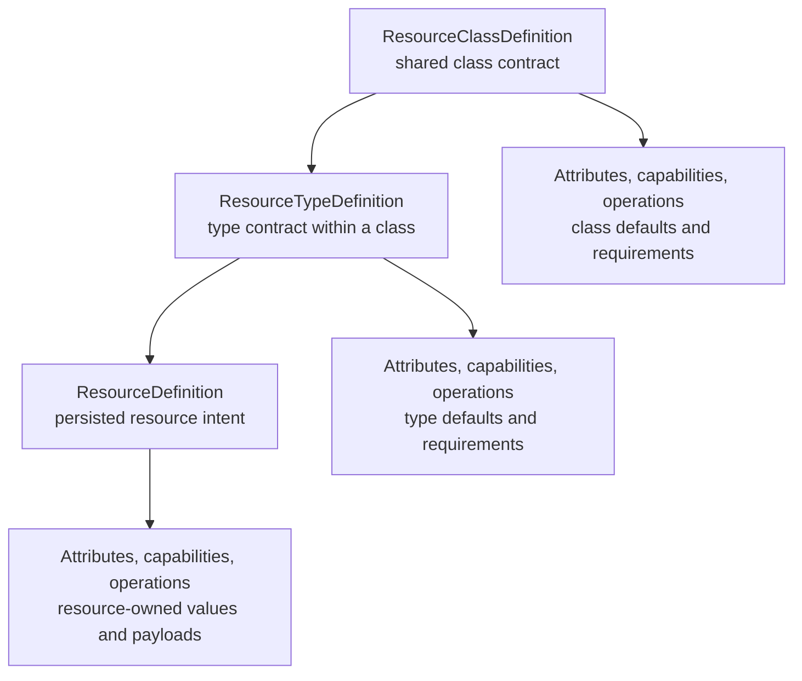
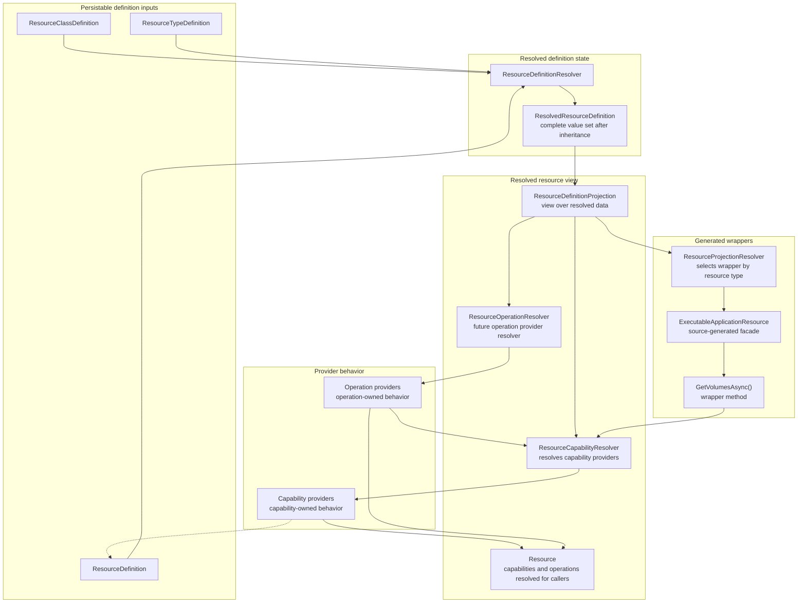
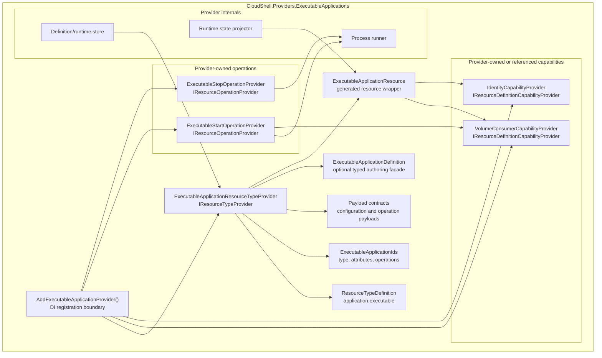

# Resource Definitions, Capability Providers, and Operation Providers Proposal

## Status

POC in progress.

CloudShell already distinguishes projected resources from declared resources in
the resource model documentation, and several providers already carry typed
definition records such as application, storage, volume, network, service, DNS,
and load-balancer definitions. This proposal tracks the next model step:
formalizing `ResourceDefinition` as resource intent and formalizing capability
providers and operation providers as attached behavior over that intent.

The first implementation slice is isolated in `CloudShell.ResourceDefinitions`
with tests in `CloudShell.ResourceDefinitions.Tests`. It proves the definition
envelope, class/type inheritance, effective attribute/capability/operation
resolution, diagnostics, and provider-dispatch contracts without changing the
Control Plane pipeline, persistence, API projection, or existing provider
definition stores.

## Problem

`Resource` is the current known projection of a managed artifact. It is what
Resource Manager, the Control Plane API, providers, and remote clients can
inspect after provider behavior has accepted, normalized, or observed resource
state.

Resource declarations, templates, persisted state, imports, and create flows
need a different artifact. They describe desired resource intent before the
provider projects it as a `Resource`. Today that intent exists in several
partly overlapping forms:

- programmatic `ResourceDeclaration`
- provider-specific typed records such as `ApplicationResourceDefinition`,
  `VolumeResourceDefinition`, and `NetworkResourceDefinition`
- resource template entries with `JsonElement Configuration`
- create requests with `JsonElement Configuration`
- projected `Resource.Attributes`

This makes it easy for definition, projection, configuration, and diagnostics
to blur together. It also tempts the platform to put complex resource
configuration into projected attributes, even though attributes are currently
documented as stable, non-secret projected facts.

Resource definitions also need inherited expectations. A resource instance can
inherit attributes, capabilities, and operations from its
`ResourceTypeDefinition`, and that type definition can in turn inherit from a
broader `ResourceClassDefinition`. Raw property bags such as `.Attributes`,
`.Capabilities`, and `.Operations` therefore cannot be treated as the
effective model. They are authored or projected inputs that need resolution
against class, type, preset, provider, and environment rules.

Capabilities have a related issue. A resource type may support a capability,
an individual resource definition may declare capability-owned intent, and a
projected resource may advertise a capability that downstream systems can
discover. Those are related, but they are not the same lifecycle phase.

Resource commands and operations have the same boundary concern. A projected
resource can expose commands such as start, stop, restart, reconcile,
update-image, or a provider-specific command. A command is the thing a caller
performs. Operations are declared on class, type, or resource definitions and
add behavior to a resource. Some operations can be exposed as caller-facing
commands; other operations may exist mainly to drive validation, projection,
automation, reconciliation, or provider behavior. The behavior that validates
operation availability and executes or applies the backing behavior should not
have to live in a single monolithic resource type provider. The current
implementation may continue mapping command affordances onto the existing
action-shaped API fields during migration, but the durable domain language
should distinguish caller-facing commands from declared operations.

Other possible names for this concept are action, command, or procedure.
`Operation` is the most neutral term because it does not imply that the
behavior is always directly invoked by a user. The important point is that an
operation declaration adds behavior to a resource, and a provider supplies the
implementation for that behavior in the current environment.

## Goals

- Distinguish `Resource` instances from `ResourceDefinition` intent in public
  domain language, docs, APIs, persistence, templates, imports, and provider
  contracts.
- Keep `Resource` as a passive projection of current resource state.
- Define a plain serialized resource-definition format that can be stored,
  exchanged, reviewed, imported, and projected through templates without
  becoming provider-native configuration.
- Let resource types expose typed facades over definition payloads without
  requiring every consumer to understand every provider-specific type.
- Treat capability providers as attached behavior registered through
  dependency injection, so they can resolve provider or platform services while
  validating and interpreting capability-owned intent.
- Treat resource operation providers as attached behavior registered through
  dependency injection, so each provider can own the provider-side operation
  behind one declared resource operation.
- Define `ResourceClassDefinition` and `ResourceTypeDefinition` inheritance so
  attributes, capabilities, operations, defaults, presets, and requirements can
  be resolved before validation or projection.
- Define attribute validators for common rules and provider/type-specific
  rules, including required attributes and broader value validation.
- Provide resolver APIs that compute effective attributes, capabilities, and
  operations instead of asking callers to trust raw property bags.
- Separate resource-type validation from cross-cutting capability validation.
- Preserve provider ownership over runtime behavior, apply/update/delete
  behavior, and provider-specific configuration.
- Prevent secrets from being serialized into resource definitions, projected
  attributes, diagnostics, logs, templates, or generated code.

## Non-Goals

- Do not subclass projected `Resource` for executable apps, container apps,
  volumes, databases, networks, services, or other resource types.
- Do not make projected `Resource.Attributes` a structured provider
  configuration schema.
- Do not require every provider-owned runtime artifact to be authorable as a
  resource definition.
- Do not require lossless round-tripping from every provider projection back
  into a resource definition.
- Do not replace provider-specific typed definitions immediately; the first
  step is an envelope and validation model that existing definitions can map
  into.
- Do not require the first implementation to settle the final resolver API
  shape. The durable requirement is that resolution exists and callers have a
  supported path to ask for effective values and diagnostics.
- Do not make capability providers UI actions. Capabilities may support UI
  workflows, but their model behavior belongs to the resource/domain layer.
- Do not make resource commands UI actions. They are resource-domain commands
  that UI or API surfaces may invoke after authorization and capability checks.
  Resource operation providers own what happens behind those commands.

## Proposed Model

CloudShell should use `ResourceDefinition` for authored or persisted resource
intent.

A definition should include:

- stable resource name or ID
- resource type
- optional provider ID when the type can be handled by more than one provider
- optional display name
- dependencies and references
- optional definition version
- provider-owned configuration payload
- capability-owned intent payloads
- optional operation declarations or operation configuration when a resource
  type allows authored operation policy
- non-secret platform metadata needed for registration, ownership, visibility,
  persistence, or grouping

A serialized projection might look like:

```jsonc
{
  "apiVersion": "cloudshell.resource/v1",
  "name": "api",
  "type": "application.executable",
  "provider": "applications.executable",
  "displayName": "API",
  "dependsOn": ["volume:data"],
  "configuration": {
    "executable": {
      "path": "dotnet",
      "arguments": "run",
      "workingDirectory": "./src/Api"
    }
  },
  "capabilities": {
    "storage.volumeConsumer": {
      "mounts": [
        {
          "volume": "volume:data",
          "targetPath": "App_Data",
          "readOnly": false,
          "name": "data"
        }
      ]
    }
  }
}
```

The serialized form is only one projection of the definition. Code-first
builders, Resource Manager create flows, resource templates, imports, and
future API clients can all produce the same definition model.

## Resource vs ResourceDefinition

`ResourceDefinition` describes intended resource shape. It is the input to
validation, persistence, apply/update/delete planning, import, template export,
and deployment projection.

`Resource` describes the current known resource instance. It is the output of
provider projection, provider observation, Control Plane overlays, current
operations, health, lifecycle state, endpoints, materialization facts,
attributes, visibility, ownership, and authorization-filtered views.

The distinction should be kept explicit:

| Concept | Describes | Owned by |
| --- | --- | --- |
| `ResourceDefinition` | Desired resource intent before projection | Control Plane plus owning resource type provider |
| `Resource` | Current projected resource instance | Control Plane projection over provider state |
| definition configuration | Provider-owned desired configuration | Owning resource type provider |
| capability intent | Cross-cutting desired behavior attached to a definition | Capability provider |
| projected attributes | Stable non-secret facts about the current projection | Owning provider or Control Plane overlay |
| runtime state | Observed provider/runtime facts | Provider, orchestrator, or Control Plane operational store |

## Resource Providers

CloudShell can use `ResourceProvider` as the general term for classes that
provide or list projected `Resource` instances from any source. A resource
provider may project accepted resource definitions, list provider-observed
runtime artifacts, surface diagnostics or child resources, or combine several
source records into the current resource graph.

For example:

```csharp
IReadOnlyList<Resource> resources =
    await containerProvider.GetResourcesAsync(cancellationToken);
```

In this terminology, a `ResourceProvider` answers "what resources are visible
now?" A resource type provider answers "how is this precise resource type
validated, accepted, changed, and projected from definition intent?" Some
provider classes may implement both roles, but the names should keep the
resource projection role distinct from the resource-definition ownership role.

## Capabilities vs Operations

Capabilities and operations both add behavior to the resource model, but they
serve different purposes.

A capability describes functionality, role, or semantics attached to a
resource. Capabilities are commonly used by Resource Manager, Control Plane
services, providers, API projection, deployment projection, validation, and
selector logic. A capability may expose typed helper behavior, projected data,
requirements, or compatibility rules. It is not necessarily something a caller
invokes. Capability intent is declared under `.Capabilities` and is resolved
through the same inheritance path as attributes and operations.

Examples:

- `storage.volumeConsumer`: the resource can consume mounted volumes.
- `logs.sources`: the resource contributes log sources.
- `monitoring`: the resource contributes monitoring data.
- `networking.namePublisher`: the resource can publish names.

An operation is explicitly declared behavior on a resource class, resource
type, or individual resource definition. It describes work that can be
invoked, applied, reconciled, or otherwise carried out for a resource. When an
operation is exposed to a caller, Resource Manager or the API can project a
command affordance for that operation. The operation itself remains the
domain-level behavior declaration. Operation intent is declared under
`.Operations`; the provider implementation for that declaration may vary by
resource class, resource type, provider, or resource definition.

Examples:

- `start`: start the resource using the appropriate provider behavior.
- `restart`: restart or reconcile the running resource.
- `deployImage`: apply a new container image to a container application.
- `reconcileDatabaseAccess`: reconcile declared database grants.

The same operation ID can have different implementations for different
resource types or providers. A `start` operation for a local executable may run
a local process; a `start` operation for a container app may apply deployment
state and materialize containers; a provider-backed service may call an
external platform. This is why operation declarations and operation providers
should stay separate.

Capability providers usually answer "what functionality does this resource
have, require, or project?" Operation providers usually answer "how is this
declared behavior validated, projected, invoked, or applied for this
resource?" Both should receive a resolved resource context so they can see
inherited attributes, capabilities, operations, presets, provider defaults,
and diagnostics.

## Class and Type Definitions

Resource definitions should be resolved against two inherited definition
layers:

- `ResourceClassDefinition` describes broad expectations for a class such as
  executable, container, storage, network, configuration, service, or
  infrastructure.
- `ResourceTypeDefinition` describes precise type expectations such as
  `application.executable`, `application.container-app`, `cloudshell.volume`,
  or `cloudshell.storage`.

A resource definition instance then supplies concrete intent. Conceptually:

```text
ResourceClassDefinition
    -> ResourceTypeDefinition
        -> ResourceDefinition
            -> ResolvedResourceDefinition
```

Class and type definitions can contribute:

- default attributes
- required attributes
- attribute descriptors and validators
- supported capabilities
- required capabilities
- default capability payloads
- supported operations
- operation requirements
- operation override policy
- provider selection requirements
- presets or named partial definition overlays
- class/type-level diagnostics and compatibility rules

The instance definition supplies values, selects presets where allowed, and can
override values only within the constraints defined by the class and type. A
type definition should not be a passive label; it should be the contract that
explains what the definition must contain before the provider can accept it.
Operations can be declared at any of the three levels: class, type, or
resource definition. For example, `start` can be a class-level executable
operation, `deployImage` can be a type-level container-app operation, and
`reconcileDatabaseAccess` can be a resource-definition-level operation exposed
only when a definition declares the relevant database capability or provider
configuration. A caller-facing command can then be projected from the resolved
operation declaration.

Those are the operation declaration sites. Operation providers do not declare
operations on their own; they advertise which resolved operation declarations
they can handle for matching resources.

Operation overrides should be explicit. A type definition can refine or hide a
class-level operation, and a resource definition can refine or disable a
type-level operation only when the inherited definition allows that override.
This avoids accidental replacement of lifecycle behavior while still allowing
resource-specific provider operations.

Presets should be modeled as named overlays rather than hidden provider
shortcuts. A preset can provide default configuration, attributes,
capabilities, and operation policy, but it still resolves through the same
class and type validators. This keeps a preset reviewable and avoids a second
path that bypasses the resource-definition model.

## Resolution

Callers should avoid reading raw `.Attributes`, `.Capabilities`, or
`.Operations` when they need the effective model. Those members can be missing
inherited values, can contain invalid authored values, or can represent
provider projection rather than accepted intent.

Operations should follow the same resolution path as attributes and
capabilities. The raw collection records what was declared or projected at one
layer. The resolved collection is the effective view after class definitions,
type definitions, resource definitions, presets, provider defaults, overrides,
and validators have been applied.

The exact API is still open, but the model needs supported methods or services
that can answer questions such as:

```csharp
ResolvedResourceDefinition resolved = resolver.Resolve(
    definition,
    new ResourceDefinitionResolutionContext(environmentId, principal));

string? executablePath = resolved.Attributes.GetString(
    ResourceAttributeNames.ExecutablePath);

bool consumesVolumes = resolved.Capabilities.Has(
    ResourceCapabilityIds.StorageVolumeConsumer);

bool hasStartOperation = resolved.Operations.Has(ResourceOperationIds.Start);
```

A resolved definition should expose effective values and diagnostics:

```csharp
public sealed record ResolvedResourceDefinition(
    ResourceDefinition Definition,
    ResourceClassDefinition ClassDefinition,
    ResourceTypeDefinition TypeDefinition,
    ResourceAttributeSet Attributes,
    ResourceCapabilitySet Capabilities,
    ResourceOperationSet Operations,
    IReadOnlyList<ResourceDefinitionDiagnostic> Diagnostics);
```

Effective values should carry source information. A resolved operation should
know whether it came from the class definition, type definition, resource
definition, or a preset overlay, and it should record whether a lower level
overrode or disabled an inherited operation. That lets operation providers make
deliberate decisions about which operation declaration they are handling.

For example:

```csharp
ResourceOperationResolution startOperation = resolved.Operations.Resolve(
    ResourceOperationIds.Start,
    ResourceOperationResolutionLevel.Type);

if (startOperation.IsAvailable)
{
    await operationProvider.ExecuteAsync(resolved, startOperation, context);
}
```

The exact names are speculative, but the provider should be able to resolve a
matching declared operation at a specified level for the matching resolved resource
definition. It should not have to rediscover inheritance, presets, or override
rules locally.

The important requirement is not this exact API shape. The requirement is that
CloudShell has a deliberate resolution boundary that combines class
definitions, type definitions, presets, provider defaults, and authored
resource definitions before validation, projection, operation availability,
deployment projection, or UI rendering relies on those values.

Provider-facing contracts should receive a resolved resource context rather
than a raw definition. The concrete name is open: `ResolvedResourceDefinition`
may be enough for definition-time validation and projection, while a shared
`IResolvedResource` or `ResolvedResource` base abstraction may be better if the
same provider contracts need to work over accepted definitions and projected
resources. The important rule is that capability providers, operation
providers, attribute validators, and resource type providers receive the
resolved context they need instead of manually combining raw properties.

The current POC treats `ResourceDefinition` as the persisted data container and
adds runtime projection wrappers over the resolved definition. The first
projection layer is a shared context exposing effective attributes,
capabilities, and operations. A second, resource-type-specific projection can
then provide an object-oriented surface such as
`ExecutableApplicationResource.GetVolumesAsync()`. That method is owned by the
executable resource projection, but it internally asks a
`ResourceCapabilityResolver` for the matching volume capability behavior.

In this shape, capability behavior is not stored on the definition itself and
is not directly projected as the main resource object. Capability providers
return typed behavior that resource projections can compose into their public
surface. Those behaviors can read effective definition state, resolve other
dependencies, project additional information, or return an updated
`ResourceDefinition` when the capability changes accepted intent.

The POC can keep these resource-type projection wrappers hand-written, but the
expected mature implementation is source-generated wrappers from the resource
class/type definitions, attribute IDs, capability IDs, and operation IDs. The
generated wrapper should be a convenience facade over the same resolved
definition and resolver services, not a second source of truth for the
resource model.

It is intentionally still open whether generated resource-type wrappers should
also implement capability-specific interfaces to advertise supported
capabilities, or whether capability support should remain discoverable only
through resolved capability declarations and resolver calls. Implementing
capability interfaces could make static use sites cleaner, but it also risks
making capability membership look like compile-time inheritance rather than
resolved provider-backed behavior.

This keeps persistence and runtime behavior separate. Serializers persist
definitions and resolved debug views as data, while provider projects attach
methods through the projection layer at runtime. The same pattern can later be
applied to operation projections so operation implementations can consume
capability projections instead of duplicating capability-specific resolution.

Persistable definition model:



Runtime resolution, providers, and generated wrappers:



The same principle applies to projected resources. A `Resource` projection can
be checked against its known class/type expectations, but callers should use a
validation or resolution helper rather than assuming the projected attribute
dictionary is complete and valid.

## Resource Type Providers

A resource type provider should own the behavior for a precise resource type or
provider-backed family of resource types.

Responsibilities:

- declare supported resource type IDs
- declare the expected `ResourceClass`
- describe supported capabilities for the resource type
- describe supported operations for the resource type
- contribute or reference the `ResourceTypeDefinition`
- parse or adapt the provider-owned configuration payload
- apply defaults and normalize definition intent
- validate type-specific configuration
- plan and apply resource definition changes
- apply changes, update persisted state, and tear down resource state
- project accepted definitions and observed provider state as `Resource`
  instances
- expose resource operations and operation availability where applicable

Resource type providers may expose typed facades such as
`ExecutableApplicationResourceDefinition`, `ContainerApplicationDefinition`, or
`VolumeResourceDefinition`. Those facades should map to and from the common
definition envelope instead of replacing it as the platform model.

Resource type providers should live behind their own resource-type or
capability-package boundary. Avoid rebuilding the application-provider tangle
where unrelated resource types share a broad service because they all happen
to use local processes, containers, lifecycle actions, or Resource Manager
projection. Shared code is appropriate only when it represents a provider-
neutral platform mechanism or a deliberately shared capability contract. Code
that knows a concrete resource type, provider configuration shape, lifecycle
quirk, projection attribute, or runtime materialization rule should stay next
to the provider that owns that behavior.

Identifier constants should follow the same ownership rule:

- Platform-wide default attribute IDs can live in a shared constants class.
- Resource type IDs belong with the resource type provider or its package.
- Attribute IDs that are unique to one resource type belong beside that
  resource type provider.
- Capability IDs can initially live as constants on the concrete capability
  provider implementation that owns the capability.
- Operation IDs should be declared by the operation definition owner at the
  class, type, or resource-definition level, the same way attributes are
  declared by the layer that owns them. CloudShell-standard lifecycle
  operation IDs can live in a shared class. Type-specific operation IDs belong
  beside the resource type definition/provider that declares them.

This keeps a resource type provider's public surface reviewable: a reader
should be able to find the type ID, type-specific attributes, supported
capabilities, supported operations, validation rules, and projection behavior
inside the owning boundary instead of following references through a generic
application-resource service.

Typed facades and builders can remain hand-written while the model is small or
still changing. If resource type definitions become structured enough that
facades, builders, descriptor constants, validation stubs, or JSON mapping code
become repetitive, CloudShell should consider C# source generators. Source
generation should be treated as an implementation aid over the definition
model, not as the source of truth. The durable contract remains the
`ResourceClassDefinition`, `ResourceTypeDefinition`, `ResourceDefinition`, and
resolved-resource model.

For example, an executable application resource type provider could own the
`application.executable` type while delegating storage mounts and start/stop
operations to DI-backed attached providers:

Sample provider package structure:



```csharp
public sealed class ExecutableApplicationResourceTypeProvider(
    IExecutableApplicationDefinitionStore definitions,
    IEnumerable<IResourceDefinitionCapabilityProvider> capabilityProviders,
    IEnumerable<IResourceOperationProvider> operationProviders)
    : IResourceTypeProvider
{
    public string TypeId => "application.executable";

    public ResourceClass ResourceClass => ResourceClass.Executable;

    public IReadOnlyList<ResourceCapabilityDescriptor> SupportedCapabilities =>
    [
        new("storage.volumeConsumer"),
        new("logs.sources"),
        new("monitoring")
    ];

    public ResourceDefinitionValidationResult Validate(
        ResolvedResourceDefinition resource,
        ResourceDefinitionValidationContext context)
    {
        var executable = resource.Definition.GetConfiguration<ExecutableConfiguration>(
            "executable");

        var diagnostics = new List<ResourceDefinitionDiagnostic>(
            resource.Diagnostics);

        if (string.IsNullOrWhiteSpace(executable.Path))
        {
            diagnostics.Add(ResourceDefinitionDiagnostic.Error(
                resource.Definition.Name,
                "Executable path is required."));
        }

        foreach (var capability in resource.Capabilities)
        {
            var provider = capabilityProviders.FirstOrDefault(provider =>
                provider.CanValidate(resource, capability.Id));

            if (provider is null)
            {
                diagnostics.Add(ResourceDefinitionDiagnostic.Error(
                    resource.Definition.Name,
                    $"No provider is registered for capability '{capability.Id}'."));
                continue;
            }

            diagnostics.AddRange(provider.Validate(resource, context).Diagnostics);
        }

        return ResourceDefinitionValidationResult.FromDiagnostics(diagnostics);
    }

    public Resource Project(
        ResolvedResourceDefinition resource,
        ResourceProjectionContext context)
    {
        var executable = resource.Definition.GetConfiguration<ExecutableConfiguration>(
            "executable");

        var operations = operationProviders
            .Where(provider => provider.CanHandle(resource))
            .Select(provider => provider.ProjectOperation(resource, context))
            .ToArray();

        return new Resource(
            Id: resource.Definition.ResourceId,
            Name: resource.Definition.Name,
            Kind: TypeId,
            Provider: "applications.executable",
            Region: "local",
            State: context.GetLifecycleState(resource.Definition.ResourceId),
            Endpoints: context.GetEndpoints(resource.Definition.ResourceId),
            Version: resource.Definition.Version,
            LastUpdated: context.Now,
            DependsOn: resource.Definition.DependsOn,
            TypeId: TypeId,
            Operations: operations,
            ResourceClass: ResourceClass,
            Attributes: new Dictionary<string, string>(StringComparer.OrdinalIgnoreCase)
            {
                [ResourceAttributeNames.ExecutablePath] = executable.Path,
                [ResourceAttributeNames.WorkingDirectory] =
                    executable.WorkingDirectory ?? "."
            },
            Capabilities: context.ProjectCapabilities(resource));
    }

    public Task<ResourceApplyResult> ApplyAsync(
        ResolvedResourceDefinition resource,
        ResourceApplyContext context,
        CancellationToken cancellationToken)
    {
        var executable = resource.Definition.ToTyped<ExecutableApplicationResourceDefinition>();
        definitions.Save(executable);

        return Task.FromResult(ResourceApplyResult.Accepted(resource.Definition.ResourceId));
    }
}
```

The resource type provider owns the type's configuration and projection shape.
It does not need to know every cross-cutting capability or every executable
operation implementation in detail. Capability and operation providers can be added
by capability packages through DI as long as they use stable resource type,
capability, and operation identifiers.

## Definition Change Application

Resource type providers should be able to respond before an update to a
resource definition is applied. The provider needs the current accepted
definition, the proposed definition, the resolved diff, and the current
resource/runtime context so it can choose the correct behavior.

The exact API is open, but the shape should make these inputs available:

```csharp
public sealed record ResourceDefinitionChange(
    ResolvedResourceDefinition Current,
    ResolvedResourceDefinition Proposed,
    ResourceDefinitionDiff Diff,
    ResourceChangeRuntimeContext Runtime);

public sealed record ResourceDefinitionDiff(
    ResourceAttributeDiff Attributes,
    ResourceCapabilityDiff Capabilities,
    ResourceOperationDiff Operations,
    ResourceConfigurationDiff Configuration);

public sealed record ResourceChangeRuntimeContext(
    Resource? CurrentProjection,
    ResourceState? State,
    bool IsTransitioning,
    string? TransitionName = null);
```

A resource type provider can then validate and apply the change deliberately:

```csharp
public interface IResourceTypeProvider
{
    Task<ResourceDefinitionChangePlan> PlanChangeAsync(
        ResourceDefinitionChange change,
        CancellationToken cancellationToken);

    Task<ResourceApplyResult> ApplyChangeAsync(
        ResourceDefinitionChange change,
        ResourceDefinitionChangePlan plan,
        CancellationToken cancellationToken);
}
```

For a hypothetical container type provider, changing `container.image` while
the resource is stopped may only update accepted intent. Changing it while the
resource is running may plan a deployment operation. Changing it while the
resource is already transitioning may be rejected, deferred, or folded into
the current transition depending on provider policy. The provider needs both
the changed attributes and the actual current status to make that decision.

Change planning should return diagnostics and an explicit plan rather than
forcing the caller to infer behavior from changed fields alone. The plan can
describe whether the change is persist-only, requires restart, can reconcile
in-place, starts a deployment operation, is blocked by current state, or needs
manual intervention.

## Capability Providers

Capability providers are attached behavior for capability-owned intent. They
should be registered with dependency injection and resolved by the Control
Plane validation/apply pipeline, so a provider can depend on platform or
provider services such as volume managers, identity managers, networking
managers, policy services, catalogs, or stores.

Responsibilities:

- declare the capability ID they handle
- parse or adapt the capability payload for that capability
- validate capability-owned intent against the definition and current
  environment
- report diagnostics for invalid, unsupported, unsafe, or unresolved intent
- provide typed helper behavior to resource type providers, orchestrators, or
  projection services where appropriate
- project typed runtime behavior through a capability resolver over a resolved
  resource projection
- optionally contribute projected capabilities, dependencies, attributes, or
  diagnostics after the definition has been accepted

Capability providers should validate resolved definitions, not raw definitions
or projected `Resource` instances. Raw definitions are missing inherited
class/type/preset values; projected resources mix accepted intent, runtime
state, provider observations, and Control Plane overlays.

For example, a storage volume consumer provider can own the
`storage.volumeConsumer` capability:

```csharp
public sealed class VolumeConsumerCapabilityProvider(IVolumeManager volumes)
    : IResourceDefinitionCapabilityProvider
{
    public string CapabilityId => "storage.volumeConsumer";

    public ResourceDefinitionValidationResult Validate(
        ResolvedResourceDefinition resource,
        ResourceDefinitionValidationContext context)
    {
        var volumeConsumer = resource.GetCapability<VolumeConsumerDefinition>(
            CapabilityId);

        // Validate mount shape, referenced volume resources, access mode,
        // permissions, and host/storage compatibility.
    }

    public IEnumerable<Volume> GetVolumes(
        ResolvedResourceDefinition resource)
    {
        var volumeConsumer = resource.GetCapability<VolumeConsumerDefinition>(
            CapabilityId);

        return volumeConsumer.Mounts
            .Select(mount => volumes.GetVolume(mount.VolumeReference));
    }
}
```

This keeps storage behavior reusable across executable apps, ASP.NET Core
projects, container apps, SQL Server resources, or future provider-owned
service resources without pushing volume semantics into each resource type.
That reuse should happen through the capability provider contract and its
owned constants/payload shape, not by making one resource-type provider depend
on another resource-type provider's implementation internals.

## Attribute Validators

Attribute validation should be explicit and reusable. Attributes are useful
only when callers can understand whether an attribute is required, inherited,
defaulted, supplied by the instance definition, projected by the provider, or
invalid for the resource's class/type.

Attribute validators should cover common rules:

- required value
- string, number, boolean, enum-like token, URI, path, resource reference, and
  structured payload validation
- allowed values
- range and length checks
- pattern checks
- case normalization
- invariant formatting
- secret-value rejection
- provider compatibility
- cross-attribute rules

They should also allow type-specific and capability-specific rules without
forcing every rule into a central switch. For example:

```csharp
public sealed class ExecutablePathAttributeValidator : IResourceAttributeValidator
{
    public string AttributeName => ResourceAttributeNames.ExecutablePath;

    public bool CanValidate(ResourceAttributeValidationContext context) =>
        context.TypeDefinition.TypeId == "application.executable";

    public ResourceAttributeValidationResult Validate(
        ResourceAttributeValue value,
        ResourceAttributeValidationContext context)
    {
        if (value.IsMissing)
        {
            return ResourceAttributeValidationResult.Error(
                AttributeName,
                "Executable path is required.");
        }

        if (!value.IsString)
        {
            return ResourceAttributeValidationResult.Error(
                AttributeName,
                "Executable path must be a string.");
        }

        return ResourceAttributeValidationResult.Valid(AttributeName);
    }
}
```

Validation should happen at two related boundaries:

- definition validation: does the authored `ResourceDefinition` satisfy its
  class/type/capability/operation requirements?
- projection validation: does the projected `Resource` still satisfy the known
  `ResourceClassDefinition` and `ResourceTypeDefinition` expectations?

Projection validation matters because provider projections can drift, omit
inherited values, or carry legacy attribute names. Resource Manager and API
clients should be able to surface diagnostics or normalized views instead of
silently trusting raw projected attributes.

## Resource Operation Providers

Resource operation providers are attached behavior for a declared resource
operation. They should be registered with dependency injection and resolved by
the Control Plane when it projects resource commands, computes command
availability, executes a requested command, reconciles state, or applies other
provider-owned behavior. Operation providers should resolve the operation
declaration they handle from the resolved resource context at the level they
explicitly support: class, type, resource definition, or a combination of those
levels.

The operation declaration is the resource model contract. The provider is the
implementation. Two resource types can declare the same operation ID while
using different operation providers because the concrete implementation may be
type-specific, provider-specific, host-specific, or capability-specific. For
example, a `start` operation can be declared broadly for executable resources,
while local processes, container apps, and provider-backed services use
different providers to execute the resulting start command.

Operation IDs should not be tangled into capability builders or capability
payload helpers. A capability can require, enable, or constrain an operation,
but the operation ID itself belongs to the class/type/resource-definition
operation declaration. This leaves room for the same operation ID to have
different implementations for different target artifacts without making a
capability provider the accidental owner of that operation.

Responsibilities:

- advertise the operation ID they handle
- declare the resource types, resource classes, or capabilities they can
  handle
- declare which operation resolution levels they handle
- project the resource operation and any caller-facing command affordance when
  the operation applies to a resource
- compute current command availability and user-displayable unavailable
  reasons
- execute or apply the backing operation after Control Plane authorization and
  validation
- return resource procedure results, diagnostics, activity events, or
  reconciliation signals

Resource commands are not UI commands. A Resource Manager button, menu item, or
API route can invoke a resource command, but the operation provider owns the
domain behavior behind that command.

For example, an executable start operation provider can handle the resolved
standard `start` operation for executable application resources:

```csharp
public sealed class ExecutableStartOperationProvider(
    IExecutableApplicationDefinitionStore definitions,
    ILocalProcessRunner processes,
    IResourceDefinitionCapabilityProvider<VolumeConsumerDefinition> volumes)
    : IResourceOperationProvider
{
    public string OperationId => ResourceOperationIds.Start;

    public ResourceOperationResolutionLevel ResolutionLevel =>
        ResourceOperationResolutionLevel.Type;

    public bool CanHandle(ResolvedResourceDefinition resource) =>
        resource.TypeDefinition.TypeId == "application.executable" &&
        resource.Operations.Resolve(OperationId, ResolutionLevel).IsAvailable;

    public ResourceOperation ProjectOperation(
        ResolvedResourceDefinition resource,
        ResourceProjectionContext context) =>
        new(
            Id: ResourceOperationIds.Start,
            Label: "Start",
            Description: "Start the executable application.",
            RequiresConfirmation: false);

    public async Task<ResourceCommandAvailability> GetAvailabilityAsync(
        ResolvedResourceDefinition resource,
        ResourceCommandAvailabilityContext context,
        CancellationToken cancellationToken)
    {
        var operation = resource.Operations.Resolve(OperationId, ResolutionLevel);
        if (!operation.IsAvailable)
        {
            return ResourceCommandAvailability.Unavailable(
                ResourceCommandIds.Start,
                operation.UnavailableReason ?? "The start operation is not available.");
        }

        if (context.State is ResourceState.Running or ResourceState.Starting)
        {
            return ResourceCommandAvailability.Unavailable(
                ResourceCommandIds.Start,
                "The resource is already running or starting.");
        }

        var volumeDiagnostics = await volumes.ValidateAsync(
            resource,
            context.ToDefinitionValidationContext(),
            cancellationToken);

        if (volumeDiagnostics.HasErrors)
        {
            return ResourceCommandAvailability.Unavailable(
                ResourceCommandIds.Start,
                "One or more volume mounts cannot be materialized.");
        }

        return ResourceCommandAvailability.Available(ResourceCommandIds.Start);
    }

    public async Task<ResourceProcedureResult> ExecuteAsync(
        ResolvedResourceDefinition resource,
        ResourceCommandExecutionContext context,
        CancellationToken cancellationToken)
    {
        var operation = resource.Operations.Resolve(OperationId, ResolutionLevel);
        if (!operation.IsAvailable)
        {
            return ResourceProcedureResult.Failed(
                operation.UnavailableReason ?? "The start operation is not available.");
        }

        var executable = definitions.Get(resource.Definition.ResourceId);
        if (executable is null)
        {
            return ResourceProcedureResult.Failed(
                $"Resource definition '{resource.Definition.ResourceId}' was not found.");
        }

        await processes.StartAsync(executable, cancellationToken);

        return ResourceProcedureResult.Completed(
            $"Started executable application '{resource.Definition.Name}'.");
    }
}
```

This lets a resource type support multiple commands without centralizing every
backing operation in the resource type provider. Standard lifecycle commands
can have shared policy in the Control Plane, while provider-specific operation
providers still own provider-specific checks and execution.

## Capability Lifecycle

CloudShell should distinguish these phases:

| Phase | Meaning |
| --- | --- |
| Resource type capability support | The type can accept definitions that use the capability. |
| Definition capability intent | This resource definition declares capability-owned desired behavior. |
| Accepted capability | Validation and normalization accepted the capability intent. |
| Projected resource capability | The current `Resource` advertises the capability for discovery. |
| Runtime materialization | A provider, orchestrator, or runtime has applied or observed the capability in the environment. |

For example, `application.container-app` may support
`storage.volumeConsumer`; a specific container app definition declares two
mounts; validation accepts the mounts; the projected resource advertises
`storage.volumeConsumer`; and runtime materialization later reports whether the
mounts are active.

## Persistence, Debugging, and Plain Format

Persisted and diagnostic resource-model artifacts should be plain enough to
inspect and review. `Resource`, `ResourceDefinition`,
`ResourceTypeDefinition`, `ResourceClassDefinition`, and related definition
artifacts should all have deliberate serialized projections for persistence,
exchange, diagnostics, and tests. `ResolvedResourceDefinition` should also be
serializable as a debug or diagnostic snapshot so callers can inspect which
attributes, capabilities, operations, defaults, sources, and diagnostics were
effective after resolution.

The durable formats should avoid making C# builder types, generated DTO names,
or provider-native files the source of truth.

Suggested principles:

- Use stable, lower-camel or dotted identifiers for resource type,
  capability, and configuration keys.
- Prefer value objects and typed IDs in .NET APIs for resource type IDs,
  attribute IDs, capability IDs, operation IDs, references, and source IDs.
  Those value objects should serialize as their stable string values through
  explicit converters or serializer-supported mappings so JSON, YAML, XML, and
  other projections remain plain, reviewable, and portable. A serializer should
  be able to round-trip the artifact without leaking implementation-only type
  details into the document.
- Include a definition version so providers can migrate payloads.
- Keep provider-owned configuration under `configuration`.
- Keep cross-cutting capability intent under `capabilities`.
- Keep secrets out of definitions. Store references to secret resources,
  configuration entries, or identity-backed access grants instead.
- Normalize before persistence only when normalization is deterministic and
  reviewable.
- Preserve enough source metadata for diagnostics when definitions are created
  from imports or templates.

Resource templates can become one serialized projection over this model rather
than a separate concept with unrelated provider configuration. Resource graph
imports can translate external dialects into resource definitions or graph
drafts before apply.

## Validation Pipeline

The Control Plane should eventually validate definitions through a predictable
pipeline:

1. Parse the definition envelope.
2. Resolve the resource class definition and resource type definition.
3. Apply selected presets and deterministic defaults.
4. Resolve inherited attributes, capabilities, and operations into an effective
   model.
5. Resolve the resource type provider.
6. Validate platform-owned identity, names, grouping, persistence, ownership,
   and references.
7. Run common and type-specific attribute validators.
8. Let the resource type provider normalize and validate type-specific
   configuration.
9. Resolve capability providers for declared capability intent.
10. Let capability providers validate capability-owned payloads and references.
11. Resolve resource operation providers for declared and type-supported
   operations.
12. Let operation providers validate operation configuration and command
   projection policy, including availability policy that can be checked before
   projection or apply.
13. Compute the definition diff when an existing resource definition is being
   updated.
14. Let the resource type provider plan the definition change using the
   resolved old/new definitions, changed attributes/capabilities/operations,
   and current runtime state.
15. Run cross-definition graph validation, including dependencies,
   authorization, compatibility, and host/provider policy.
16. Return diagnostics and normalized accepted definitions without side
    effects.
17. Apply, update, persist, or project only after validation succeeds.

Expected validation failures should be returned as diagnostics or result
objects. Exceptions should remain for programmer errors or boundary adapters
that must translate invalid input into API errors.

## Relationship to Existing Concepts

### Resource declarations

Programmatic declarations should become one authoring surface for
`ResourceDefinition`. Existing builders can continue producing provider-typed
definitions internally while the common envelope is introduced.

### Resource templates

Resource templates should eventually store resource definitions instead of
provider-specific configuration records that must be interpreted separately.
Template import/export providers may remain during migration, but their target
shape should converge on the common definition model.

### Resource graph import

External imports, such as Docker Compose, should translate into CloudShell
resource definitions or graph drafts. External formats remain input dialects,
not native CloudShell definition formats.

### Deployment projection

Deployment projection should consume accepted resource definitions and current
graph context. It should not infer desired intent solely from projected
`Resource.Attributes` when the original definition is available.

### Projected resources

Provider-created and runtime-managed resources may be projected as `Resource`
instances without having user-authored definitions. If they later become
authorable, their provider should introduce a definition shape deliberately.

Projected resources should still be validated against known
`ResourceClassDefinition` and `ResourceTypeDefinition` expectations when those
definitions exist. Projection validation can produce diagnostics, normalize
legacy provider output, or explain why generated details and command
availability are incomplete.

## Recommended First Slices

1. Document the terminology across the domain and resource model docs:
   `Resource` is instance projection; `ResourceDefinition` is intent.
2. Introduce a public preview `ResourceDefinition` envelope in
   `CloudShell.Abstractions` without migrating every provider immediately.
3. Add preview `ResourceClassDefinition` and `ResourceTypeDefinition` records
   with inherited attribute, capability, and operation descriptors.
4. Add a resource-definition resolver that computes effective attributes,
   capabilities, operations, and diagnostics.
5. Add a resource-definition validation result and diagnostic model.
6. Add common attribute validators and one type-specific validator.
7. Add a resource type provider validation/normalization path for one narrow
   type, preferably `cloudshell.volume` or `application.executable`.
8. Add a capability-provider path for `storage.volumeConsumer` that validates
   `ResourceVolumeMount` intent outside application-specific code.
9. Add a resource-operation-provider path for one standard lifecycle operation,
   preferably executable `start` or container app `restart`.
10. Map one existing programmatic builder into the definition envelope.
11. Update resource template export/import for the same narrow type to use the
   definition format.
12. Add Control Plane tests for valid definitions, invalid attributes, invalid
   capability payloads, missing capability providers, missing operation
   providers, projection validation, and diagnostics.
13. Add API/client projection only after the in-process definition model is
   stable enough to expose.

## Open Questions

- Should `ResourceDefinition` use resource `name` plus `type`, resource `id`,
  or both as the primary identity in the serialized format?
- Should capability payloads live only under `capabilities`, or can a resource
  type provider promote common capability payloads into typed configuration
  facades for ergonomics?
- How much normalized state should be persisted versus recomputed from the
  authored definition and current provider defaults?
- What is the precedence order between class defaults, type defaults, selected
  presets, provider defaults, and explicit resource-definition values?
- Should class/type definitions be public authoring artifacts, provider-only
  descriptors, or both?
- Should typed resource facades, builders, descriptor constants, or mapping
  helpers be generated from resource type definitions with C# source
  generators when the repetition becomes material?
- Should definition migrations be owned entirely by resource type providers, or
  should the Control Plane own a common migration registry?
- Which attribute validators belong in common abstractions versus provider
  packages?
- Should projection validation normalize invalid provider output, return
  diagnostics only, or support both modes?
- How should capability providers declare compatibility with resource types:
  type-provider metadata, capability-provider metadata, or both?
- Which validation belongs in capability providers versus graph-level Control
  Plane policy?
- How should operation providers declare compatibility with resource types:
  operation-provider metadata, type-provider metadata, capability requirements,
  or all of those?
- What is the exact boundary between capability-driven functionality and
  operation-driven behavior when a concept has both, such as storage mounts or
  deployment?
- Should resource definitions be able to override inherited operations, and
  which class/type/resource-level operation declarations may be disabled or
  refined?
- Should command affordances always be projected from resolved operations, or
  should any command affordances be declared independently?
- What runtime state should be available to resource type providers when they
  plan a definition update, and how should transitioning resources be handled?
- How should persisted definitions represent provider selection when several
  providers can handle the same resource type?
- What is the minimal API surface for remote clients to create, validate, and
  persist definitions without exposing unstable provider internals?

## Remaining Tasks

- Define the `ResourceDefinition` envelope and serialized field names.
- Define `ResourceClassDefinition` and `ResourceTypeDefinition`, including
  inheritance, presets, requirements, and descriptor precedence.
- Define resolver services or helper methods for effective attributes,
  capabilities, and operations.
- Decide whether any typed resource facades or builders should be hand-written
  first or generated from resource type definitions later with C# source
  generators.
- Define resource type provider contracts for definition parsing,
  normalization, validation, projection, apply, update, and tear down.
- Define resource definition diff and change-planning contracts for resource
  type providers.
- Define common and provider-owned attribute validator contracts.
- Define capability provider contracts for capability-owned payload parsing,
  validation, diagnostics, and helper behavior.
- Define resource operation provider contracts for command projection, command
  availability, backing operation execution, diagnostics, and operation
  results.
- Decide how existing provider-specific definitions map to the envelope.
- Decide how resource templates, persisted declarations, imports, and create
  requests converge on the definition model.
- Add documentation examples for executable apps, container apps, volumes, and
  volume consumers.
- Add focused tests around definition validation and capability-provider
  resolution.
- Update the roadmap when this becomes an active implementation track.
