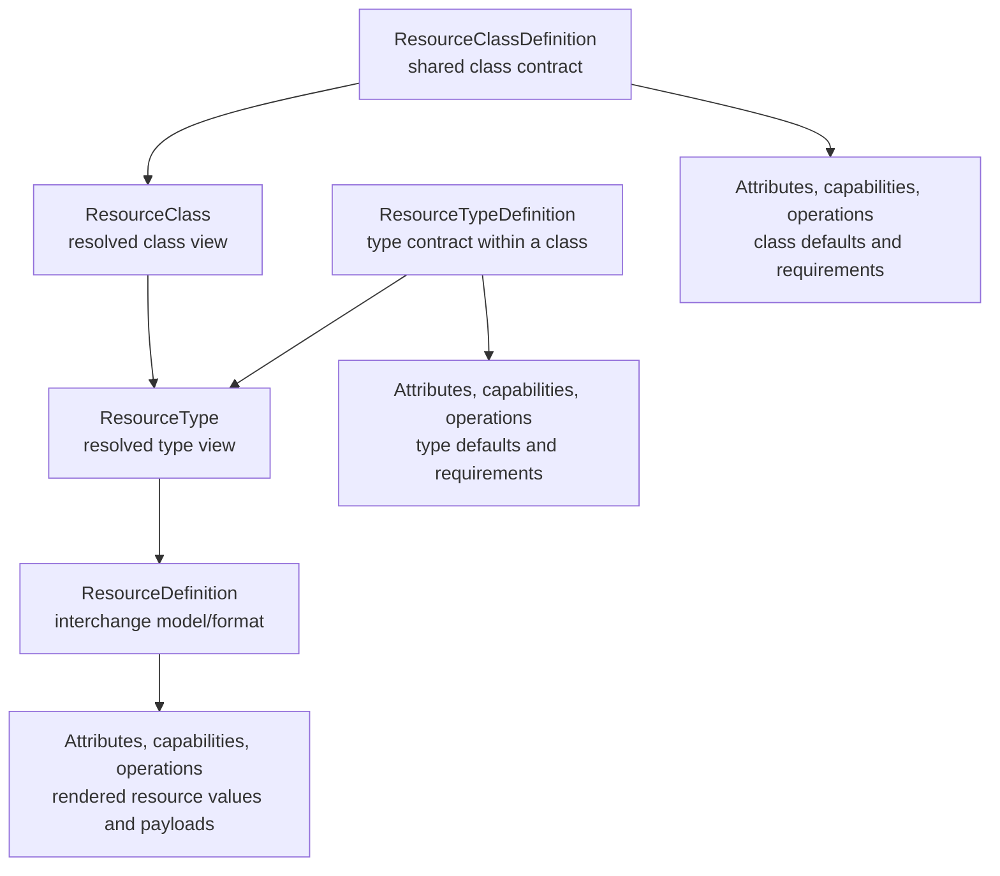
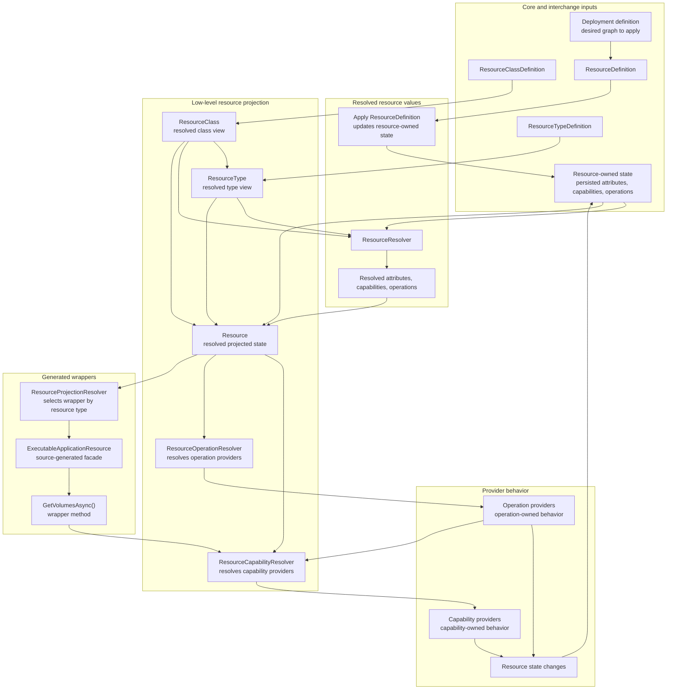
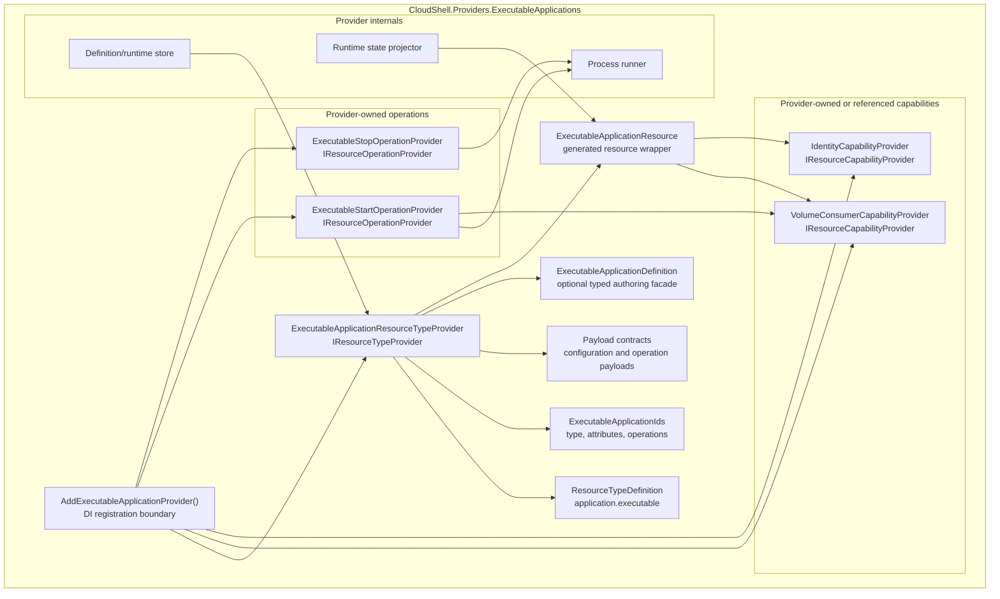
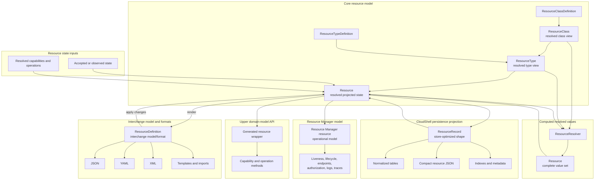

# Resource Definitions, Capability Providers, and Operation Providers Proposal

## Status

POC in progress.

CloudShell already distinguishes projected resources from declared resources in
the resource model documentation, and several providers already carry typed
definition records such as application, storage, volume, network, service, DNS,
and load-balancer definitions. This proposal tracks the next model step:
formalizing `Resource` as the resolved core projection, formalizing
`ResourceDefinition` as its interchange model/format, and formalizing
capability providers and operation providers as attached behavior over the
resolved resource.

The first implementation slice is isolated in `CloudShell.ResourceDefinitions`
with tests in `CloudShell.ResourceDefinitions.Tests`. It proves the
interchange envelope, class/type inheritance, effective
attribute/capability/operation resolution, diagnostics, and provider-dispatch
contracts without changing the Control Plane pipeline, persistence, API
projection, or existing provider definition stores.

## Problem

`Resource` is the current known projection of a managed artifact. It is what
Resource Manager, the Control Plane API, providers, and remote clients can
inspect after provider behavior has accepted, normalized, or observed resource
state.

Resource declarations, templates, persistence flows, imports, and create flows
need an interchange artifact. They describe a resource state snapshot or
change that can be applied to a `Resource`, but they are not the source from
which a `Resource` is projected. Today that structure exists in several
partly overlapping forms:

- programmatic `ResourceDeclaration`
- provider-specific typed records such as `ApplicationResourceDefinition`,
  `VolumeResourceDefinition`, and `NetworkResourceDefinition`
- resource template entries with `JsonElement Configuration`
- create requests with `JsonElement Configuration`
- projected `Resource.Attributes`

This makes it easy for definition, projection, configuration, and diagnostics
to blur together. It also tempts the platform to put complex resource
configuration into projected attributes, even though attributes are currently
documented as stable, non-secret projected facts.

Resource definitions also need inherited expectations. A resource instance can
inherit attributes, capabilities, and operations from its
`ResourceTypeDefinition`, and that type definition can in turn inherit from a
broader `ResourceClassDefinition`. Raw property bags such as `.Attributes`,
`.Capabilities`, and `.Operations` therefore cannot be treated as the
effective model. They are declared or observed inputs that need resolution
against class, type, preset, provider, and environment rules.

Capabilities have a related issue. A resource type may support a capability,
an individual resource may define capability-owned state, and the resolved
resource may advertise a capability that downstream systems can discover.
Those are related, but they are not the same lifecycle phase.

Resource commands and operations have the same boundary concern. A projected
resource can expose commands such as start, stop, restart, reconcile,
update-image, or a provider-specific command. A command is the thing a caller
performs. Operations are declared on class definitions, type definitions, or
resource-owned state and add behavior to a resource. Some operations can be exposed as caller-facing
commands; other operations may exist mainly to drive validation, projection,
automation, reconciliation, or provider behavior. The behavior that validates
operation availability and executes or applies the backing behavior should not
have to live in a single monolithic resource type provider. The current
implementation may continue mapping command affordances onto the existing
action-shaped API fields during migration, but the durable domain language
should distinguish caller-facing commands from declared operations.

Other possible names for this concept are action, command, or procedure.
`Operation` is the most neutral term because it does not imply that the
behavior is always directly invoked by a user. The important point is that an
operation declaration adds behavior to a resource, and a provider supplies the
implementation for that behavior in the current environment.

## Goals

- Distinguish `Resource` projections from the `ResourceDefinition`
  interchange model/format in public domain language, docs, APIs,
  persistence, templates, imports, and provider contracts.
- Keep `Resource` as the resolved core projection of resource state.
- Define a plain serialized resource-definition interchange format that can be
  exchanged, reviewed, imported, and projected through templates without
  becoming provider-native configuration or the required persistence shape.
- Let resource types expose typed facades over definition payloads without
  requiring every consumer to understand every provider-specific type.
- Treat capability providers as attached behavior registered through
  dependency injection, so they can resolve provider or platform services while
  validating and interpreting resolved capabilities on `Resource`.
- Treat resource operation providers as attached behavior registered through
  dependency injection, so each provider can own the provider-side behavior
  behind one resolved resource operation.
- Define `ResourceClassDefinition` and `ResourceTypeDefinition` inheritance so
  attributes, capabilities, operations, defaults, presets, and requirements can
  be resolved before validation or projection.
- Define attribute validators for common rules and provider/type-specific
  rules, including required attributes and broader value validation.
- Provide resolver APIs that compute effective attributes, capabilities, and
  operations instead of asking callers to trust raw property bags.
- Separate resource-type validation from cross-cutting capability validation.
- Preserve provider ownership over runtime behavior, apply/update/delete
  behavior, and provider-specific configuration.
- Prevent secrets from being serialized into resource definitions, projected
  attributes, diagnostics, logs, templates, or generated code.

## Why This Model

The main advantage of this model is that it separates graph structure from
Control Plane operations. The Resource model owns declared resources,
relationships, resource-owned attributes, capability declarations, operation
declarations, and resolution rules. Resource Manager owns operational records,
liveness, lifecycle procedures, authorization-filtered views, logs, traces,
and provider runtime state. That lets each side evolve without forcing one
model to carry every concern.

The expected benefits are:

- Cleaner provider boundaries: provider packages can define resource types,
  attributes, capabilities, and operations without mixing those declarations
  with Resource Manager UI or operational state.
- A real declaration graph: declared resources and relationships can be
  resolved, validated, rendered, diffed, and applied instead of being inferred
  from ad hoc provider projections.
- Lazy resolution: Resource Manager can serve ordinary inspection from its own
  model and resolve the Resource model graph only when relationships,
  capabilities, operations, validation, planning, or graph changes require it.
- Behavior as model concepts: capabilities and operations become resolvable
  resource behavior with provider-owned implementations, not scattered helper
  methods or UI-shaped actions.
- Deliberate interchange: `ResourceDefinition` becomes an import, export,
  deployment, template, and debug format instead of the required internal
  runtime state container.
- Typed upper-domain APIs: future generated wrappers can expose typed
  properties and methods over the low-level `Resource` projection without
  duplicating state or introducing resource subclasses.
- Better persistence choices: CloudShell can persist resource-owned state,
  snapshots, or incremental changes without making the interchange document
  the database schema or choosing a backing store too early.
- Safer replacement path: the model can first integrate through adapters into
  the existing Resource Manager surface, then replace older provider and
  declaration paths only after the integration proves value.

## Non-Goals

- Do not subclass projected `Resource` for executable apps, container apps,
  volumes, databases, networks, services, or other resource types.
- Do not make projected `Resource.Attributes` a structured provider
  configuration schema.
- Do not require every provider-owned runtime artifact to be authorable as a
  resource definition.
- Do not require lossless round-tripping from every provider projection back
  into a resource definition.
- Do not replace provider-specific typed definitions immediately; the first
  step is an envelope and validation model that existing definitions can map
  into.
- Do not require the first implementation to settle the final resolver API
  shape. The durable requirement is that resolution exists and callers have a
  supported path to ask for effective values and diagnostics.
- Do not make capability providers UI actions. Capabilities may support UI
  workflows, but their model behavior belongs to the resource/domain layer.
- Do not make resource commands UI actions. They are resource-domain commands
  that UI or API surfaces may invoke after authorization and capability checks.
  Resource operation providers own what happens behind those commands.

## Proposed Model

At the highest level, the core runtime model should center on three
concepts: `Resource`, `ResourceTypeDefinition`, and
`ResourceClassDefinition`.
`Resource` represents the low-level projected state of a resource:
identity, type, attributes, capability declarations, operation declarations,
dependencies, provider-owned payloads, and actual resource state observed or
accepted by providers. `ResourceTypeDefinition` and
`ResourceClassDefinition` define shapes, presets, and expectations for
valid `Resource` instances.

The composition of a `Resource` is based on its `ResourceTypeDefinition`,
which is based on its `ResourceClassDefinition`, plus the resource's declared
attribute values, capabilities, and operations. Those inputs are merged by the
resource resolution rules. That is why `Resource` is a projection: callers see
the resolved `.Type`, `.Attributes`, `.Capabilities`, and `.Operations`, not
only the raw declarations. Some resolved values may still be lazy or queried
through resolvers when they depend on provider state, related resources, or
runtime observations.

CloudShell may also need `ResourceType` and `ResourceClass` views.
`ResourceTypeDefinition` resolves to `ResourceType`, and
`ResourceClassDefinition` resolves to `ResourceClass`. The definitions are
static declarations; they do not change and do not carry modifiable resource
state. `ResourceType` would include inherited class values, effective
attributes, supported capabilities, supported operations, presets, and
provider requirements. `ResourceClass` would be the resolved view of a
`ResourceClassDefinition`. A `Resource` can then expose or query its resolved
`.Type` and `.Class` views instead of forcing callers to inspect raw
definition objects.

The reason for having the `*Definition` classes is that they are the
declaration classes for interchange. `ResourceDefinition`,
`ResourceTypeDefinition`, and `ResourceClassDefinition` can be rendered to and
loaded from JSON, YAML, XML, templates, imports, or provider package
manifests, while `Resource`, `ResourceType`, and `ResourceClass` remain the
resolved runtime views used by normal domain code.

`ResourceDefinition` is still part of the model, but with a specific purpose:
it is the interchange model/format for a `Resource`, not another runtime
state container. The direction is explicit: take a `Resource` projection and
render it as a `ResourceDefinition` for interchange, review, deployment input,
import, or export; take a `ResourceDefinition` and apply it to a `Resource`
through provider-owned validation, planning, and behavior. Applying a
`ResourceDefinition` changes resource-owned state, not
`ResourceTypeDefinition` or `ResourceClassDefinition`. Capability providers
and operation providers interpret the resolved resource projection as
behavior: they can validate it, project helper data or command affordances
from it, resolve related resources, and produce changes.

Raw `ResourceDefinition` validation is a separate interchange/document
concern. It can check whether an authored document is well formed, references
known IDs, uses allowed fields, or contains capability/operation declarations
that are valid before a `Resource` exists. Capability providers and operation
providers are the runtime/domain behavior layer and should act on the
resolved `Resource`. If CloudShell supports both, the contracts should remain
separate so document validation does not become resource behavior and
resource behavior does not depend on raw interchange shape.

This proposal should distinguish the capability or operation from its
provider. A resolved `Capability` or `Operation` can live in the `Resource`
collections as model data with IDs, source information, availability, and
effective configuration. A `CapabilityProvider` or `OperationProvider` is the
behavior implementation for that resolved model entry in the current
environment.

Typed resource wrappers are a higher-level API over this low-level
projection. They may eventually be source generated from type definitions,
attribute IDs, capability IDs, and operation IDs, but they are not the
projection itself and must not become another state container.

CloudShell should use `ResourceDefinition` as the authored or exchanged
resource interchange model/format.

A resource definition interchange format should include:

- stable resource name or ID
- resource type
- optional provider ID when the type can be handled by more than one provider
- optional display name
- dependencies and references
- optional definition version
- provider-owned configuration payload
- capability-owned intent payloads
- optional operation declarations or operation configuration when a resource
  type allows authored operation policy
- non-secret platform metadata needed for registration, ownership, visibility,
  persistence, or grouping

A serialized projection might look like:

```jsonc
{
  "apiVersion": "cloudshell.resource/v1",
  "name": "api",
  "type": "application.executable",
  "provider": "applications.executable",
  "displayName": "API",
  "dependsOn": ["volume:data"],
  "configuration": {
    "executable": {
      "path": "dotnet",
      "arguments": "run",
      "workingDirectory": "./src/Api"
    }
  },
  "capabilities": {
    "storage.volumeConsumer": {
      "mounts": [
        {
          "volume": "volume:data",
          "targetPath": "App_Data",
          "readOnly": false,
          "name": "data"
        }
      ]
    }
  }
}
```

The serialized form is one rendering of a `Resource`. Code-first builders,
Resource Manager create flows, resource templates, imports, and future API
clients can all produce a `ResourceDefinition` interchange model that applies
to the same core resource model. `ResourceTypeDefinition` and
`ResourceClassDefinition` should also be renderable as plain JSON when they
need to be inspected, exchanged, or loaded from provider packages.

## Resource and ResourceDefinition

The core concern in this proposal is the Resource model. The Resource model
defines resources, their relationships, resource-owned attribute data,
capability declarations, and operation declarations. A resource graph is the
result: a graph defined using this model, resolved from the declared resources
and their relationships.

`Resource` is the concrete resolved projection in this model. It combines
`ResourceClassDefinition` and `ResourceTypeDefinition` presets with
resource-specific declared state, resolved attributes, resolved capabilities,
resolved operations, and accepted resource state. It is the low-level object
that typed wrappers can be built on, not the generated typed wrapper itself.
Most consumers should normally see this `Resource` projection rather than a
`ResourceDefinition`.

`ResourceDefinition` is the interchange model/format for a `Resource`. It is
used for rendering, validation at import boundaries, apply/update/delete
planning, template export, interchange, and deployment input. It should be
plain and serializable, but it should not be treated as the runtime state
container inside the model. The two primary operations are:

- render `Resource` as `ResourceDefinition`
- apply `ResourceDefinition` to `Resource`

Resource Manager is part of the Control Plane. It should manage a resource
graph that is defined using the Resource model. It may share identity with a
low-level `Resource`, may use that projection model, and may reference the
same accepted state, but it is a separate Control Plane artifact. Resource
Manager resources carry operational responsibilities such as liveness signal
realization, lifecycle state, materialization status, authorization-filtered
projection, endpoints, procedures, logs, traces, and provider-observed runtime
facts. Those concerns belong to the Resource Manager model and projection
pipeline, not to the core Resource model or its interchange format.

For the POC, the Resource model should be implemented far enough to produce
and resolve a resource graph: type/class inheritance, resolved attributes,
resolved capabilities, resolved operations, provider lookup, and
rendering/applying `ResourceDefinition`. It should prove declaration,
relationship, stored attribute data, capability declaration, and operation
declaration semantics. It should not try to become the Resource Manager model.
Resource Manager concerns such as liveness realization, lifecycle execution,
authorization-specific views, operational history, endpoint materialization,
logs, and traces should remain above this model.

That is the core POC concern. The immediate implementation should stay focused
on declaring resources, storing their declared state, expressing their
relationships, defining capabilities and operations, resolving the resulting
graph, and committing accepted declaration-state changes. Runtime operation
execution, liveness materialization, provider reconciliation, authorization
views, and operational history are consumers or later layers over that graph,
not reasons to expand the Resource model now.

The next useful POC question is therefore Resource Manager integration, not
the final data store. Resource Manager should be able to manage a resource
graph defined by the Resource model while continuing to own Control Plane
concerns such as registration, grouping, liveness, lifecycle procedures,
authorization-filtered views, logs, traces, and provider runtime metadata. The
integration slice should show where a resolved Resource model graph enters the
existing Resource Manager composition path, how it maps to the current
Resource Manager-facing `Resource` projection, and which operational state
remains Control Plane-owned. Only after that boundary is proven should the POC
optimize the backing store shape.

Resource Manager should also remain the normal entry point for users and API
consumers. Most reads can start from the Resource Manager model and its
Resource Manager-facing resources without resolving the full Resource model
graph. The graph should be resolved when a workflow needs graph-aware behavior:
relationship traversal, inherited type/class values, capability or operation
resolution, validation, planning, or a change that updates declared resource
state. This keeps ordinary inspection and operational views on the Resource
Manager side, while reserving Resource model resolution for the cases where
the model's relationships and declaration semantics are actually needed.

In effect, CloudShell has two complementary models. The Resource model owns
the graph model: resource structure, declared relationships, resource-owned
attributes, capability declarations, operation declarations, and the
resolution rules that turn those declarations into usable capability and
operation behavior. Resource Manager owns the operational model: records of
existing resources and the state and behavior it needs to operate its Control
Plane domain. When Resource Manager needs graph knowledge or behavior, it
resolves the Resource model graph and composes that result with its own
operational resource record.

The Resource Manager API should therefore expose a projection composed from
both sources: the Resource Manager resource record and the resolved `Resource`
from the Resource model graph. This composition lets Resource Manager keep
operational data and behavior in its own model while still using Resource
model capabilities and operations when it needs to validate, plan, update, or
execute graph-aware behavior.

The current integration POC starts with that projection seam. A small bridge
adapter maps resolved Resource model `Resource` instances to the existing
Resource Manager-facing `CloudShell.Abstractions.ResourceManager.Resource`
shape and exposes them through `IResourceProvider`. This does not replace
Resource Manager storage or orchestration. It tests whether the new Resource
model can be consumed by the existing Resource Manager composition path before
the project decides which existing declaration/provider paths it should
replace. The bridge provider can be registered with the existing
`ResourceManagerStore` like any other provider, letting the current Resource
Manager registration filtering, metadata composition, resource class
projection, capability projection, and action projection run over resources
that originated in the new Resource model. The bridge can also resolve a
`ResourceGraphSnapshot` on demand through `ResourceResolver`, which keeps the
Resource Manager entry point stable while moving graph resolution to the
provider boundary where graph-aware behavior is needed.

The bridge should also project Resource model diagnostics into Resource
Manager diagnostics. That makes invalid graph definitions visible through the
existing `GetResourceModelDiagnostics()` surface instead of hiding resolver
diagnostics inside the bridge provider. The initial POC maps
`ResourceDefinitionDiagnostic` entries to `ResourceModelDiagnostic` entries
with the Resource model diagnostic code and message preserved, while the
diagnostic source identifies the Resource model bridge.

The bridge project should own registration helpers for this integration seam.
Hosts can register a graph-backed Resource model provider as an existing
Resource Manager `IResourceProvider` without making `CloudShell.ControlPlane`
reference the experimental Resource model infrastructure directly. The host
still owns which `ResourceResolver`, graph snapshot source, and graph model
services it registers.

The same integration helper should make `ResourceResolver` host-wirable from
registered Resource model providers. A host can register class definitions,
`IResourceTypeProvider` implementations, and attribute validators, then let the
bridge compose a resolver from those services. That keeps provider packages as
the owners of their type definitions while Resource Manager consumes the
resolved graph through the existing provider composition path.

The expected migration path is to keep the bridge temporary and incremental.
Once the graph model, provider registration, resolution, diagnostics, and
Resource Manager projection path work well enough, existing resource providers
can be ported to the new provider model one boundary at a time. After the
ported providers cover the required Resource Manager behavior, the older
resource provider infrastructure can be removed instead of maintained as a
parallel long-term model.

Porting a provider means implementing the complete Resource model support that
the resource type needs to work, not only mapping an existing provider to a new
list or projection interface. A ported resource type should own its
`ResourceTypeDefinition`, attribute definitions and validation, supported
capability declarations and capability provider implementations, supported
operation declarations and operation provider implementations, plus any apply,
update, or provider-owned behavior required for Resource Manager and other
Control Plane consumers to use that type through the new model.

This migration does not mean Resource Manager stops owning resources in its
Control Plane domain. Resource Manager can continue to keep operational
resource records and project from its own data, from the resolved Resource
model graph, or from both when a workflow needs graph-aware information. The
Resource model becomes the declaration and graph-behavior boundary; Resource
Manager remains the operational entry point that composes the view it needs.

Graph locking, graph update coordination, and transaction policy belong at
the Resource Manager or Control Plane coordination layer. The Resource model
can provide change sets, resolved projections, diagnostics, and commit-shaped
results, but it should not own the policy for whether Resource Manager locks
the graph, uses optimistic transactions, retries, merges, or rejects
concurrent updates.

A future orchestrator or lifecycle service can follow the same boundary. It
can start from the Control Plane's own Resource Manager resource record, use
the shared resource ID to resolve the matching Resource model graph node and
any dependencies it needs, then use the resolved graph knowledge,
capabilities, and operations while operating the lifecycle. If that operation
needs to update declared graph state, it should persist only the necessary
Resource model changes. Any locks, transactions, retries, or conflict handling
between reading the Control Plane resource, resolving the graph, executing
provider behavior, and committing graph changes remain implementation details
of the Resource Manager, orchestrator, or broader Control Plane coordination
layer.

The POC supports that lookup shape with a small Resource model graph resolver
that can resolve a target resource and its declared dependency closure from a
`ResourceGraphSnapshot`. The resolver returns resolved `Resource` projections
plus diagnostics for missing graph nodes or dependency cycles; it does not
decide lifecycle ordering, lock policy, or persistence behavior.

Identity and authorization hooks are Resource model and graph concerns, but
identity should not automatically become an inherent property of the core
`Resource` type. The graph can declare principal or identity-related data as a
dedicated interchange field, such as `principal`, or as a resource-owned
attribute, such as `attributes.principal`. If attributes need to carry that
kind of data, the attribute model may need to support scalar values and
structured object values. An identity capability can then expose attached
methods and properties that interpret those declared values. The realization
of the identity, credential materialization, policy enforcement, and runtime
authorization checks can remain part of the operational model owned by
Resource Manager or the broader Control Plane.

The distinction should be kept explicit:

| Concept | Describes | Owned by |
| --- | --- | --- |
| `Resource` | Low-level resolved resource projection from attributes, capabilities, operations, presets, and actual state | Control Plane projection over provider state |
| `ResourceType` | Resolved view of a static `ResourceTypeDefinition` | Resource type resolver/provider boundary |
| `ResourceClass` | Resolved view of a static `ResourceClassDefinition` | Resource class resolver/provider boundary |
| `ResourceDefinition` | Interchange model/format rendering of a `Resource` and input format for applying changes | Control Plane plus owning resource type provider |
| `ResourceTypeDefinition` | Static type-level declaration for shape, presets, capability support, operation support, and validation expectations | Owning resource type provider |
| `ResourceClassDefinition` | Static class-level declaration for shape, presets, shared expectations, and cross-type contracts | Platform or class-owning provider package |
| `Capability` | Resolved capability entry on a `Resource` | Capability contract owner |
| `Operation` | Resolved operation entry on a `Resource` | Operation contract owner |
| capability provider | Behavior implementation that acts on a `Resource` for a resolved capability | Capability provider package |
| operation provider | Behavior implementation that acts on a `Resource` for a resolved operation | Operation provider package |
| typed resource wrapper | Higher-level source-generated facade over the low-level `Resource` projection | Resource definition tooling and provider contracts |
| Resource Manager resource | Managed operational resource with lifecycle, liveness, authorization, and runtime responsibilities that consumes the low-level projection | Resource Manager |
| definition configuration | Provider-owned desired configuration | Owning resource type provider |
| capability intent | Cross-cutting desired behavior attached to a definition | Capability provider |
| projected attributes | Stable non-secret facts about the current projection | Owning provider or Control Plane overlay |
| runtime state | Observed provider/runtime facts | Provider, orchestrator, or Control Plane operational store |

## Resource Providers

CloudShell can use `ResourceProvider` as the general term for classes that
provide or list projected `Resource` instances from any source. A resource
provider may project persisted resource state, apply a `ResourceDefinition`
interchange input, list provider-observed runtime artifacts, surface
diagnostics or child resources, or combine several source records into the
current resource graph.

For example:

```csharp
IReadOnlyList<Resource> resources =
    await containerProvider.GetResourcesAsync(cancellationToken);
```

In this terminology, a `ResourceProvider` answers "what resources are visible
now?" A resource type provider answers "how is this precise resource type
validated, accepted, changed, and projected?" Some provider classes may
implement both roles, but the names should keep the resource projection role
distinct from interchange rendering and apply behavior.

The exact `IResourceProvider` contract is intentionally open. It may be only a
resource resolution/listing surface, or it may include richer resolution by ID,
query, environment, graph, or projection context. It should be able to use
accepted resource definitions, provider-observed state, generated wrappers,
capability resolvers, and operation resolvers to project the resources it
returns.

Mutation is a separate question. Adding, updating, deleting, applying, or
tearing down resources may belong in focused contracts such as resource type
apply providers, definition stores, lifecycle providers, or operation
providers instead of on `IResourceProvider` itself. The POC should avoid
collapsing listing/resolution and mutation into one broad provider interface
until there is evidence that a combined contract is the right boundary.

## Capabilities vs Operations

Capabilities and operations both add behavior to the resource model, but they
serve different purposes.

They should not be treated as the persisted state container. Resource,
resource type, and resource class declarations say which capabilities and
operations exist for a resource. Resolution merges those declarations into
the effective `Resource.Capabilities` and `Resource.Operations` collections.
Providers attach behavior to those resolved entries and may return
diagnostics, projections, operations, or changes that modify the graph.

A capability describes functionality, role, or semantics attached to a
resource. Capabilities are commonly used by Resource Manager, Control Plane
services, providers, API projection, deployment projection, validation, and
selector logic. A capability may expose typed helper behavior, projected data,
requirements, or compatibility rules. It is not necessarily something a caller
invokes. Capability declarations are resolved into `.Capabilities` through
the same inheritance path as attributes and operations.

Examples:

- `storage.volumeConsumer`: the resource can consume mounted volumes.
- `logs.sources`: the resource contributes log sources.
- `monitoring`: the resource contributes monitoring data.
- `networking.namePublisher`: the resource can publish names.

An operation is explicitly declared behavior on a resource class, resource
type, or individual resource state. It describes work that can be
invoked, applied, reconciled, or otherwise carried out for a resource. When an
operation is exposed to a caller, Resource Manager or the API can project a
command affordance for that operation. The operation itself remains the
domain-level behavior declaration. Operation declarations are resolved into
`.Operations`; the provider implementation for that declaration may vary by
resource class, resource type, provider, or resource instance.

Examples:

- `start`: start the resource using the appropriate provider behavior.
- `restart`: restart or reconcile the running resource.
- `deployImage`: apply a new container image to a container application.
- `reconcileDatabaseAccess`: reconcile declared database grants.

The same operation ID can have different implementations for different
resource types or providers. A `start` operation for a local executable may run
a local process; a `start` operation for a container app may apply deployment
state and materialize containers; a provider-backed service may call an
external platform. This is why operation declarations and operation providers
should stay separate.

Capability providers usually answer "what functionality does this resource
have, require, or project?" Operation providers usually answer "how is this
declared behavior validated, projected, invoked, or applied for this
resource?" Both should receive a resolved resource context so they can see
inherited attributes, capabilities, operations, presets, provider defaults,
and diagnostics.

## Class and Type Definitions

Resources should be resolved against two inherited definition layers:

- `ResourceClassDefinition` describes broad expectations for a class such as
  executable, container, storage, network, configuration, service, or
  infrastructure.
- `ResourceTypeDefinition` describes precise type expectations such as
  `application.executable`, `application.container-app`, `cloudshell.volume`,
  or `cloudshell.storage`.

A resource instance then supplies concrete declared values. Conceptually:

```text
ResourceClassDefinition
    -> ResourceTypeDefinition
        -> Resource
            -> resolved Resource projection
```

Class and type definitions can contribute:

- default attributes
- required attributes
- attribute definitions and validators
- supported capabilities
- required capabilities
- default capability payloads
- supported operations
- operation requirements
- operation override policy
- provider selection requirements
- presets or named partial definition overlays
- class/type-level diagnostics and compatibility rules

`ResourceAttributeDefinition` is the contract-level place for attribute shape
metadata on `ResourceClassDefinition` and `ResourceTypeDefinition`. In the POC
class and type definitions carry attributes as a map keyed by
`ResourceAttributeId`, where each value is a `ResourceAttributeDefinition`:

```json
{
  "attributes": {
    "container:replicas": {
      "defaultValue": 1,
      "required": false
    }
  }
}
```

`ResourceDefinition` keeps a different meaning for `attributes`: it is the
resource-owned state or interchange value map, keyed by attribute ID directly:

```json
{
  "attributes": {
    "container:replicas": 1
  }
}
```

The attribute definition carries an optional default value,
required-attribute intent, an optional required message, a description, and an
optional serializer-neutral `ResourceAttributeValueShape`. Those definitions
participate in normal resource resolution: class defaults are applied first,
type defaults refine them, and resource-owned state still wins. Custom
validation rules remain provider or platform validator hooks over the resolved
`Resource`; the attribute definition is not intended to become a full provider
configuration schema.

When a class or type definition declares both `defaultValue` and
`valueShape`, the resolver should validate that the default value matches the
shape before treating the resolved resource as valid. This includes checking
scalar kinds, object fields, required object fields, and array element shape.
That validation proves the definition contract is internally coherent; it does
not replace provider-owned validation of resource state or behavior.

The current POC still keeps resolved attribute values and defaults
string-based to avoid prematurely building the full value system. The intended
model should support scalar and complex attribute values, including structured
object and collection values that can be rendered as JSON objects, YAML
mappings, XML elements, or other document targets. `ResourceClassDefinition`
and `ResourceTypeDefinition` should therefore describe attribute value shape in
serializer-neutral CloudShell terms such as value kind, object fields, and
array element shape, not by embedding `JsonElement` or another format-specific
DOM as the definition contract. Format adapters can map the value object and
shape descriptors to JSON, YAML, XML, database records, or compact persistence
records at the boundary.

Stable IDs should use `:` as the namespace separator and `.` for local
hierarchy inside that namespace. For example, `container:replicas`,
`application:executable.path`, and `identity:principal.subject` have clear
owners while still leaving room for configuration-style sections. Canonical
resource model documents should keep the full ID as the map key so IDs remain
unambiguous across JSON, YAML, XML, database records, and in-memory maps.
Format-specific authoring adapters may render the namespace or dotted suffix
as nested sections when that improves readability, but that is a document
projection choice rather than the core model identity.

The resource instance supplies values, selects presets where allowed, and can
override values only within the constraints defined by the class and type. A
type definition should not be a passive label; it should be the contract that
explains what the resource must contain before the provider can accept it.
Operations can be declared at any of the three levels: class, type, or
resource instance. For example, `start` can be a class-level executable
operation, `deployImage` can be a type-level container-app operation, and
`reconcileDatabaseAccess` can be a resource-level operation exposed
only when a definition declares the relevant database capability or provider
configuration. A caller-facing command can then be projected from the resolved
operation declaration.

Those are the operation declaration sites. Operation providers do not declare
operations on their own; they advertise which resolved operation declarations
they can handle for matching resources.

Operation overrides should be explicit. A type definition can refine or hide a
class-level operation, and resource-owned state can refine or disable a
type-level operation only when the inherited definition allows that override.
This avoids accidental replacement of lifecycle behavior while still allowing
resource-specific provider operations.

Presets should be modeled as named overlays rather than hidden provider
shortcuts. A preset can provide default configuration, attributes,
capabilities, and operation policy, but it still resolves through the same
class and type validators. This keeps a preset reviewable and avoids a second
path that bypasses the resource-definition model.

## Resolution

Callers should avoid reading raw `.Attributes`, `.Capabilities`, or
`.Operations` when they need the effective model. Those members can be missing
inherited values, can contain invalid authored values, or can represent
provider projection rather than accepted intent.

Operations should follow the same resolution path as attributes and
capabilities. The raw collection records what was declared or observed at one
layer. The resolved collection is the effective view after class definitions,
type definitions, resource-owned state, presets, provider defaults, overrides,
and validators have been applied.

The exact API is still open, but the model needs supported methods or services
that can answer questions such as:

```csharp
Resource resource = resolver.Resolve(
    state,
    new ResourceDefinitionResolutionContext(environmentId, principal));

string? executablePath = resource.Attributes.GetString(
    ResourceAttributeNames.ExecutablePath);

bool consumesVolumes = resource.Capabilities.Has(
    ResourceCapabilityIds.StorageVolumeConsumer);

bool hasStartOperation = resource.Operations.Has(ResourceOperationIds.Start);
```

A resolved resource should expose effective values, type/class views, and
diagnostics:

```csharp
public sealed record Resource(
    ResourceState State,
    ResourceClass Class,
    ResourceType Type,
    ResourceAttributeSet Attributes,
    ResourceCapabilitySet Capabilities,
    ResourceOperationSet Operations,
    IReadOnlyList<ResourceDefinitionDiagnostic> Diagnostics);
```

Effective values should carry source information. A resolved operation should
know whether it came from the class definition, type definition, resource
state, or a preset overlay, and it should record whether a lower level
overrode or disabled an inherited operation. That lets operation providers make
deliberate decisions about which operation declaration they are handling.

For example:

```csharp
ResourceOperationResolution startOperation = resource.Operations.Resolve(
    ResourceOperationIds.Start,
    ResourceOperationResolutionLevel.Type);

if (startOperation.IsAvailable)
{
    await operationProvider.ExecuteAsync(resource, startOperation, context);
}
```

The exact names are speculative, but the provider should be able to resolve a
matching declared operation at a specified level for the matching resolved
resource. It should not have to rediscover inheritance, presets, or override
rules locally.

The important requirement is not this exact API shape. The requirement is that
CloudShell has a deliberate resolution boundary that combines class
definitions, type definitions, resource-owned state, presets, provider
defaults, and provider observations before validation, projection, operation
availability, deployment projection, or UI rendering relies on those values.

Provider-facing resource contracts should act on `Resource`, not on
`ResourceDefinition`. The current POC now resolves directly to `Resource`
from `ResourceState`, `ResourceType`, and `ResourceClass`; it no longer needs
a separate `ResolvedResourceDefinition` model. The low-level `Resource`
combines persisted or accepted resource state, resolved type/class values,
resolved capabilities, and resolved operations. The important rule is that
capability providers, operation providers, attribute validators, and resource
type providers receive the resolved `Resource` context they need instead of
manually combining raw properties or re-reading the interchange format.

The current POC treats `ResourceDefinition` as the interchange model/format
and adds runtime projection on top of the resolved values. The first
projection layer is a low-level `Resource` exposing effective attributes,
capabilities, operations, type definition, and class definition. A second,
resource-type-specific wrapper can then provide an
object-oriented surface such as
`ExecutableApplicationResource.GetVolumesAsync()`. That method is owned by the
executable resource projection, but it internally asks
`Resource.Capabilities.Get<VolumeConsumerCapability>()` for the matching
volume capability behavior.

In this shape, capability behavior is not stored on the definition itself and
is not directly projected as generated wrapper methods. Capability providers
return projected capability work units bound to the resolved `Resource`.
Generated wrappers can compose those work units into their public surface.
Those behaviors can read effective resource values, resolve other
dependencies, project additional information, or return a change that can be
rendered as or applied from a `ResourceDefinition` when the capability changes
accepted state. Callers should not need to pass the resource definition back
into a projected capability; the capability already knows which `Resource` it
belongs to.

Operations should use the same structure. A `ResourceOperationResolver`
resolves an operation projection for a resolved `Resource` and operation ID.
The projected operation is a work unit bound to the resource and exposes the
operation's resolved definition, methods, properties, availability, and
diagnostics. The resolved operation can expose async methods such as
`CanExecuteAsync()` and `ExecuteAsync(...)` because availability and execution
may require provider state, authorization, dependencies, or runtime checks.
Generated wrappers can expose operation methods such as
`GetStartOperationAsync()` or a future source-generated convenience method
while keeping the resolved `Resource` as the state source.

For example:

```csharp
var volumeCapability = resource.Capabilities.Get<VolumeConsumerCapability>();
var mounts = volumeCapability.Mounts;
var volumeChanges = volumeCapability.AddMount(new("volume:logs", "Logs"));
var incrementalDefinition = volumeChanges.ToIncrementalDefinition();

var start = resource.Operations.Get<ExecutableStartOperation>();
if (await start.CanExecuteAsync(cancellationToken))
{
    await start.ExecuteAsync(cancellationToken);
}
```

Changes made through `Resource`, capability projections, operation
projections, or generated wrappers should be tracked as pending resource-state
changes until an explicit apply/commit boundary. The low-level resource view
can support direct staging:

```csharp
resource.SetAttribute(NamedAttributeIds.ContainerReplicasAttributeId, 2);

ResourceChangeSet changes = resource.ApplyChanges();
ResourceDefinition fullDefinition = changes.ToDefinition();
ResourceDefinition incrementalChange = changes.ToIncrementalDefinition();
```

`ApplyChanges()` in this model does not mean the graph has been mutated or
that provider/runtime consequences have cascaded. It creates an explicit
change set that can be validated, planned, accepted, rejected, persisted, or
projected as a full or incremental `ResourceDefinition`. A provider or future
resource manager commit pipeline owns the actual application of those changes
to resource state and the surrounding resource graph.

The current POC adds that first provider-owned boundary through
`IResourceChangeApplyProvider` and `ResourceChangeApplyDispatcher`. The
dispatcher resolves the provider for the resource type in the
`ResourceChangeSet`, and the provider returns a `ResourceChangeApplyResult`
with diagnostics and an accepted `ResourceState` when the change is allowed.
The apply context can request commit behavior, but committing accepted state to
durable persistence or cascading changes through the graph remains a Resource
Manager/persistence concern outside this low-level projection model.

Several accepted resource changes should also be committed as one graph
version. The POC models that with `ResourceGraphChangeTracker`,
`ResourceGraphChangeSet`, `ResourceGraphVersion`, and `IResourceStateProvider`.
The tracker groups accepted `ResourceChangeApplyResult` instances against a
base graph snapshot, and the state provider commits the batch or rejects it as
a unit. This is deliberately similar to an EF Core-style change graph: callers
can inspect the pending graph changes, persist full state, or persist only the
incremental definitions depending on the chosen persistence provider.
Individual resource changes never persist on their own; they are staged into a
resource graph change set and only the resource graph commit boundary writes
to the backing store.

The first persistence proof is `InMemoryResourceStateProvider`. It
materializes `ResourceState` objects from an in-memory store, accepts a
`ResourceGraphChangeSet`, checks the base graph version, applies all accepted
states, and increments the graph version once for the whole commit. A database
provider would use the same boundary, but materialize resources from database
records and persist the accepted state or provider-specific delta format in a
transaction.

The graph version is the batch/concurrency token for the whole resource graph.
Each persisted resource state also carries its own resource revision through
the serialized `Version` field, surfaced in the model as `ResourceRevision`.
When the state provider commits accepted changes, only changed resources get
their revision advanced and their last-modified timestamp updated. Creation
time is set when committed state is first persisted and preserved on later
commits. The projected `Resource` exposes `Version`, `Revision`, `CreatedAt`,
and `LastModifiedAt` from committed `ResourceState`; pending
`ResourceChangeSet` values do not update those fields until the graph commit
boundary accepts the change. This lets persistence providers store graph-level
ordering and resource-level revisions independently, while keeping
`ResourceDefinition`, `ResourceState`, and `ResourceRecord` document/store
shapes serializer-friendly.

For the server application shape, the POC also allows a single in-memory
`ResourceGraphModel` to own the current graph snapshot. The model loads from
`IResourceStateProvider`, hands out trackers based on the current snapshot,
commits changes back through the state provider, and only updates its cached
snapshot from the committed provider result. This lets the server keep the
resource graph hot in memory when there is one primary graph consumer, while
still preserving explicit commit boundaries, optimistic graph versions, and a
clear synchronization point with the backing data store.

Before a server-hosted `ResourceGraphModel` commits changes, it should refresh
the current snapshot from `IResourceStateProvider` and compare the change
set's base graph version with the stored graph version. If the store has moved
forward, the model updates its cache and returns a version-conflict result
instead of attempting to write stale changes. A stored graph version higher
than the change set's base version is therefore a direct indication that the
commit cannot be applied as-is; the caller needs to refresh the graph, or a
relevant part of it, and create a new change set against the newer version.
The state provider must still perform its own optimistic version check during
the actual commit because a second consumer can update the store after the
preflight read.

Commit results should summarize the outcome in addition to returning
diagnostics and the committed snapshot. `ResourceGraphCommitResult` carries a
`ResourceGraphCommitSummary` with a status such as committed, no changes,
rejected, or version conflict; the base and resulting graph versions; accepted
resource count; attribute and capability change counts; and per-resource
revision movement. This gives callers a stable way to decide whether to update
UI state, append events, publish notifications, retry a stale change, or show
validation errors without reinterpreting the full change set.

### Event History and Event Sourcing

The graph commit boundary is also a natural place to produce a durable change
history. A committed `ResourceGraphChangeSet` has the information needed to
append events such as resource attributes changed, capability payload changed,
operation declaration changed, resource state committed, or provider operation
executed. Those events can include graph version, resource ID, resource
revision, timestamp, actor/context, incremental `ResourceDefinition` deltas,
provider diagnostics, and provider-specific correlation data.
`ResourceGraphCommitSummary` is the immediate result-object surface for those
same facts, while a future event log would be the durable historical stream.

The POC should not make pure event sourcing the only source of truth yet.
Resource state is a resolved model over provider-owned reality, and providers
may reconcile against external systems, reject changes, or project runtime
facts that are not clean CloudShell-owned domain events. Full replay also
creates extra questions around provider behavior, schema evolution, graph-wide
cascading, and the boundary between desired state and observed runtime state.

The pragmatic direction is a hybrid model:

- `ResourceState` and `ResourceGraphSnapshot` remain the current persisted
  read model and fast server-hydration source.
- Successful graph commits may append a durable event/change record beside the
  snapshot.
- The event log can power audit history, a user-facing resource changelog,
  debugging, rebuilds, and future replay experiments.
- `ResourceGraphModel` can hydrate from the latest snapshot first and later
  replay committed events after that snapshot if a persistence provider
  supports it.
- Provider acceptance and external reconciliation remain explicit at the
  commit/provider boundary instead of being hidden inside event replay.

This keeps event-sourcing concepts available where they fit while avoiding an
early requirement that every provider-owned resource fact be reconstructable
from CloudShell events alone.

Typed projections can use the same boundary through a change context:

```csharp
using var changeContext = model.CreateChangeContext();
typedResource.ContainerReplicas = 2;

ResourceChangeSet changes = changeContext.ApplyChanges();
```

The exact source-generated shape is open, but property setters should not
silently commit provider-visible state or trigger graph-wide consequences.

The POC can keep these resource-type projection wrappers hand-written, but the
expected mature implementation is source-generated wrappers from the resource
class/type definitions, attribute IDs, capability IDs, and operation IDs. The
generated wrapper should be a convenience facade over the low-level
`Resource`, resolved values, and injected resolver services, not a second
source of truth for the resource model.

It is intentionally still open whether generated resource-type wrappers should
also implement capability-specific interfaces to advertise supported
capabilities, or whether capability support should remain discoverable only
through resolved capability declarations and resolver calls. Implementing
capability interfaces could make static use sites cleaner, but it also risks
making capability membership look like compile-time inheritance rather than
resolved provider-backed behavior.

This keeps interchange formats, persistence, low-level resource projection,
and runtime behavior separate. Serializers project definitions and resolved
debug views as data, while providers attach methods through the projection
layer at runtime. The same pattern can later be applied to operation
projections so operation implementations can consume capability projections
instead of duplicating capability-specific resolution.

Core and interchange structure:



Runtime resolution, providers, and generated wrappers:



The same principle applies to projected resources. A `Resource` projection can
be checked against its known class/type expectations, but callers should use a
validation or resolution helper rather than assuming the projected attribute
dictionary is complete and valid.

## Resource Type Providers

A resource type provider should own the behavior for a precise resource type or
provider-backed family of resource types.

Responsibilities:

- declare supported resource type IDs
- declare the expected `ResourceClass`
- describe supported capabilities for the resource type
- describe supported operations for the resource type
- contribute or reference the `ResourceTypeDefinition`
- parse or adapt the provider-owned configuration payload
- apply defaults and normalize resource-owned state
- validate type-specific configuration
- plan and apply resource definition changes
- apply changes, update persisted state, and tear down resource state
- project persisted resource state and observed provider state as `Resource`
  instances
- expose resource operations and operation availability where applicable

Resource type providers may expose typed facades such as
`ExecutableApplicationResourceDefinition`, `ContainerApplicationDefinition`, or
`VolumeResourceDefinition`. Those facades should map to and from the common
definition envelope instead of replacing it as the platform model.

Resource type providers should live behind their own resource-type or
capability-package boundary. Avoid rebuilding the application-provider tangle
where unrelated resource types share a broad service because they all happen
to use local processes, containers, lifecycle actions, or Resource Manager
projection. Shared code is appropriate only when it represents a provider-
neutral platform mechanism or a deliberately shared capability contract. Code
that knows a concrete resource type, provider configuration shape, lifecycle
quirk, projection attribute, or runtime materialization rule should stay next
to the provider that owns that behavior.

Identifier constants should follow the same ownership rule:

- Platform-wide default attribute IDs can live in a shared constants class.
- Resource type IDs belong with the resource type provider or its package.
- Attribute IDs that are unique to one resource type belong beside that
  resource type provider.
- Capability IDs can initially live as constants on the concrete capability
  provider implementation that owns the capability.
- Operation IDs should be declared by the operation definition owner at the
  class, type, or resource-definition level, the same way attributes are
  declared by the layer that owns them. CloudShell-standard lifecycle
  operation IDs can live in a shared class. Type-specific operation IDs belong
  beside the resource type definition/provider that declares them.

This keeps a resource type provider's public surface reviewable: a reader
should be able to find the type ID, type-specific attributes, supported
capabilities, supported operations, validation rules, and projection behavior
inside the owning boundary instead of following references through a generic
application-resource service.

Typed facades and builders can remain hand-written while the model is small or
still changing. If resource type definitions become structured enough that
facades, builders, descriptor constants, validation stubs, or JSON mapping code
become repetitive, CloudShell should consider C# source generators. Source
generation should be treated as an implementation aid over the definition
model, not as the source of truth. The durable contract remains the
`ResourceClassDefinition`, `ResourceTypeDefinition`, `ResourceDefinition`, and
resolved-resource model.

For example, an executable application resource type provider could own the
`application.executable` type while delegating storage mounts and start/stop
operations to DI-backed attached providers:

Sample provider package structure:



```csharp
public sealed class ExecutableApplicationResourceTypeProvider(
    IExecutableApplicationDefinitionStore definitions,
    IEnumerable<IResourceCapabilityProvider> capabilityProviders,
    IEnumerable<IResourceOperationProvider> operationProviders)
    : IResourceTypeProvider
{
    public string TypeId => "application.executable";

    public ResourceClass ResourceClass => ResourceClass.Executable;

    public IReadOnlyList<ResourceCapabilityDescriptor> SupportedCapabilities =>
    [
        new("storage.volumeConsumer"),
        new("logs.sources"),
        new("monitoring")
    ];

    public ResourceDefinitionValidationResult Validate(
        Resource resource,
        ResourceProviderContext context)
    {
        var executable = resource.GetConfiguration<ExecutableConfiguration>(
            "executable");

        var diagnostics = new List<ResourceDefinitionDiagnostic>(
            resource.Diagnostics);

        if (string.IsNullOrWhiteSpace(executable.Path))
        {
            diagnostics.Add(ResourceDefinitionDiagnostic.Error(
                resource.Name,
                "Executable path is required."));
        }

        foreach (var capability in resource.Capabilities)
        {
            var provider = capabilityProviders.FirstOrDefault(provider =>
                provider.CanValidate(resource, capability.Id));

            if (provider is null)
            {
                diagnostics.Add(ResourceDefinitionDiagnostic.Error(
                    resource.Name,
                    $"No provider is registered for capability '{capability.Id}'."));
                continue;
            }

            diagnostics.AddRange(provider.Validate(resource, context).Diagnostics);
        }

        return ResourceDefinitionValidationResult.FromDiagnostics(diagnostics);
    }

    public Resource Project(
        Resource resource,
        ResourceProjectionContext context)
    {
        var executable = resource.GetConfiguration<ExecutableConfiguration>(
            "executable");

        var operations = operationProviders
            .Where(provider => provider.CanHandle(resource))
            .Select(provider => provider.ProjectOperation(resource, context))
            .ToArray();

        return new Resource(
            Id: resource.EffectiveResourceId,
            Name: resource.Name,
            Kind: TypeId,
            Provider: "applications.executable",
            Region: "local",
            State: context.GetLifecycleState(resource.EffectiveResourceId),
            Endpoints: context.GetEndpoints(resource.EffectiveResourceId),
            Version: resource.State.Version,
            LastUpdated: context.Now,
            DependsOn: resource.State.DependsOn,
            TypeId: TypeId,
            Operations: operations,
            ResourceClass: ResourceClass,
            Attributes: new Dictionary<string, string>(StringComparer.OrdinalIgnoreCase)
            {
                [ResourceAttributeNames.ExecutablePath] = executable.Path,
                [ResourceAttributeNames.WorkingDirectory] =
                    executable.WorkingDirectory ?? "."
            },
            Capabilities: context.ProjectCapabilities(resource));
    }

    public Task<ResourceApplyResult> ApplyAsync(
        Resource resource,
        ResourceApplyContext context,
        CancellationToken cancellationToken)
    {
        var executable = resource.GetConfiguration<ExecutableApplicationResourceDefinition>("executable");
        definitions.Save(executable);

        return Task.FromResult(ResourceApplyResult.Accepted(resource.EffectiveResourceId));
    }
}
```

The resource type provider owns the type's configuration and projection shape.
It does not need to know every cross-cutting capability or every executable
operation implementation in detail. Capability and operation providers can be added
by capability packages through DI as long as they use stable resource type,
capability, and operation identifiers.

## Resource Change Application

Resource type providers should be able to respond before staged projection
changes are accepted as resource state. The provider receives a
`ResourceChangeSet`, which contains the current `Resource`, proposed
`ResourceState`, and attribute/capability diffs. It can return diagnostics,
accept the proposed state, or reject the change.

The current POC shape is intentionally small:

```csharp
public interface IResourceChangeApplyProvider
{
    ResourceTypeId TypeId { get; }

    bool CanApply(ResourceChangeSet changes);

    ValueTask<ResourceChangeApplyResult> ApplyChangesAsync(
        ResourceChangeSet changes,
        ResourceChangeApplyContext context,
        CancellationToken cancellationToken);
}

public sealed record ResourceChangeApplyResult(
    ResourceChangeSet ChangeSet,
    ResourceState? AcceptedState,
    IReadOnlyList<ResourceDefinitionDiagnostic> Diagnostics);
```

This is not the same level as applying a `ResourceDefinition` interchange
document to a graph. A `ResourceDefinition` can be rendered from a
`ResourceChangeSet`, or a `ResourceDefinition` can be applied to resource-owned
state before resolution, but provider-owned change acceptance acts on the
resolved `Resource` projection and its proposed resource state.

The future Resource Manager model can add a broader transaction or graph
commit pipeline on top:

```csharp
using var changeContext = model.CreateChangeContext();
resource.SetAttribute(NamedAttributeIds.ContainerReplicasAttributeId, 2);

ResourceChangeSet staged = changeContext.ApplyChanges();
ResourceChangeApplyResult accepted =
    await changeApplyDispatcher.ApplyChangesAsync(staged, context, cancellationToken);

await using var transaction = await graphModel.BeginTransactionAsync(cancellationToken);
transaction.Track(accepted);

ResourceGraphCommitResult commit =
    await transaction.CommitAsync(commitContext, cancellationToken);
```

For a hypothetical container type provider, changing `container.image` while
the resource is stopped may only update accepted resource state. Changing it while the
resource is running may plan a deployment operation. Changing it while the
resource is already transitioning may be rejected, deferred, or folded into
the current transition depending on provider policy. The provider needs both
the changed attributes and the actual current status to make that decision.

Change planning should return diagnostics and an explicit plan rather than
forcing the caller to infer behavior from changed fields alone. The plan can
describe whether the change is persist-only, requires restart, can reconcile
in-place, starts a deployment operation, is blocked by current state, or needs
manual intervention. That richer planning belongs in a later Resource Manager
or provider orchestration layer; the POC only proves the low-level resource
projection can stage changes, route them to the owning type provider, and
commit accepted changes together as a versioned resource graph. In a server
process, `ResourceGraphModel` can keep that graph in memory and synchronize it
through the same provider commit boundary rather than forcing each operation
to rematerialize the whole graph from storage.

## Transactions and Staged Changes

The core model should distinguish committed state from staged changes. A
`ResourceChangeSet` is a proposed change against a base graph version; it is
not a new resource version and it does not represent committed resource state.
Callers may stage attribute or capability changes freely inside a change
context or future transaction because those changes are outside the committed
model until the graph commit boundary accepts them.

Versions are assigned only when changes become committed state:

- `ResourceGraphSnapshot.Version` identifies the committed graph snapshot.
- `Resource.Revision` identifies committed resource state.
- `ResourceChangeSet` carries proposed changes and the base graph version it
  was prepared against.
- `ResourceGraphTransaction` owns staged accepted changes for a graph snapshot
  and commits them through `ResourceGraphModel`.
- Future transaction slices can add provider validation orchestration,
  conflict policy, diagnostics enrichment, summary enrichment, and event
  creation.

That transaction layer sits above the core resource projection. The core model
resolves state and allows proposed changes to be expressed; the transaction or
resource graph management layer decides whether those proposals can become
committed state. In the conservative default, a transaction commits only when
the stored graph version still matches its base graph version. If the stored
graph is newer, the transaction is rejected with a version conflict and the
caller refreshes the graph or relevant resources before creating a new change
set. Future merge or rebase support should be explicit, provider-aware, and
auditable rather than implicit in `Resource` or capability projections.

The current POC transaction is intentionally small. It captures the base
`ResourceGraphSnapshot`, tracks accepted `ResourceChangeApplyResult` values,
exposes the pending `ResourceGraphChangeSet` for inspection, and can be
committed once through the graph model. It prevents reusing a completed
transaction, but it does not yet resolve resources, run capability providers,
or apply merge policies itself.

## Capability Providers

Capability providers are attached behavior for resolved capabilities. They
should be registered with dependency injection and resolved by the Control
Plane validation/apply pipeline, so a provider can depend on platform or
provider services such as volume managers, identity managers, networking
managers, policy services, catalogs, or stores.

Capabilities are also integration points. The owner of a capability
implementation does not have to be the resource type provider. Resource
Manager, an orchestrator, a provider package, or another Control Plane service
can own the concrete capability provider when that owner needs to inject its
own services, enforce its own policy, or coordinate its own domain logic. The
Resource model declares and resolves the capability; the implementation can
belong to the boundary that owns the behavior.

Responsibilities:

- declare the capability ID they handle
- parse or adapt the capability payload for that capability
- validate capability-owned state against the resolved resource and current
  environment
- report diagnostics for invalid, unsupported, unsafe, or unresolved state
- provide typed helper behavior to resource type providers, orchestrators, or
  projection services where appropriate
- project typed runtime behavior as a resource-bound capability work unit
  through a capability resolver
- optionally contribute resolved capabilities, dependencies, attributes, or
  diagnostics after the resource state has been accepted

Capability providers should validate resolved `Resource` projections, not raw
`ResourceDefinition` interchange inputs. Raw interchange inputs are missing
inherited class/type/preset values. The resolved `Resource` gives the provider
the effective capability entry, resource attributes, operation declarations,
type/class views, current environment, and provider observations needed for
validation.

If a capability needs to reject raw authored document shape before resource
resolution, that should be modeled as a resource-definition validator for the
interchange layer. It may use the same capability ID, but it is not the
capability provider that attaches behavior to the resolved resource.

For example, a storage volume consumer provider can own the
`storage.volumeConsumer` capability:

```csharp
public sealed class VolumeConsumerCapabilityProvider(IVolumeManager volumes)
    : IResourceCapabilityProvider
{
    public string CapabilityId => "storage.volumeConsumer";

    public ResourceDefinitionValidationResult Validate(
        Resource resource,
        ResourceProviderContext context)
    {
        var declaration = resource.Capabilities.Resolve(CapabilityId);

        // Validate mount shape, referenced volume resources, access mode,
        // permissions, and host/storage compatibility.
    }

    public IEnumerable<Volume> GetVolumes(
        Resource resource)
    {
        var volumeConsumer =
            resource.Capabilities.Get<VolumeConsumerCapability>();

        return volumeConsumer.Mounts
            .Select(mount => volumes.GetVolume(mount.VolumeReference));
    }
}
```

This keeps storage behavior reusable across executable apps, ASP.NET Core
projects, container apps, SQL Server resources, or future provider-owned
service resources without pushing volume semantics into each resource type.
That reuse should happen through the capability provider contract and its
owned constants/payload shape, not by making one resource-type provider depend
on another resource-type provider's implementation internals.

## Attribute Validators

Attribute validation should be explicit and reusable. Attributes are useful
only when callers can understand whether an attribute is required, inherited,
defaulted, supplied by the instance definition, projected by the provider, or
invalid for the resource's class/type.

Attribute validators should cover common rules:

- required value
- string, number, boolean, enum-like token, URI, path, resource reference, and
  structured payload validation
- allowed values
- range and length checks
- pattern checks
- case normalization
- invariant formatting
- secret-value rejection
- provider compatibility
- cross-attribute rules

They should also allow type-specific and capability-specific rules without
forcing every rule into a central switch. For example:

```csharp
public sealed class ExecutablePathAttributeValidator : IResourceAttributeValidator
{
    public string AttributeName => ResourceAttributeNames.ExecutablePath;

    public bool CanValidate(ResourceAttributeValidationContext context) =>
        context.Type.TypeId == "application.executable";

    public ResourceAttributeValidationResult Validate(
        ResourceAttributeValue value,
        ResourceAttributeValidationContext context)
    {
        if (value.IsMissing)
        {
            return ResourceAttributeValidationResult.Error(
                AttributeName,
                "Executable path is required.");
        }

        if (!value.IsString)
        {
            return ResourceAttributeValidationResult.Error(
                AttributeName,
                "Executable path must be a string.");
        }

        return ResourceAttributeValidationResult.Valid(AttributeName);
    }
}
```

Validation should happen at two related boundaries:

- definition validation: does the authored `ResourceDefinition` satisfy its
  class/type/capability/operation requirements?
- projection validation: does the projected `Resource` still satisfy the known
  `ResourceClassDefinition` and `ResourceTypeDefinition` expectations?

Projection validation matters because provider projections can drift, omit
inherited values, or carry legacy attribute names. Resource Manager and API
clients should be able to surface diagnostics or normalized views instead of
silently trusting raw projected attributes.

## Resource Operation Providers

Resource operation providers are attached behavior for a declared resource
operation. They should be registered with dependency injection and resolved by
the Control Plane when it projects resource commands, computes command
availability, executes a requested command, reconciles state, or applies other
provider-owned behavior. Operation providers should resolve the operation
declaration they handle from the resolved resource context at the level they
explicitly support: class, type, resource state, or a combination of those
levels.

Operations are also integration points. Resource Manager can own an operation
provider when the operation is part of the Resource Manager or Control Plane
domain and needs Resource Manager services, authorization context,
orchestration state, procedure dispatch, activity logging, or provider runtime
coordination. The Resource model should define the operation declaration and
make it resolvable on the resource graph; it should not require the operation
implementation to live beside the resource type definition.

Operation projections follow the same pattern as capability projections: they
are resource-bound work units resolved from a `Resource`, an operation ID, and
an optional resolution level. The projection can expose methods and
properties for that operation while the provider owns the implementation. The
wrapper that consumes the operation should not pass a `ResourceDefinition`
back into it; changes can be rendered to interchange only when the operation
needs to return a proposed resource-state update.

The operation declaration is the resource model contract. The provider is the
implementation. Two resource types can declare the same operation ID while
using different operation providers because the concrete implementation may be
type-specific, provider-specific, host-specific, or capability-specific. For
example, a `start` operation can be declared broadly for executable resources,
while local processes, container apps, and provider-backed services use
different providers to execute the resulting start command.

Operation IDs should not be tangled into capability builders or capability
payload helpers. A capability can require, enable, or constrain an operation,
but the operation ID itself belongs to the class/type/resource-definition
operation declaration. This leaves room for the same operation ID to have
different implementations for different target artifacts without making a
capability provider the accidental owner of that operation.

Responsibilities:

- advertise the operation ID they handle
- declare the resource types, resource classes, or capabilities they can
  handle
- declare which operation resolution levels they handle
- project the resource operation and any caller-facing command affordance when
  the operation applies to a resource
- compute current command availability and user-displayable unavailable
  reasons
- execute or apply the backing operation after Control Plane authorization and
  validation
- return resource procedure results, diagnostics, activity events, or
  reconciliation signals

Resource commands are not UI commands. A Resource Manager button, menu item, or
API route can invoke a resource command, but the operation provider owns the
domain behavior behind that command.

For example, an executable start operation provider can handle the resolved
standard `start` operation for executable application resources:

```csharp
public sealed class ExecutableStartOperationProvider(
    IExecutableApplicationDefinitionStore definitions,
    ILocalProcessRunner processes,
    IResourceCapabilityProvider<VolumeConsumerDefinition> volumes)
    : IResourceOperationProvider
{
    public string OperationId => ResourceOperationIds.Start;

    public ResourceOperationResolutionLevel ResolutionLevel =>
        ResourceOperationResolutionLevel.Type;

    public bool CanHandle(Resource resource) =>
        resource.Type.TypeId == "application.executable" &&
        resource.Operations.Resolve(OperationId, ResolutionLevel).IsAvailable;

    public ResourceOperation ProjectOperation(
        Resource resource,
        ResourceProjectionContext context) =>
        new(
            Id: ResourceOperationIds.Start,
            Label: "Start",
            Description: "Start the executable application.",
            RequiresConfirmation: false);

    public async Task<ResourceCommandAvailability> GetAvailabilityAsync(
        Resource resource,
        ResourceCommandAvailabilityContext context,
        CancellationToken cancellationToken)
    {
        var operation = resource.Operations.Resolve(OperationId, ResolutionLevel);
        if (!operation.IsAvailable)
        {
            return ResourceCommandAvailability.Unavailable(
                ResourceCommandIds.Start,
                operation.UnavailableReason ?? "The start operation is not available.");
        }

        if (context.State is ResourceState.Running or ResourceState.Starting)
        {
            return ResourceCommandAvailability.Unavailable(
                ResourceCommandIds.Start,
                "The resource is already running or starting.");
        }

        var volumeDiagnostics = await volumes.ValidateAsync(
            resource,
            context.ToDefinitionValidationContext(),
            cancellationToken);

        if (volumeDiagnostics.HasErrors)
        {
            return ResourceCommandAvailability.Unavailable(
                ResourceCommandIds.Start,
                "One or more volume mounts cannot be materialized.");
        }

        return ResourceCommandAvailability.Available(ResourceCommandIds.Start);
    }

    public async Task<ResourceProcedureResult> ExecuteAsync(
        Resource resource,
        ResourceCommandExecutionContext context,
        CancellationToken cancellationToken)
    {
        var operation = resource.Operations.Resolve(OperationId, ResolutionLevel);
        if (!operation.IsAvailable)
        {
            return ResourceProcedureResult.Failed(
                operation.UnavailableReason ?? "The start operation is not available.");
        }

        var executable = definitions.Get(resource.EffectiveResourceId);
        if (executable is null)
        {
            return ResourceProcedureResult.Failed(
                $"Resource '{resource.EffectiveResourceId}' was not found.");
        }

        await processes.StartAsync(executable, cancellationToken);

        return ResourceProcedureResult.Completed(
            $"Started executable application '{resource.Name}'.");
    }
}
```

This lets a resource type support multiple commands without centralizing every
backing operation in the resource type provider. Standard lifecycle commands
can have shared policy in the Control Plane, while provider-specific operation
providers still own provider-specific checks and execution.

## Capability Lifecycle

CloudShell should distinguish these phases:

| Phase | Meaning |
| --- | --- |
| Resource type capability support | The type can accept resources that use the capability. |
| Resource capability declaration | The resource-owned state declares capability-owned data. |
| Resolved capability | Resolution and validation accepted the capability into `Resource.Capabilities`. |
| Projected resource capability | The current `Resource` advertises the resolved capability for discovery. |
| Runtime materialization | A provider, orchestrator, or runtime has applied or observed the capability in the environment. |

For example, `application.container-app` may support
`storage.volumeConsumer`; a specific container app resource declares two
mounts; validation accepts the mounts; the resolved resource advertises
`storage.volumeConsumer`; and runtime materialization later reports whether the
mounts are active.

## Persistence, Debugging, and Plain Format

Resource-model artifacts should be plain enough to inspect and review, but
CloudShell should distinguish the domain model, serialized interchange
formats, and internal persistence records.
`ResourceDefinition`, `ResourceTypeDefinition`, `ResourceClassDefinition`, and
related definition artifacts should be serializable as deliberate
interchange formats for JSON, YAML, XML, templates, imports,
exports, diagnostics, tests, and review. That serialized projection is a
portable representation of the model, not a requirement that
CloudShell persist the exact same shape internally.

Persistence is a core concern for the Resource model, but there are separate
questions that should not be collapsed too early:

1. What document or interchange format represents the model, and how is that
   format saved and loaded?
2. How does CloudShell persist resource-owned state: individual resources,
   whole graph snapshots, collections of accepted changes, or incremental
   change documents?

Whether a specific store is in-memory, database-backed, file-backed, or a
combination of those is a lower-level provider and hosting choice. The POC
should prove the model can save, load, and commit resource-owned state without
optimizing prematurely around one storage backend. Before choosing that store
shape, the POC should first demonstrate how Resource Manager consumes and
manages a resource graph defined by the Resource model. That integration will
tell us which data belongs in the Resource model, which data belongs in the
Control Plane operational model, and what persistence boundary the store
actually needs to support.

CloudShell persistence should store the resource-owned state on `Resource`:
identity, type, dependencies, provider-owned payloads, and the attributes,
capabilities, and operations defined on that resource instance. The
persistence model can use a store-optimized representation, such as a
`ResourceRecord`, normalized tables, provider-owned persistence records, or a
compact JSON file. That persistence shape may split out identity fields,
dependencies, attributes, capability declarations, operation declarations,
provider payloads, ownership, grouping, indexes, and migration metadata.

The persistence record should remain an implementation detail and must
rehydrate into the same core resource model before validation, resolution,
planning, projection, provider behavior, or deployment apply runs.
`ResourceDefinition` remains the interchange projection of that resource
state, not the required internal persistence shape.

`Resource` should also be serializable as a debug or
diagnostic snapshot so callers can inspect which attributes, capabilities,
operations, defaults, sources, and diagnostics were effective after
resolution. It is a computed view of resolved values, not the primary state
container.

The low-level `Resource` projection sits above those data shapes as the
resolved state object in this model. It combines persisted resource-owned
state, resolved type/class values, actual accepted or observed state, and
resolved capability and operation behavior. Generated wrappers sit above that
projection as the upper domain-model API. A generated resource-type wrapper,
such as an
`ExecutableApplicationResource`, can expose typed properties and methods over
the low-level `Resource` while internally resolving capability and operation
providers. Those wrappers are how domain code should consume behavior-rich
resource views; they are not the persistence record and they are not the
portable serialized interchange format.

This does not replace the Control Plane's own resource manager model. The
Control Plane may store additional resource records for ownership,
authorization, grouping, procedures, liveness signals, operational state,
logs, traces, and provider runtime metadata. Those records are complementary
server-side state around the resource graph. They may share identity with this
POC's `Resource` projection and may materialize or consume it, but they are
not required to use the same persistence shape or to expose every Control
Plane operational concern through the low-level resource definition model.

Layered definition, persistence, and projection model:



The durable formats should avoid making C# builder types, generated DTO names,
or provider-native files the source of truth.

Suggested principles:

- Use stable, lower-camel or dotted identifiers for resource type,
  capability, and configuration keys.
- Prefer value objects and typed IDs in .NET APIs for resource type IDs,
  attribute IDs, capability IDs, operation IDs, references, and source IDs.
  Those value objects should serialize as their stable string values through
  explicit converters or serializer-supported mappings so JSON, YAML, XML, and
  other projections remain plain, reviewable, and portable. A serializer should
  be able to round-trip the artifact without leaking implementation-only type
  details into the document.
- Include a definition version so providers can migrate payloads.
- Keep provider-owned configuration under `configuration`.
- Keep cross-cutting capability intent under `capabilities`.
- Keep secrets out of definitions. Store references to secret resources,
  configuration entries, or identity-backed access grants instead.
- Normalize before persistence only when normalization is deterministic and
  reviewable.
- Preserve enough source metadata for diagnostics when definitions are created
  from imports or templates.

Resource templates can become one serialized projection over this model rather
than a separate concept with unrelated provider configuration. Resource graph
imports can translate external dialects into resource definitions or graph
drafts before apply.

## Validation Pipeline

The Control Plane should eventually validate definitions through a predictable
pipeline:

1. Parse the definition envelope.
2. Resolve the resource class definition and resource type definition.
3. Apply selected presets and deterministic defaults.
4. Resolve inherited attributes, capabilities, and operations into an effective
   model.
5. Resolve the resource type provider.
6. Validate platform-owned identity, names, grouping, persistence, ownership,
   and references.
7. Run common and type-specific attribute validators.
8. Let the resource type provider normalize and validate type-specific
   configuration.
9. Resolve capability providers for declared capability intent.
10. Let capability providers validate capability-owned payloads and references.
11. Resolve resource operation providers for declared and type-supported
   operations.
12. Let operation providers validate operation configuration and command
   projection policy, including availability policy that can be checked before
   projection or apply.
13. Compute the definition diff when a `ResourceDefinition` update is being
   applied to an existing resource.
14. Let the resource type provider plan the definition change using the
   current resource, proposed resource state, changed
   attributes/capabilities/operations, and current runtime state.
15. Run cross-definition graph validation, including dependencies,
   authorization, compatibility, and host/provider policy.
16. Return diagnostics and normalized accepted resource state without side
    effects.
17. Apply, update, persist, or project only after validation succeeds.

Expected validation failures should be returned as diagnostics or result
objects. Exceptions should remain for programmer errors or boundary adapters
that must translate invalid input into API errors.

## Relationship to Existing Concepts

### Resource declarations

Programmatic declarations should become one authoring surface for
`ResourceDefinition`. Existing builders can continue producing provider-typed
definitions internally while the common envelope is introduced.

### Resource templates

Resource templates should eventually store resource definitions instead of
provider-specific configuration records that must be interpreted separately.
Template import/export providers may remain during migration, but their target
shape should converge on the common definition model.

### Resource graph import

External imports, such as Docker Compose, should translate into CloudShell
resource definitions or graph drafts. External formats remain input dialects,
not native CloudShell definition formats.

### Deployment projection

Deployment definitions should be able to contain `ResourceDefinition` entries
as interchange inputs for resource state. In that flow, a deployment
definition tells CloudShell which resource state changes an actor wants
applied, while each resource type provider validates, plans, and applies the
definition to the resource type it owns.

This makes resource definitions useful before a resource has been persisted as
accepted inventory. The same interchange envelope can describe a new resource
to create, changes for an existing resource, or a candidate graph that must be
validated before apply. The resource type provider remains the boundary that
maps accepted resource state to an executable, container, orchestrator
service, database, load balancer, or other managed target.

Deployment projection should consume proposed `ResourceDefinition`
interchange inputs, resolved `Resource` projections, and current graph
context. It should not infer resource state solely from projected
`Resource.Attributes` when a full `Resource` projection or apply input is
available.

### Projected resources

Provider-created and runtime-managed resources may be projected as `Resource`
instances without having user-authored definitions. If they later become
authorable, their provider should introduce a definition shape deliberately.

Projected resources should still be validated against known
`ResourceClassDefinition` and `ResourceTypeDefinition` expectations when those
definitions exist. Projection validation can produce diagnostics, normalize
legacy provider output, or explain why generated details and command
availability are incomplete.

## Recommended First Slices

1. Document the terminology across the domain and resource model docs:
   `Resource` is instance projection; `ResourceDefinition` is intent.
2. Introduce a public preview `ResourceDefinition` envelope in
   `CloudShell.Abstractions` without migrating every provider immediately.
3. Add preview `ResourceClassDefinition` and `ResourceTypeDefinition` records
   with inherited attribute, capability, and operation descriptors.
4. Add a resource-definition resolver that computes effective attributes,
   capabilities, operations, and diagnostics.
5. Add a resource-definition validation result and diagnostic model.
6. Add common attribute validators and one type-specific validator.
7. Add a resource type provider validation/normalization path for one narrow
   type, preferably `cloudshell.volume` or `application.executable`.
8. Add a capability-provider path for `storage.volumeConsumer` that validates
   `ResourceVolumeMount` intent outside application-specific code.
9. Add a resource-operation-provider path for one standard lifecycle operation,
   preferably executable `start` or container app `restart`.
10. Map one existing programmatic builder into the definition envelope.
11. Update resource template export/import for the same narrow type to use the
   definition format.
12. Add Control Plane tests for valid definitions, invalid attributes, invalid
   capability payloads, missing capability providers, missing operation
   providers, projection validation, and diagnostics.
13. Add API/client projection only after the in-process definition model is
   stable enough to expose.

## Open Questions

- Should `ResourceDefinition` use resource `name` plus `type`, resource `id`,
  or both as the primary identity in the serialized format?
- Should capability payloads live only under `capabilities`, or can a resource
  type provider promote common capability payloads into typed configuration
  facades for ergonomics?
- How much normalized resource state should be persisted versus recomputed
  from type/class definitions and current provider defaults?
- What is the precedence order between class defaults, type defaults, selected
  presets, provider defaults, and explicit resource-owned values?
- Should class/type definitions be public authoring artifacts, provider-only
  descriptors, or both?
- Should typed resource facades, builders, descriptor constants, or mapping
  helpers be generated from resource type definitions with C# source
  generators when the repetition becomes material?
- Should definition migrations be owned entirely by resource type providers, or
  should the Control Plane own a common migration registry?
- Which attribute validators belong in common abstractions versus provider
  packages?
- Should projection validation normalize invalid provider output, return
  diagnostics only, or support both modes?
- How should capability providers declare compatibility with resource types:
  type-provider metadata, capability-provider metadata, or both?
- Which validation belongs in capability providers versus graph-level Control
  Plane policy?
- How should operation providers declare compatibility with resource types:
  operation-provider metadata, type-provider metadata, capability requirements,
  or all of those?
- What is the exact boundary between capability-driven functionality and
  operation-driven behavior when a concept has both, such as storage mounts or
  deployment?
- Should resource state be able to override inherited operations, and which
  class/type/resource-level operation declarations may be disabled or
  refined?
- Should command affordances always be projected from resolved operations, or
  should any command affordances be declared independently?
- What runtime state should be available to resource type providers when they
  plan a definition update, and how should transitioning resources be handled?
- How should persisted definitions represent provider selection when several
  providers can handle the same resource type?
- What is the minimal API surface for remote clients to create, validate, and
  persist definitions without exposing unstable provider internals?

## Remaining Tasks

- Define the `ResourceDefinition` envelope and serialized field names.
- Define `ResourceClassDefinition` and `ResourceTypeDefinition`, including
  inheritance, presets, requirements, and descriptor precedence.
- Define resolver services or helper methods for effective attributes,
  capabilities, and operations.
- Decide whether any typed resource facades or builders should be hand-written
  first or generated from resource type definitions later with C# source
  generators.
- Define resource type provider contracts for definition parsing,
  normalization, validation, projection, apply, update, and tear down.
- Define resource definition diff and change-planning contracts for resource
  type providers.
- Define common and provider-owned attribute validator contracts.
- Define capability provider contracts for capability-owned payload parsing,
  validation, diagnostics, and helper behavior.
- Define resource operation provider contracts for command projection, command
  availability, backing operation execution, diagnostics, and operation
  results.
- Decide how existing provider-specific definitions map to the envelope.
- Decide how resource templates, persisted declarations, imports, and create
  requests converge on the definition model.
- Add documentation examples for executable apps, container apps, volumes, and
  volume consumers.
- Add focused tests around definition validation and capability-provider
  resolution.
- Update the roadmap when this becomes an active implementation track.
