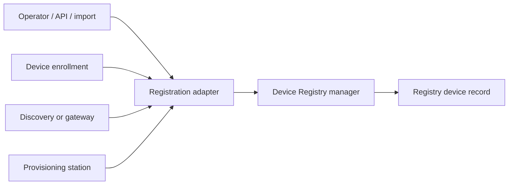

# Device Registration and Management

## Status

- Status: Proposed
- Strategy fit: Medium-high; it extends the existing Device Registry into a
  provider-neutral inventory and onboarding boundary without pulling broad
  fleet management into the local-development MVP.
- Canonical feature docs:
  [Device Registry](../../resources/device-registry.md),
  [Resource identity and permissions](../../resource-identity-and-permissions.md),
  and [Event Broker](../../resources/event-broker.md).
- Remaining action: Add operator-initiated device registration to the Device
  Registry domain manager, service API, remote client, and Resource Manager,
  then reconcile later enrollment into the same device record.
- Out of scope: firmware and operating-system update execution, application
  deployment to devices, out-of-band flashing, ownership-transfer protocol
  implementations, and projecting enrolled devices as top-level CloudShell
  resources.

## Summary

Device Registry should be the provider-neutral abstraction over different
device types and the different ways they become known to an environment. A
device may be registered by an operator before it is powered on, announce
itself through the existing enrollment endpoint, be discovered by a gateway or
network provider, arrive through an inventory import, or be reported by a
future manufacturing or flashing station. All of those paths should create or
reconcile one registry-owned device record.

The first increment is operator-initiated registration. Resource Manager, the
Control Plane API, SDK clients, and automation should be able to add a known
device with a stable registry identity, external identifiers, and non-secret
metadata. The device does not need to be online and registration does not
implicitly prove the device identity or create operational credentials. When
the device later enrolls, the registry should match it to the existing record,
validate proof through the enrollment provider, bind or provision its
principal, and update the record rather than creating a duplicate device.

Future device-management providers can project software deployment, in-band
firmware or operating-system updates, out-of-band flashing, and recovery
operations against the same registered device. Those operations are separate
from registration and are not part of the first implementation slice.

## Motivation

The current Device Registry creates a device record only after a device calls
the enrollment endpoint with an accepted subject, claims, and provider-owned
proof token. That is useful for device-initiated onboarding, but it does not
cover environments that already know their inventory.

Examples include:

- a team that knows the manufacturer serial number or hardware identifier
  before installing a device;
- a Raspberry Pi or embedded Linux device that will be imaged before first
  boot;
- a microcontroller that is visible to a programming probe before it can run a
  CloudShell-aware application;
- devices imported from an asset-management or manufacturing system;
- a gateway that can discover attached or local devices that cannot call the
  registry directly;
- a replacement or recovered device whose registry identity must survive a
  software or storage rewrite.

Requiring every one of these devices to self-register makes physical inventory,
identity, onboarding, presence, and software delivery one operation. CloudShell
should keep those concerns separate while making their relationships visible.

## Industry Reference Model

Existing products and standards provide useful vocabulary and behavior, but
CloudShell should not copy their product boundaries:

- [Azure IoT Hub identity registry](https://learn.microsoft.com/azure/iot-hub/iot-hub-devguide-identity-registry)
  proves that a service can create a device identity before the device
  connects. Its separation between IoT Hub, Device Provisioning Service, twin
  state, and application metadata should not become separate CloudShell
  product silos.
- [AWS IoT device provisioning](https://docs.aws.amazon.com/iot/latest/developerguide/iot-provision.html)
  provides useful thing, type, group, attribute, certificate, policy, and
  provisioning-template concepts. CloudShell should avoid coupling the
  inventory name, protocol client identifier, security principal, and
  connectivity record.
- [OMA Lightweight M2M](https://www.openmobilealliance.org/release/LightweightM2M/V1_2_2-20240613-A/HTML-Version/OMA-TS-LightweightM2M_Core-V1_2_2-20240613-A.html)
  provides mature bootstrap, registration, security, intermittent
  connectivity, device object, and firmware-update semantics for constrained
  devices. A future LwM2M integration should adapt those concepts into the
  registry rather than make LwM2M the universal CloudShell protocol.
- [FIDO Device Onboard](https://fidoalliance.org/fido-device-onboarding/)
  provides a strong manufacturer credential, ownership voucher, rendezvous,
  and mutual-proof model. FDO should be a possible registration and
  provisioning provider, not the registry's core record shape.
- [RFC 9944](https://www.rfc-editor.org/rfc/rfc9944.html) defines a SCIM Device
  resource and extensions for several bootstrap technologies. CloudShell does
  not need to expose SCIM in the first slice, but its device model should
  remain projectable into interoperable inventory systems.

The CloudShell improvement is one resource-centered view across inventory,
identity, access, presence, desired and reported state, relationships,
diagnostics, and provider operations without treating one vendor's hub,
protocol, or provisioning service as the domain.

## Terminology

| Term | Meaning |
| --- | --- |
| Device record | The registry-owned representation of one physical, virtual, or logical device. |
| Device registration | Creating or reconciling a device record in a Device Registry. |
| Operator-initiated registration | A trusted user or service supplies the known device details through UI, API, SDK, CLI, or import automation. |
| Device-initiated enrollment | A device announces itself, presents enrollment facts and proof, and requests credentials or configuration. |
| Registration source | The actor or adapter that supplied a registration fact, such as operator, enrollment, discovery, import, gateway, or provisioning station. |
| External identifier | A hardware, manufacturer, network, protocol, or provider identifier associated with the device. |
| Announcement or observation | Evidence that a device exists, is attached, or is reachable at a point in time. |
| Identity proof | Cryptographic or provider-trusted evidence that the observed party is entitled to claim an identifier or device record. |
| Presence | Time-bounded observed availability, independent from registration and administrative lifecycle. |
| Device management provider | A future provider that can perform operations such as deploy, update, flash, or recover against a registered device. |

The product UI should use **Add device**. Documentation and diagnostics should
use **operator-initiated registration** when the initiating flow matters.
Avoid **manual registration** as the domain name because the same operation is
also usable through automation and bulk import.

## Ownership Boundary

Device Registry owns:

- the stable registry device identity;
- external identifier bindings and their provenance;
- registration and administrative lifecycle;
- identity/principal bindings and access-grant attribution;
- normalized presence and last-observed facts;
- desired and reported state;
- normalized non-secret device metadata and capabilities;
- registration, identity, presence, and management-operation audit history.

Registration and discovery providers own:

- protocol-specific requests and sessions;
- network, gateway, USB, debugger, or programming-station discovery;
- extraction and normalization of provider-native identifiers;
- credential, certificate, ownership-voucher, or hardware-attestation
  validation;
- provider-specific observations and diagnostics.

Future device-management providers own:

- SSH, agent, bootloader, DFU, SWD, JTAG, USB boot, network boot, or
  vendor-specific execution;
- compatibility checks for provider-native device families and layouts;
- transfer, write, verification, rollback, and recovery behavior;
- provider-specific progress and failure details.

The Control Plane remains responsible for authorization, accepted operation
intent, provider dispatch, auditability, and stable diagnostics. Resource
Manager presents these capabilities but does not implement registration,
discovery, identity proof, or device-management protocols.

## One Device Record Across Registration Sources

Registration source must not define a different device type or persistence
model.



Every source supplies normalized registration facts to the registry manager.
The manager validates, finds matching records, reports collisions, and either
creates or reconciles the canonical device record. Provider adapters must not
write the device store directly.

The registration origin is retained for attribution and audit, but the record
must remain usable when later facts arrive through another source. For example,
an operator-created device may later be observed by a USB provider, enrolled
over HTTP, report presence over MQTT, and be managed through an SSH provider.

## Device Identity and Identifiers

The stable CloudShell identity is the registry-assigned device ID. It must not
be derived from a MAC address, user-facing display name, MQTT client ID,
certificate thumbprint, or another replaceable external identifier.

A record may contain several typed external identifiers, for example:

- organization, product, and serial identifiers;
- manufacturer or board serial number;
- hardware or silicon unique identifier;
- UUID;
- IEEE EUI-48, EUI-64, or MAC address;
- 1-Wire identifier;
- IMEI or another cellular equipment identifier;
- TPM endorsement or attestation identity reference;
- certificate or public-key fingerprint;
- USB vendor, product, and serial tuple;
- provider-scoped identifiers for systems without a portable standard.

Where a standardized URI representation exists, providers and clients should
preserve it. [RFC 9039](https://www.rfc-editor.org/rfc/rfc9039.html) DEV URNs,
[RFC 9562](https://www.rfc-editor.org/rfc/rfc9562.html) UUID URNs, and
technology-specific registered URNs are useful inputs. The registry contract
must also allow typed provider identifiers without pretending that every
hardware ecosystem has one global identifier standard.

An identifier binding should carry:

- normalized type and value;
- optional issuing authority or provider scope;
- provenance or registration source;
- first- and last-observed timestamps when applicable;
- assurance such as `expected`, `observed`, `verified`, or `retired`;
- non-secret provider metadata needed to interpret the identifier.

External identifiers are matching and evidence inputs, not credentials.
Private keys, enrollment tokens, certificate payloads, Wi-Fi credentials,
debug-probe secrets, and other sensitive material must not be stored in the
device record, resource attributes, logs, diagnostics, or UI fields.

## Independent State Dimensions

CloudShell should not collapse registration, identity assurance,
administrative lifecycle, and presence into one status.

| Dimension | Example values | Meaning |
| --- | --- | --- |
| Registration | `registered`, `provisioned`, `commissioned` | How far the device has progressed from known inventory to operational use. |
| Assurance | `unverified`, `partiallyVerified`, `verified` | How strongly the registry can associate current evidence with the record. |
| Administrative state | `enabled`, `disabled`, `revoked` | Whether the environment permits the device identity to operate. |
| Presence | `unknown`, `detected`, `online`, `stale`, `offline` | Whether a source recently observed the device and how. |

The exact values remain an implementation decision, but the dimensions must
remain independent. Examples:

```text
registered + unverified + enabled + unknown
registered + unverified + enabled + detected
commissioned + verified + enabled + online
commissioned + verified + disabled + offline
```

Presence observations should include source, transport, observed time, and an
expiry or freshness policy. A network or USB observation can establish
`detected` without authenticating the device. An authenticated heartbeat can
establish stronger online presence. Registration itself never means the device
is powered on.

## Operator-Initiated Registration Flow

The first implementation slice should work as follows:

1. An authorized actor opens **Add device** or calls the management API.
2. The actor supplies a name, one or more external identifiers when known,
   optional type/model information, and non-secret metadata.
3. The Device Registry normalizes identifiers and checks them against existing
   records.
4. An unambiguous existing match returns a reconciliation result rather than
   creating a duplicate.
5. Conflicting identifiers return stable diagnostics naming the conflicting
   record and identifier; the registry must not silently merge devices.
6. With no match, the registry creates a stable device ID and a registered,
   unverified record with unknown presence.
7. Credential creation is an explicit option or later provisioning step. It is
   not a side effect of recording inventory.
8. Resource Manager opens the standard device details view and shows
   registration origin, identifiers, assurance, administrative state, and
   presence.

Operator registration requires the registry's device-management permission.
Separate permissions may be introduced later for bulk import, credential
provisioning, or identity verification if those operations need narrower
authorization.

## Device-Initiated Enrollment Reconciliation

The existing enrollment endpoint should become another caller of the common
registration manager:

1. Normalize the announced subject, identifiers, claims, and properties.
2. Validate enrollment policy and provider-owned proof.
3. Find an existing device using explicit record identity or verified
   identifier matches.
4. Reject ambiguous or conflicting matches.
5. Reconcile accepted facts into the existing record or create a new record
   when policy allows just-in-time enrollment.
6. Bind or provision the device principal and access grants.
7. Return credentials only through the protected enrollment response.
8. Record enrollment as the last contact source without losing the original
   registration attribution.

Enrollment policy decides whether unknown devices may create records. A
registry may support operator-pre-registered devices only, just-in-time
enrollment, or both. Matching an expected identifier selects a candidate; it
does not replace cryptographic or provider-trusted proof.

## Proposed Domain and API Shape

Names remain provisional until the implementation slice, but the public
abstraction should center on a registry-owned manager rather than expose the
service store:

```csharp
public interface IDeviceRegistryManager
{
    Task<DeviceRegistrationResult> RegisterOrReconcileDeviceAsync(
        DeviceRegistrationRequest request,
        CancellationToken cancellationToken = default);
}
```

`DeviceRegistrationResult` should report created, reconciled, rejected, or
conflicted outcomes with stable diagnostics. Expected validation failures
should not require consumers to parse exceptions.

The request carries the registration source and the facts available to that
source. Operator registration and device enrollment differ in who supplies
those facts and which proof is available; they do not use different registry
record or reconciliation semantics.

The HTTP management surface should be registry-scoped and domain-shaped. A
first route may use:

```text
POST /api/control-plane/v1/device-registries/{registryId}/devices
```

The response should return the canonical device representation and appropriate
hypermedia affordances for permitted follow-up operations. The existing
device-service enrollment route may remain transport-specific while adapting
accepted requests into the same domain manager.

Remote clients, CLI commands, and future language SDKs should call the same
Control Plane API. They must not reproduce matching, identifier
canonicalization, or collision behavior locally.

## Resource Manager Experience

The Device Registry **Devices** tab should add an **Add device** command when:

- the registry service and management API are available;
- the current actor has device-management permission;
- the backing registry provider supports operator-initiated registration.

The form should begin with a compact portable shape:

- name;
- identifier type and value, with support for multiple identifiers;
- optional manufacturer, model, and device class;
- optional non-secret properties;
- an explicit credential-provisioning choice only when a provider supports it.

Provider extensions may contribute identifier editors or registration sections
for protocol-specific facts, but the base UI must remain useful without a
provider-specific component.

Device details should distinguish operator-supplied facts from device-reported
or provider-observed facts. Conflicts should be visible as diagnostics rather
than resolved by last-write-wins behavior.

## Provider Parity Contract

A registration provider should document:

- which registration sources it accepts;
- which external identifier types it normalizes;
- whether it can observe, verify, or only record each identifier;
- whether unknown devices may be created or only existing devices reconciled;
- proof and credential boundaries;
- presence semantics and freshness;
- collision and ambiguity diagnostics;
- persistence and recovery behavior;
- API/client and Resource Manager projections;
- security and privacy considerations.

Provider-specific registration facts remain behind provider contracts. Stable,
non-secret normalized facts can be projected on the common device record.

Launcher and language SDK parity is not required for the first Resource Manager
slice, but any public device-registration client should eventually be available
through the C#, TypeScript/JavaScript, and Java SDK surfaces. Samples should use
the public manager or API rather than the Device Registry service store.

## Future Device Management

Registration establishes the target for later operations; it does not define
how software is delivered. Future providers may expose separate capabilities:

| Capability | Intent |
| --- | --- |
| `application.deploy` | Replace or deploy a user workload while preserving the base operating environment. |
| `firmware.update` | Perform an in-band update through a running agent or bootloader. |
| `operatingSystem.update` | Update the installed operating system while preserving the device installation. |
| `device.flash` | Rewrite the device through an external host, programmer, jig, boot mode, or recovery interface. |
| `device.recover` | Restore a device that cannot complete its normal in-band update path. |

`device.flash` is destructive and may include bootloader, partition layout,
operating system, security configuration, identity material, and application
payload. Providers must identify irreversible operations such as OTP or fuse
changes before dispatch. Flash plans must explain whether device identity will
be preserved, reinjected, rotated, or require renewed enrollment.

Microcontrollers may need a persistent bootloader or management firmware before
they can accept later application updates. Full operating-system devices may
use an agent, package manager, container runtime, SSH, network boot, or
out-of-band flashing. Those are provider behaviors behind distinct management
capabilities, not branches in the Device Registry record model.

## Diagnostics and Audit

Registration and reconciliation should produce activity suitable for answering:

- who or what registered the device;
- which identifiers were supplied, observed, matched, or rejected;
- whether a record was created or reconciled;
- which provider validated proof;
- when the device was last observed and by which source;
- why an announcement was rejected or considered ambiguous;
- whether credentials or grants were provisioned.

Diagnostics may include normalized non-secret identifiers when authorized, but
the UI and logs should treat long-lived identifiers as potentially sensitive
inventory data. Secrets and private credential material must never be included.

## Persistence and Lifecycle

The current Device Registry JSON sidecar remains the MVP persistence boundary.
The first slice can extend its device record schema while keeping storage
behind the registry service contract. Migration must preserve existing enrolled
devices, device IDs, principals, lifecycle state, twin state, and last-seen
metadata.

Deleting and recreating a device with the same external identifier must not
silently restore revoked trust. Re-registration, identifier transfer, and
replacement-device workflows require explicit policy and audit behavior.

## Implementation Slices

1. **Common record and manager**
   - Add stable operator-created device records, external identifier bindings,
     registration origin, and result diagnostics.
   - Move current enrollment record creation behind the common manager.
   - Preserve existing enrolled-device compatibility.
2. **Management API and clients**
   - Add operator registration and device lookup routes.
   - Project the new fields through remote clients and OpenAPI.
   - Add authorization and collision contract tests.
3. **Resource Manager**
   - Add **Add device**, identifier editing, and registration/assurance details.
   - Preserve existing lifecycle, presence, and twin management.
4. **Registration providers**
   - Extract provider contracts for discovery, gateway, import, FDO, LwM2M, or
     manufacturing adapters only when a concrete integration proves the shape.
5. **Device-management capabilities**
   - Design application deployment, in-band updates, flashing, and recovery as
     separate proposals or proposal increments after registration identity is
     stable.

## Open Questions

- Should operator-created device credentials be opt-in during registration or
  always a separate provisioning operation?
- Which external identifier representations should the first UI support
  directly, and which should begin as provider-scoped values?
- What explicit identifier should a device present to reconcile with a
  pre-registered record before proof is validated?
- Should just-in-time enrollment remain enabled by default when a registry also
  supports pre-registered-only policy?
- Which presence sources can report `online` versus only `detected`?
- When should enrolled devices become projected child resources rather than
  registry-owned operational records?
- What authorization and audit flow should transfer an identifier from a
  retired or replaced device to another record?
