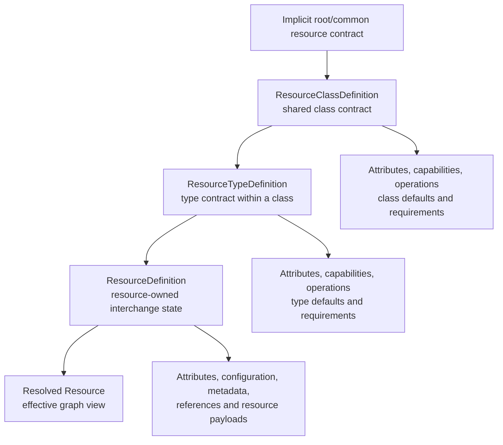

# Resource Definition Structure

This document describes the common `ResourceDefinition` structure used by the
Resource model. It focuses on the interchange shape: the serializer-neutral
model used by deployments, templates, imports, exports, debug views, and apply
operations. YAML is the preferred authoring format. JSON remains the
Control Plane API-compatible projection.

For the provider contracts that validate, apply, and project these
definitions, see [Resource model providers](resource-model-providers.md).

The Resource Graph still owns the durable graph/configuration state. The
Control Plane and Resource Manager own runtime state, operational records,
live endpoint observations, logs, traces, metrics, orchestration, and provider
runtime caches.

The boundary is:

```mermaid
flowchart TD
    definition["ResourceDefinition<br/>interchange format"]
    graph["Resource graph<br/>durable configuration contract"]
    resolved["Resolved Resource<br/>effective graph view"]
    declarations["Capabilities and operations<br/>resolved declarations"]
    manager["Resource Manager<br/>Control Plane operational model"]
    runtime["Runtime integrations<br/>handlers and provider services"]
    infrastructure["Running infrastructure"]

    definition --> graph
    graph --> resolved
    resolved --> declarations
    declarations --> manager
    manager --> runtime
    runtime --> infrastructure
```

## Definition Layers

`ResourceDefinition` is not resolved by itself. It is interpreted through
definition layers:



The root/common resource contract is a conceptual layer for fields and
expectations that apply to all graph resources, such as identity, metadata,
startup dependency references, attributes, capabilities, and operations. The
current model does not need a concrete `RootResourceDefinition` type yet, but
it should treat these common fields as inherited by every class, type, and
resource.

`ResourceClassDefinition` defines broad shared expectations for a class of
resources, such as infrastructure, storage, configuration, network, service,
or container resources. It may declare shared attributes, default values,
capabilities, operations, validation expectations, and common value shapes.

`ResourceTypeDefinition` refines the class contract for a concrete resource
type, such as `application.container-app` or `configuration.store`. It may add
or override type-specific attributes, declare supported capabilities and
operations, provide defaults, and attach validation rules.

Definitions are expected to become versioned artifacts. Resource class
definitions, resource type definitions, capability declarations, and operation
declarations may each declare the provider/artifact version they were authored
for. A resource definition may pin the type definition version it expects; if
it does not, resolution can assume the latest compatible provider version.

The domain model should keep the logical artifact ID separate from the
requested version. Serialized authoring formats can still choose a compact
selector convention later, but the convention is not settled. One possible
shorthand is a suffix on the type selector:

```json
{
  "type": "application.executable:v2"
}
```

That selector would parse as logical type `application.executable` with the
requested type/provider version `v2`. Other conventions may be clearer, such
as explicit fields:

```json
{
  "typeId": "application.executable",
  "typeVersion": "v2"
}
```

The model should not choose this prematurely. Whatever convention is selected
for JSON, YAML, or another authoring format, the graph should resolve it into
explicit IDs and versions before validation.

`ResourceDefinition` then represents resource-owned state in interchange form.
It can be:

- a full rendition of a resource state suitable for export, review, or
  template/deployment input
- an authored declaration for creating a resource
- an incremental update overlay applied to an existing resource

This distinction matters for capabilities and operations. They are often
declared on `ResourceClassDefinition` or `ResourceTypeDefinition`, while the
resource definition provides resource-specific attributes whose contracts are
defined by those capabilities or operations. For example, a container-like
class or type may declare the `storage.volumeConsumer` capability, and a
specific `ResourceDefinition` supplies the mount attributes for the resolved
resource to consume.

Resolution combines the implicit root/common contract, class definition, type
definition, and resource-owned state into a resolved `Resource`. That resolved
`Resource` is the effective graph view consumers normally use. Rendering a
`Resource` back to `ResourceDefinition` produces an interchange document for
the resource; it should not be treated as a dump of every inherited or
runtime-observed value. Provider-managed or read-only attributes may be
filtered from interchange output unless a provider explicitly makes them part
of the authored contract.

## Resource Templates

The current graph model has `ResourceTemplate` as a small grouping of
`ResourceDefinition` values that can be validated and applied together. It is
intentionally narrow.

The file-level shape should remain a desired-state envelope:

```yaml
resources:
  - type: application.container-app
    name: api
    container:
      image: api:latest
      replicas: 3
```

This shape is called a **ResourceTemplate** because it contains resource
definitions. It should not be wrapped in `ResourceDeploymentDefinition` or any
other deployment-shaped user authoring object. If Resource Manager or an
orchestrator needs a deployment definition, that definition is an internal
orchestration artifact produced after Resource Manager accepts resource state.

The public apply model should stay close to Azure ARM in spirit: an actor
declares resource state and sends one or more `ResourceDefinition` entries to
Resource Manager. The "Add resource" page produces a `ResourceDefinition` for
the new resource. Editing an existing resource produces an incremental
`ResourceDefinition` overlay for that resource. Applying a file with multiple
resources is the same model with more entries, not a separate template system.
Any outer grouping is transport and apply metadata around resource
definitions, not a second resource-state language.

The user experience follows that boundary:

1. To create or modify resources, the UI or caller sends a resource template
   with one or more `ResourceDefinition` entries to Resource Manager.
2. To start, stop, pause, restart, or run another resource operation, the caller
   sends a resource command. A provider may also support applying a resource
   template whose accepted state implies the same transition, but the command
   remains the direct operation surface.
3. To delete a resource, the caller asks Resource Manager to delete that
   resource. Deletion is not modeled as an orchestrator deployment authored by
   the user.

The important boundary is that `ResourceDefinition` remains the resource
interchange unit. A resource template describes how a set of resource
definitions is authored, grouped, ordered, parameterized, or applied together;
it should not invent a second resource state model. It should also stay
distinct from the existing Resource Manager orchestration types such as
`ResourceOrchestratorDeploymentSpec` and
`ResourceOrchestratorDeploymentDefinition`, which describe operational runtime
deployment state.

Operational deployment concepts such as orchestrator services, replica groups,
and runtime deployment revisions are internal orchestration projections unless
they are deliberately exposed for a specific workload-builder scenario later.
For normal authoring, a container app remains a container app resource: the
provider maps its accepted resource intent to the internal orchestrator service
and replica group it controls.

## Template Export And Import

The current graph path exports graph-backed Resource Manager resources as
`ResourceTemplate` values containing `ResourceDefinition` entries. It imports
the same shape through the graph apply path. The template is desired resource
state, not an orchestrator deployment artifact.

The apply flow is:

```text
Desired state
(ResourceTemplate)
    |
    v
Resource Graph
    |
    v
Resource Providers
    |
    v
Deployment Planning
    |
    v
Orchestrator
    |
    v
Running System
```

The name and shape of a file-level resource template container may evolve, but
the inner resource payload should stay based on `ResourceDefinition`, because
that format is tied to resource shape, validation, and incremental apply
semantics.
Exporting existing resources back to `ResourceDefinition` is the portability
mechanism: the exported definition can be moved, reviewed, edited, and applied
again without converting through a special CloudShell template language.

Template import delegates to the graph apply path with create-missing-resource
semantics. Applying resource definitions remains owned by that graph apply
path so each resource type provider can validate and accept or reject changes
before they become graph state. Deployment planning happens after providers
accept resource intent, so orchestrator services, replica groups, load-balancer
bindings, and runtime revisions remain internal projections of accepted
resource graph state.

## Core Envelope

A `ResourceDefinition` describes a resource state snapshot or an incremental
change that can be validated and applied to the graph.

```json
{
  "name": "api",
  "typeId": "application.container-app",
  "resourceId": "application.container-app:api",
  "providerId": "applications.container-app",
  "displayName": "API",
  "version": "1",
  "dependsOn": [],
  "attributes": {},
  "metadata": {}
}
```

Common fields:

| Field | Purpose |
| --- | --- |
| `name` | Scoped authored name. |
| `typeId` | Resource type, such as `application.container-app` or `docker.host`. |
| `resourceId` | Optional canonical resource ID. If omitted, the model derives one from type and name. |
| `providerId` | Optional default provider or implementation owner. |
| `displayName` | Optional presentation label. It does not affect addressing. |
| `version` | Optional resource revision/version string for graph state. |
| `dependsOn` | Optional startup dependency references. This is not general service discovery. |
| `attributes` | Resource-owned graph/configuration state. Attribute definitions may project canonical IDs into document paths. Existing dotted IDs can still be projected as nested groups. |
| `configuration` | Provider-owned structured configuration payloads when attributes are not the right shape. |
| `metadata` | Non-runtime metadata about the definition. |

The serialized authoring format should not include computed CLR convenience
properties such as `effectiveResourceId`, `startupDependencies`,
`resourceAttributes`, `resourceAttributeValues`, `configurationPayloads`,
`capabilityPayloads`, or `operationPayloads`. Those names are local accessors
over the canonical fields, not document fields.

Attributes are the resource-owned desired-state surface. In the canonical CLR
model they live under `ResourceDefinition.Attributes`. In authored templates
they are hoisted beside fixed resource fields by default so provider/resource
configuration reads like the rest of the resource declaration. If a capability
defines the contract for some resource-owned value, the accepted value is still
an attribute in the Resource model. Resource-level `capabilities` and
`operations` payload bags still exist in the current CLR model for legacy
graph and provider paths, but they are not the preferred authoring location for
resource-owned state.

Attribute IDs are canonical schema keys. They must not be the only mechanism
for document hierarchy. The in-memory model still resolves current canonical
IDs such as `container.image`, `logs.sources`, and `health.checks`, and
YAML/JSON templates may continue projecting those IDs into hoisted nested
objects for compatibility. `ResourceAttributeDefinition` can describe the
authored path separately from the canonical ID, so a resource type can export a
clear document shape without making the ID string carry grouping semantics.

The `attributes` wrapper and full canonical IDs remain valid input forms for
compatibility and for fixed-field name collisions. When an attribute definition
declares an authored path, import/export should prefer that path and accept
canonical IDs or aliases as fallback input.

Resource-type-local attributes should prefer stable canonical IDs that make
sense to provider code. Shared capabilities may still use stable dotted IDs
when the namespace itself is part of the schema identity, but the exported
document hierarchy should come from attribute-definition metadata over time.
Schema-aware import/export paths should use the Resource model's
`ResourceAttributePathResolver` to resolve authored paths and aliases to
canonical IDs and to reject or report ambiguous paths before applying
attributes.
The resolver is schema-local and can be built from the resource class,
resource type, and selected capability attribute definitions for one resource.
That means two resource types, or two capabilities used in different resource
schemas, can expose the same authored path while resolving it to different
canonical IDs owned by their respective schemas.
Inside one composed schema, a shared authored path or alias is reported as
ambiguous rather than guessed. Full canonical IDs remain valid in that case and
are the explicit escape hatch for choosing the intended attribute.

```yaml
container:
  image: cloudshell-signalr-api:20260630.1
  replicas: 3
  endpointRequests:
  - name: http
    protocol: http
    targetPort: 8080
logs:
  sources:
  - id: console
    name: Console logs
    kind: processOutput
    format: jsonConsole
    capabilities:
    - read
      - stream
```

When the document is deserialized, these grouped attributes flatten back to
canonical attribute IDs before validation and provider code sees them. That
flattening is a projection step, not proof that the canonical ID itself owns
the hierarchy.

Resource references also use a compact document projection for the common
resource-id case. `value`, `relationship`, `addressingMode`, `typeId`, and
`providerId` are the full model fields, but a startup dependency usually only
needs the target resource ID:

```yaml
dependsOn:
- resourceId: cloudshell.container-host:default
```

This deserializes to a `dependsOn` relationship with `resourceId` addressing.
The full form remains available when a reference needs a non-default
relationship, addressing mode, type hint, or provider hint.

Empty optional sections such as `dependsOn`, `attributes`, `configuration`,
`capabilities`, `operations`, and `metadata` should be omitted from serialized
ResourceDefinition documents instead of emitted as empty arrays or objects.

## Applying to Existing Resources

When a `ResourceDefinition` is applied to an existing graph, `resourceId` is
the canonical target if it is present. If `resourceId` is omitted, the apply
path may resolve the target by `typeId` plus `name`, which is the common
authoring case and keeps the serialized format from depending on one generated
ID convention.

For existing resources, `resourceId`, `typeId`, and `name` are identity fields.
Applying a definition should not silently change them. If a definition targets
an existing resource by `resourceId` but supplies a different `name`, the
current apply path rejects the change instead of treating it as a rename. A
future explicit rename or change-identity operation can add warnings,
reference updates, and provider checks when there is a concrete use case.

The model may eventually support configurable ID or naming schemes, including
schemes that encode other logical relationships. That should be an extension
point around identity generation and matching policy, not a reason to bake one
resource ID convention into the `ResourceDefinition` envelope.

## References

`ResourceReference` is the graph-native way to reference another resource. A
reference is not the same thing as a relationship. It may be used by
`dependsOn`, by resource attributes, or inside provider-owned complex values.

```json
{
  "value": "docker.host:sample",
  "relationship": "dependsOn",
  "addressingMode": "resourceId",
  "typeId": "docker.host",
  "providerId": "docker"
}
```

Current relationship values:

| Value | Meaning |
| --- | --- |
| `dependsOn` | Startup ordering dependency. |
| `belongsTo` | Ownership or containment-style reference. |
| `reference` | General reference without stronger semantics. |

Current addressing modes:

| Value | Meaning |
| --- | --- |
| `resourceId` | Reference a resource already known by graph/resource ID. |
| `projectedResource` | Future-facing mode for provider-projected resources. |
| `providerNative` | Future-facing mode for provider-native identity. |

## Attributes

Attributes are graph/configuration state for a resource. Attribute IDs are
owned by the resource type, resource class, or a deliberately shared
definition. They can be scalar values, `ResourceReference` values, complex
objects, or collections when the attribute definition allows it.

Attribute definitions separate canonical identity from authored shape. The
canonical `ResourceAttributeId` is what providers, validators, stores, and
runtime adapters use. An optional authored path describes where that value
appears in templates and exports. Aliases can accept legacy dotted IDs or older
paths during import once import/export uses the metadata. This keeps two
resource types free to expose the same logical field name or document path
while keeping distinct provider-owned schema identities.

```json
{
  "attributes": {
    "container.image": "cloudshell-application-api:20260622.2",
    "container.replicas": 3,
    "database.server": {
      "value": "application.sql-server:sql-server",
      "relationship": "belongsTo",
      "addressingMode": "resourceId",
      "typeId": "application.sql-server",
      "providerId": "applications.sql-server"
    }
  }
}
```

Attribute definitions declare expected value type, default value, required
state, read-only/provider-managed mutability, collection shape, and optional
complex shape. A resource may still carry custom attributes without a
definition, but defined attributes are the portable contract for validation,
authoring, and provider integration.

Resolved attributes track definition state separately from value state.
`ResourceAttributeResolution.IsDefined` means the attribute ID came from a
resolved class or type definition. `ResourceAttributeResolution.IsSet` means
the resolved resource has an actual value for that attribute. A class/type
attribute without a default resolves as defined but unset. A custom
resource-state attribute without a class/type definition resolves as
undefined/custom but set. Projection code that needs concrete ID/value maps,
such as the Resource Manager bridge, should include only set attributes.

This distinction keeps schema problems separate from legitimate absence of a
runtime or provider-managed value. An unknown attribute ID may be invalid in a
reserved provider namespace, while an unset defined attribute may be valid,
defaultable, required, or provider-managed depending on its
`ResourceAttributeDefinition`.

Capabilities attach behavior to resources and may contribute the attribute
definitions and validators that configure or describe that behavior. For
example, a volume-consumer capability can define the mount-related attributes
or payload shape it needs, and validate those values when the capability is
declared on a class, type, or resource. Some capability attributes are
intentionally reusable across resource types and are not logically owned by
the resource type that consumes them. The graph should still store accepted
resource-owned values as attributes; the capability supplies part of the
contract that explains and validates those attributes.

When a resource inherits a capability from its class or type, authored
resources set capability-defined attributes instead of repeating the capability
declaration. Those attributes should use stable IDs, normally qualified by the
capability or provider boundary:

```json
{
  "attributes": {
    "health.checks": {
      "checks": []
    }
  }
}
```

The canonical CLR/API envelope keeps resource state under `attributes`.
Resource template files project those attributes into hoisted document groups
for authoring, then flatten them back into this canonical shape before
validation and apply:

```json
{
  "health.checks": {
    "checks": []
  }
}
```

## Endpoint Requests

Endpoint requests are graph configuration. They describe what endpoint a
resource is asking the runtime/provider to make available. They are not the
same as observed endpoint mappings or live addresses.

Common endpoint request shape:

```json
{
  "name": "http",
  "protocol": "http",
  "targetPort": 8080,
  "host": "localhost",
  "port": 5092,
  "ipAddress": null,
  "exposure": "Local",
  "assignment": null,
  "network": null,
  "providerEndpointId": null
}
```

Current providers declare endpoint requests as provider-owned attributes, for
example:

```json
{
  "attributes": {
    "container.endpointRequests": [
      {
        "name": "http",
        "protocol": "http",
        "targetPort": 8080,
        "host": "localhost",
        "port": 5092,
        "exposure": "Local"
      }
    ]
  }
}
```

`project.endpointRequests` and `container.endpointRequests` currently use the
same shared `networking.endpointRequest` shape. This keeps the model flexible
without making endpoints a graph-native primitive.

## Endpoint Mappings

Endpoint mappings and endpoint network mappings are usually Resource Manager
runtime projections, not generic graph state. They describe configured or
observed reachability after providers and networks have acted on endpoint
requests.

Shared shapes exist for providers that need to declare mapping intent in graph
configuration, but they should be used deliberately:

```json
{
  "source": {
    "resource": {
      "value": "cloudshell.virtualNetwork:public",
      "relationship": "reference",
      "addressingMode": "resourceId",
      "typeId": "cloudshell.virtualNetwork",
      "providerId": "cloudshell.network"
    },
    "endpointName": "api-public"
  },
  "target": {
    "resource": {
      "value": "application.container-app:api",
      "relationship": "reference",
      "addressingMode": "resourceId",
      "typeId": "application.container-app",
      "providerId": "applications.container-app"
    },
    "endpointName": "http"
  }
}
```

When a provider projects a concrete address, that belongs to the Resource
Manager projection unless the provider has an explicit graph configuration
attribute for it.

## Health Checks And Liveness

Health checks and liveness are resource attributes under `health.checks`. The
health capability defines the attribute contract and validation behavior. The
Control Plane evaluates probes, stores observations, and decides
health/liveness state.

```yaml
health:
  checks:
  - name: health
    type: health
    source:
      kind: http
      http:
        path: /health
        endpointName: http
        timeoutMilliseconds: 1000
    intervalSeconds: 10
  - name: alive
    type: liveness
    source:
      kind: http
      http:
        path: /alive
        endpointName: http
```

The derived `liveness` capability may appear on resolved or Resource Manager
projections, but the persisted interchange input should focus on the
`health.checks` declaration unless a provider has a stronger reason to declare
something else.

## Volumes

Volume attachments are resource attributes under `storage.volumeConsumer`.
The volume-consumer capability defines the attribute contract and validation
behavior. Provider/runtime code decides how mounts are materialized.

```yaml
storage:
  volumeConsumer:
    mounts:
    - volume: storage.volume:data
      targetPath: /data
      readOnly: false
```

The volume reference is currently stored as a string in the volume-consumer
attribute and projected into graph dependencies by the capability dependency
provider. A future cleanup may move this to `ResourceReference` if provider
ports show that the current shape is too weak for interchange authoring.

## Log Sources

Log sources are resource attributes under `logs.sources` when a provider can
describe stable log sources. The log-source capability defines the attribute
contract and validation behavior. Read and stream sessions remain Control
Plane runtime concerns.

```yaml
logs:
  sources:
  - id: console
    name: Console logs
    kind: processOutput
    format: plainText
    capabilities:
    - read
    - stream
    origin: providerDefault
    purpose: default
    availability: resourceRunning
```

## Operations

Operations declare named behavior available for a resource. Their
implementation belongs to runtime integrations, operation providers, or
Control Plane handlers.

```json
{
  "operations": {
    "start": {},
    "restart": {},
    "container.image.update": {}
  }
}
```

Most current operation declarations come from `ResourceTypeDefinition` rather
than explicit resource definitions. Explicit operation payloads should be used
only when the operation needs resource-owned configuration or when a provider
has made that part of its interchange contract.

## Interchange Feedback

Provider README examples should use the actual `ResourceDefinition` shape.
When an example is hard to author, hard to read, or awkward to round-trip,
record that as feedback against the interchange API. Provider porting should
prefer the simplest shape that captures graph configuration without leaking
runtime implementation details into the document.
