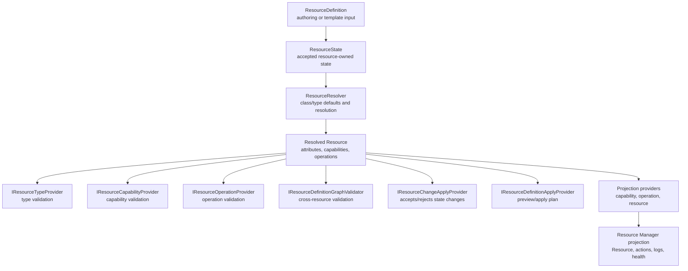

# Resource Model Providers

Resource model providers define how `ResourceDefinition` entries become
validated graph state, Resource Manager projections, operations, diagnostics,
and runtime materialization. This is the provider-facing contract for the
current ResourceDefinition-based path.

For the generic resource object shape, see [Resource model](resource-model.md).
For template/import/export shape, see
[ResourceDefinition structure](resource-definition-structure.md) and
[Resource templates](resource-templates.md).

## Current Provider Layers

The current Resource model provider contracts live in `CloudShell.ResourceModel`
and are registered by Control Plane provider packages.

`ResourceDefinition` and `ResourceState` remain data contracts. Provider
behavior is attached through DI-registered services rather than encoded in the
serialized definition format.

## Type and Class Definitions

`ResourceClassDefinition` defines broad class-level expectations. Examples
include application, container, storage, network, configuration, and
infrastructure classes.

`ResourceTypeDefinition` refines a class for a precise type such as
`application.container-app`, `cloudshell.volume`, `sql.server`, or
`cloudshell.container-host`.

Definitions can declare:

- required attributes
- attribute definitions and value shapes
- default provider id
- capability declarations
- operation declarations
- read-only or provider-managed attribute mutability

Definitions are not runtime implementations. They describe accepted shape,
defaults, and validation expectations. Runtime work remains provider-owned.

## Validation Contracts

`IResourceTypeProvider` owns validation for one resource type:

- `TypeId`
- `TypeDefinition`
- `CanValidate(Resource)`
- `ValidateAsync(Resource, ResourceProviderContext, ...)`

`IResourceCapabilityProvider` validates a resolved capability on a resource.
For example, the shared volume consumer capability provider validates volume
mount declarations for executable apps, project apps, JavaScript apps, Java
apps, and container apps.

`IResourceOperationProvider` validates a resolved operation declaration at a
specific resolution level. Operation providers are selected by operation id,
resolution source, and `CanHandle(...)`.

`IResourceDefinitionGraphValidator` validates cross-resource rules after the
individual definitions have resolved. Current graph validators cover
relationship and compatibility checks such as volume targets, load-balancer
references, service targets, app references, SQL Server host references, and
name-mapping dependencies.

## Apply and Planning Contracts

`IResourceChangeApplyProvider` accepts or rejects a proposed change set for a
specific resource type. The dispatcher rejects read-only attribute changes
before provider apply, and also rejects provider apply results that mutate a
read-only attribute unless that attribute is explicitly provider-managed.

`IResourceDefinitionApplyProvider` produces apply plans for a resolved
resource. Current plan steps include:

- `AcceptDefinition`
- `MaterializeRuntime`
- `UpdateDefinition`

The plan is a preview/apply explanation surface. It does not replace provider
runtime adapters or the deployment/orchestration system.

## Projection Contracts

Resource model state is bridged into the Resource Manager domain projection by
the Resource model Control Plane integration.

Projection hooks include:

- `IResourceCapabilityProjector`
- `IResourceOperationProjector`
- `IResourceProjectionProvider`
- Resource Manager endpoint, attribute, parent, state, and observability
  projection providers in `CloudShell.ControlPlane.ResourceModel`

Projection may add Resource Manager actions, capabilities, endpoint mappings,
parent relationships, health checks, log sources, observability metadata, and
derived non-secret attributes. Projection should not make serialized
definition files depend on provider-native runtime objects.

## Provider Package Shape

A resource type package should register the pieces it owns through DI:

- `ResourceClassDefinition` when it owns or contributes a class contract
- `IResourceTypeProvider`
- `IResourceChangeApplyProvider`
- `IResourceDefinitionApplyProvider`
- capability providers/projectors it owns
- operation providers/projectors it owns
- graph validators for cross-resource constraints
- graph dependency providers when a capability or type implies dependencies
- Resource Manager projection providers for endpoints, parents, state,
  observability, and attributes
- runtime adapter interfaces and default/no-op implementations where useful
- logs, monitoring, health, and operation providers when supported

The schema pieces and implementation pieces should be registered and versioned
as one provider-owned contract. `ResourceClassDefinition`,
`ResourceTypeDefinition`, capability attribute definitions, validators,
projectors, apply providers, and runtime adapters are different facets of the
same resource model provider package. Template import/export can consume those
schema facets through a `ResourceDefinitionSchemaCatalog`, while validation and
execution continue through the provider interfaces.

Provider packages may later move their class/type definitions and capability
attribute schemas into checked-in YAML artifacts. That is a good fit for
generated launcher builders and language SDKs because it gives generation a
stable source that is easy to diff and review. The provider package still owns
the artifact version and must ship matching implementation code. Hosts should
register the compiled/runtime representation of those schemas into the
`ResourceDefinitionSchemaCatalog`; generators can consume either the YAML
source or the catalog projection as long as both represent the same provider
version.

Provider packages should expose a host registration method such as
`AddContainerApplicationResourceType(...)` or `UseContainerApplicationResourceProvider(...)`
so hosts install the full provider slice consistently.

## Parity Expectations

A new resource model provider should document:

- resource type id, class id, provider id, and registration method
- supported attributes, configuration payloads, capabilities, and operations
- which attributes are authorable, read-only, or provider-managed
- graph validators and dependency providers
- Resource Manager projection behavior
- action availability and diagnostic reasons
- runtime adapters required by the provider
- logs, traces, metrics, monitoring, health, and usage behavior
- storage, networking, identity, and container-host compatibility
- launcher and language SDK builder helpers
- import/export behavior through `ResourceDefinition`
- tests for validation, apply, projection, and Resource Manager behavior

## Source Generation Status

Typed facades and builders currently exist as hand-written helpers for several
resource types. Source-generated wrappers, generated builders, and generated
provider stubs are future implementation aids, not the current contract and
not the source of truth. The durable contract is the ResourceDefinition model,
registered class/type definitions, provider services, and Resource Manager
projection behavior.
