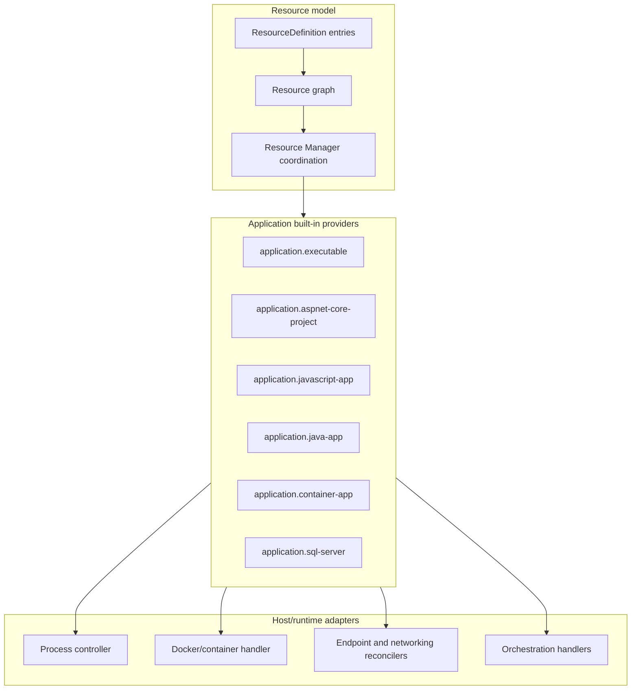

# Application Resources

CloudShell includes application resource types for local development machines.
They project host-local workloads into Resource Manager while keeping
provider-owned configuration and runtime state behind provider and runtime
adapter boundaries.

Resource-type-specific guidance:

- [Executable applications](executable-applications.md) for
  `application.executable` command resources.
- [ASP.NET Core applications](aspnet-core-applications.md) for
  `application.aspnet-core-project` project resources.
- [JavaScript applications](javascript-applications.md) for
  `application.javascript-app` Node.js-backed project resources.
- [Java applications](java-applications.md) for `application.java-app`
  JVM-backed project resources.
- [Container apps](container-apps.md) for `application.container-app` deployable
  container workloads.
- [SQL Server resources](sql-server.md) for `application.sql-server`
  container-backed database resources.

Application resources are primarily intended for local development:
ASP.NET Core APIs, frontend dev servers, emulators, workers, containerized
services, and similar host-local tools. They are not a deployment abstraction
for remote infrastructure.

Container application resources represent managed services in CloudShell. A
container app should be the normal configuration surface for service endpoints,
opt-in replica scaling, internal exposure on the host or a virtual network,
public endpoint exposure, internal DNS-style names, and custom domain name
mappings. Resource Manager should make those relationships visible from the
application resource itself, while still showing the related network,
load-balancer, storage, identity, and DNS/name-mapping resources when users
need to inspect the underlying platform pieces.

`cloudshell.service` remains optional for explicit service facades, imported
provider-native services, non-application targets, or advanced routing. A
normal container app should not require a separate Service resource just to act
like a managed service.

## Provider Boundaries And Runtime Adapters

Application resource authoring now flows through ResourceDefinition entries
and the Resource graph. The current built-in providers expose builders such as
`AddExecutableApplication(...)`, `AddAspNetCoreProject(...)`,
`AddJavaScriptApp(...)`, `AddJavaApp(...)`, and
`AddContainerApplication(...)`, then map accepted
resource intent to provider projection, actions, logs, health, endpoint, and
runtime adapter contracts.
The earlier application-definition provider package was part of the old
provider model and has been removed from the active solution.

Executable apps, ASP.NET Core projects, container apps, and SQL Server each
have their own resource type and provider-owned semantics. They can still
share provider-neutral helpers for common concerns such as local process
execution, container-backed startup, environment variables, app settings,
endpoint projection, logs, monitoring, and orchestration. Shared helpers must
stay behind provider contracts or default runtime integration registrations so
providers do not depend directly on a concrete host/runtime implementation.



The layering is intentional. ResourceDefinition entries express desired
resource state. Resource Manager accepts that state into the graph and invokes
provider semantics. Providers then use focused adapter interfaces for concrete
runtime work such as process startup, Docker container execution, endpoint
mapping reconciliation, and orchestrator operations. The host or default
runtime package registers the concrete adapters for the current environment.

An application resource can be backed by one executable, several cooperating
executables, one container, several containers, or a provider-managed runtime
service. The stable CloudShell resource remains the application resource that
users inspect and operate. Runtime artifacts can still be tracked below that
resource when they matter for cleanup, diagnostics, monitoring, or advanced
inspection, but they should not become the primary user-facing resource unless
the user explicitly modeled them as resources.

Runtime materialization and resource projection are separate concerns. An
application resource may materialize runtime work without projecting every
runtime artifact as a resource. The shared application infrastructure should
support a small set of materialization primitives that provider authors can
reuse when policy allows:

- spawn a local process and keep enough identity to observe, stop, recover, and
  clean it up according to the resource lifetime
- start an ad-hoc container on a selected container host and track the host,
  name, replica, log source, and cleanup identity owned by the application
- create or reconcile sub-resources through the Resource Manager when the
  materialized entity is itself a meaningful resource with identity,
  authorization, relationships, diagnostics, or lifecycle behavior

Processes and ad-hoc containers can remain resource-owned runtime state when
they are only implementation details of the application. They should be
projected as child or runtime-managed resources only when that projection adds
resource-model value, such as independent inspection, targeted diagnostics,
actions, permissions, ownership traversal, or references from other resources.
Sub-resources that are managed through the Resource Manager are different:
they are real resources with normal resource identity, even when the
application provider creates or reconciles them on behalf of the parent.

Containment exists at more than one level:

- The application resource contains the runtime behavior it owns.
- The shared application infrastructure manages process and container
  lifecycles for that resource.
- Providers can materialize child or internal resources, such as container app
  replicas, when they are real runtime-managed resources owned by the parent.
- Providers can project declared or provider-observed child resources, such as
  SQL databases or Docker host containers, when the backing platform exposes
  resources that are useful to inspect.
- Providers can create Resource Manager-managed sub-resources when the
  materialized artifact should participate in the normal resource graph rather
  than remain provider-owned runtime state.
- Orchestrators manage orchestrator-owned sub-resources and runtime service
  descriptors that materialize the application resource on a selected host.

Internal sub-resources should use ownership, management-mode, visibility, and
cleanup metadata to make their relationship explicit. They remain part of the
resource graph for diagnostics and cleanup, but Resource Manager should present
the containing application as the normal management surface. The orchestrator,
not the application provider author, owns the lifecycle of orchestrator-managed
replicas, runtime services, and other materialized implementation artifacts.

Application resources still use the same Resource Manager graph model as any
other resource. Provider-specific attributes describe executable, project,
container, endpoint, health, observability, storage, and dependency intent.
Concrete runtime behavior is supplied by host/runtime adapters for local
processes, project execution, Docker containers, sidecar services, and future
orchestrator controllers.

Storage state is modeled separately from application resources. A volume
resource owns the durable storage identity and provider-backed location, which
can later be materialized, backed up, moved, or diagnosed by a storage
provider. Executable, ASP.NET Core project, JavaScript app, container app, and
SQL Server resources only declare `ResourceVolumeMount` attachments to those
volumes. For local process-backed resources, `FileSystem` volume mounts are
materialized by linking the resolved volume source into the application target
path before launch; relative target paths are resolved under the application
working directory.

The goal is for any resource author to be able to implement a normal resource
type when the runtime is backed by a local executable, an ad-hoc container, or
Resource Manager-managed sub-resources such as replicas. The provider should
declare stable resource intent and choose the backing runtime shape, then opt
into default wiring for lifecycle actions, endpoint projection, log sources,
telemetry scopes, health and liveness declarations, storage mounts,
configuration, and cleanup through adapter contracts.

## Endpoint And Exposure Model

Application resources are the primary owners of service endpoints. The endpoint
is the application-owned named protocol and target port: an HTTP endpoint, TCP
endpoint, container target port, or provider-projected logical endpoint that
callers can address once the current topology resolves it.

The concrete address is topology-specific and governed by the environment or
network policy. Local development can resolve endpoints through the implicit
Host network and expose `localhost` addresses by default. Managed or
on-premise environments can require tenant virtual networks and disallow
host-local bindings unless an administrator explicitly permits them. See
[Networking](../networking.md) for the shared endpoint mapping, binding,
exposure, and policy model.

Exposure is separate. It describes how that endpoint becomes reachable from a
specific network boundary:

- a local development host binding can expose a single process or container
  endpoint directly
- a virtual network can map one of its endpoints to an application endpoint
- provider-managed app ingress can expose a replicated container app endpoint
  without making individual replica containers addressable
- a load balancer can provide an explicit user-managed route, front door, or
  backend pool for one or more stable resource targets
- DNS/name mappings can assign a human-facing name to the reachable endpoint or
  exposure route

Aspire-compatible and local-development helpers can continue to make endpoint
declarations produce an endpoint mapping to the default Host network,
which currently resolves to a `localhost` or `127.0.0.1` address. That keeps
early modeling ergonomic, but it is helper behavior over the same primitives:
the application owns the endpoint, while topology, exposure, and naming are
modeled separately.

This keeps the application as the normal management surface. Users configure
the app's endpoints on the app, then inspect or configure endpoint mappings
and exposure paths through the app's Networking views or through explicit
infrastructure resources such as networks, load balancers, and DNS zones when
those resources are intentionally part of the topology.

Resource Manager should apply the same model to all endpoint-capable
application resources:

- Overview shows the best current address to use, not the full networking
  model.
- Networking > Endpoints shows the app-owned endpoints, endpoint mappings, and
  observed concrete addresses.
- Networking > DNS shows name mappings that target the app or its exposure
  route.
- Future exposure sections can show whether an endpoint is directly bound,
  provider-ingressed, virtual-network mapped, or load-balancer routed.

For shared on-premise environments, exposing an application endpoint can affect
the host or network boundary. Public exposure, host-port publishing,
host-name/DNS changes, and privileged local networking setup should be
permission-gated and auditable even when the application resource itself is
managed by a non-admin user.

## Shared Runtime State

The provider persists runtime state separately from application configuration.
By default:

```text
CloudShell.Host/Data/application-resources.json
CloudShell.Host/Data/application-runtime-state.json
CloudShell.Host/Data/application-logs/
```

The runtime state file stores process/container observations such as the last
known process ID, observed process start time, last observation time, last exit
code, and log path when those concepts apply. The `Data` directory is ignored by
git because this is local machine state.

Runtime recovery has two separate concerns:

- Host restart recovery reconciles what CloudShell owns after the CloudShell
  host exits or crashes. Host-scoped resources should be cleaned up or treated
  as stale on the next host startup. Detached resources may be rediscovered when
  CloudShell still has a resource definition, either from persisted Resource
  Manager configuration or from the same programmatic declaration being loaded
  again.
- Workload crash recovery decides whether a resource that exits unexpectedly
  should be restarted, left stopped, restarted with backoff, or delegated to a
  provider-native policy. That is an orchestration policy concern. Resource
  providers should report the observed state and keep enough runtime identity
  to reconcile ownership, but they should not silently invent restart policy
  while rediscovering runtime state.

Process-backed resources recover detached processes by validating both the
persisted process ID and the recorded process start time, because a PID alone
can be reused. Container-backed resources need a different recovery identity:
the container host plus stable container name, replica name, or provider-native
workload ID. Detached container recovery and crash restart policy should be
handled through the orchestrator/host path rather than by treating the
container-host CLI process as the workload identity.

## Resource Templates

The application provider supports resource templates for
`application.executable`, `application.aspnet-core-project`,
`application.javascript-app`, `application.java-app`,
`application.container-app`, and
`application.sql-server` resources. Export writes a provider-owned
configuration payload with the resource-type-specific configuration, such as:

- executable path, arguments, and working directory
- project path, project application arguments, and ASP.NET Core hot reload mode
- JavaScript app project path, Node.js engine selection, package manager,
  development script, and application arguments
- Java app project path, JVM command, artifact path, classpath/main-class
  settings, JVM arguments, and application arguments
- container image, registry, host binding, endpoints, and environment variables
- SQL Server TDS endpoint, data-volume mount, and current provider image
  payload until the managed SQL Server model moves to version/edition settings
- lifetime and service discovery opt-in where supported

Import creates a new application definition in the provider's configuration
store, assigns it to the imported group, and avoids overwriting an existing
application with the same generated ID.

See [Resource templates](../resource-templates.md).

## Observability

Application resources have Aspire-compatible observability metadata. By default,
executable, ASP.NET Core project, JavaScript app, and container app resources
declare support for logs, traces, and metrics. Process-backed runtime providers
add OpenTelemetry environment variables before user-configured environment
variables are applied, so explicit resource variables can override generated
values.

CloudShell emits:

```text
OTEL_SERVICE_NAME=<normalized-resource-name>
OTEL_RESOURCE_ATTRIBUTES=service.instance.id=<resource-id>,cloudshell.resource.id=<resource-id>,cloudshell.resource.type=<resource-type>
OTEL_EXPORTER_OTLP_ENDPOINT=<resolved-endpoint>
OTEL_EXPORTER_OTLP_PROTOCOL=grpc
OTEL_EXPORTER_OTLP_HEADERS=<resolved-headers>
```

`OTEL_EXPORTER_OTLP_ENDPOINT` is resolved in this order:

1. The resource's `WithOtlpExporter(...)` endpoint.
2. A resource-specific `OTEL_EXPORTER_OTLP_ENDPOINT` environment variable.
3. `ASPIRE_DASHBOARD_OTLP_ENDPOINT_URL`, using `grpc`.
4. `ASPIRE_DASHBOARD_OTLP_HTTP_ENDPOINT_URL`, using `http/protobuf`.
5. An inherited `OTEL_EXPORTER_OTLP_ENDPOINT`.

Use resource environment variables to set a collector endpoint:

```csharp
resources
    .AddAspNetCoreProject("api", "src/Api/Api.csproj")
    .WithEnvironmentVariable("OTEL_EXPORTER_OTLP_ENDPOINT", "http://localhost:4317")
    .WithEnvironmentVariable("OTEL_EXPORTER_OTLP_PROTOCOL", "grpc");
```

Use fluent resource APIs to configure or disable a specific resource:

```csharp
resources
    .AddAspNetCoreProject(
        "application:example-web-api",
        "Example Web API",
        "samples/CloudShell.ExampleWebApi/CloudShell.ExampleWebApi.csproj")
    .WithOtlpExporter("http://localhost:4317", protocol: "grpc");

resources
    .AddContainer("redis", "redis:7.2")
    .WithObservability(false);
```

Container-backed application resources include the generated OTEL variables in
their workload descriptor, so generated Docker Compose files receive the same
settings as locally started processes.

Applications can also project telemetry source metadata. A typical web
application uses an OpenTelemetry exporter source when it sends traces or
metrics to an OTLP collector, while a provider can use an endpoint source for a
Prometheus/OpenMetrics scrape endpoint or a provider source for provider-owned
logs or metrics. When a container app runs with multiple replicas, the
application resource remains the stable telemetry owner and replica descriptors
can be exposed as telemetry scopes for Trace and Metric filtering.

## Service Discovery

Application resources can opt in to Aspire-compatible service discovery for
referenced resources. `WithReference(...)` records that an application wants
endpoint/configuration values for another resource; `WithServiceDiscovery()` is
the separate opt-in for executable applications and container apps that maps
those referenced resource endpoints into environment variables using the .NET
configuration shape.

See [Service discovery](../service-discovery.md) for the current Microsoft
service discovery package requirements, generated configuration shape, and the
line between application-level discovery and future network-level discovery.

ASP.NET Core project resources enable that mapping automatically when
`WithReference(...)` is used.

Configuration Store and Secrets Vault resources follow the same rule as other
services. Reference them when an application should discover their service
endpoints; bind identity and grants separately when the application needs
authorized access to their APIs.

```text
services__<resource-name>__<endpoint-name-or-scheme>__0=<endpoint-address>
```

CloudShell emits names based on both the referenced resource name and resource
ID, normalized for environment variables. Explicit application environment
variables are applied last, so they can override generated service discovery
variables.

The Resource Manager overview hides raw literal app setting and environment
variable values whose name contains `password`, case-insensitively. Those rows
render with reveal and copy actions. Configuration-entry references and secret
references remain references; the overview does not resolve or display their
plain values.

Before Start or Restart dispatches, application action availability resolves
configured app settings and environment variables through the registered
configuration-entry and secret resolvers. Missing stores, vaults, entries,
secrets, or read grants report stable action-unavailable reasons before the
provider starts the workload, without displaying resolved values.

Endpoint variables are generated from the application's referenced resources,
not from its wait dependencies. For declarative application resources,
`WithReference(...)` records an endpoint reference, while `DependsOn(...)`
records a startup dependency. The broader resource model uses
`DependsOn(...)` as the standard explicit startup dependency declaration;
`WaitFor(...)` remains available on the executable application builder as an
Aspire-compatible alias. CloudShell only emits endpoint variables when the
referenced resource is registered in the same resource group.

An application can depend on any resource builder returned from the declarative
graph, including provider sub-resources such as Docker containers.

This developer service discovery flow is intentionally opt-in for generic
application resources. It is the Aspire-compatible local/programmatic path, not
the future managed on-premise discovery model. An application can reference or
depend on resources without receiving generated environment variables, which
leaves room for other discovery mechanisms such as a service discovery service
running in a container or network-level discovery owned by a host or virtual
network provider.

Applications can read the generated URLs directly through `IConfiguration`:

```csharp
client.BaseAddress = builder.Configuration.GetResourceUri("example-api", "http");
```
