# Container Apps

Use the container app resource type for a deployable container workload. These
resources project as `application.container-app`. The container app is the
stable deployment target. It is not the same thing as a Docker container
resource, even when the current host is Local Docker.

For shared or hosted CloudShell environments, container apps are the preferred
application resource shape before host-run language-specific app resources
such as `.NET app`, Java app, JavaScript app, Go app, Python app, or executable
app. Container apps give the host a stronger isolation and placement boundary.
Language-specific app resources still exist for local development and for
artifact-backed hosted workflows when the provider and host deliberately
support that model. Hosted CloudShell profiles can disable built-in host-run
application resource types while leaving `application.container-app` available
as the default application creation path.

Replicas are app-owned runtime resources materialized by the container app when
replica mode is enabled. Docker or another container host provider may also
project observed runtime containers as separate container resources for
inspection and low-level operations, but those projected container resources
are not the same thing as the container app's replica resources. Deployment
automation should target the container app.

For shared application-provider behavior, see
[Application resources](application-resources.md). For related resource types,
see [Executable applications](executable-applications.md) and
[ASP.NET Core applications](aspnet-core-applications.md). SQL Server is a
container-backed authored resource with its own storage guidance; see
[SQL Server resources](sql-server.md). To route traffic to container apps
through a stable provider-neutral routing resource, see [Load balancers](load-balancers.md).
For host placement, host capabilities, and resolver diagnostics, see
[Container Hosts](container-hosts.md).
For the tracked product proposal and remaining MVP work, see
[Container applications](../proposals/containers/container-applications.md).
For the internal runtime materialization model behind image updates, replica
updates, deployment records, environment revisions, and replica groups, see
[Orchestration and Deployments](../orchestration-and-deployments.md).

## Host Binding

Container apps can be bound to a specific container host resource, such as Local
Docker, or can rely on the configured default container host. That binding is
host plumbing. Build systems, shell integrations, and users should not need to
know which runtime container instance currently backs the app.

Declare a top-level container app with `AddContainerApplication(...)`:

```csharp
resources
    .AddContainerApplication(
        "application:api",
        "API",
        "team/api:dev",
        registry: "https://registry.example.com")
    .WithContainerHost("docker:dev");
```

`AddContainer(...)` remains available as the Aspire-compatible shorthand for the
same top-level `application.container-app` resource:

```csharp
resources
    .AddContainer("api", "team/api:dev")
    .WithRegistry("https://registry.example.com");
```

This is intentionally different from `resources.AddDocker().AddContainer(...)`,
which creates a Docker container sub-resource parented under a Docker resource.

Project-like application resources can be converted into container apps with
`AsContainerApp(...)`. The app provider owns how the application becomes a
container image. ASP.NET Core can use the .NET SDK container publisher when no
Dockerfile is supplied; JavaScript uses a project build context and normally a
Dockerfile supplied by the app:

```csharp
resources
    .AddDotnetProject(
        "application:api",
        "API",
        "src/API/API.csproj")
    .AsContainerApp()
    .WithContainerHost("docker:dev");
```

The converted resource projects as `application.container-app`, but its
workload descriptor retains `ProjectPath`. The default local runner uses that
shape to build the container image with the .NET SDK when no Dockerfile is
supplied, or with the project's Dockerfile when one is specified. Use
`AsContainerApp(tag: "...")` when the generated image reference should use a
stable tag.

```csharp
resources
    .AddJavaScriptApp("frontend", "src/frontend")
    .AsContainerApp(tag: "dev", dockerfile: "Dockerfile")
    .WithReplicas(3);
```

The language-specific container samples show the same app-as-container pattern
across current runtimes:

| Runtime | Sample | Proof |
| --- | --- | --- |
| JavaScript/TypeScript | `samples/TypeScriptContainerApp` | TypeScript launcher sample for a Dockerfile-backed Node.js container app that reads Configuration Store and Secrets Vault through the TypeScript runtime SDK. `samples/JavaScriptContainerApp` remains the C# host-composition coverage sample. |
| Java | `samples/JavaContainerApp` | Java launcher sample for a Maven-built container app that reads Configuration Store and Secrets Vault through the Java runtime SDK. |
| Go | `samples/GoContainerApp` | Go launcher sample for a Dockerfile-backed container app that reads Configuration Store and Secrets Vault through the Go runtime SDK. |
| Python | `samples/PythonContainerApp` | Python launcher sample for a Dockerfile-backed container app that reads Configuration Store and Secrets Vault through the Python runtime SDK. |

Docker is the initial local container runtime target for this flow. The
resource contract remains a container app plus container host intent so Podman
or other OCI-compatible hosts can be added without changing the authored app
shape.

When the local Docker container-app runtime is registered, container apps do
not need separate per-app runtime registration. The runtime reads the resolved
resource state: image-only apps run the declared image, `container.buildContext`
apps build through Docker, and `project.path` apps publish through the .NET SDK
container target when no Dockerfile-backed build context is present.
Runtime options may still override local names, ingress directories, probe
ports, telemetry endpoints, or migration-time project paths, but those options
are not the source of container app intent.

Implicit local Docker materialization scopes Docker container names, network
aliases, and ingress configuration directories to the running CloudShell host
instance. The stable CloudShell resource ID remains the container app resource
ID, but Docker's global name namespace must not let a test run, another sample,
or a second local host reuse or inspect the wrong containers for the same
resource ID. Hosts can set `CloudShell:RuntimeNameScope` when they need an
explicit stable materialization scope; otherwise the local runtime derives one
from the host endpoint and content root when that information is available.
Scoped names are compacted with a deterministic hash when needed so Docker DNS
network aliases stay within label length limits.

For project-backed container apps declared directly with
`AddContainerApplication(...)`, use `.WithProjectPath(...)` to keep the build
source on the resource declaration. The local Docker runtime also derives
container-reachable trace and metric ingest endpoints from the host's
configured CloudShell endpoint when explicit observability endpoints are not
set, so samples normally do not need per-app telemetry wiring.

## Lifetime

Programmatic container app declarations default to `ControlPlaneScoped` for
local development. CloudShell starts the container with host-scoped cleanup
semantics where the selected container host supports them, and callers can opt
into a longer-lived container app with `.WithLifetime(ResourceLifetime.Detached)`.

The Resource Manager UI defaults container app registrations to `Detached`
because UI-created resources usually model manually managed or production-like
services that should keep running if the shell restarts.

Detached container recovery is host-specific. A container app should be
rediscovered through the selected container host and the stable container or
replica identity, not through the `docker run` or other host CLI process used to
launch it. Restarting a crashed container app is an orchestrator policy concern
and should be modeled separately from host restart recovery.

## Registry

Container apps can specify a container registry separately from the image name.
The registry defaults to Docker Hub (`docker.io`). Custom registries can be
specified as a host name or URI string. Runtime orchestrators use the URI
authority when they need a pullable image reference, for example
`http://localhost:5000` becomes `localhost:5000/team/api:dev`.

The registry is projected as the non-secret `container.registry` resource
attribute and is included in workload descriptors. Registry credentials are
provider-owned configuration, not resource attributes. Container app and Docker
declarations can specify credentials with
`WithRegistryCredentialsFromEnvironment(username, passwordEnvironmentVariable)`.
The provider reads the password from the named environment variable at
execution time and uses Docker `login --password-stdin` before launching the
container image. Before Start or Restart dispatches, Resource Manager verifies
that the configured password environment variable is present when registry
credentials are configured, and reports an action-unavailable reason without
exposing the password value.

Start and Restart readiness also validate that the selected container host
resource is available, that host credentials are available, and that the host
advertises the capability needed by the workload. Image-backed apps require
`container.image`; project-container builds additionally require
`container.build`.

The Container app registration and configuration tabs expose the registry next
to the image setting. Docker host registration/configuration exposes a registry
setting for Docker child-container resources; that setting also defaults to
`docker.io`.

## Resource Manager Experience

Resource Manager can create and configure container apps with image, registry,
environment-variable, endpoint, lifetime, replica, and container-host settings.
Create and update flows support explicit host selection while still allowing
the configured default container host path.

The container app overview is the normal operator entry point. It shows the
current app identity, image, host placement and readiness, endpoint summary,
attached volumes, app relationships, and inbound exposure relationships from
virtual networks, load balancers, DNS zones, and name mappings. Attached
volumes are visible on the overview so storage impact is understandable from
the app context; the Storage tab remains the edit surface. For the shared
storage and volume model, see [Storage and Volumes](storage-and-volumes.md).

When an app has an endpoint that should be exposed through a stable routing or
name resource, Resource Manager provides app-centric entry points into the
normal add-resource flows. Load-balancer creation can be prefilled from the
container app overview with the target app endpoint selected. Name-mapping
creation can also be prefilled from the app overview so users do not have to
start from a DNS or networking resource to answer "how do I expose this app?"

Runtime-managed replica resources are surfaced in app-scoped views such as
Scale and replicas, Monitoring, Health, Logs, and Telemetry when they explain
the selected app. Users do not need to enable global hidden/runtime-managed
inventory settings for normal app diagnostics.

The current container app to runtime mapping is:

```mermaid
flowchart LR
    subgraph App["Container app domain"]
        AppResource["Container app resource<br/>application.container-app"]
        AppDeployment["Container app deployment<br/>user/provider request"]
        AppRevision["Container app revision<br/>configuration snapshot"]
    end

    subgraph ResourceManager["Resource Manager"]
        DeploymentSpec["Orchestrator deployment<br/>desired runtime state"]
        Orchestrator["Orchestration service<br/>materializes resources"]
        EnvironmentRevision["Environment revision<br/>materialized outcome"]
    end

    subgraph Runtime["Materialized runtime"]
        Service["Orchestrator service<br/>service boundary"]
        Routing["Routing / load balancer<br/>traffic mapping"]
        ReplicaGroup["Replica group<br/>versioned runtime set"]
        Slot1["Replica slot 1<br/>stable desired position"]
        Slot2["Replica slot 2<br/>stable desired position"]
        Replica1["Runtime resource occupant<br/>container replica 1"]
        Replica2["Runtime resource occupant<br/>container replica 2"]
    end

    AppResource --> AppDeployment
    AppDeployment --> AppRevision
    AppRevision --> DeploymentSpec
    DeploymentSpec --> Orchestrator
    Orchestrator --> Service
    Orchestrator --> Routing
    Orchestrator --> ReplicaGroup
    Service --> Routing
    Service --> ReplicaGroup
    ReplicaGroup --> Slot1
    ReplicaGroup --> Slot2
    Slot1 --> Replica1
    Slot2 --> Replica2
    Orchestrator --> EnvironmentRevision
    EnvironmentRevision -. "records" .-> Service
    EnvironmentRevision -. "records" .-> ReplicaGroup
    AppRevision -. "may reference" .-> EnvironmentRevision
```



## Resource Manager Deployment

Container app resources expose container app deployment controls on the
Deployment tab. Enter a new image tag, and optionally a requested replica count
for replicated apps. The tab calls the same container app deployment path used
by remote clients, then refreshes the projected running image and recent
deployment events.

The Deployment tab also shows deployment readiness before enabling the deploy
command. It reports missing manage permission, missing image input, no-op
deployments, and invalid requested replica counts.

The same tab shows the current running image, deployment status, requested and
materialized replica counts, and recent orchestrator deployment, readiness,
routing, rollback, and cleanup activity for the app resource. The Deployment
tab is focused on the act of deploying and observing that deployment; it does
not ask users to understand revisions before they can update an app.

The Revisions tab shows the current and previous app configuration revisions.
Almost every meaningful container app configuration change is modeled as an
app deployment and versioned as an app revision, but revision details stay one
level deeper than the default deployment workflow. Runtime materialization is
requested through the internal orchestrator deployment-apply boundary; the
container app domain records app revisions and does not directly replace
replicas or remap ingress.
The tab displays the app-local `RevisionNumber` as the user-facing revision
identifier and keeps the unique revision id in revision metadata for
traceability. Revision metadata also records who provisioned the deployment
that produced the materialized app state.
When restore support is added, restoring to a prior app revision should create
a new app deployment whose requested configuration is based on the
configuration captured by the selected app revision. The selected revision
remains an immutable configuration record, and the successful restore produces
a new app revision that records the based-on revision relationship. The
restore deployment can recreate that configuration exactly, or it can include
additional resources or overrides before the new revision is materialized.
Ordinary deployments default their based-on revision to the current active or
latest successful app revision.
Requested replicas are the count asked for by the deployment; materialized
replicas are the runtime instances the orchestrator actually produced.
When an image deployment changes a running app, the Control Plane applies the
provider-described deployment spec through the selected orchestrator instead
of returning a user-facing restart requirement. The default local orchestrator
starts a revision-scoped replica group beside the currently serving revision,
waits for declared HTTP startup/readiness checks, or HTTP health checks when no
startup/readiness checks are present, remaps ingress to the new replica group
after apply, and tears down the superseded group as a separate post-apply
operation. If setup or readiness fails before the orchestrator revision is
produced, the candidate group is rolled back, the candidate app
deployment/revision is marked failed, and the previously active app revision
remains active. Superseded cleanup is best-effort after the new revision is
active; cleanup failures are shown as warning activity instead of failing the
applied revision. Advanced traffic policies and configurable cleanup/retention
remain rollout strategy work.

## Service Discovery

Container apps can reference other resources with `WithReference(...)` and opt
into the current Aspire-compatible developer service discovery mapping with
`WithServiceDiscovery()`. Descriptor-based orchestrators receive the same
`services__<resource-name-or-id>__<endpoint-name-or-scheme>__0` environment
variables as local executable resources, so Docker Compose and future
descriptor-driven orchestrators can pass those values into the workload
container. This is the local/programmatic flow; managed on-premise
network-level discovery is a separate future provider capability.

See [Service discovery](../service-discovery.md) for the current Microsoft
service discovery package requirements for applications that consume logical
service URIs.

Developer service discovery remains separate from resource identity. Use
references and developer service discovery to locate another resource's
endpoint in the local/programmatic flow, then use resource identity and grants
when the container app needs authorized access to the service provided by that
resource.

Container apps can also declare app-level virtual-network endpoint intent on
their endpoint requests. The app endpoint may carry a network resource
reference, private IP address, and assignment mode. That metadata belongs to
the stable container app service, not to individual replicas. Runtime
orchestrators can use it to bind the app service into a virtual network and to
publish a stable DNS/name mapping for the app. Per-replica DNS names are a
future operational diagnostic concern, not the default service-discovery
contract.
The graph DNS reconciliation path resolves name mappings against this
container app endpoint projection, so an internal name such as
`api.internal.example` targets the stable app endpoint address rather than a
specific replica instance.

## Replicas

Container apps default to single-instance mode. In that mode the app binds its
own endpoint directly and does not need a load balancer just because it is a
container app.

Replicas are an explicit scaling mode. Resource Manager exposes this on the
Application > Scale and replicas tab, where users enable replicas and set the
desired count.
Programmatic declarations opt in with `.WithReplicas(...)` or by passing a
replica count greater than one to the container app declaration helpers.

Container apps project replica intent through `container.replicas.enabled` and
`container.replicas`. The current MVP supports updating that explicit count;
autoscaling policy, traffic splitting, and richer replica health are future
resource-model work. The Scale and replicas tab is also diagnostic: it lists
materialized runtime replica resources only after scaling is enabled.
When updating replicas with automatic restart for a running app, the provider
preflights restart readiness before saving the new desired count.

When a container app has inbound endpoints and replicas are enabled,
CloudShell needs ingress or a load balancer so traffic can be distributed
across instances. The endpoint is still owned by the container app: a single
container binds it in single-instance mode, and an ingress or load balancer
binds it on behalf of the app in replicated mode.
Worker-style replicated apps without inbound endpoints do not require a load
balancer. Resource Manager can prompt endpoint-bearing apps to create a
load-balancer route when replicas are enabled.

Update the replica count through the Container Apps API:

```http
PUT /api/container-apps/v1/{containerAppId}/replicas
Authorization: Bearer <control-plane-access-token>
Content-Type: application/json

{
  "replicas": 3,
  "restartIfRunning": true,
  "triggeredBy": "load-balancer"
}
```

The API targets the stable container app resource and opts the app into replica
mode. The container app materializes app-owned replica resources below itself,
then the selected provider or orchestrator maps those replicas to runtime
implementation details: a default local container group, Docker containers, a
Docker Compose service, a Kubernetes Service or Deployment, or another
runtime-specific management shape. The provider configures that implementation
with the app's current image or revision and requested replica count, then
creates, updates, inspects, or replaces the backing runtime containers as
needed.
Scale-out creates the added replica slots before routing includes them.
Scale-in updates routing to the retained slots before removing superseded
replicas. Image deployments materialize the new revision's replica group,
route traffic to that group, and then retire the superseded group as
post-apply cleanup.
Container apps can declare app-level service-routing session affinity with
`WithCookieSessionAffinity(...)`, `WithClientIpSessionAffinity()`, or
`WithSessionAffinity(...)`. The Resource Manager Scale and replicas tab exposes
the same setting as resource intent. The deployment projection carries the
policy into the orchestrator service routing binding so an orchestrator or
load-balancer provider can keep traffic from the same client pinned to the same
replica when that policy is enabled.

Cookie session affinity is endpoint-wide HTTP stickiness. Once the affinity
cookie exists, ordinary HTTP requests that carry the cookie are routed back to
the selected replica as well. SignalR and WebSocket workloads are the primary
reason CloudShell models the setting: SignalR negotiation, reconnects,
fallback transports, and WebSocket upgrade requests need to reach the same
replica as the related session. The same sticky-cookie mechanism also affects
REST, page, health, or other HTTP requests sent by that client to the
container app endpoint. An already-upgraded WebSocket remains on its selected
replica because the connection is long-lived; affinity controls which replica
is selected for the HTTP requests that establish or resume that connection.
For SignalR and similar WebSocket workloads, prefer a short affinity duration
that covers negotiation, transport fallback, and reconnects instead of using
sticky routing as durable browser placement. A later site visit should be able
to create a fresh affinity context unless the workload explicitly needs
longer-lived replica-local state.

Session affinity is opt-in resource intent, not a default for replicated
container apps. Leave affinity disabled for stateless HTTP services that can
serve any request from any healthy replica. Enable cookie affinity only when
the workload needs replica-local continuity, such as SignalR, WebSocket setup
flows, in-memory session state, per-replica caches that are part of request
correctness, or another stateful per-client interaction. This keeps ordinary
stateless APIs balanced across replicas and avoids coupling clients to one
replica unless the application design requires it.

Runtime enforcement is provider-specific. The current local Docker
container-app runtime projects cookie affinity into its Traefik ingress bridge
by writing sticky-cookie configuration when routing is reconciled. The
local-process runtime enforces the same cookie behavior in its in-process
proxy. `ClientIp` remains accepted as resource intent, but current local
Traefik enforcement is cookie-based. Providers that do not enforce a declared
affinity policy should document or report that non-parity instead of implying
that the setting is active.

Inside the orchestration layer, CloudShell represents this management group as
a `ResourceOrchestratorService` descriptor. Container apps produce this
descriptor today. It is built from the container app's workload configuration,
ports, dependencies, networks, replica count, and routing policy, and it is the
orchestrator-facing descriptor used to group the service contained by the
resource: replicas, endpoint bindings, dependency ordering, network membership,
and related provider-owned runtime services such as app ingress. Docker Compose
maps this descriptor to a Compose service where `deploy.replicas` can be
declared. The descriptor is consumed by orchestrator providers and is not
projected as a Resource Manager resource by default. It is also distinct from
the `cloudshell.service` resource type at the CloudShell model/API layer.

Runtime replica child resources carry the app deployment id, orchestrator
service id, and deployment revision they implement. They are real
runtime-managed resources materialized by the container app, not merely Docker
container projections. The app-scoped Scale and replicas tab shows those
identifiers after scaling is enabled so operators can correlate expected
runtime artifacts with the current Deployment tab projection without enabling
global hidden runtime-managed inventory.

Full revision management is a separate future Application view. The current
Deployment tab projects the latest revision, container app deployment
operation, and basic revision history, but CloudShell does not yet expose full
rollout history, restore, activation, or traffic splitting.

A `cloudshell.service` resource can still be
declared when a stable CloudShell Service resource or facade should expose
non-application targets, multiple targets, imported provider-native services,
or advanced routing. A normal container app does not require a
`cloudshell.service` resource to expose its app-owned endpoint, but a future
orchestrator may materialize an explicitly modeled `cloudshell.service` as its
provider-native service primitive when that resource represents the service
unit.

Runtime replica resources are not normal Resource Manager management targets.
The container app materializes them as hidden runtime-managed child resources
for diagnostics, relationship inspection, scoped health, logs, telemetry, and
lifetime tracking. The current application provider creates replica resources
from the orchestrator service descriptor with replica ordinal, replica count,
container name, and revision metadata. Provider-observed backing container IDs,
placement, health, and materialization state are future enrichment. Hidden
replica resources are not automatically internal artifacts: they can remain
part of the resource graph for the container app while staying out of the
top-level inventory by default. Resource Manager decides whether to present
them on app-owned views.
Resource Manager only shows them in global inventory when both hidden resources
and runtime-managed resources are enabled for the current user, and
runtime-managed inspection requires the
`resources.runtime-managed.read` permission. Provider-owned helper containers
or other pure implementation details should stay internal and are not part of
the default user-facing graph. A future runtime-managed resource that is part of
the public application surface can use normal visibility and remain visible
without being treated as an internal artifact.

The cross-cutting rules for source, management mode, visibility, ownership,
cleanup behavior, Resource Manager filtering, and provider parity are described
in [Provider-created and runtime-managed resources](../runtime-managed-resources.md).

Replicated HTTP health and liveness declarations are projected onto hidden
runtime replica resources. Active local Docker replicas materialize probe-only
endpoint mappings, while the stable container app receives the aggregate health
assessment and remains the lifecycle, recovery, and management boundary. A
failed runtime slot can be observed by health refresh, queued for replica
management, recorded as replica-management activity, and replaced by the
orchestration service according to the latest active materialized replica
group when deployment history is available.

Container app notifications should stay focused on operationally meaningful
state changes. The user-visible notification path should cover resource startup
progress, successful startup, startup failure, failures observed after the app
was running, recovery or replica repair attempts, and whether those recovery
attempts succeeded, failed, were skipped, or exhausted. Routine health polling,
healthy observations, low-level slot observations, and deferred reconciliation
thresholds should remain activity/diagnostic facts without creating notification
noise.

When multiple local containers are materialized, they are named by convention
from the parent container app, for example with a `-replica-{n}` suffix. Docker
Compose maps the same desired count to `deploy.replicas`; future orchestrators
should map it to their native service and replica abstractions without changing
the CloudShell API shape.

## Ingress

Container app endpoints are app-owned. In single-instance mode the one
container binds the endpoint directly. When a replicated container app exposes
an HTTP or TCP endpoint, CloudShell needs an ingress/load-balancing strategy
for that app so traffic can reach all instances. The projected container app
endpoint remains the URL or address users call; an ingress or load balancer
binds that endpoint on behalf of the app and maps traffic to the replicated
runtime instances. Callers do not address individual replica containers
directly.

For MVP, ingress is not a separate top-level resource type. Treat app ingress
as provider-managed exposure for a container app endpoint. The container app
remains the resource that users configure and operate; the provider decides
whether that endpoint is backed by a directly published container port,
provider-owned ingress infrastructure, or an explicit load balancer selected by
the user.

For the default Docker runner, that ingress is currently implemented as a
provider-owned Traefik container attached to the same Docker network as the app
replicas. It owns the host-published app port and balances to the convention
named replica containers. Single-replica apps keep the direct published-port
path.

Docker Compose follows the same app-owned model when CloudShell generates the
Compose file: the application remains one Compose service with
`deploy.replicas`, and replicated services with published HTTP or TCP ports get
a generated Traefik sidecar plus labels so traffic is routed to the Compose
service replicas. This keeps Compose service DNS and replica management as the
runtime implementation detail instead of exposing individual containers as
CloudShell resources.

Load balancers should target the stable container app or another stable
Resource Manager artifact when the user wants gateway-level control beyond a
single app's ingress. That is the path for shared host/path/TCP rules, public
front doors, custom domains, TLS policy, or routing across more than one stable
target. Optional `cloudshell.service` resources can be used as logical facades
for scenarios that need that extra indirection. They can also represent a
manually composed service unit or replica set, for example several web
application instance resources behind one shared Service resource frontend that
a load balancer targets. The replica containers themselves still remain runtime
artifacts, not separate Resource Manager resources.

Resource Manager exposes ingress through the Container App experience:

- Overview shows the best reachable address.
- Networking > Endpoints shows the app-owned endpoint contract.
- Scaling warns that endpoint-bearing replicated apps need provider-managed
  ingress or an explicit load balancer.
- Future exposure sections can show whether the endpoint is directly bound,
  provider-ingressed, virtual-network mapped, or load-balancer routed.

## Readiness And Diagnostics

Before Start or Restart dispatches, Resource Manager evaluates container app
readiness from the same provider context used by lifecycle execution. Current
checks include selected host resolution, host credentials, registry credential
environment variables, required host capabilities, image or build metadata,
and local host-published endpoint availability. Declared Docker container
resources use the same local TCP/HTTP endpoint preflight path, which covers
local registry resources used by container app deployment samples.

The application overview reports host placement and readiness so the user can
see whether the default/local container-host path is available before invoking
an operation. Missing hosts, missing credentials, unsupported capabilities, and
occupied local ports should appear as action capability reasons or diagnostics
instead of provider exception text.

Local Docker runtime failures keep provider details such as publish, build,
Docker, or Traefik errors, but wrap them with the runtime operation and target
resource so lifecycle, image rollout, replica scaling, and orchestrator
routing failures can be traced back to the container app path that produced
them.

The Scale and replicas tab is diagnostic as well as mutating. It renders
requested replica slots first, polls for changes while the app is running, and
shows materialized runtime replicas, repair/unhealthy state, and last result
state without requiring the global environment page.

## Monitoring

Container apps use a provider-owned Monitoring tab under Management instead of
only the generated metric-card view. The tab summarizes single-instance
container stats and replicated app resource usage from materialized
replica/container monitoring snapshots when the active runtime can resolve the
selected container host. Missing CPU, memory, network, process, or provider
counters are shown as not collected rather than zero. For the shared model, see
[Resource Monitoring and Usage](../monitoring-and-usage.md).

## Image Deployment Procedure

The proposed deployment flow for CloudShell-hosted dev environments is:

1. The build server builds the application image.
2. The build server tags the image with an immutable value, usually the commit
   SHA, build number, or release version.
3. The build server pushes the image to the configured registry.
4. The build action calls the authenticated Container Apps API to create a
   deployment for the pushed image tag.
5. The Control Plane updates the container app, records a resource event with
   the actor/trigger, and records the app-owned revision produced by the
   deployment.

The API call targets the container app, not an underlying Docker container:

```http
POST /api/container-apps/v1/{containerAppId}/deployments
Authorization: Bearer <control-plane-access-token>
Content-Type: application/json

{
  "image": "team/api:20260608.42",
  "requestedReplicas": 3,
  "triggeredBy": "build:20260608.42"
}
```

Authentication is required whenever CloudShell authentication is enabled. A
build action should use a Control Plane credential intended for
service-to-service automation, such as a client secret, client certificate, or
equivalent static credential for local/dev-only environments. The credential
must authorize the build identity to manage the target container app or its
resource group.

## Revisions

The deployment creates a new app-owned configuration revision. The revision is
projected on the container app resource through `container.revision`; runtime
containers or replicas implement that revision but do not define it.

The Resource Manager overview shows the latest projected revision. A richer
revision history needs a dedicated design because app revisions are
configuration state snapshots produced by app deployments. They are important
for understanding app configuration state and history, not just image tags and
not the individual changes themselves.

This is intentionally similar to Azure Container Apps at the basic concept
level: a deployment produces a revision of the app. CloudShell's MVP keeps the
revision model simple and does not yet model traffic splitting, activation
state, restore deployments, or rollout history as first-class concepts. The
intended restore model is deployment-based configuration management: use the
configuration captured by a selected revision as the requested configuration
for a new app deployment, optionally add deployment input, then record the
resulting app revision with the based-on revision relationship. Ordinary
deployments default that relationship to the current active or latest
successful app revision. The same model can later support merging
configuration captured by selected revisions into a final deployable app
configuration, while using deployment records for diff context.
That remains future revision-management work rather than part of the MVP
Deployment tab.

## Logs And Events

The `triggeredBy` value from the deployment request is written to the resource
event stream so deployments can be traced back to the build action, user, or
external system that requested them.

Container apps should also expose console logs from the underlying workload as
resource-type-specific logs. Those logs show stdout/stderr from the running
container. They complement, but do not replace, the platform-owned `Resource
events` stream that records who or what changed the resource.

## Telemetry Scope

Container app Telemetry views are app-scoped by default. Logs, Traces, and
Telemetry Metrics should open on the stable container app resource even when
the app is implemented by multiple runtime replicas. Users should not need to
open hidden runtime-managed replica resources for normal telemetry
investigation.

When only one runtime instance is observed, the Telemetry views should not
show a scope selector. When multiple runtime instances are observed, the views
should default to `All instances` and expose a compact scope or instance
selector for individual replicas or containers. Logs can use that scope to
filter source output. Traces stay trace-first and service-aware, so a scope
filter narrows spans rather than redefining trace ownership. Telemetry Metrics
should default to app-level aggregate data with optional per-scope filtering
or breakdowns.

Telemetry records need the stable app `resourceId` plus optional runtime
dimensions such as runtime resource ID, replica ordinal, replica count,
container name, and deployment revision before Resource Manager can implement
that selector consistently across Logs, Traces, and Metrics. Provider-observed
CPU, memory, restart count, uptime, and container status remain Resource
Metrics under Management > Monitoring.
