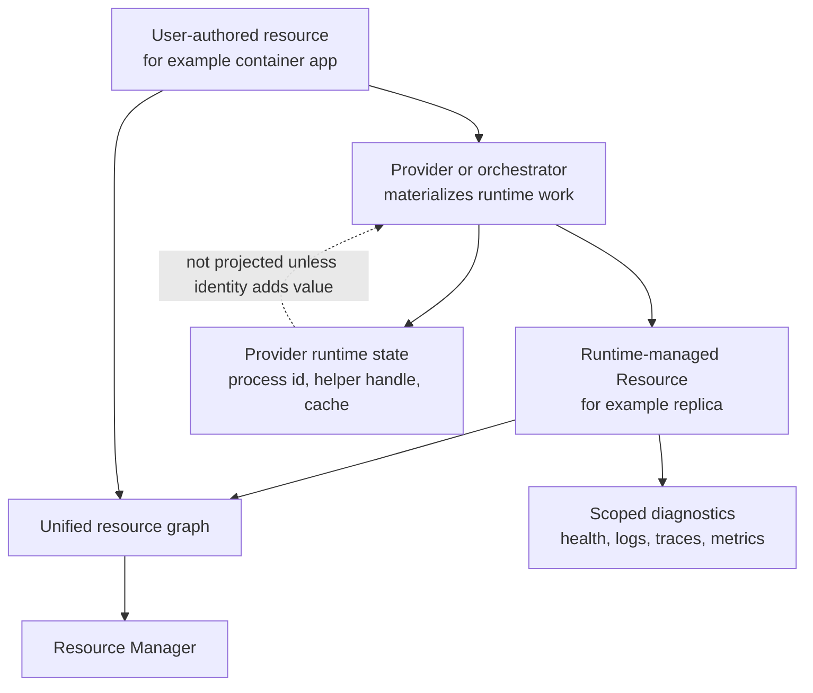

# Provider-Created and Runtime-Managed Resources

CloudShell uses one resource graph for user-authored resources,
provider-created resources, and runtime-managed artifacts. A runtime artifact
should become a `Resource` only when resource identity adds value: inspection,
relationships, authorization, lifecycle actions, diagnostics, cleanup
traversal, or references from other resources.

Not every materialized artifact needs to be a resource. Providers may keep
local process IDs, ad-hoc helper containers, reconciliation sessions, caches,
connection handles, and other implementation details as provider-owned runtime
state when they have no useful identity outside the owning resource.

## Current Contracts

The current resource metadata lives on
`CloudShell.Abstractions.ResourceManager.Resource`:

| Field | Meaning |
| --- | --- |
| `Source` | Origin of the resource projection: `User`, `Provider`, `Orchestrator`, or `RuntimeController`. |
| `ManagementMode` | Who is expected to manage the resource: `UserManaged`, `ProviderManaged`, `OrchestratorManaged`, or `RuntimeManaged`. |
| `Visibility` | Default graph visibility: `Normal`, `Hidden`, or `Diagnostic`. |
| `ParentResourceId` | Containment or presentation parent. |
| `OwnerResourceId` | Stable owner for lifecycle, diagnostics, and cleanup semantics. |
| `CleanupBehavior` | Owner cleanup behavior: `None`, `DeleteWithOwner`, or `DetachWithOwner`. |

`Source`, `ManagementMode`, `Visibility`, ownership, and cleanup are separate
qualities. A resource can be provider-created but visible, user-created but
hidden under an owning resource, or orchestrator-created and hidden until an
advanced diagnostic view requests it.

`Resource.IsRuntimeManaged` is true for `RuntimeManaged` and
`OrchestratorManaged` management modes. `Resource.IsNormalResource` is true
only for `Visibility == ResourceVisibility.Normal`.

The Control Plane API projects these fields through `ResourceResponse`, and
`CloudShell.ControlPlane.Client.RemoteControlPlane` maps them back to the
domain `Resource`. Contract tests preserve source, management mode,
visibility, owner resource, and cleanup behavior across the remote API.

## Projection Model

The implemented model is:

Providers should register or project a separate resource when one or more of
these are true:

- the entity has an independent lifecycle
- the entity participates in ownership, dependency, or graph relationships
- the entity exposes useful diagnostics, health, logs, traces, metrics, or
  operational state
- the entity exposes actions or capabilities
- the entity may require authorization or auditing
- another resource may reference it
- cleanup traversal needs a durable resource identity

Providers should keep an artifact as provider-owned runtime state when all of
these are true:

- lifecycle operations naturally happen through the owning resource
- authorization and audit are represented by the owning resource's actions
- diagnostics can be projected through the owning resource
- no other resource needs to reference the artifact directly
- exposing it would add noise without improving operation or troubleshooting

## Current Implemented Cases

Container app replica resources are the main implemented runtime-managed case.
The local Docker and local process container app runtimes project hidden
`runtime.container` resources for replica slots. These resources are owned by
the stable container app, have `ManagementMode = RuntimeManaged`,
`Source = Orchestrator`, `Visibility = Hidden`, and
`CleanupBehavior = DeleteWithOwner`.

Runtime replica resources currently carry stable, non-secret attributes such
as:

- `deployment.serviceId`
- `deployment.replicaGroup.id`
- `runtime.kind`
- `runtime.container.name` when a backing container name is available
- `runtime.network.alias` when the runtime attaches a stable network alias
- `runtime.replica.ordinal`
- `runtime.replica.count`
- `runtime.revision`
- `runtime.materialization`

Replica resources can expose monitoring capability, health checks, log
sources, traces, and metrics. The stable container app remains the lifecycle,
configuration, exposure, recovery, and normal management boundary.

Storage-owned volumes are a separate ownership case. A volume created under a
storage resource is hidden and carries `OwnerResourceId`, but remains a normal
storage/volume resource instead of a runtime-managed replica. It is managed
through the storage-owned Resource Manager workflow, not through global
runtime-resource inspection.

Docker host discovery is intentionally different from container app replicas.
Raw Docker containers observed by a Docker host provider are provider
observations unless explicitly authored as `AddDockerContainer(...)`
resources. A provider-observed backing container ID may enrich a runtime
replica later, but it should not replace the app-owned runtime replica
resource.

## Visibility and Authorization

Visibility is not authorization. Resource authorization still comes from
CloudShell resource access checks, resource groups, and permissions.

Resource Manager applies display filtering:

- `Normal` resources appear in standard inventory.
- Non-normal resources require the `Show hidden resources` Resource Manager
  display setting.
- Hidden `RuntimeManaged` resources also require the
  `Show runtime-managed resources` setting.
- Runtime-managed inspection requires the
  `resources.runtime-managed.read` permission before the setting can take
  effect.

Parent or owner access can make child resources readable for Control Plane
operations. UI surfaces must still decide whether to present hidden children in
global inventory, relationship views, or owner-specific tabs.

Normal edit, delete, and lifecycle controls should remain limited to normal
user-managed resources unless the provider explicitly exposes safe actions or a
parent-owned workflow. Hidden runtime-managed resources are primarily
inspection targets.

## Ownership, Parent, and Dependency

Ownership, parent, and dependency are different relationships:

- `OwnerResourceId` describes lifecycle ownership and cleanup semantics.
- `ParentResourceId` describes containment or presentation context.
- `DependsOn` describes operational dependency and ordering.

The owner and parent are often the same for runtime replicas, but providers
should not rely on that always being true. A shared provider-created resource
may have one owner plus references from other resources, or it may require a
future shared-ownership model. Shared ownership is still open proposal work.

## Cleanup

`CleanupBehavior` records the intended owner cleanup relationship:

- `None` means no owner-driven cleanup behavior is declared.
- `DeleteWithOwner` means the resource should be removed when the owner is
  removed.
- `DetachWithOwner` means the resource should survive owner removal but detach
  from that owner.

The enum is implemented, and container app runtime replicas use
`DeleteWithOwner`. Broad garbage collection, orphan cleanup, shared ownership,
and provider-created durable-resource cleanup policies are still proposal
work.

## Provider Parity

A provider that projects provider-created or runtime-managed resources should:

- set `Source`, `ManagementMode`, `Visibility`, `OwnerResourceId`, and
  `CleanupBehavior` deliberately
- expose only stable, non-secret attributes
- keep the stable authored resource as the normal lifecycle and configuration
  boundary unless the child resource is intentionally user-facing
- expose health, logs, traces, metrics, or monitoring only when the child
  resource can produce meaningful scoped observations
- use actions for child resources only when the provider can safely authorize
  and execute them independently
- document whether provider-observed runtime objects are authoritative
  resources, facade projections, or implementation observations
- preserve source/management/visibility metadata through API and client
  projections
- add tests that cover API/client round-trip, Resource Manager filtering,
  owner/parent traversal, and provider-specific diagnostics

## Launcher and Language Parity

Launchers and language SDKs should not need special syntax for runtime-managed
children unless those children become authorable resources. Current
runtime-managed resources are produced by providers from accepted resource
state.

When a future launcher or SDK adds authoring support for a resource whose
provider creates runtime children, the feature docs for that resource should
state:

- which authored fields cause runtime children to appear
- which child attributes are stable enough for diagnostics
- which child resources can appear in app-scoped or provider-scoped views
- which runtime children are hidden from global inventory by default
- which permissions/settings are required for direct runtime inspection

## Known Gaps

- Shared ownership and references for provider-created resources are not
  standardized.
- Garbage collection and orphan cleanup beyond owner-scoped runtime cleanup are
  not fully specified.
- Provider-observed backing IDs, placement, and materialization details for
  container app replicas are still enrichment work.
- Deployment revisions, generated images, endpoint registrations, backend
  registrations, and certificates may become resources where this adds
  operational value, but they are not broadly standardized yet.
- `Diagnostic` visibility exists in the enum, but current Resource Manager
  filtering treats non-normal resources through the hidden-resource display
  setting, with additional gating for `RuntimeManaged`.
