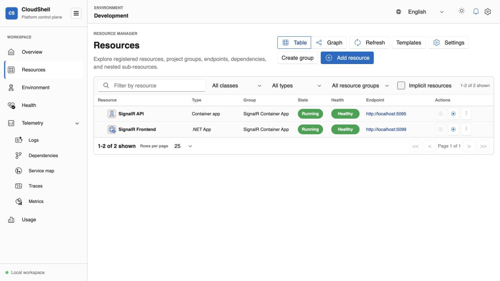
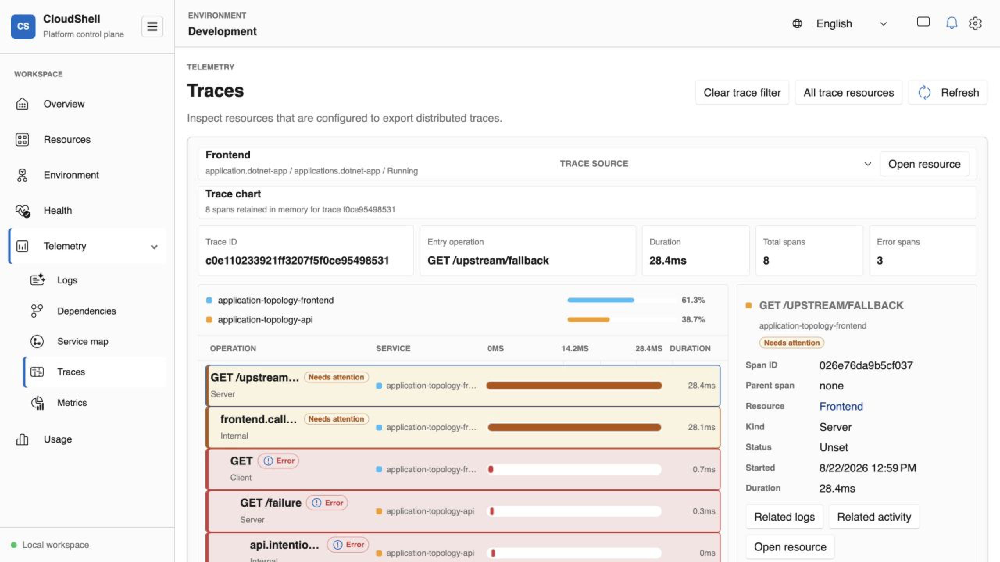
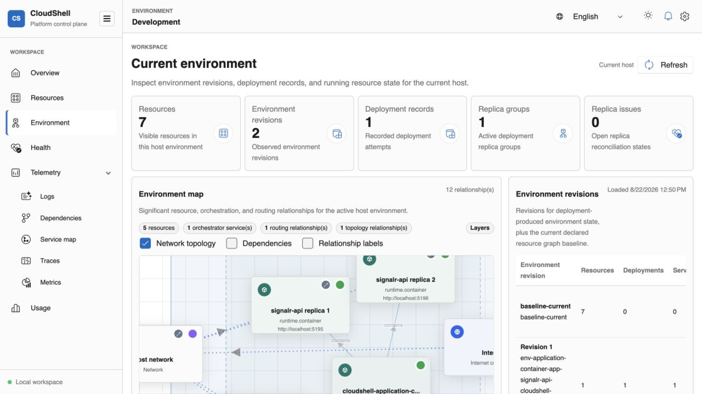
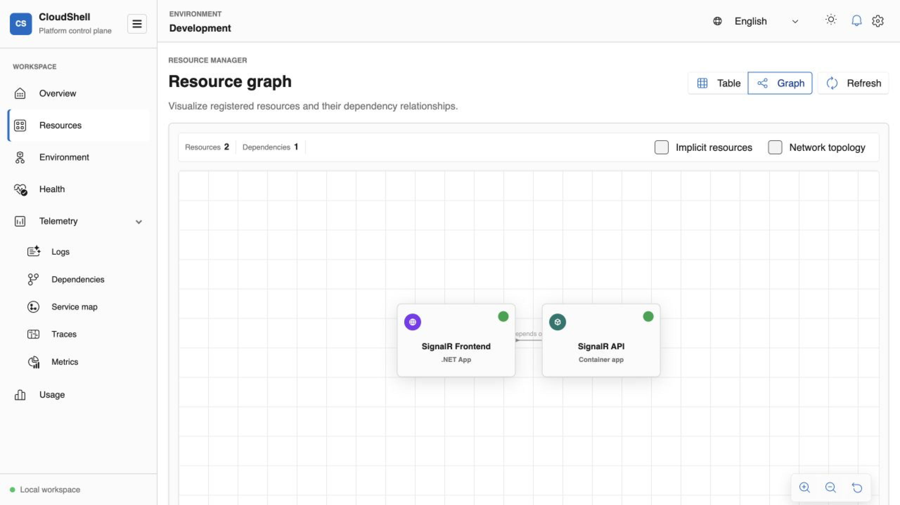

  <section class="cs-hero" aria-labelledby="hero-title">
    

      
 Preview · Self-hosted · Resource-oriented

      <h1 id="hero-title">Your application environment, <em>in one clear view.</em></h1>
      
CloudShell is a language-neutral control plane for modeling, running, inspecting, and operating distributed applications—locally or on infrastructure your team owns.

      

        <a class="cs-button cs-button-primary" href="get-started.md">Get started with the CLI →</a>
        <a class="cs-button cs-button-secondary" href="https://github.com/marinasundstrom/CloudShell">View on GitHub</a>
      

      
<strong>Preview software.</strong> CloudShell is evolving quickly and is not a committed product.

    

    

      

      

      
CS<strong>CloudShell</strong><small>Control Plane</small>

      
<strong>Application</strong><small>Running</small>

      
<strong>SQL database</strong><small>Healthy</small>

      
<strong>Telemetry</strong><small>Live signals</small>

    

  </section>

  <section class="cs-section cs-product" aria-labelledby="product-title">
    

      

        
One operational workspace

        <h2 id="product-title">See the system, not a pile of tools.</h2>
      

      
Follow resources from declared intent to live runtime state. Open endpoints, run lifecycle actions, trace dependencies, and diagnose failures without losing context.

    

    

      

        <figure class="cs-slide is-active" data-carousel-slide data-title="Resource inventory" data-copy="Filter the environment, check health, open endpoints, and run lifecycle actions from a shared inventory.">
          
        </figure>
        <figure class="cs-slide" data-carousel-slide data-title="Request trace" data-copy="Break one request into its frontend and API spans, timings, operations, and failure path.">
          
        </figure>
        <figure class="cs-slide" data-carousel-slide data-title="Runtime environment" data-copy="Move from declared resources into the active revision, replica group, routes, and individual container instances.">
          
        </figure>
        <figure class="cs-slide" data-carousel-slide data-title="Resource graph" data-copy="Understand application services, infrastructure, and declared dependencies as one provider-neutral graph.">
          
        </figure>
        <button class="cs-carousel-arrow cs-carousel-prev" type="button" data-carousel-prev aria-label="Previous highlight">←</button>
        <button class="cs-carousel-arrow cs-carousel-next" type="button" data-carousel-next aria-label="Next highlight">→</button>
      

      

        

01 / 04
<h3 data-carousel-title>Resource inventory</h3>

        
Filter the environment, check health, open endpoints, and run lifecycle actions from a shared inventory.

        

          <button class="is-active" type="button" role="tab" aria-selected="true" aria-label="Show resource inventory" data-carousel-dot></button>
          <button type="button" role="tab" aria-selected="false" aria-label="Show request trace" data-carousel-dot></button>
          <button type="button" role="tab" aria-selected="false" aria-label="Show runtime environment" data-carousel-dot></button>
          <button type="button" role="tab" aria-selected="false" aria-label="Show resource graph" data-carousel-dot></button>
        

      

    

  </section>

  <section class="cs-section cs-resources" aria-labelledby="resources-title">
    

      

Services and building blocks
<h2 id="resources-title">Run the stack your application needs.</h2>

      
CloudShell presents workloads and infrastructure as resources with consistent identity, relationships, state, operations, and diagnostics.

    

    

      <article class="cs-resource-card">01<h3>Applications</h3>
.NET, JavaScript, Java, Go, Python, executables, and container apps.
<a href="resources/applications.md">Application resources →</a></article>
      <article class="cs-resource-card">02<h3>Data & messaging</h3>
SQL Server, RabbitMQ, configuration stores, secrets vaults, event brokers, and device registries.
<a href="resources/data-services.md">Data and service resources →</a></article>
      <article class="cs-resource-card">03<h3>Platform</h3>
Container hosts, networks, load balancers, DNS names, storage, volumes, and identities.
<a href="resources/platform.md">Platform resources →</a></article>
      <article class="cs-resource-card cs-resource-card-accent">04<h3>Operations</h3>
Health, lifecycle actions, endpoints, logs, traces, metrics, monitoring, usage, and activity.
<a href="observability.md">See observability →</a></article>
    

  </section>

  <section class="cs-section cs-flow" aria-labelledby="flow-title">
    

      

One model, several entry points
<h2 id="flow-title">Start near the code. Grow into a platform.</h2>

      
The same domain-shaped resource graph moves between developer workflows, Resource Manager, automation, and self-hosted environments.

    

    <ol class="cs-steps">
      <li>01
<h3>Declare</h3>
Describe the environment with YAML, code-first launchers, templates, or the Control Plane API.

</li>
      <li>02
<h3>Run</h3>
Providers turn resource intent into local processes, containers, managed services, and platform state.

</li>
      <li>03
<h3>Operate</h3>
Inspect the graph, use endpoints and actions, and correlate health with telemetry in Resource Manager.

</li>
    </ol>
  </section>

  <section class="cs-cta" aria-labelledby="cta-title">
    
Cloud-like primitives, without a public cloud account

    <h2 id="cta-title">Build a clearer local environment.</h2>
    
Explore the architecture, try the YAML app host, or help shape CloudShell while the project is young.

    
<a class="cs-button cs-button-light" href="get-started.md">Get started →</a><a class="cs-button cs-button-ghost" href="https://github.com/marinasundstrom/CloudShell">Contribute on GitHub</a>

  </section>

