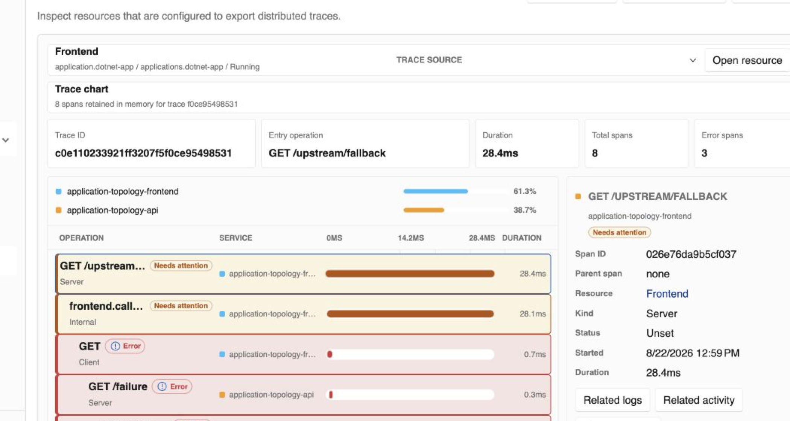

# .NET apps

A .NET app resource turns a local project into an operable part of the environment. CloudShell keeps the fast source-based development loop while adding resource identity, dependencies, endpoints, health, lifecycle actions, and telemetry.

> [!NOTE]
> .NET app resources are preview functionality. Use local project execution only on a trusted CloudShell host because project paths and commands are privileged host inputs.

## What you get

- **Project-aware execution.** Start and stop the project from Resource Manager while keeping its application identity stable.
- **Endpoint discovery.** Publish the app's HTTP or TCP endpoint to dependent resources and the operator-facing UI.
- **Dependency wiring.** Express that a frontend calls an API or that an API uses configuration, secrets, messaging, or data services.
- **Health and diagnostics.** Attach health checks, inspect current state, and move directly into logs and activity.
- **Distributed tracing.** Follow one request across .NET services and inspect the contribution of every server, client, and internal span.

<figure class="cs-doc-shot">
  
  <figcaption>A single request is broken into eight frontend and API spans, including the failed call and the successful fallback path.</figcaption>
</figure>

## A local-development resource

The resource represents the application, not merely its process. Other resources can depend on it by identity and endpoint name, and the UI can keep diagnostics attached to that same identity across restarts.

Use a .NET app for fast iteration on a trusted developer machine. Move to a [container app](container-apps.md) when validating the packaged artifact, replica behavior, or a stronger placement and isolation boundary.

## A useful telemetry path

The Application Topology sample demonstrates the intended experience: a frontend calls an API through a resource reference, trace context crosses the HTTP boundary, and CloudShell presents the resulting request as one trace. From an individual span you can open related logs, activity, or the owning resource.

Follow the [CLI guide](../get-started.md) to start CloudShell, then use a project-based sample to explore resource actions, dependencies, and telemetry.
