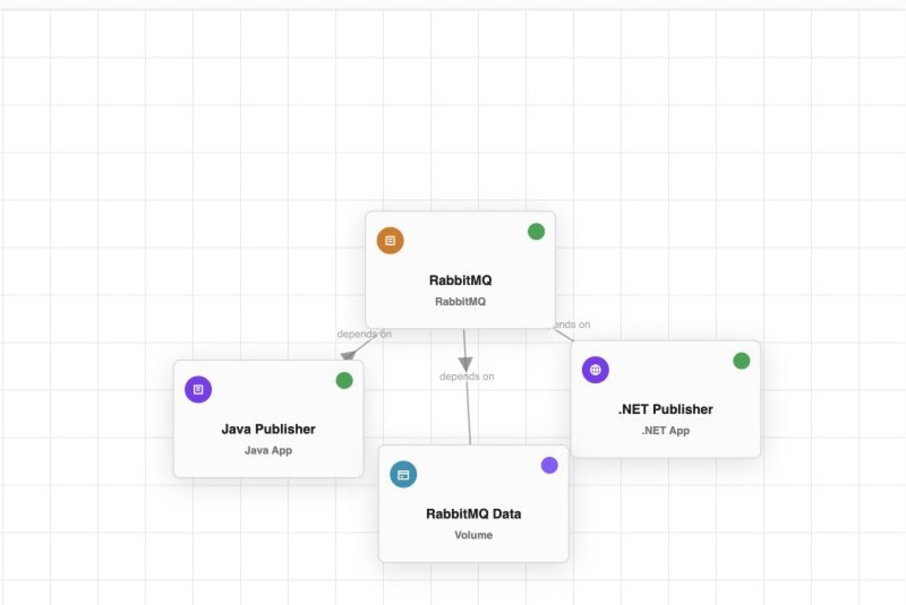

# Java apps

A Java app resource makes a JVM workload a first-class member of the CloudShell environment. Applications can depend on the Java service by resource identity and endpoint instead of embedding a machine-specific address.

> [!NOTE]
> Java app resources and the Java launcher are in preview. Local project and artifact paths are privileged inputs for a trusted development host.

## What you get

- **JVM-aware execution.** Run a JAR or main class with explicit JVM and application arguments.
- **Connected dependencies.** Relate the service to brokers, databases, configuration, secrets, and other applications.
- **Operational context.** Start and stop the service, open endpoints, and inspect logs, health, monitoring, and activity.
- **Language-neutral telemetry.** Preserve trace context across HTTP or messaging boundaries when the app emits OpenTelemetry data.

<figure class="cs-doc-shot">
  <a href="../../images/resource-rabbitmq-graph.png"></a>
  <figcaption>The Java publisher participates in the same dependency graph and lifecycle experience as the broker and the .NET publisher beside it.</figcaption>
</figure>

## Minimal resource template

```yaml
resources:
  - type: application.java-app
    name: java-api
    project:
      path: ./app
    artifactPath: ./target/app.jar
    endpoints:
      - name: http
        protocol: http
        targetPort: 8080
        port: 8080
        exposure: Local
```

Use `mainClass` and `classPath` instead of `artifactPath` when the workload is launched by class name.

## When to choose it

Choose a Java app for fast local iteration on a trusted host. Use a [container app](container-apps.md) when the JAR should run from an image or needs a stronger deployment boundary.
