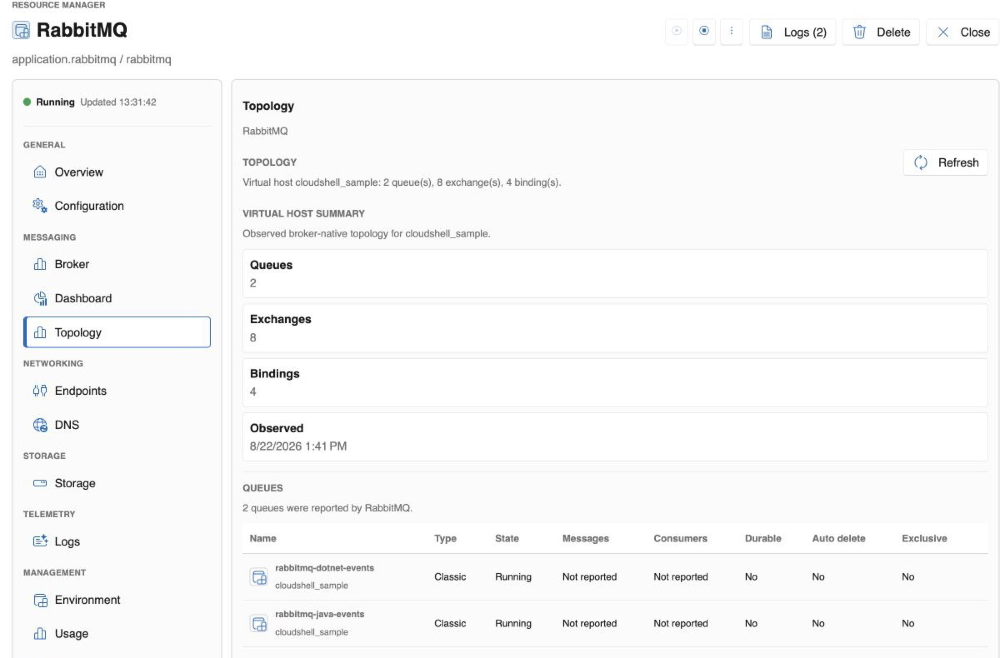

# RabbitMQ

The RabbitMQ resource provides a broker boundary that applications can depend on without embedding host-specific connection details in the application graph. CloudShell brings broker lifecycle, relationships, endpoints, storage, access, and selected broker signals into the same Resource Manager experience as the workloads that use it.

> [!NOTE]
> RabbitMQ support is in preview and currently targets local, container-backed development environments. CloudShell provides an integrated operational view; it is not a replacement for the full RabbitMQ Management experience.

## What you get

- **A connected resource graph.** See which applications depend on the broker and which storage resource persists its data.
- **Broker lifecycle and state.** Start and stop the broker, inspect current state, and keep it grouped with the applications that depend on it.
- **Named endpoints.** Expose AMQP and the RabbitMQ management UI as distinct resource-owned endpoints.
- **Persistent storage intent.** Attach a CloudShell volume without making the host path or Docker volume the stable application contract.
- **Identity-based access.** Grant configure, publish, and consume permissions to workload identities while keeping broker-native credentials out of the resource graph.
- **Focused broker signals.** Inspect an observed topology summary, queues, exchanges, bindings, and broker counters without leaving the resource context.
- **Messaging traces.** Propagate trace context through message headers and correlate HTTP publishers, RabbitMQ publish operations, and consumers in one trace.

<figure class="cs-doc-shot">
  <a href="../../images/resource-rabbitmq-graph.png"></a>
  <figcaption>RabbitMQ remains a first-class resource between two running publisher applications and its persistent data volume.</figcaption>
</figure>

## Minimal resource template

```yaml
resources:
  - type: application.rabbitmq
    name: rabbitmq
    version: "3"
    rabbitmq:
      managementUi: true
    endpoints:
      - name: amqp
        protocol: tcp
        targetPort: 5672
        port: 5672
        exposure: Local
      - name: management
        protocol: http
        targetPort: 15672
        port: 15672
        exposure: Local
```

Add a `cloudshell.volume` and mount it at `/var/lib/rabbitmq` when broker state should survive container replacement.

## Applications depend on the broker resource

Applications reference the RabbitMQ resource and request an allowed operation. The provider owns the runtime-specific user and virtual-host reconciliation needed by RabbitMQ itself. This keeps portable application intent—who may publish or consume—separate from broker-native account management.

The broker can expose multiple endpoints. Applications normally use AMQP, while operators can open the management UI from the resource without treating that UI address as the workload connection contract.

## Inspect broker topology in context

CloudShell can project a focused, observed view of broker-native topology into the RabbitMQ resource. The sample view summarizes its virtual host and shows the queues used by the .NET and Java publishers alongside exchange and binding counts.

<figure class="cs-doc-shot">
  <a href="../../images/resource-rabbitmq-topology.png"></a>
  <figcaption>The topology view surfaces the broker facts that help explain the application environment while preserving a link to RabbitMQ Management for deeper administration.</figcaption>
</figure>

This is deliberately an integrated diagnostic surface rather than a complete broker console. It keeps common operational facts beside resource relationships, access, logs, activity, and endpoints; RabbitMQ Management remains the authoritative tool for the full set of broker-native operations.

## Explore the complete messaging path

The RabbitMQ Messaging sample connects .NET and Java publishers to one broker. Each application publishes JSON events to a fan-out exchange and consumes from its own queue. Because trace context crosses the broker, CloudShell can present the publisher and consumers as parts of the same request flow.

Follow the [CLI guide](../get-started.md), then use the RabbitMQ sample to inspect lifecycle, access grants, endpoints, message delivery, and traces together.
