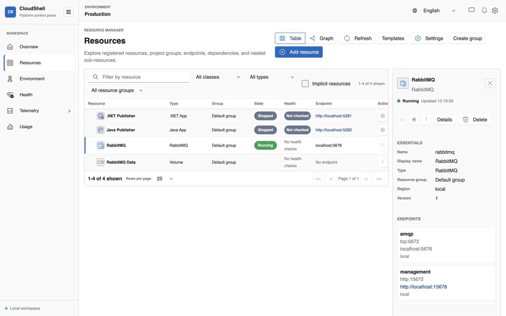

# RabbitMQ

The RabbitMQ resource provides a broker boundary that applications can depend on without embedding host-specific connection details in the application graph. CloudShell manages the local broker lifecycle and projects its AMQP and management endpoints through the same Resource Manager experience as the workloads that use it.

> [!NOTE]
> RabbitMQ support is in preview and currently targets local, container-backed development environments.

## What you get

- **Broker lifecycle and health.** Start and stop the broker, inspect current state, and keep it grouped with the applications that depend on it.
- **Named endpoints.** Expose AMQP and the RabbitMQ management UI as distinct resource-owned endpoints.
- **Persistent storage intent.** Attach a CloudShell volume without making the host path or Docker volume the stable application contract.
- **Identity-based access.** Grant configure, publish, and consume permissions to workload identities while keeping broker-native credentials out of the resource graph.
- **Messaging traces.** Propagate trace context through message headers and correlate HTTP publishers, RabbitMQ publish operations, and consumers in one trace.

<figure class="cs-doc-shot">
  
  <figcaption>The broker stays a first-class resource with its own state and endpoints while publisher applications reference it through declared dependencies and permissions.</figcaption>
</figure>

## Applications depend on the broker resource

Applications reference the RabbitMQ resource and request an allowed operation. The provider owns the runtime-specific user and virtual-host reconciliation needed by RabbitMQ itself. This keeps portable application intent—who may publish or consume—separate from broker-native account management.

The broker can expose multiple endpoints. Applications normally use AMQP, while operators can open the management UI from the resource without treating that UI address as the workload connection contract.

## Explore the complete messaging path

The RabbitMQ Messaging sample connects .NET and Java publishers to one broker. Each application publishes JSON events to a fan-out exchange and consumes from its own queue. Because trace context crosses the broker, CloudShell can present the publisher and consumers as parts of the same request flow.

Follow the [CLI guide](../get-started.md), then use the RabbitMQ sample to inspect lifecycle, access grants, endpoints, message delivery, and traces together.
