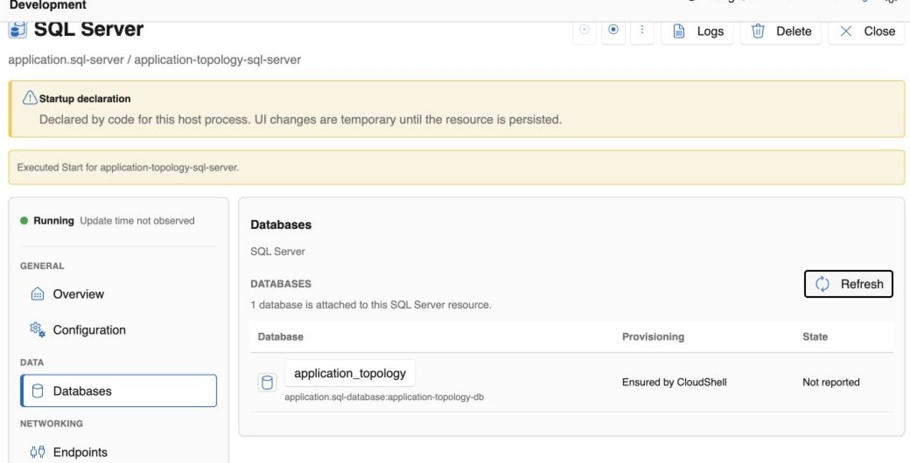

# SQL Server

The SQL Server resource gives applications a stable database-service dependency while CloudShell manages the local runtime, TDS endpoint, storage relationship, declared databases, and access intent.

> [!NOTE]
> SQL Server support is in preview and currently targets local, container-backed development. CloudShell provides an integrated resource view; use normal SQL administration tools for the complete SQL Server management surface.

## What you get

- **Service lifecycle and state.** Start, stop, restart, and diagnose the local SQL Server resource.
- **A named TDS endpoint.** Let applications reference the SQL resource instead of embedding a host port.
- **Durable storage intent.** Attach a CloudShell volume at the SQL Server data boundary.
- **Database resources.** See declared databases, provisioning intent, and current state from the server context.
- **Identity and access intent.** Relate workload identities to database permissions without placing administrator credentials in the resource graph.
- **Connected diagnostics.** Move between the server, databases, applications, logs, health, activity, and dependency graph.

<figure class="cs-doc-shot">
  <a href="../../images/resource-sql-server-databases.png"></a>
  <figcaption>The integrated Databases view keeps declared database state and provisioning intent beside the SQL Server resource lifecycle.</figcaption>
</figure>

## Minimal resource template

```yaml
resources:
  - type: cloudshell.volume
    name: sql-data
    storage:
      volume:
        medium: FileSystem
        accessMode: ReadWriteOnce
        persistent: true

  - type: application.sql-server
    name: sql
    dependsOn:
      - resourceId: cloudshell.volume:sql-data
    version: "2022"
    edition: Developer
    endpoints:
      - name: tds
        protocol: tcp
        targetPort: 1433
        port: 1433
        exposure: Local
    storage:
      volume:
        mounts:
          - volume: cloudshell.volume:sql-data
            targetPath: /var/opt/mssql

  - type: application.sql-database
    name: app-db
    dependsOn:
      - resourceId: application.sql-server:sql
    database:
      name: app
      ensureCreated: true
```

The volume owns persistence, SQL Server owns the running service, and the database remains independently visible for relationships and access.

## Local preview boundary

The current provider uses the SQL Server Linux container image as a runtime detail. The CloudShell resource deliberately presents version, endpoint, storage, databases, access, and diagnostics rather than generic container-app controls. Production database administration, backup, restore, tuning, and the full native SQL surface remain outside this preview experience.
